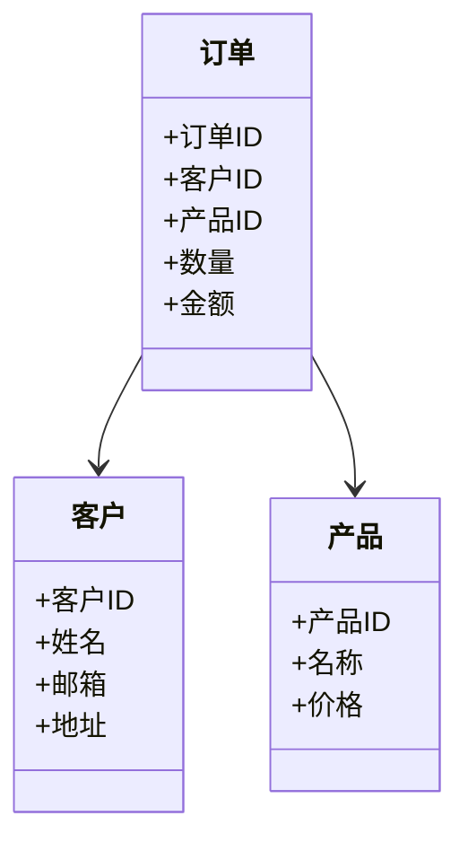
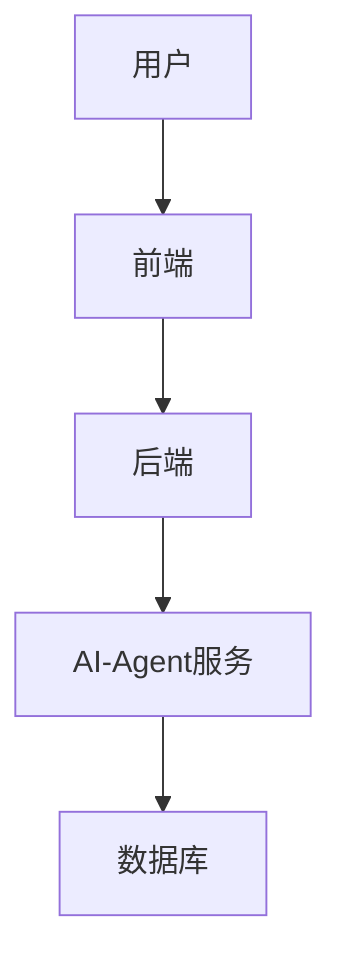

                 


# 企业AI Agent的ROI评估方法

## 关键词：企业AI Agent，ROI评估，投资回报率，人工智能，系统架构

## 摘要：  
企业AI Agent（人工智能代理）作为一项前沿技术，正在迅速改变企业的运作方式。然而，企业在引入AI Agent之前，必须对其投资回报率（ROI）进行科学评估。本文将从基本概念、数学模型、系统架构到实际案例，全面解析企业AI Agent的ROI评估方法。通过详细分析，本文为读者提供一套完整的评估框架，帮助企业在数字化转型中做出明智决策。

---

# 第1章：AI Agent与ROI概述

## 1.1 AI Agent的基本概念

### 1.1.1 什么是AI Agent  
AI Agent（人工智能代理）是指能够感知环境、自主决策并执行任务的智能系统。它通过传感器获取信息，利用算法处理数据，并通过执行器完成目标。AI Agent可以是软件程序、机器人或其他智能设备。

### 1.1.2 AI Agent的类型  
AI Agent可以根据功能和应用场景分为以下几类：  
- **简单反射型**：基于预设规则执行任务，如自动回复机器人。  
- **基于模型的反应型**：利用环境模型做出决策，如自动驾驶系统。  
- **目标驱动型**：为实现特定目标而行动，如智能助手。  
- **实用驱动型**：追求效用最大化，如推荐系统。  

### 1.1.3 企业AI Agent的应用场景  
在企业中，AI Agent的应用场景广泛，包括：  
- **客户支持**：智能客服系统提高响应速度和满意度。  
- **流程自动化**：自动化处理订单、审批等流程，提升效率。  
- **数据分析**：实时监控数据，提供决策支持。  
- **风险管理**：预测潜在风险，制定应对策略。  

---

## 1.2 ROI的基本概念

### 1.2.1 投资回报率的定义  
投资回报率（ROI）是衡量投资收益与成本比的重要指标，公式为：  
$$ ROI = \frac{\text{净收益}}{\text{投资成本}} \times 100\% $$  
其中，净收益 = 收益 - 成本。

### 1.2.2 ROI在企业中的重要性  
ROI是企业评估投资项目可行性的重要标准。通过ROI，企业可以判断AI Agent的投资是否值得，是否能带来长期收益。

### 1.2.3 企业AI Agent与ROI的关系  
企业引入AI Agent的目的是通过自动化和智能化提升效率、降低成本或创造新价值。因此，AI Agent的ROI评估直接关系到企业的投资决策。

---

## 1.3 本章小结  
本章介绍了AI Agent的基本概念、类型及其在企业中的应用场景，同时阐述了ROI的定义及其在企业中的重要性，为后续的评估方法奠定了基础。

---

# 第2章：ROI评估的基本原理

## 2.1 ROI的计算方法

### 2.1.1 净现值计算公式  
净现值（NPV）是评估投资项目的重要指标，公式为：  
$$ NPV = \sum_{t=1}^{n} \frac{C_t}{(1 + r)^t} $$  
其中，\( C_t \) 是第 \( t \) 年的现金流量，\( r \) 是贴现率。  
NPV > 0 表示项目可行，NPV < 0 表示项目不可行。

### 2.1.2 内部收益率的计算  
内部收益率（IRR）是使净现值为零的贴现率，公式为：  
$$ IRR = r \text{ 使得 } NPV = 0 $$  

---

## 2.2 企业AI Agent的收益与成本分析

### 2.2.1 收益来源  
AI Agent的收益主要来源于效率提升、成本降低和新价值创造。例如，自动化流程可以减少人工成本，智能推荐可以提高销售额。

### 2.2.2 成本构成  
AI Agent的成本包括开发成本、部署成本和维护成本。开发成本包括算法设计、数据采集和模型训练，部署成本包括硬件设备和软件许可，维护成本包括系统更新和人员培训。

---

## 2.3 本章小结  
本章通过数学公式详细讲解了ROI的计算方法，并分析了企业AI Agent的收益与成本构成，为后续的评估方法提供了理论基础。

---

# 第3章：企业AI Agent ROI评估的核心方法

## 3.1 定性评估方法

### 3.1.1 战略价值评估  
战略价值评估关注AI Agent对企业发展目标的贡献。例如，AI Agent是否能提升企业的核心竞争力。

### 3.1.2 风险评估  
风险评估分析AI Agent在实施过程中可能遇到的技术风险、市场风险和管理风险。

---

## 3.2 定量评估方法

### 3.2.1 收益预测模型  
收益预测模型基于历史数据和市场趋势，预测AI Agent带来的收益。例如，使用时间序列分析模型预测未来的收益增长。

### 3.2.2 成本分摊模型  
成本分摊模型将AI Agent的成本分摊到各个部门或项目，确保成本合理分配。

---

## 3.3 定性与定量结合的评估策略

### 3.3.1 综合评估框架  
综合评估框架结合定性分析和定量分析，从多个维度评估AI Agent的ROI。例如，同时考虑技术可行性、市场潜力和财务回报。

### 3.3.2 案例分析  
以某企业引入智能客服系统为例，分析其战略价值、成本构成和预期收益，展示如何结合定性与定量方法进行评估。

---

## 3.4 本章小结  
本章详细探讨了定性和定量评估方法，并通过案例分析展示了如何结合两者进行评估，为企业的AI Agent ROI评估提供了实用的策略。

---

# 第4章：企业AI Agent ROI评估的系统架构

## 4.1 系统需求分析

### 4.1.1 问题场景描述  
以某企业的订单处理流程为例，分析当前流程中的低效环节，如订单审核时间长、错误率高。

### 4.1.2 项目目标设定  
引入AI Agent自动处理订单，目标是提高处理速度、减少错误率和降低成本。

---

## 4.2 系统功能设计

### 4.2.1 领域模型设计  
领域模型描述系统的功能和数据关系。例如，订单处理系统涉及订单、客户、产品等实体，以及订单创建、审核、发货等流程。



---

## 4.3 系统架构设计

### 4.3.1 分层架构  
系统架构分为前端、后端和AI Agent层。前端处理用户交互，后端处理业务逻辑，AI Agent层负责自动化处理。



---

## 4.4 本章小结  
本章通过系统需求分析和架构设计，展示了如何构建企业AI Agent的ROI评估系统，为后续的实现提供了指导。

---

# 第5章：项目实战——企业AI Agent ROI评估系统实现

## 5.1 环境安装与配置

### 5.1.1 安装Python与相关库  
安装Python 3.8以上版本，安装Pandas、NumPy、Scikit-learn等数据处理库。

### 5.1.2 安装AI框架  
安装TensorFlow或PyTorch框架，用于模型训练和部署。

---

## 5.2 系统核心实现

### 5.2.1 数据采集与预处理  
从数据库中提取订单数据，清洗数据并进行特征工程。

### 5.2.2 模型训练与部署  
使用机器学习模型训练AI Agent，部署到生产环境中。

---

## 5.3 代码实现

### 5.3.1 数据加载与预处理  
```python
import pandas as pd

# 加载数据
data = pd.read_csv('order.csv')

# 数据清洗
data.dropna(inplace=True)
data = data[[
    '订单ID', '客户ID', '产品ID', '数量', '金额'
]]
```

### 5.3.2 模型训练  
```python
from sklearn.tree import DecisionTreeRegressor

# 训练模型
model = DecisionTreeRegressor()
model.fit(X_train, y_train)
```

---

## 5.4 案例分析

### 5.4.1 收益预测  
通过模型预测AI Agent引入后的收益增长，计算净现值和内部收益率。

### 5.4.2 成本分析  
分析AI Agent的部署成本，包括硬件和人工成本。

---

## 5.5 本章小结  
本章通过实际案例展示了企业AI Agent ROI评估系统的实现过程，包括环境配置、数据处理和模型部署。

---

# 第6章：总结与展望

## 6.1 本章总结  
本文从基本概念、数学模型到系统架构，全面解析了企业AI Agent的ROI评估方法，为企业的投资决策提供了科学依据。

## 6.2 未来展望  
未来，随着AI技术的进步，企业AI Agent的ROI评估将更加精准和动态。结合边缘计算和区块链技术，将进一步提升评估的效率和安全性。

---

## 6.3 最佳实践Tips  
- 在评估AI Agent ROI时，建议结合企业实际情况，选择合适的评估方法。  
- 数据质量是评估的基础，确保数据的准确性和完整性。  
- 定期更新模型，适应市场变化和技术进步。  

---

## 6.4 小结  
企业AI Agent的ROI评估是企业数字化转型中的关键环节，通过科学的评估方法和系统的架构设计，企业可以更好地实现智能化转型，创造更大的价值。

---

# 附录

## 附录A：术语表  
- ROI：投资回报率  
- AI Agent：人工智能代理  
- NPV：净现值  
- IRR：内部收益率  

## 附录B：工具列表  
- Python：编程语言  
- Pandas：数据处理库  
- TensorFlow：深度学习框架  

## 附录C：参考文献  
- [1] Smith, J., & Lee, M. (2022). Artificial Intelligence in Business.  
- [2] Johnson, R., & Green, E. (2021). ROI Analysis for AI Projects.  

---

# 结束语  
企业AI Agent的ROI评估是技术与商业结合的典范，通过科学的评估方法和系统的架构设计，企业可以更好地利用AI技术提升竞争力。希望本文能为企业的AI Agent应用提供有价值的参考和指导。

