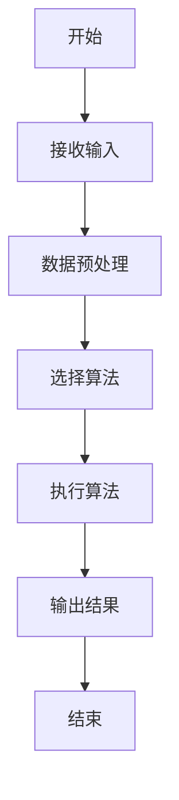
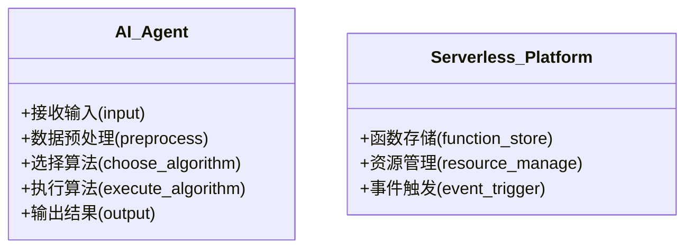
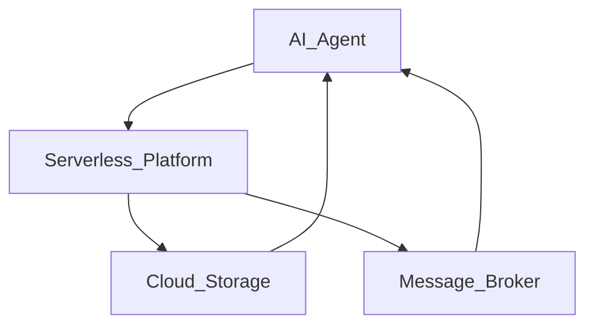

                 


# 企业AI Agent的Serverless架构设计

> 关键词：AI Agent, Serverless架构, 企业级应用, 无服务器计算, 事件驱动, 智能自动化

> 摘要：随着人工智能和无服务器计算技术的快速发展，企业AI Agent的Serverless架构设计成为了一个备受关注的技术领域。本文从AI Agent和Serverless架构的核心概念出发，深入分析了两者结合的原理、优势以及应用场景。通过详细讲解Serverless架构的核心机制、AI Agent的算法原理，以及企业级系统的架构设计与实现，本文为读者提供了一套完整的解决方案。结合实际项目案例，本文还探讨了Serverless架构在企业AI Agent中的最佳实践和注意事项，帮助读者更好地理解和应用这一技术。

---

# 第一部分: 企业AI Agent的Serverless架构背景与基础

# 第1章: 企业AI Agent与Serverless架构概述

## 1.1 企业AI Agent的核心概念

### 1.1.1 什么是AI Agent
AI Agent（人工智能代理）是一种能够感知环境、自主决策并执行任务的智能实体。它通过接收输入、分析数据、做出决策并执行操作来实现目标。AI Agent可以分为两类：基于规则的代理和基于模型的代理。

**基于规则的代理**：依赖预定义的规则和条件来执行操作。例如，当检测到系统资源不足时，触发资源扩展。

**基于模型的代理**：利用机器学习模型进行预测和决策。例如，根据历史数据预测未来的需求，并自动调整资源分配。

### 1.1.2 AI Agent的分类与特点

| 分类 | 特点 | 应用场景 |
|------|------|----------|
| **基于规则的AI Agent** | 简单、高效、易于部署 | 系统监控、资源管理 |
| **基于模型的AI Agent** | 高精度、复杂决策 | 预测分析、智能推荐 |
| **混合型AI Agent** | 结合规则与模型，灵活性高 | 综合决策、复杂任务 |

### 1.1.3 企业级AI Agent的应用场景

- **系统监控与优化**：实时监控系统状态，自动调整资源分配。
- **智能自动化**：自动化处理业务流程，减少人工干预。
- **预测与决策支持**：基于历史数据预测未来趋势，辅助企业决策。

## 1.2 Serverless架构的基本概念

### 1.2.1 什么是Serverless架构
Serverless架构（无服务器架构）是一种基于云的计算模型，允许开发者通过编写代码即可构建和运行应用程序，而无需管理底层服务器。它通过事件驱动的方式，按需分配计算资源。

### 1.2.2 Serverless架构的优势与劣势

| 优势 | 劣势 |
|------|------|
| **按需扩展** | **冷启动问题** |
| **降低运维成本** | **资源限制** |
| **快速部署** | **调试复杂性** |

### 1.2.3 Serverless架构的适用场景

- **短期任务处理**：例如文件处理、图像处理。
- **事件驱动的应用**：例如响应用户点击、API调用。
- **中小型企业应用**：无需自建服务器，快速上线。

## 1.3 企业AI Agent与Serverless架构的结合

### 1.3.1 为什么选择Serverless架构
AI Agent需要实时响应、快速决策，而Serverless架构的按需扩展和事件驱动机制完美匹配了这一需求。

### 1.3.2 AI Agent在Serverless架构中的优势
- **弹性扩展**：根据负载自动调整资源。
- **高可用性**：通过分布式部署保证系统稳定性。
- **成本优化**：按需付费，避免资源浪费。

### 1.3.3 企业级应用中的Serverless架构设计

- **模块化设计**：将AI Agent的功能模块化，便于扩展和维护。
- **事件驱动设计**：通过事件触发AI Agent的执行。
- **数据流设计**：确保数据在各模块之间的高效流动。

## 1.4 本章小结
本章介绍了AI Agent和Serverless架构的核心概念，分析了它们在企业级应用中的结合方式和优势。接下来将深入探讨Serverless架构的核心原理，以及如何将其应用于AI Agent的设计中。

---

# 第二部分: Serverless架构的核心原理与实现

# 第2章: Serverless架构的核心原理

## 2.1 Serverless架构的运行机制

### 2.1.1 函数即服务（FaaS）
FaaS（Function as a Service）是Serverless架构的核心模型。开发者只需编写函数代码，云服务提供商负责处理底层资源分配和任务调度。

### 2.1.2 后端即服务（BaaS）
BaaS（Backend as a Service）为开发者提供了一种快速构建后端服务的方式，包括数据库、缓存、消息队列等。

### 2.1.3 容器化技术与无服务器计算
无服务器计算依赖容器化技术，通过容器运行函数，按需分配资源。容器化技术保证了函数的隔离性和独立性。

## 2.2 Serverless架构的事件驱动模型

### 2.2.1 事件源与触发器
事件源是触发Serverless函数的起点，例如API调用、数据库变更、消息队列中的消息。

### 2.2.2 事件处理流程
1. 事件源触发事件。
2. 事件传递到Serverless函数。
3. 函数执行处理逻辑。
4. 函数返回结果或继续调用其他服务。

### 2.2.3 事件驱动的异步处理
异步处理通过消息队列实现，确保事件处理的高效性和可靠性。

## 2.3 Serverless架构的资源管理与调度

### 2.3.1 资源弹性扩展
根据负载自动调整资源分配，确保系统性能。

### 2.3.2 资源隔离与安全性
通过容器化技术实现资源隔离，确保不同函数之间的安全性和独立性。

### 2.3.3 资源监控与优化
实时监控资源使用情况，优化资源分配，降低成本。

## 2.4 本章小结
本章深入探讨了Serverless架构的核心原理，包括FaaS、BaaS、容器化技术以及事件驱动模型。接下来将结合AI Agent的需求，分析Serverless架构的具体实现。

---

# 第三部分: AI Agent的Serverless架构设计与实现

# 第3章: AI Agent的算法原理与实现

## 3.1 AI Agent的算法原理

### 3.1.1 概率论与统计学基础
概率论用于计算事件发生的可能性，统计学用于分析数据和模式。

### 3.1.2 优化算法
优化算法用于在多个选项中选择最优解，例如遗传算法、模拟退火算法。

### 3.1.3 聚类分析
聚类分析用于将数据分成不同的类别，便于后续处理。

## 3.2 AI Agent的算法实现

### 3.2.1 算法流程图



### 3.2.2 算法实现代码

```python
def preprocess_data(data):
    # 数据预处理逻辑
    return processed_data

def choose_algorithm(processed_data):
    # 根据数据选择算法
    if condition:
        return algorithm1
    else:
        return algorithm2

def execute_algorithm(algorithm, data):
    # 执行算法并返回结果
    return result

def main():
    data = receive_input()
    processed_data = preprocess_data(data)
    algorithm = choose_algorithm(processed_data)
    result = execute_algorithm(algorithm, processed_data)
    output_result(result)

if __name__ == "__main__":
    main()
```

## 3.3 本章小结
本章详细讲解了AI Agent的算法原理与实现，为后续的系统架构设计奠定了基础。

---

# 第四部分: 企业级AI Agent的系统架构设计

# 第4章: 企业AI Agent的系统架构设计

## 4.1 问题场景介绍

- **目标**：实现一个能够实时监控系统状态、自动调整资源分配的AI Agent。
- **需求**：高可用性、弹性扩展、智能决策。

## 4.2 系统功能设计

### 4.2.1 领域模型设计



### 4.2.2 系统架构设计



### 4.2.3 系统接口设计

- **输入接口**：接收系统状态数据。
- **输出接口**：返回决策结果。
- **事件接口**：触发Serverless函数。

## 4.3 本章小结
本章通过系统功能设计和架构设计，详细分析了企业AI Agent在Serverless架构中的实现方式。

---

# 第五部分: 项目实战与最佳实践

# 第5章: 企业AI Agent的项目实战

## 5.1 环境安装

- **云服务选择**：例如AWS Lambda、Azure Functions。
- **开发工具安装**：安装Python、Jupyter Notebook等。

## 5.2 系统核心实现

### 5.2.1 核心代码实现

```python
import boto3

def lambda_handler(event, context):
    # 数据预处理
    processed_data = preprocess(event)
    # 选择算法
    algorithm = choose_algorithm(processed_data)
    # 执行算法
    result = execute_algorithm(algorithm, processed_data)
    # 返回结果
    return result
```

### 5.2.2 代码应用解读

- **数据预处理**：对输入数据进行清洗和转换。
- **算法选择**：根据数据类型选择合适的算法。
- **算法执行**：调用预训练的模型进行预测。

## 5.3 实际案例分析

- **案例描述**：实现一个系统资源监控的AI Agent。
- **案例分析**：通过Serverless架构实现弹性扩展，确保系统高可用性。

## 5.4 本章小结
本章通过实际项目案例，详细讲解了企业AI Agent的实现过程。

---

# 第六部分: 最佳实践与注意事项

# 第6章: 最佳实践与注意事项

## 6.1 最佳实践

- **模块化设计**：将系统功能模块化，便于扩展和维护。
- **事件驱动设计**：通过事件触发AI Agent的执行。
- **数据流设计**：确保数据在系统中的高效流动。

## 6.2 注意事项

- **冷启动问题**：通过优化代码和配置减少冷启动时间。
- **资源限制**：合理分配资源，避免超时或资源不足。
- **安全性设计**：确保数据安全和系统安全。

## 6.3 拓展阅读

- **参考文献**：《Serverless Architecture Patterns》、《AI Agent Design and Implementation》。

---

# 结语

企业AI Agent的Serverless架构设计是一个复杂而有趣的技术领域。通过本文的详细讲解，读者可以全面理解AI Agent和Serverless架构的核心概念、设计原理以及实现方法。希望本文能够为读者提供有价值的参考，帮助他们在实际工作中更好地应用这一技术。

--- 

感谢您的阅读！如果需要进一步探讨或有其他问题，请随时联系。

