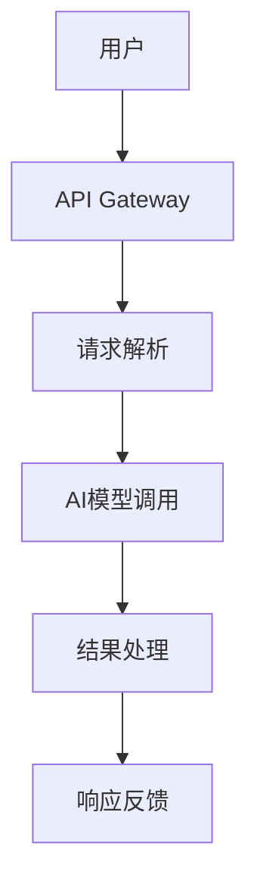
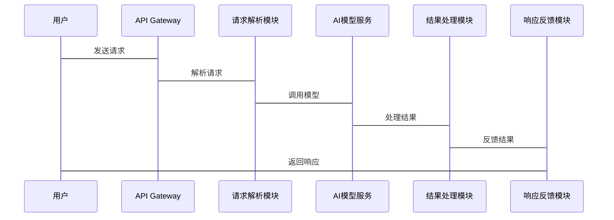

                 


# 企业AI Agent的Serverless计算架构

## 关键词
- AI Agent
- Serverless计算
- 企业架构
- 云计算
- 分布式系统

## 摘要
本文详细探讨了企业AI Agent在Serverless计算架构中的设计与实现。从基本概念到系统架构，再到实际应用，全面分析了AI Agent如何利用Serverless技术提升企业智能化水平。通过理论与实践结合，展示了如何构建高效、可扩展的AI Agent系统。

---

# 第一部分: 企业AI Agent的Serverless计算架构概述

## 第1章: AI Agent与Serverless计算的背景介绍

### 1.1 AI Agent的基本概念
#### 1.1.1 AI Agent的定义与特点
AI Agent（人工智能代理）是一种能够感知环境、自主决策并执行任务的智能实体。其特点包括自主性、反应性、目标导向和社交能力。

#### 1.1.2 AI Agent在企业中的应用场景
AI Agent广泛应用于企业客服、智能推荐、自动化操作等领域，能够提高效率、降低成本并增强用户体验。

#### 1.1.3 Serverless计算的起源与特点
Serverless计算是一种云计算模型，允许开发者编写代码而无需管理服务器。其特点包括按需扩展、按需付费和隐藏的基础设施。

### 1.2 企业AI Agent的Serverless架构背景
#### 1.2.1 传统企业AI系统的局限性
传统AI系统面临资源消耗大、部署复杂、扩展性差等问题。

#### 1.2.2 Serverless计算的优势
Serverless计算能够按需扩展、降低成本、简化部署，非常适合AI应用。

#### 1.2.3 AI Agent与Serverless的结合
将AI Agent部署在Serverless架构中，能够实现高效、灵活的智能化服务。

---

## 第2章: AI Agent与Serverless计算的核心概念

### 2.1 AI Agent的体系结构
#### 2.1.1 AI Agent的组成要素
AI Agent通常包括感知模块、推理模块、执行模块和学习模块。

#### 2.1.2 不同类型AI Agent的对比
- 单智能体：独立决策，适用于简单任务。
- 多智能体：协同工作，适用于复杂场景。
- 基于规则的智能体：基于预定义规则执行任务。
- 基于模型的智能体：使用复杂模型进行决策。

#### 2.1.3 AI Agent与传统软件代理的区别
AI Agent具备自主决策能力，能够处理复杂任务，而传统软件代理通常执行预定义任务。

### 2.2 Serverless计算的核心原理
#### 2.2.1 Serverless的执行环境
- 函数即服务（FaaS）：将代码部署为无状态函数，按需执行。
- 后端即服务（BaaS）：提供数据库、存储等后端服务。

#### 2.2.2 无服务器架构的优缺点
优点：按需扩展、降低成本、简化运维。缺点：冷启动延迟、资源限制、依赖第三方服务。

#### 2.2.3 AI Agent与Serverless的结合
AI Agent作为Serverless函数，在云平台上按需调用，实现智能化服务。

### 2.3 AI Agent与Serverless的协同工作模式
- 请求驱动：用户请求触发AI Agent执行任务。
- 事件驱动：AI Agent根据预设事件触发响应。
- 混合驱动：结合请求和事件驱动，实现灵活响应。

---

## 第3章: AI Agent的Serverless计算架构设计

### 3.1 架构设计的核心要素
#### 3.1.1 功能模块划分
- 用户请求接收模块
- 请求解析模块
- AI模型调用模块
- 结果处理模块
- 响应反馈模块

#### 3.1.2 数据流与交互流程
用户请求 → 请求解析 → AI模型调用 → 结果处理 → 响应反馈。

#### 3.1.3 系统的可扩展性与容错性
通过函数扩展和分布式架构，确保系统可扩展和容错。

### 3.2 架构设计的原则与方法
#### 3.2.1 模块化设计
将系统划分为独立模块，便于开发和维护。

#### 3.2.2 考虑异步处理
使用异步任务处理，提高系统响应速度和吞吐量。

#### 3.2.3 确保系统安全性
采用鉴权机制、数据加密和访问控制，保障系统安全。

### 3.3 系统架构图


### 3.4 系统交互序列图


---

## 第4章: AI Agent的Serverless计算架构实现

### 4.1 环境配置
- 选择云平台（如AWS Lambda、Azure Functions、Google Cloud Functions）。
- 安装必要的开发工具（如AWS CLI、VS Code）。
- 配置API网关和相关服务。

### 4.2 核心代码实现
#### 4.2.1 请求处理模块
```python
def handle_request(event, context):
    # 解析请求
    request = parse(event)
    # 调用AI模型
    result = call_model(request)
    # 处理结果
    response = process_result(result)
    return response
```

#### 4.2.2 AI模型调用模块
```python
def call_model(request):
    # 调用AI模型API
    response = model_api(request)
    return response
```

#### 4.2.3 结果处理模块
```python
def process_result(result):
    # 处理模型返回结果
    processed_result = format(result)
    return processed_result
```

### 4.3 代码应用解读与分析
- 请求处理模块负责接收和解析用户请求。
- AI模型调用模块负责与AI模型服务交互。
- 结果处理模块负责将模型返回的结果格式化为用户友好的响应。

### 4.4 实际案例分析
以智能客服系统为例，展示如何通过Serverless架构实现智能化的用户支持。

---

## 第5章: 最佳实践与注意事项

### 5.1 性能优化
- 使用缓存技术减少重复计算。
- 优化代码逻辑，减少资源消耗。

### 5.2 安全性
- 实施严格的鉴权机制。
- 加密敏感数据，确保传输安全。

### 5.3 可扩展性
- 设计模块化的架构，便于扩展。
- 使用弹性计算资源，应对波动的请求量。

### 5.4 小结
通过合理的架构设计和最佳实践，能够构建高效、安全、可扩展的企业AI Agent的Serverless计算架构。

### 5.5 注意事项
- 注意冷启动问题，优化启动时间。
- 监控系统性能，及时发现和解决问题。
- 定期更新模型，保持AI Agent的智能化水平。

### 5.6 扩展阅读
- 推荐阅读《Serverless架构设计》和《AI Agent设计与实现》。

---

通过以上目录结构，读者可以系统地了解企业AI Agent的Serverless计算架构，从理论到实践，逐步掌握相关知识和技能。

