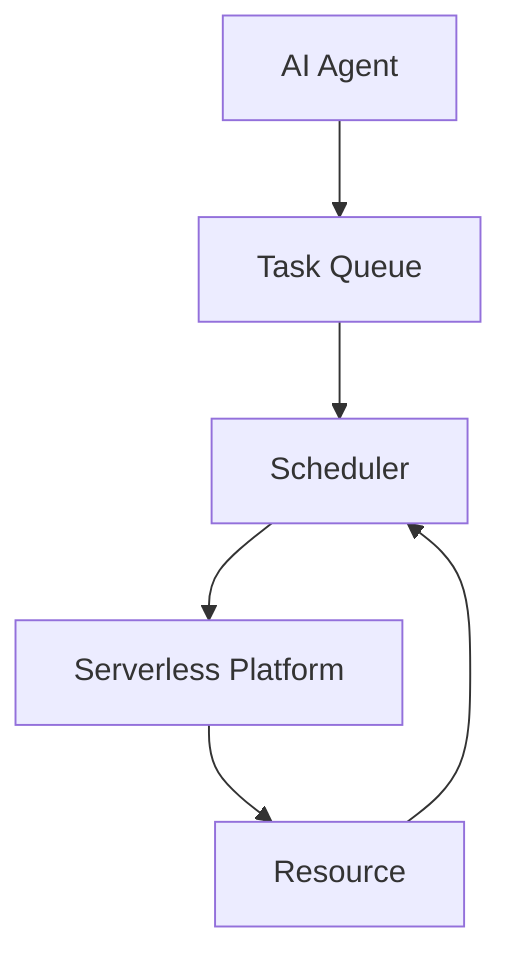
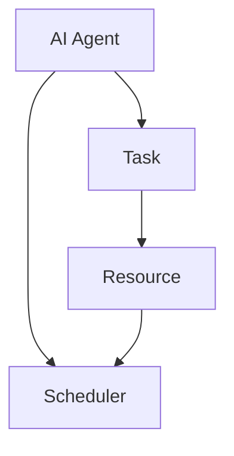
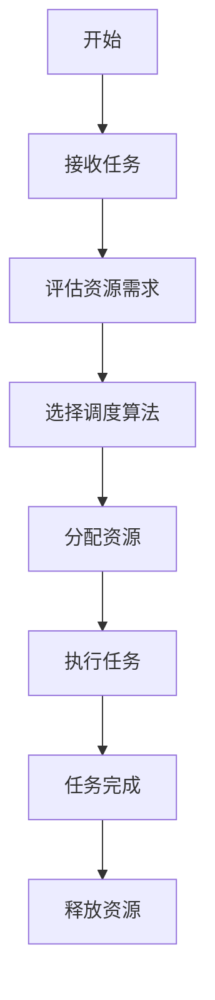
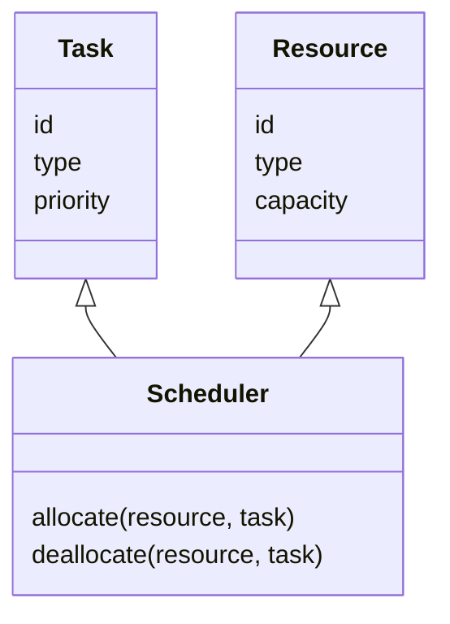
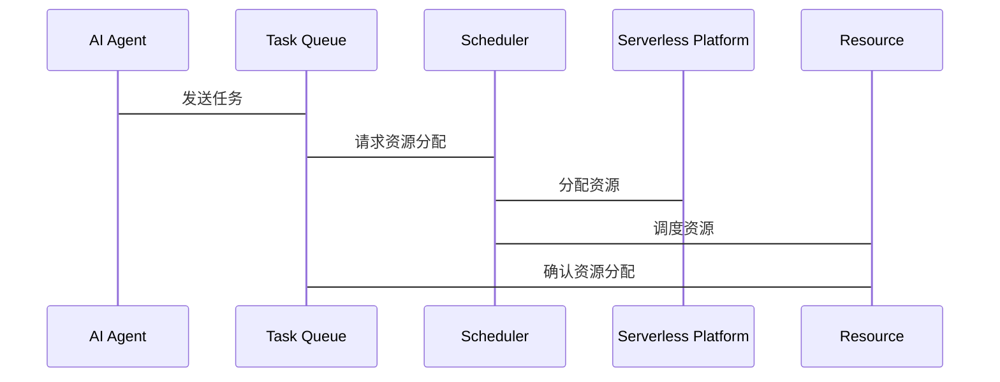

                 


# 企业AI Agent的Serverless计算资源调度

## 关键词：企业AI Agent, Serverless, 资源调度, 计算资源, 算法优化, 架构设计, 负载均衡

## 摘要：随着企业AI Agent的广泛应用，Serverless计算因其弹性扩展和按需付费的特点，成为资源调度的理想选择。本文深入探讨了AI Agent在Serverless环境下的资源调度问题，分析了核心概念、算法原理、系统架构，并通过实际案例展示了资源调度的实现过程，最后提出了优化建议和未来研究方向。

---

# 第1章: 背景介绍

## 1.1 问题背景

### 1.1.1 企业AI Agent的需求与挑战
企业AI Agent作为智能化转型的核心工具，需要处理大量复杂任务，包括自然语言处理、图像识别和预测分析。然而，AI Agent的资源需求波动性大，传统虚拟机架构难以高效应对，导致资源浪费和成本增加。

### 1.1.2 Serverless计算的兴起
Serverless计算通过无服务器架构，将资源管理交由云平台处理，具备弹性扩展、按需付费和自动扩展等特点，为AI Agent的资源调度提供了新的解决方案。

### 1.1.3 资源调度的核心问题
资源调度需解决如何高效分配计算资源，确保任务按时完成，同时最小化成本。关键挑战包括任务类型多样性、资源分配策略优化和调度算法的实时性。

## 1.2 问题描述

### 1.2.1 AI Agent的资源需求特点
AI Agent任务类型多样，资源需求动态变化，对资源调度的实时性和准确性要求高。

### 1.2.2 Serverless环境下的资源分配问题
资源分配需考虑任务优先级、执行时间、资源利用率等多因素，确保任务高效执行。

### 1.2.3 调度算法的复杂性与优化目标
调度算法需平衡资源利用率、任务完成时间、成本等多个目标，构建高效的调度模型。

## 1.3 问题解决

### 1.3.1 调度算法的选择与设计
根据任务类型选择合适的调度算法，如轮转法、优先级调度和负载均衡算法，确保资源高效利用。

### 1.3.2 资源分配策略的制定
制定动态调整策略，根据任务负载实时分配资源，优化资源利用率和任务响应时间。

### 1.3.3 系统架构的优化与实现
通过优化系统架构，提升资源调度的效率和准确性，确保AI Agent在Serverless环境下的高效运行。

## 1.4 边界与外延

### 1.4.1 系统边界定义
明确系统与外部系统的接口，确保资源调度在限定范围内高效运行。

### 1.4.2 外延功能的考虑
考虑日志管理、监控告警等外延功能，确保系统运行稳定和可维护性。

### 1.4.3 与其他系统的接口设计
设计与云平台、任务队列等系统的接口，确保资源调度的无缝集成和协同工作。

## 1.5 概念结构与核心要素

### 1.5.1 核心概念的组成
包括AI Agent、Serverless平台、资源调度算法、任务队列和监控系统。

### 1.5.2 要素之间的关系
AI Agent触发任务，任务队列接收并分发任务，资源调度算法分配资源，监控系统实时跟踪资源使用情况。

### 1.5.3 系统整体架构图


---

# 第2章: 核心概念与联系

## 2.1 AI Agent的基本原理

### 2.1.1 AI Agent的定义与功能
AI Agent通过感知环境、理解需求、执行任务，为用户提供智能化服务，资源调度是其高效运行的关键。

### 2.1.2 Serverless计算的特点与优势
Serverless计算具备弹性扩展、按需付费和自动管理资源的特点，适合处理AI Agent的动态任务。

### 2.1.3 资源调度的核心机制
资源调度通过算法优化，动态分配计算资源，确保任务高效执行。

## 2.2 核心概念的对比分析

### 2.2.1 资源分配的属性对比
| 属性 | 虚拟机 | Serverless |
|------|--------|------------|
| 资源分配 | 静态分配 | 动态分配 |
| 成本 | 固定成本 | 按需付费 |

### 2.2.2 调度算法的特征对比
| 特征 | 轮转法 | 优先级调度 | 负载均衡 |
|------|--------|------------|------------|
| 优点 | 简单公平 | 高优先级任务优先 | 高效利用资源 |
| 缺点 | 低优先级任务等待时间长 | 可能忽视低优先级任务 | 资源分配复杂 |

### 2.2.3 任务类型与资源需求的关系
任务类型影响资源需求，AI Agent需要根据任务类型动态调整资源分配策略。

## 2.3 ER实体关系图


---

# 第3章: 算法原理讲解

## 3.1 调度算法的Mermaid流程图


## 3.2 算法实现的Python代码
```python
def schedule_task(tasks, resources):
    for task in tasks:
        if task.type == 'high_priority':
            resources.high_priority_pool.allocate(task)
        else:
            resources.default_pool.allocate(task)
```

## 3.3 算法的数学模型和公式
调度算法的目标是最小化任务完成时间，同时平衡资源利用率：
$$ \text{目标函数} = \min \sum_{i=1}^{n} (t_i - s_i) $$
其中，$t_i$是任务完成时间，$s_i$是任务开始时间。

---

# 第4章: 系统分析与架构设计方案

## 4.1 问题场景介绍
企业AI Agent在Serverless环境下的资源调度场景，涉及任务队列管理、资源分配和监控。

## 4.2 系统功能设计

### 4.2.1 领域模型Mermaid类图


### 4.2.2 系统架构设计Mermaid架构图


## 4.3 系统接口设计和交互序列图


---

# 第5章: 项目实战

## 5.1 环境安装
安装Python、Serverless框架和相关工具。

## 5.2 核心实现源代码
```python
class Scheduler:
    def __init__(self, resources):
        self.resources = resources

    def allocate(self, task):
        if task.priority == 'high':
            selected_resource = next(r for r in self.resources if r.type == 'gpu')
        else:
            selected_resource = min(self.resources, key=lambda r: r utilization)
        return selected_resource

    def deallocate(self, resource, task):
        resource.free()
```

## 5.3 代码应用解读与分析
解释代码实现，分析资源分配策略和算法优化。

## 5.4 实际案例分析
通过具体案例说明资源调度的实际效果和优化方向。

## 5.5 项目小结
总结项目实现的关键点和经验教训。

---

# 第6章: 最佳实践、小结、注意事项和拓展阅读

## 6.1 最佳实践
选择合适的调度算法，优化资源分配策略，加强监控和日志管理。

## 6.2 小结
总结全文，强调资源调度在企业AI Agent中的重要性。

## 6.3 注意事项
关注资源分配的公平性，处理任务优先级冲突，优化算法效率。

## 6.4 拓展阅读
推荐相关书籍、论文和工具，帮助读者深入学习。

---

# 结语
企业AI Agent的Serverless计算资源调度是一个复杂但重要的问题。通过合理的设计和优化，可以提升系统的效率和性能，为企业的智能化转型提供支持。未来的研究可以进一步探索更高效的调度算法和更智能的资源分配策略。

