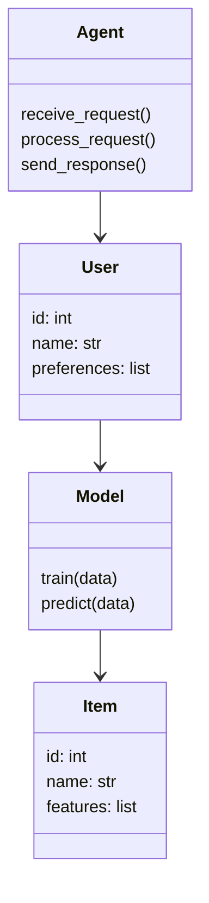
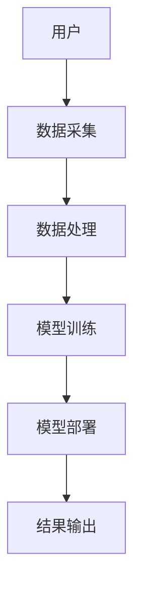
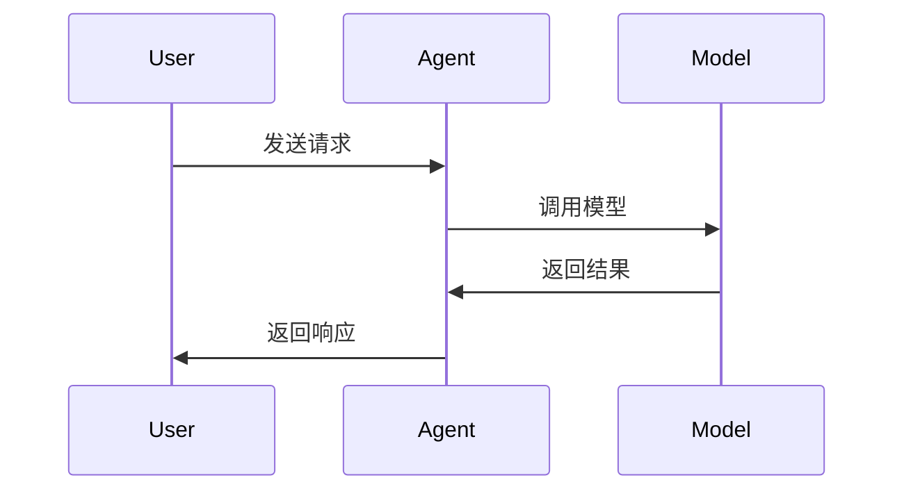

                 


# 企业AI Agent的个性化定制：适应不同部门需求

## 关键词：企业AI Agent，个性化定制，部门需求，推荐系统，深度学习，系统架构

## 摘要：  
本文探讨了企业AI Agent的个性化定制，分析了不同部门的需求特点，详细介绍了推荐系统、自然语言处理等算法的应用，提出了可扩展的系统架构和接口设计，并通过具体案例展示了个性化定制的实现过程。文章还总结了最佳实践和注意事项，为企业的AI Agent定制提供了全面的指导。

---

# 第一部分: 企业AI Agent的个性化定制概述

## 第1章: 企业AI Agent的基本概念与应用场景

### 1.1 AI Agent的定义与核心功能

#### 1.1.1 AI Agent的基本定义  
AI Agent（人工智能代理）是指能够感知环境、执行任务并做出决策的智能系统。它通过数据驱动和模型推理，为企业提供自动化支持，优化业务流程。

#### 1.1.2 AI Agent的核心功能  
1. **感知环境**：通过数据采集和分析，识别环境中的关键信息。  
2. **任务执行**：根据需求，执行特定任务，如推荐、预测或决策。  
3. **决策优化**：基于历史数据和实时反馈，优化决策策略。  

#### 1.1.3 企业AI Agent的独特性  
- **定制化需求**：不同部门的业务目标和数据特点差异显著，需要个性化的解决方案。  
- **高效性**：AI Agent需快速响应，确保业务流程的流畅性。  
- **可扩展性**：支持多种应用场景，适应企业发展的需求。  

### 1.2 企业AI Agent的应用场景

#### 1.2.1 销售部门的AI Agent应用  
AI Agent可以根据客户行为和偏好，提供个性化推荐，优化销售策略。例如，通过协同过滤算法推荐潜在客户，提升转化率。  

#### 1.2.2 客服部门的AI Agent应用  
AI Agent可以自动处理客户咨询，提供24/7的实时支持。例如，利用自然语言处理技术，识别客户情绪，提供相应的解决方案。  

#### 1.2.3 技术部门的AI Agent应用  
AI Agent可以辅助开发人员进行代码审查、故障排查和性能优化。例如，通过深度学习模型检测潜在的代码错误。  

### 1.3 个性化定制的必要性

#### 1.3.1 个性化定制的核心价值  
个性化定制能够提高AI Agent的准确性和实用性，更好地满足部门的特定需求。  

#### 1.3.2 企业部门需求的多样性  
不同部门的业务目标和数据特点差异显著，需要个性化的解决方案。例如，销售部门关注客户行为，而技术部门关注代码质量。  

#### 1.3.3 个性化定制的技术挑战  
个性化定制需要结合部门的特定数据和业务逻辑，技术实现复杂，且需要高效的计算能力。  

## 第2章: 企业AI Agent的个性化定制需求分析

### 2.1 部门需求的差异性

#### 2.1.1 销售部门的需求特点  
销售部门需要AI Agent能够实时分析客户行为，提供精准的推荐和预测。  

#### 2.1.2 客服部门的需求特点  
客服部门需要AI Agent能够理解客户情绪，提供个性化的服务解决方案。  

#### 2.1.3 技术部门的需求特点  
技术部门需要AI Agent能够快速识别代码问题，提供优化建议。  

### 2.2 个性化定制的实现路径

#### 2.2.1 数据驱动的定制方法  
通过收集和分析部门的特定数据，训练个性化模型。例如，销售部门可以通过客户点击数据训练推荐模型。  

#### 2.2.2 模型驱动的定制方法  
基于通用模型，通过微调或迁移学习，适应部门的特定需求。例如，技术部门可以通过预训练模型检测代码错误。  

#### 2.2.3 交互驱动的定制方法  
通过与用户的交互，动态调整模型参数，优化推荐结果。例如，销售部门可以根据客户的反馈调整推荐策略。  

### 2.3 定制化AI Agent的核心要素

#### 2.3.1 数据采集与处理  
数据是个性化定制的基础，需要从各部门收集结构化和非结构化数据，并进行清洗和预处理。  

#### 2.3.2 模型训练与优化  
根据部门需求，选择合适的算法，训练个性化模型，并通过验证和测试优化模型性能。  

#### 2.3.3 交互设计与反馈机制  
设计直观的交互界面，让用户能够方便地与AI Agent互动，并通过反馈机制不断优化模型。  

---

# 第二部分: 个性化定制的核心算法与实现

## 第3章: 推荐系统算法

### 3.1 推荐系统的原理与流程

#### 3.1.1 推荐系统的定义与分类  
推荐系统是一种通过分析用户行为和数据特征，向用户推荐相关内容的系统。它可以分为协同过滤、内容推荐和混合推荐三种类型。  

#### 3.1.2 基于协同过滤的推荐算法  
协同过滤算法通过分析用户的相似性，推荐相似用户的偏好内容。例如，基于用户的点击数据，推荐相似商品。  

#### 3.1.3 基于内容的推荐算法  
内容推荐算法通过分析物品的特征，推荐与当前物品相似的内容。例如，基于商品的属性推荐相关产品。  

### 3.2 基于深度学习的推荐算法

#### 3.2.1 矩阵分解模型  
矩阵分解是一种常用的方法，通过将用户-物品矩阵分解为两个低维矩阵，来预测用户的偏好。  

- 矩阵分解模型的公式：$$X = U \cdot V^T$$，其中$X$是用户-物品矩阵，$U$和$V$是低维矩阵。  

#### 3.2.2 神经网络协同过滤模型  
神经网络协同过滤模型通过神经网络结构，学习用户和物品的特征表示，进行推荐。  

- 示例代码：  
```python
import tensorflow as tf
from tensorflow.keras import layers

# 定义模型
model = tf.keras.Sequential([
    layers.Dense(64, activation='relu'),
    layers.Dense(1, activation='sigmoid')
])
```

#### 3.2.3 图神经网络推荐模型  
图神经网络模型通过构建用户和物品的图结构，进行推荐。  

- 示例代码：  
```python
import tensorflow as tf
from tensorflow.keras import layers

# 定义图神经网络模型
class Graph Neural Network(tf.keras.Model):
    def call(self, inputs):
        # 图结构处理
        # 输出预测结果
        return outputs
```

### 3.3 推荐系统的实现与优化

#### 3.3.1 推荐系统的实现流程  
1. 数据采集与预处理  
2. 模型训练与优化  
3. 推荐结果生成与展示  

#### 3.3.2 推荐系统的优化方法  
- 参数调优：通过交叉验证选择最优参数。  
- 模型融合：结合多种推荐算法，提升推荐效果。  

---

## 第4章: 自然语言处理算法

### 4.1 词嵌入模型

#### 4.1.1 词嵌入的基本原理  
词嵌入模型通过将词语映射到低维向量空间，捕捉词语的语义信息。常用的模型包括Word2Vec和GloVe。  

#### 4.1.2 Word2Vec模型  
Word2Vec通过_skip-gram_和_CBOW_两种架构，训练词向量。  

- 示例代码：  
```python
from gensim.models import Word2Vec

# 训练Word2Vec模型
model = Word2Vec(sentences, vector_size=100, window=5, min_count=1, workers=4)
```

### 4.2 序列模型

#### 4.2.1 RNN模型  
RNN模型通过循环神经网络，处理序列数据。  

- 示例代码：  
```python
import tensorflow as tf
from tensorflow.keras import layers

# 定义RNN模型
model = tf.keras.Sequential([
    layers.SimpleRNN(64),
    layers.Dense(1, activation='sigmoid')
])
```

#### 4.2.2 LSTM模型  
LSTM模型通过长短期记忆机制，处理序列数据中的长距离依赖。  

- 示例代码：  
```python
import tensorflow as tf
from tensorflow.keras import layers

# 定义LSTM模型
model = tf.keras.Sequential([
    layers.LSTM(64),
    layers.Dense(1, activation='sigmoid')
])
```

### 4.3 对话系统

#### 4.3.1 基于规则的对话系统  
基于规则的对话系统通过预定义的规则，生成回复。  

#### 4.3.2 基于深度学习的对话系统  
基于深度学习的对话系统通过训练对话数据，生成回复。常用的模型包括Seq2Seq和Transformer。  

- 示例代码：  
```python
import tensorflow as tf
from tensorflow.keras import layers

# 定义对话系统模型
model = tf.keras.Sequential([
    layers.Input(shape=(None,)),
    layers.Embedding(vocab_size, 64),
    layers.TransformerDecoder(...)
])
```

---

# 第三部分: 系统架构与设计

## 第5章: 可扩展的企业AI Agent系统架构

### 5.1 系统架构设计

#### 5.1.1 领域模型设计  
领域模型描述了系统的功能模块和数据流。  

- 示例：  


#### 5.1.2 系统架构图  
系统架构图展示了各模块之间的关系。  

- 示例：  


### 5.2 系统交互流程

#### 5.2.1 交互流程设计  
交互流程描述了用户与系统之间的交互步骤。  

- 示例：  


---

## 第6章: 系统接口设计与交互流程

### 6.1 系统接口设计

#### 6.1.1 接口定义  
系统接口定义了模块之间的交互方式。  

- 示例：  
```python
# 接口定义
class Agent:
    def receive_request(self, request):
        pass

    def process_request(self):
        pass

    def send_response(self, response):
        pass
```

#### 6.1.2 接口实现  
根据接口定义，实现具体的业务逻辑。  

---

# 第四部分: 项目实战

## 第7章: 销售部门的个性化定制案例

### 7.1 环境安装与数据准备

#### 7.1.1 环境安装  
安装所需的依赖库，如TensorFlow、Keras、Gensim等。  

- 示例代码：  
```bash
pip install tensorflow gensim
```

#### 7.1.2 数据准备  
收集和整理销售部门的客户数据和历史销售数据。  

### 7.2 核心代码实现

#### 7.2.1 数据预处理  
对数据进行清洗和特征提取。  

- 示例代码：  
```python
import pandas as pd

# 数据加载
data = pd.read_csv('sales_data.csv')

# 数据清洗
data.dropna(inplace=True)

# 特征提取
features = data[['age', 'gender', 'purchase_history']]
```

#### 7.2.2 模型训练  
训练个性化推荐模型，并进行验证和测试。  

- 示例代码：  
```python
from sklearn.metrics.pairwise import cosine_similarity

# 计算相似度
similarity_matrix = cosine_similarity(features)
```

#### 7.2.3 模型部署  
将模型部署到生产环境，提供实时推荐服务。  

---

## 第8章: 客服部门的个性化定制案例

### 8.1 环境安装与数据准备

#### 8.1.1 环境安装  
安装自然语言处理相关的依赖库，如spaCy、Gensim等。  

- 示例代码：  
```bash
pip install spacy gensim
```

#### 8.1.2 数据准备  
收集和整理客服部门的客户咨询和历史对话数据。  

### 8.2 核心代码实现

#### 8.2.1 数据预处理  
对数据进行清洗和特征提取。  

- 示例代码：  
```python
import spacy

# 数据加载
data = pd.read_csv('support_data.csv')

# 数据清洗
data.dropna(inplace=True)

# 特征提取
text_features = data['text'].apply(spacy.lang.en.English().lex)
```

#### 8.2.2 模型训练  
训练自然语言处理模型，并进行验证和测试。  

- 示例代码：  
```python
from gensim.models import Word2Vec

# 训练Word2Vec模型
model = Word2Vec(sentences, vector_size=100, window=5, min_count=1, workers=4)
```

#### 8.2.3 模型部署  
将模型部署到生产环境，提供实时对话服务。  

---

# 第五部分: 高级主题与最佳实践

## 第9章: 模型的可解释性与多模态交互

### 9.1 模型的可解释性

#### 9.1.1 可解释性的定义  
可解释性是指模型的决策过程能够被人类理解。  

#### 9.1.2 提升可解释性的方法  
- 使用可解释性模型，如线性回归和决策树。  
- 提供模型的解释报告，如SHAP值和LIME解释。  

### 9.2 多模态交互

#### 9.2.1 多模态交互的定义  
多模态交互是指通过多种感官输入（如文本、语音、图像）进行交互。  

#### 9.2.2 多模态交互的应用  
- 销售部门：结合文本和图像进行推荐。  
- 客服部门：结合语音和文本进行交互。  

## 第10章: 最佳实践与注意事项

### 10.1 最佳实践

#### 10.1.1 数据管理  
- 确保数据的完整性和准确性。  
- 定期更新数据和模型。  

#### 10.1.2 模型优化  
- 定期监控模型性能，进行再训练和优化。  
- 使用分布式计算框架，如Spark和Dask，提升计算效率。  

### 10.2 注意事项

#### 10.2.1 隐私与安全  
- 遵守数据隐私法规，确保数据的安全性。  
- 定期进行安全审计和漏洞修复。  

#### 10.2.2 可持续性  
- 设计可持续的系统架构，支持长期运行和扩展。  
- 定期评估系统的资源消耗，优化资源配置。  

---

# 结语

企业AI Agent的个性化定制是一个复杂而重要的任务，需要结合部门需求和先进技术，进行系统化的设计和实现。通过本文的探讨，读者可以全面了解企业AI Agent的核心概念、算法实现和系统架构，为实际应用提供有价值的指导。未来，随着技术的进步，个性化定制的深度和广度将进一步扩展，为企业创造更大的价值。  

---

