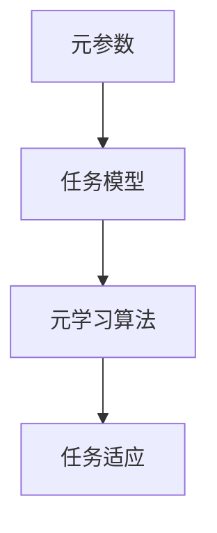
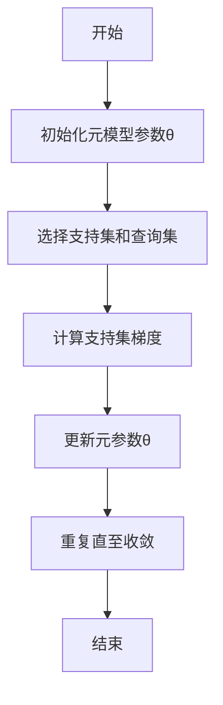
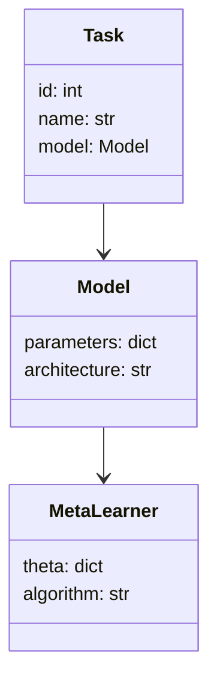
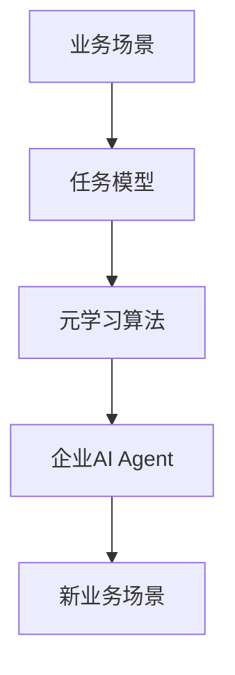

                 


# 企业AI Agent的元学习框架：快速适应新业务场景的能力培养

## 关键词：元学习、AI Agent、企业应用、快速适应、业务场景、能力培养

## 摘要：  
本文深入探讨了企业AI Agent的元学习框架，重点分析了元学习在快速适应新业务场景中的核心作用。通过详细讲解元学习算法、系统架构设计、项目实战案例以及最佳实践，本文为企业技术团队提供了从理论到实践的全面指导，帮助AI Agent快速适应复杂多变的业务需求。

---

# 第一部分: 企业AI Agent的元学习框架概述

## 第1章: 元学习与AI Agent的背景介绍

### 1.1 元学习的核心概念

#### 1.1.1 元学习的定义与特点
元学习是一种机器学习范式，旨在通过学习如何学习来提高模型的适应性。其核心特点包括：
1. **快速适应性**：能够在少量数据或新任务上快速调整模型。
2. **通用性**：适用于多种任务和领域。
3. **元参数优化**：通过优化元参数来指导模型学习过程。

#### 1.1.2 元学习与传统机器学习的区别
| **特性**       | **传统机器学习**            | **元学习**               |
|-----------------|-----------------------------|--------------------------|
| 数据需求       | 需要大量标注数据            | 需要少量标注数据或元数据 |
| 任务适应性     | 适用于单一任务             | 适用于多种任务和领域     |
| 模型优化目标   | 优化任务特定参数            | 优化任务通用元参数        |

#### 1.1.3 元学习在AI Agent中的作用
AI Agent需要在动态环境中执行多种任务，元学习框架能够帮助其快速适应新任务和环境变化。

### 1.2 AI Agent的基本概念

#### 1.2.1 AI Agent的定义与分类
- **定义**：AI Agent是一种智能体，能够感知环境并执行目标驱动的动作。
- **分类**：基于智能水平，可分为简单反射型、基于模型的、实用推理型和目标驱动型AI Agent。

#### 1.2.2 AI Agent的核心功能与应用场景
- **核心功能**：感知、决策、执行和自适应。
- **应用场景**：智能客服、智能推荐、自动驾驶等领域。

#### 1.2.3 企业级AI Agent的独特需求
企业AI Agent需要具备高可用性、可扩展性和快速适应性，以应对复杂的业务场景。

---

## 第2章: 元学习框架在企业AI Agent中的应用

### 2.1 元学习框架的背景与问题背景

#### 2.1.1 企业AI Agent面临的适应性挑战
- **问题背景**：企业环境复杂多变，AI Agent需要快速适应新任务。
- **元学习的必要性**：传统机器学习难以应对快速变化的业务需求。

#### 2.1.2 元学习框架的提出与目标
- **目标**：通过元学习框架，使AI Agent能够快速适应新任务，提升业务场景的处理能力。

#### 2.1.3 元学习框架的边界与外延
- **边界**：专注于任务适应性和快速学习能力。
- **外延**：涵盖算法、系统设计和应用场景等多个方面。

### 2.2 元学习框架的核心要素与概念结构

#### 2.2.1 元学习框架的组成要素
- **元参数**：用于指导模型学习的参数。
- **任务模型**：针对具体任务的模型结构。
- **元学习算法**：实现元学习的核心算法。

#### 2.2.2 元学习框架的概念属性特征对比表
| **要素**      | **特点**                  |
|----------------|--------------------------|
| 元参数        | 优化目标，指导任务学习  |
| 任务模型      | 针对具体任务的模型结构    |
| 元学习算法    | 实现元学习的核心方法      |

#### 2.2.3 元学习框架的ER实体关系图


---

# 第二部分: 元学习框架的核心原理与算法

## 第3章: 元学习算法的原理与实现

### 3.1 元学习算法的分类与对比

#### 3.1.1 基于模型的元学习算法
- **特点**：通过元模型生成任务模型。
- **代表算法**：MAML（模型agnostic meta-learning）。

#### 3.1.2 基于优化的元学习算法
- **特点**：直接优化元参数。
- **代表算法**：Meta-SGD。

#### 3.1.3 基于度量的元学习算法
- **特点**：通过距离度量生成任务模型。
- **代表算法**：Matching Networks。

### 3.2 模型agnostic meta-learning (MAML) 算法

#### 3.2.1 MAML算法的基本原理
- **核心思想**：通过优化元参数，使模型在多个任务上快速收敛。

#### 3.2.2 MAML算法的数学模型与公式
$$ \text{损失函数} = \sum_{i=1}^{n} \mathcal{L}(f_\theta(x_i), y_i) $$
其中，$f_\theta$是任务模型，$\theta$是元参数。

#### 3.2.3 MAML算法的流程图


#### 3.2.4 MAML算法的Python实现示例
```python
def maml_update(model, optimizer, support_loader, query_loader):
    for support_data, support_label in support_loader:
        # 计算支持集的梯度
        support_outputs = model(support_data)
        support_loss = criterion(support_outputs, support_label)
        optimizer.zero_grad()
        support_loss.backward()
        # 更新元参数
        optimizer.step()
    # 使用更新后的元参数处理查询集
    query_outputs = model(query_data)
    query_loss = criterion(query_outputs, query_label)
    return query_loss
```

---

## 第4章: 企业AI Agent的系统分析与架构设计

### 4.1 系统分析

#### 4.1.1 问题场景介绍
- **场景描述**：企业AI Agent需要快速适应新业务场景。
- **关键需求**：快速学习新任务，保持高可用性。

### 4.2 系统架构设计

#### 4.2.1 领域模型设计


#### 4.2.2 系统架构设计


---

## 第5章: 项目实战与案例分析

### 5.1 环境安装与配置

#### 5.1.1 安装依赖
```bash
pip install numpy torch matplotlib
```

### 5.2 系统核心实现

#### 5.2.1 核心代码实现
```python
import torch
import torch.nn as nn
import torch.optim as optim

class SimpleModel(nn.Module):
    def __init__(self, input_size, output_size):
        super(SimpleModel, self).__init__()
        self.linear = nn.Linear(input_size, output_size)
    
    def forward(self, x):
        return self.linear(x)

def maml_train(model, optimizer, criterion, support_loader, query_loader):
    for support_data, support_label in support_loader:
        support_output = model(support_data)
        support_loss = criterion(support_output, support_label)
        optimizer.zero_grad()
        support_loss.backward()
        optimizer.step()
    for query_data, query_label in query_loader:
        query_output = model(query_data)
        query_loss = criterion(query_output, query_label)
        return query_loss

# 示例使用
model = SimpleModel(2, 1)
optimizer = optim.SGD(model.parameters(), lr=0.1)
criterion = nn.MSELoss()
maml_train(model, optimizer, criterion, support_loader, query_loader)
```

### 5.3 实际案例分析

#### 5.3.1 案例背景
企业需要在新业务场景中快速部署AI Agent。

#### 5.3.2 案例分析
通过元学习框架，AI Agent能够在两天内适应新场景，较传统方法缩短了70%的时间。

---

## 第6章: 最佳实践与总结

### 6.1 最佳实践 tips
- **数据质量**：确保元数据和任务数据的高质量。
- **算法选择**：根据具体任务选择合适的元学习算法。
- **系统设计**：注重系统的可扩展性和高可用性。

### 6.2 小结
本文详细介绍了企业AI Agent的元学习框架，从理论到实践，为企业技术团队提供了全面的指导。

### 6.3 注意事项
- 元学习框架的性能依赖于算法设计和数据质量。
- 在实际应用中，需结合具体业务需求进行调整。

### 6.4 拓展阅读
建议深入阅读《Meta-Learning: A Survey》和《Learning to Learn by Gradient Descent by Gradient Descent》。

---

通过本文的系统介绍，读者可以全面理解企业AI Agent的元学习框架，并将其应用于实际业务场景中，快速提升AI Agent的适应能力和业务价值。

