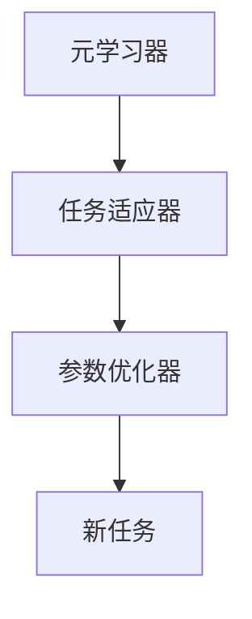

                 


# 企业AI Agent的元学习框架：快速适应新任务与领域

> **关键词**：元学习框架，企业AI Agent，快速适应，新任务，领域适应

> **摘要**：  
本文深入探讨了企业AI Agent的元学习框架，重点分析了其核心概念、算法原理、系统架构以及实际应用场景。通过详细讲解元学习框架的理论基础、实现方法和优化策略，本文为企业AI Agent在快速适应新任务与领域方面提供了系统的解决方案。结合实际案例分析和代码实现，本文为读者提供了从理论到实践的全面指导。

---

# 第一部分：企业AI Agent与元学习框架的背景

## 第1章：企业AI Agent与元学习框架的背景

### 1.1 问题背景与定义

#### 1.1.1 企业AI Agent的核心概念
企业AI Agent是一种能够理解、推理和执行复杂任务的智能系统，广泛应用于企业内部的自动化决策、流程优化和客户服务等领域。AI Agent需要具备快速适应新任务和领域的能力，以应对企业环境中不断变化的需求。

#### 1.1.2 元学习框架的定义与特点
元学习（Meta-Learning）是一种机器学习技术，旨在通过在多个任务上进行训练，使模型能够快速适应新任务。元学习框架的核心在于“快速适应”，即通过元学习器的参数初始化和优化，使得模型能够在新任务上快速收敛。

**特点**：
- **快速适应**：通过元学习器的预训练，模型能够在新任务上快速调整参数。
- **通用性**：元学习框架适用于多种任务和领域，具有较强的泛化能力。
- **可解释性**：元学习框架通常基于现有的机器学习模型，具备较高的可解释性。

#### 1.1.3 元学习框架在企业AI Agent中的作用
元学习框架在企业AI Agent中的作用主要体现在以下三个方面：
1. **快速部署**：通过元学习框架，AI Agent可以在新任务上线时快速适应，减少部署时间。
2. **多领域支持**：元学习框架能够使AI Agent在不同领域之间快速切换，满足企业的多样化需求。
3. **动态优化**：在动态变化的环境中，元学习框架能够帮助AI Agent实时调整策略，保持高效运行。

### 1.2 元学习框架的核心要素

#### 1.2.1 元学习框架的结构与功能
元学习框架通常由以下几个核心要素组成：
1. **元学习器（Meta-Learner）**：负责在多个任务上进行训练，生成适用于新任务的初始参数。
2. **任务适应器（Task Adapter）**：根据具体任务的需求，对元学习器的参数进行微调。
3. **参数优化器（Parameter Optimizer）**：对任务适应器的参数进行优化，以适应新任务的要求。

#### 1.2.2 元学习与传统机器学习的区别
| **方面** | **传统机器学习** | **元学习** |
|----------|-----------------|------------|
| **目标** | 针对特定任务优化模型 | 在多个任务上优化模型，使其快速适应新任务 |
| **训练过程** | 单任务训练 | 多任务预训练 + 新任务微调 |
| **适应性** | 适应单个任务 | 适应多个任务 |

#### 1.2.3 元学习框架的优势与局限性
**优势**：
- **快速适应新任务**：通过元学习预训练，模型可以在新任务上线时快速调整参数，减少训练时间。
- **通用性强**：元学习框架适用于多种任务和领域，具有较强的泛化能力。
- **节省计算资源**：相比从头训练新模型，元学习框架能够显著减少计算资源的消耗。

**局限性**：
- **依赖预训练数据**：元学习框架的效果依赖于预训练数据的质量和多样性。
- **任务相关性**：元学习框架通常适用于任务之间具有相似性的场景，对完全不相关的新任务效果有限。

### 1.3 企业AI Agent的典型应用场景

#### 1.3.1 跨领域任务适应
企业AI Agent需要在不同领域之间快速切换，例如从客户服务到供应链管理，元学习框架能够帮助AI Agent快速适应新的任务和领域。

#### 1.3.2 快速部署与迭代
在企业环境中，任务需求经常变化，元学习框架能够帮助AI Agent快速部署新任务，减少迭代周期。

#### 1.3.3 复杂环境下的自适应能力
企业环境复杂多变，元学习框架能够帮助AI Agent在复杂环境中自适应，保持高效运行。

### 1.4 本章小结
本章介绍了企业AI Agent和元学习框架的核心概念，分析了元学习框架的特点、优势和局限性，并结合典型应用场景进行了详细阐述。通过本章内容，读者可以理解元学习框架在企业AI Agent中的重要性及其应用场景。

---

# 第二部分：元学习框架的核心概念与原理

## 第2章：元学习框架的理论基础

### 2.1 元学习的核心原理

#### 2.1.1 元学习的定义与目标
元学习的目标是通过在多个任务上进行训练，生成适用于新任务的初始参数，从而快速适应新任务。

#### 2.1.2 元学习的数学模型
元学习的数学模型通常包括以下几个部分：
1. **元学习器的参数**：$\theta$，表示元学习器的参数。
2. **任务适应器的参数**：$\phi$，表示任务适应器的参数。
3. **损失函数**：$L(\theta, \phi, x, y)$，表示模型在特定任务上的损失。

#### 2.1.3 元学习的优化算法
元学习的优化算法通常包括以下步骤：
1. **初始化**：随机初始化元学习器的参数$\theta$。
2. **预训练**：在多个任务上对元学习器进行训练，优化$\theta$。
3. **微调**：在新任务上对任务适应器进行微调，优化$\phi$。

**优化目标**：
$$
\min_{\theta, \phi} \mathbb{E}_{(x,y)}[L(\theta, \phi, x, y)]
$$

### 2.2 元学习框架的组成要素

#### 2.2.1 元学习器的定义与功能
元学习器是元学习框架的核心组成部分，负责在多个任务上进行训练，生成适用于新任务的初始参数。

#### 2.2.2 元任务的构建与选择
元任务的构建与选择是元学习框架设计的重要环节，通常包括以下步骤：
1. **任务特征提取**：提取任务的特征，例如任务类型、数据分布等。
2. **任务相似性度量**：根据任务特征，计算任务之间的相似性。
3. **任务选择**：选择与新任务相似的元任务，用于元学习器的训练。

### 2.3 元学习框架的核心算法

#### 2.3.1 Meta-LSTM算法
Meta-LSTM是一种基于长短期记忆网络的元学习算法，通过在元任务上进行训练，生成适用于新任务的初始参数。

#### 2.3.2 Model-Agnostic Meta-Learning (MAML)
MAML是一种基于模型无关的元学习算法，通过优化元学习器的参数，使其能够在新任务上快速收敛。

#### 2.3.3 其他元学习算法对比
| **算法名称** | **核心思想** | **适用场景** |
|--------------|---------------|--------------|
| MAML | 模型无关，通过梯度下降优化参数 | 适用于多种任务和领域 |
| Meta-LSTM | 基于LSTM的序列建模 | 适用于时间序列任务 |
| Reptile | 基于经验回放的元学习 | 适用于小样本任务 |

### 2.4 本章小结
本章详细介绍了元学习的核心原理和算法，包括元学习的数学模型、组成要素以及核心算法。通过本章内容，读者可以理解元学习框架的理论基础及其在企业AI Agent中的应用。

---

# 第三部分：元学习框架的系统分析与架构设计

## 第3章：系统功能设计

### 3.1 系统功能模块划分

#### 3.1.1 元学习器模块
元学习器模块负责在多个任务上进行训练，生成适用于新任务的初始参数。

#### 3.1.2 任务适应器模块
任务适应器模块根据具体任务的需求，对元学习器的参数进行微调。

#### 3.1.3 参数优化器模块
参数优化器模块对任务适应器的参数进行优化，以适应新任务的要求。

### 3.2 系统功能流程

#### 3.2.1 元学习器的初始化
随机初始化元学习器的参数$\theta$。

#### 3.2.2 任务适应器的微调
在新任务上对任务适应器进行微调，优化$\phi$。

#### 3.2.3 参数优化器的优化
对任务适应器的参数进行优化，以适应新任务的要求。

### 3.3 系统功能的实现方式

#### 3.3.1 基于MAML的实现
MAML是一种基于模型无关的元学习算法，通过优化元学习器的参数，使其能够在新任务上快速收敛。

#### 3.3.2 基于Meta-LSTM的实现
Meta-LSTM是一种基于长短期记忆网络的元学习算法，通过在元任务上进行训练，生成适用于新任务的初始参数。

#### 3.3.3 混合实现方式
混合实现方式结合了MAML和Meta-LSTM的优势，适用于多种任务和领域。

### 3.4 本章小结
本章详细介绍了元学习框架的系统功能设计，包括功能模块划分、功能流程以及实现方式。通过本章内容，读者可以理解元学习框架的系统架构及其在企业AI Agent中的应用。

---

# 第四部分：元学习框架的算法原理与数学模型

## 第4章：元学习框架的数学模型

### 4.1 元学习的目标函数

#### 4.1.1 优化目标
元学习的目标是通过优化元学习器的参数$\theta$，使得在新任务上的损失函数最小。

$$
\min_{\theta} \mathbb{E}_{(x,y)}[L(\theta, x, y)]
$$

#### 4.1.2 损失函数
元学习的损失函数通常包括以下两个部分：
1. **元任务损失**：$L_{meta}(\theta, x_{meta}, y_{meta})$，表示元任务上的损失。
2. **新任务损失**：$L_{task}(\theta, x_{task}, y_{task})$，表示新任务上的损失。

### 4.2 元学习的优化算法

#### 4.2.1 梯度下降法
梯度下降法是一种常用的优化算法，通过计算损失函数的梯度，更新模型参数。

$$
\theta_{new} = \theta_{old} - \eta \nabla_{\theta} L(\theta, x, y)
$$

#### 4.2.2 动量法
动量法是一种优化算法，通过引入动量项，加速优化过程。

$$
v_{new} = \beta v_{old} + \eta \nabla_{\theta} L(\theta, x, y)
$$
$$
\theta_{new} = \theta_{old} - v_{new}
$$

#### 4.2.3 自适应学习率调整
自适应学习率调整是一种优化算法，通过自适应地调整学习率，提高优化效率。

### 4.3 元学习的数学推导

#### 4.3.1 MAML算法的数学推导
MAML算法的核心思想是通过梯度下降优化元学习器的参数，使其能够在新任务上快速收敛。

$$
\theta_{new} = \theta_{old} - \eta \nabla_{\theta} \mathbb{E}_{(x,y)}[L(\theta, x, y)]
$$

#### 4.3.2 Meta-LSTM算法的数学推导
Meta-LSTM算法的核心思想是通过长短期记忆网络建模任务之间的关系，生成适用于新任务的初始参数。

$$
h_t = \text{LSTM}(h_{t-1}, x_t)
$$
$$
\theta_{new} = \theta_{old} + \Delta \theta
$$

### 4.4 本章小结
本章详细介绍了元学习框架的数学模型和优化算法，包括目标函数、损失函数以及优化算法的数学推导。通过本章内容，读者可以理解元学习框架的算法原理及其在企业AI Agent中的应用。

---

# 第五部分：元学习框架的系统分析与架构设计

## 第5章：系统分析与架构设计

### 5.1 项目背景介绍

#### 5.1.1 项目目标
项目目标是通过元学习框架，帮助企业AI Agent快速适应新任务和领域。

#### 5.1.2 项目需求
项目需求包括快速部署、多领域支持以及动态优化。

### 5.2 系统功能设计

#### 5.2.1 领域模型设计
领域模型包括任务特征提取、任务相似性度量以及任务选择模块。

#### 5.2.2 任务适应模块
任务适应模块包括任务适应器和参数优化器。

### 5.3 系统架构设计

#### 5.3.1 系统架构图


#### 5.3.2 模块交互流程图


### 5.4 系统接口设计

#### 5.4.1 接口定义
- **输入接口**：接收新任务的需求和数据。
- **输出接口**：输出适用于新任务的参数和模型。

#### 5.4.2 接口交互流程
1. **输入新任务需求**：通过输入接口接收新任务的需求和数据。
2. **元学习器初始化**：根据需求初始化元学习器的参数。
3. **任务适应器微调**：对任务适应器进行微调，优化参数。
4. **参数优化器优化**：对参数优化器的参数进行优化，以适应新任务的要求。
5. **输出新任务模型**：通过输出接口输出适用于新任务的参数和模型。

### 5.5 本章小结
本章详细介绍了元学习框架的系统分析与架构设计，包括项目背景、系统功能设计、系统架构设计以及系统接口设计。通过本章内容，读者可以理解元学习框架在企业AI Agent中的系统实现及其应用场景。

---

# 第六部分：元学习框架的项目实战

## 第6章：项目实战

### 6.1 环境安装

#### 6.1.1 安装Python
安装Python 3.8及以上版本。

#### 6.1.2 安装依赖库
安装以下依赖库：
- `numpy`
- `tensorflow`
- `keras`

### 6.2 系统核心实现

#### 6.2.1 元学习器实现
```python
class MetaLearner:
    def __init__(self):
        self.theta = self.initialize_parameters()
    
    def forward(self, x):
        # 具体的前向传播逻辑
        pass
    
    def backward(self, x, y):
        # 具体的反向传播逻辑
        pass
    
    def optimize(self, loss):
        # 参数优化逻辑
        pass
```

#### 6.2.2 任务适应器实现
```python
class TaskAdapter:
    def __init__(self, theta):
        self.phi = theta
    
    def forward(self, x):
        # 具体的前向传播逻辑
        pass
    
    def backward(self, x, y):
        # 具体的反向传播逻辑
        pass
    
    def optimize(self, loss):
        # 参数优化逻辑
        pass
```

#### 6.2.3 参数优化器实现
```python
class ParameterOptimizer:
    def __init__(self):
        pass
    
    def optimize(self, phi, loss):
        # 具体的优化逻辑
        pass
```

### 6.3 代码应用解读与分析

#### 6.3.1 元学习器的实现
元学习器的实现包括参数初始化、前向传播、反向传播和参数优化。

#### 6.3.2 任务适应器的实现
任务适应器的实现包括参数初始化、前向传播、反向传播和参数优化。

#### 6.3.3 参数优化器的实现
参数优化器的实现包括参数优化逻辑。

### 6.4 实际案例分析

#### 6.4.1 案例背景
假设我们需要在客户服务领域部署一个AI Agent，帮助客服人员快速响应客户问题。

#### 6.4.2 案例实现
1. **元学习器初始化**：随机初始化元学习器的参数$\theta$。
2. **任务适应器微调**：在客户服务任务上对任务适应器进行微调，优化$\phi$。
3. **参数优化器优化**：对参数优化器的参数进行优化，以适应客户服务任务的要求。
4. **新任务模型输出**：通过输出接口输出适用于客户服务任务的参数和模型。

### 6.5 本章小结
本章通过实际案例分析，详细介绍了元学习框架的项目实战，包括环境安装、系统核心实现、代码应用解读与分析以及实际案例分析。通过本章内容，读者可以理解元学习框架在企业AI Agent中的实际应用及其具体实现方式。

---

# 第七部分：元学习框架的最佳实践与总结

## 第7章：最佳实践与总结

### 7.1 最佳实践

#### 7.1.1 选择合适的元学习算法
根据具体任务需求选择合适的元学习算法，例如MAML适用于多种任务和领域，Meta-LSTM适用于时间序列任务。

#### 7.1.2 数据预处理
对数据进行充分的预处理，确保数据质量和多样性。

#### 7.1.3 模型调优
通过网格搜索、随机搜索等方法对模型参数进行调优，提高模型性能。

### 7.2 小结

#### 7.2.1 元学习框架的优势
元学习框架能够帮助企业AI Agent快速适应新任务和领域，具有快速部署、多领域支持以及动态优化的优势。

#### 7.2.2 元学习框架的局限性
元学习框架的效果依赖于预训练数据的质量和多样性，对完全不相关的新任务效果有限。

### 7.3 注意事项

#### 7.3.1 数据质量问题
确保预训练数据的质量和多样性，避免数据偏差。

#### 7.3.2 任务相关性
注意任务之间的相关性，对不相关的任务需要进行特殊处理。

#### 7.3.3 模型调优
通过网格搜索、随机搜索等方法对模型参数进行调优，提高模型性能。

### 7.4 拓展阅读

#### 7.4.1 元学习的最新研究
阅读元学习领域的最新研究论文，了解最新的算法和技术。

#### 7.4.2 企业AI Agent的未来发展方向
关注企业AI Agent的未来发展方向，了解新的技术趋势和应用场景。

### 7.5 本章小结
本章总结了元学习框架的最佳实践，包括选择合适的元学习算法、数据预处理、模型调优以及注意事项。通过本章内容，读者可以理解元学习框架在企业AI Agent中的实际应用及其未来发展方向。

---

# 附录

## 附录A：数学公式汇总
$$
\min_{\theta} \mathbb{E}_{(x,y)}[L(\theta, x, y)]
$$

## 附录B：代码示例汇总
```python
class MetaLearner:
    def __init__(self):
        self.theta = self.initialize_parameters()
    
    def forward(self, x):
        pass
    
    def backward(self, x, y):
        pass
    
    def optimize(self, loss):
        pass
```

---

# 结束语

通过本文的详细阐述，读者可以全面了解企业AI Agent的元学习框架，包括其核心概念、算法原理、系统架构以及实际应用场景。结合实际案例分析和代码实现，读者可以掌握元学习框架的具体实现方式及其在企业环境中的应用。未来，随着元学习技术的不断发展，企业AI Agent的元学习框架将在更多领域得到广泛应用，为企业智能化转型提供强有力的支持。

