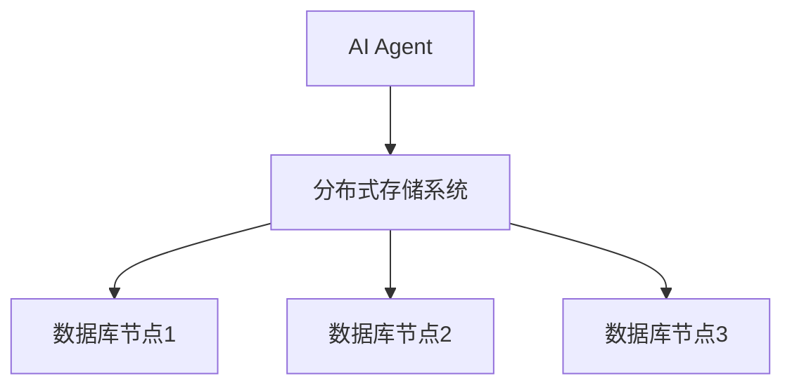

                 


# 企业AI Agent的分布式存储系统设计

> 关键词：企业AI Agent，分布式存储，系统设计，一致性算法，分布式事务

> 摘要：本文深入探讨了企业AI Agent在分布式存储系统中的设计与实现。从背景、核心概念、算法原理、系统架构到项目实战，全面分析了企业AI Agent如何通过分布式存储系统实现高效、可靠的数据管理。通过实际案例分析和详细代码实现，展示了如何在企业级应用中设计和优化分布式存储系统，确保系统的高可用性、扩展性和一致性。

---

## 第一部分：企业AI Agent与分布式存储概述

### 第1章：企业AI Agent的定义与背景

#### 1.1 企业AI Agent的定义与背景

企业AI Agent（Artificial Intelligence Agent）是指在企业环境中运行的智能代理，能够感知环境、自主决策并执行任务。它广泛应用于企业内部的自动化操作、数据分析、流程优化等领域。

**企业AI Agent的核心特征：**

1. **自主性**：能够独立决策和行动，无需人工干预。
2. **反应性**：能够感知环境并实时响应变化。
3. **目标导向**：基于预设目标执行任务。
4. **协作性**：能够与其他系统或AI Agent协同工作。

**企业AI Agent的应用场景：**

- **自动化操作**：如自动订单处理、库存管理。
- **数据分析**：如实时数据分析、预测性维护。
- **流程优化**：如自动化审批流程、资源分配优化。

**企业AI Agent对存储的需求：**

- **高可用性**：确保数据在任何时候都能被访问。
- **高扩展性**：支持大规模数据存储和处理。
- **一致性**：保证数据在分布式系统中的强一致性。

---

### 第2章：分布式存储的基本概念

#### 2.1 分布式存储的定义与特点

**分布式存储**是指将数据分散存储在多个独立的节点上，通过网络进行通信和数据同步。其特点包括：

1. **高可用性**：通过冗余存储和故障转移保证数据可用性。
2. **高扩展性**：能够轻松添加新节点以扩展存储容量和性能。
3. **一致性**：保证所有副本的数据一致。

**分布式存储的优势：**

- **容错性**：单个节点故障不会导致数据丢失。
- **负载均衡**：通过分布式存储降低单点压力。
- **灵活性**：支持多种数据模型和访问模式。

---

## 第二部分：分布式存储系统的核心概念与原理

### 第3章：分布式存储系统的核心概念

#### 3.1 分布式存储的关键特性

**CAP定理**：在分布式系统中，一致性（Consistency）、可用性（Availability）和分区容忍性（Partition Tolerance）三者无法同时满足。

- **一致性**：保证所有副本的数据一致。
- **可用性**：系统在任何情况下都能响应请求。
- **分区容忍性**：系统在网络分区的情况下仍能正常运行。

**一致性模型**：

- **强一致性**：所有副本在任何时间点都保持一致。
- **弱一致性**：副本之间可能有延迟，但最终会一致。

---

## 第三部分：分布式存储系统的设计与实现

### 第4章：分布式存储系统的设计原则

#### 4.1 分布式存储系统的设计目标

- **高可用性**：确保数据在任何情况下都能被访问。
- **高扩展性**：支持动态添加或移除节点。
- **高一致性**：保证数据在分布式系统中的强一致性。

**设计挑战：**

1. **数据一致性问题**：如何保证多个副本的数据一致性。
2. **网络分区问题**：如何在网络分区情况下保证系统可用性。
3. **节点故障问题**：如何处理节点故障导致的数据丢失。

**设计策略：**

- **分区策略**：将数据按某种规则分散到不同的节点。
- **副本策略**：通过冗余存储保证数据可用性。
- **一致性协议**：如Paxos、Raft等，确保数据一致性。

---

### 第5章：一致性算法与分布式存储

#### 5.1 Paxos一致性算法

**Paxos算法**是一种分布式一致性算法，用于在分布式系统中达成一致决策。

**Paxos算法流程：**

1. 提案者（Proposer）提出提案。
2. 参与者（Participant）通过投票决定提案是否通过。
3. 提案者确认提案通过，并通知所有参与者。

**Paxos算法的数学模型：**

- 提案编号：$p$
- 参与者集合：$P$
- 提案内容：$v$

**算法步骤：**

1. 提案者发送Prepare请求，询问参与者当前最高的提案编号。
2. 参与者返回Prepare响应，确认收到Prepare请求。
3. 提案者发送Accept请求，包含提案内容。
4. 参与者返回Accept响应，确认提案内容。

**Paxos算法的优缺点：**

- 优点：能够保证数据一致性。
- 缺点：实现复杂，性能较低。

---

## 第四部分：企业AI Agent的分布式存储系统架构

### 第6章：企业AI Agent的系统架构设计

#### 6.1 企业AI Agent的系统架构

**系统架构图：**



**系统功能设计：**

- 数据存储：AI Agent将数据存储到分布式存储系统。
- 数据查询：AI Agent从分布式存储系统中查询数据。
- 数据同步：AI Agent确保分布式存储系统中的数据一致性。

**系统实现：**

- 数据建模：定义数据结构和存储方式。
- 数据一致性：通过一致性算法保证数据一致性。
- 数据冗余：通过副本机制保证数据可用性。

---

### 第7章：项目实战与案例分析

#### 7.1 环境安装

**分布式存储系统环境：**

- 操作系统：Linux
- 分布式存储框架：Etcd
- 开发工具：Go语言

**安装步骤：**

1. 安装Etcd：`curl -sSL https://github.com/etcd-io/etcd/releases/download/v2.4.15/etcd-v2.4.15-linux-amd64.tar.gz -o etcd-v2.4.15-linux-amd64.tar.gz`
2. 解压Etcd：`tar -xzf etcd-v2.4.15-linux-amd64.tar.gz`
3. 启动Etcd：`./etcd-v2.4.15-linux-amd64/etcd`

---

### 第8章：系统实现与代码示例

#### 8.1 分布式一致性算法实现

**代码示例：**

```python
class Paxos:
    def __init__(self):
        self.proposer = Proposer()
        self.participants = [Participant() for _ in range(3)]

    def propose(self, value):
        highest = self.proposer.send_prepare()
        self.proposer.send_accept(highest + 1, value)
        return self.participants[0].get_value()
```

**代码解读：**

- `Paxos`类管理整个一致性算法的流程。
- `Proposer`类负责提出提案。
- `Participant`类负责参与投票。

---

## 第五部分：总结与展望

### 第9章：总结与最佳实践

#### 9.1 总结

企业AI Agent的分布式存储系统设计是一个复杂而重要的任务。通过合理的设计和优化，可以实现高效、可靠的数据管理。

**最佳实践：**

1. 选择合适的分布式存储框架。
2. 确保数据一致性和系统可用性。
3. 定期监控和维护系统。

---

## 第六部分：未来展望

### 第10章：未来发展趋势

#### 10.1 分布式存储的未来发展趋势

1. **更高效的一致性算法**：如Raft、Polar等。
2. **支持更多数据模型**：如键值存储、文档存储。
3. **智能化的存储管理**：通过AI技术优化存储性能。

---

## 结语

企业AI Agent的分布式存储系统设计是一个复杂而重要的任务。通过合理的设计和优化，可以实现高效、可靠的数据管理。未来，随着技术的发展，分布式存储系统将更加智能化和高效化。

---

希望这篇文章能够为企业AI Agent的分布式存储系统设计提供有价值的参考和启示。

