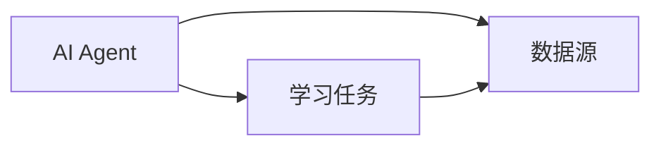
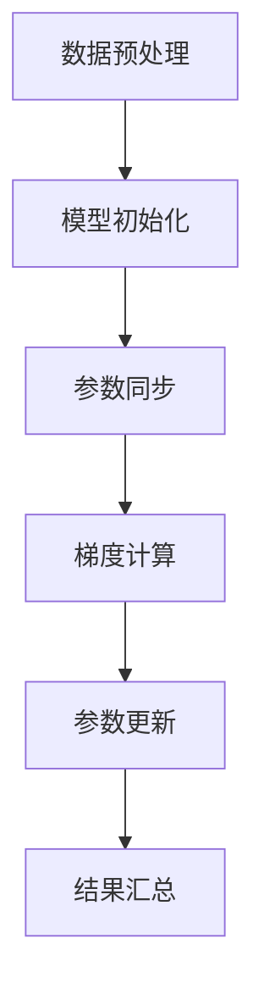
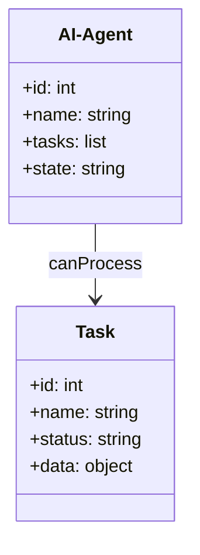
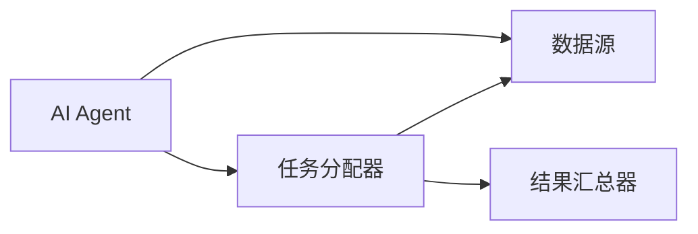
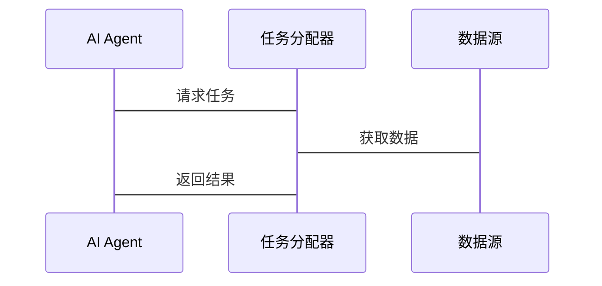

                 


# 企业AI Agent的分布式学习平台设计

> 关键词：分布式学习平台、AI Agent、企业智能化、分布式计算、机器学习

> 摘要：随着企业智能化转型的深入推进，AI Agent（人工智能代理）在企业中的应用日益广泛。然而，传统的集中式AI代理在处理大规模、多节点的分布式任务时，面临着计算效率低下、资源利用率不足等问题。本文将探讨企业AI Agent的分布式学习平台的设计与实现，从背景、核心概念、算法原理到系统架构、项目实战等多维度进行深入分析，为企业构建高效、可靠的分布式学习平台提供理论支持和实践指导。

---

# 第一部分: 企业AI Agent的背景与概念

## 第1章: 企业AI Agent的背景与概念

### 1.1 问题背景与挑战

#### 1.1.1 传统企业AI应用的局限性
传统的企业AI应用多以集中式架构为主，这种方式在处理单点任务时表现出色，但在面对大规模、多节点的分布式任务时，往往存在以下问题：
- **计算效率低下**：集中式架构难以充分利用多节点的计算资源，导致任务处理时间增加。
- **资源利用率不足**：在分布式环境中，单点计算容易成为性能瓶颈，资源浪费严重。
- **扩展性受限**：随着企业业务规模的扩大，集中式架构的扩展性逐渐显得不足，难以满足动态增长的计算需求。

#### 1.1.2 分布式学习的需求与痛点
随着企业对智能化需求的增加，AI Agent需要在分布式环境中完成以下任务：
- **多任务协作**：多个AI Agent需要协同完成复杂的分布式任务。
- **数据一致性**：在分布式环境下，确保数据的一致性是一个巨大的挑战。
- **通信与同步**：AI Agent之间需要高效的通信机制以确保任务的顺利进行。

#### 1.1.3 企业AI Agent的定义与目标
企业AI Agent是一种能够自主感知环境、理解和执行任务的智能实体。其目标是通过分布式学习和协作，为企业提供高效、智能的解决方案。

### 1.2 分布式学习平台的核心要素

#### 1.2.1 分布式计算的基本概念
分布式计算是一种将计算任务分散到多个计算节点上并行执行的计算模式，其核心在于充分利用多节点的计算资源，提高任务处理效率。

#### 1.2.2 AI Agent的特征与属性
- **智能性**：能够自主决策和学习。
- **协作性**：能够与其他AI Agent协同完成任务。
- **分布式性**：任务可以在多个节点上并行执行。

#### 1.2.3 平台的边界与外延
- **边界**：分布式学习平台的核心功能包括任务分配、数据同步、结果汇总等。
- **外延**：平台可能延伸至数据源、用户界面等外部系统。

### 1.3 本章小结
本章从背景、问题、概念等多个维度对企业AI Agent的分布式学习平台进行了概述，明确了平台的核心目标和关键要素。

---

# 第二部分: 分布式学习平台的核心概念与原理

## 第2章: 分布式学习平台的核心概念

### 2.1 核心概念与关系图

#### 2.1.1 实体关系图（ER图）


#### 2.1.2 核心概念对比表
| 概念 | 特性 | 描述 |
|------|------|------|
| AI Agent | 智能性 | 具备自主决策能力 |
| 分布式学习 | 并行性 | 多节点协同完成任务 |

### 2.2 核心原理概述

#### 2.2.1 分布式计算的基本原理
- 分布式计算通过将任务分解为多个子任务，并行执行以提高效率。
- 每个节点负责一部分数据的处理，最终将结果汇总。

#### 2.2.2 AI Agent的协作机制
- **任务分配**：中央调度器将任务分配给多个AI Agent。
- **数据同步**：各节点之间定期同步数据，确保一致性。
- **结果汇总**：各节点完成任务后，将结果汇总到中央节点。

### 2.3 本章小结
本章通过实体关系图和对比表，明确了分布式学习平台的核心概念及其关系，为后续的算法和系统设计奠定了基础。

---

# 第三部分: 分布式学习平台的算法原理

## 第3章: 分布式学习算法原理

### 3.1 分布式训练算法

#### 3.1.1 分布式训练流程图


#### 3.1.2 分布式训练的数学模型
- 损失函数：$$L = \frac{1}{n}\sum_{i=1}^{n}L_i$$
- 梯度计算：$$\Delta w = \sum_{i=1}^{n}\Delta w_i$$
- 参数更新：$$w = w + \alpha \Delta w$$

#### 3.1.3 并行计算的优化策略
- **数据并行**：每个节点处理不同的数据子集。
- **模型并行**：将模型的不同部分分布到不同的节点上。

### 3.2 分布式训练的实现代码示例

#### 3.2.1 环境安装
```bash
pip install tensorflow==2.10.0
```

#### 3.2.2 分布式训练代码
```python
import tensorflow as tf
from tensorflow import keras

# 分布式训练初始化
strategy = tf.distribute.MirroredStrategy()

with strategy.scope():
    model = keras.Sequential([
        keras.layers.Dense(64, activation='relu'),
        keras.layers.Dense(10, activation='softmax')
    ])
    
    model.compile(optimizer='adam',
                  loss='sparse_categorical_crossentropy',
                  metrics=['accuracy'])
    
    model.fit(x_train, y_train, epochs=10, batch_size=64)
```

### 3.3 本章小结
本章通过流程图和代码示例，详细讲解了分布式训练的算法原理和实现细节。

---

# 第四部分: 分布式学习平台的系统架构设计

## 第4章: 系统架构设计

### 4.1 问题场景介绍
在企业AI Agent的分布式学习平台中，我们需要设计一个高效、可靠的系统架构，以支持大规模的分布式任务处理。

### 4.2 系统功能设计

#### 4.2.1 领域模型设计


### 4.3 系统架构设计

#### 4.3.1 系统架构图


### 4.4 系统接口设计

#### 4.4.1 接口描述
- **任务分配接口**：将任务分配给多个AI Agent。
- **数据同步接口**：确保各节点数据的一致性。
- **结果汇总接口**：收集各节点的处理结果。

### 4.5 系统交互设计

#### 4.5.1 交互流程图


### 4.6 本章小结
本章通过系统架构设计和接口设计，明确了企业AI Agent分布式学习平台的技术实现路径。

---

# 第五部分: 项目实战

## 第5章: 项目实战

### 5.1 环境安装

#### 5.1.1 安装依赖
```bash
pip install tensorflow==2.10.0
pip install matplotlib
pip install numpy
```

### 5.2 核心代码实现

#### 5.2.1 分布式训练实现
```python
import tensorflow as tf
from tensorflow import keras
import numpy as np

# 分布式训练初始化
strategy = tf.distribute.MirroredStrategy()

with strategy.scope():
    # 定义模型
    model = keras.Sequential([
        keras.layers.Dense(64, activation='relu'),
        keras.layers.Dense(10, activation='softmax')
    ])
    
    # 定义损失函数和优化器
    loss_fn = keras.losses.sparse_categorical_crossentropy()
    optimizer = keras.optimizers.Adam()
    
    # 编译模型
    model.compile(optimizer=optimizer, loss=loss_fn, metrics=['accuracy'])
    
    # 生成数据
    x_train = np.random.rand(1000, 64)
    y_train = np.random.randint(0, 10, 1000)
    
    # 训练模型
    model.fit(x_train, y_train, epochs=10, batch_size=64)
```

#### 5.2.2 任务分配与结果汇总
```python
import multiprocessing
from multiprocessing import Process

def worker(model, data):
    # 处理数据
    result = model.predict(data)
    return result

def main():
    # 初始化模型
    model = keras.Sequential([
        keras.layers.Dense(64, activation='relu'),
        keras.layers.Dense(10, activation='softmax')
    ])
    
    # 数据分配
    data = np.random.rand(1000, 64)
    num_workers = multiprocessing.cpu_count()
    
    # 分配任务
    processes = []
    for i in range(num_workers):
        start = i * (len(data) // num_workers)
        end = (i + 1) * (len(data) // num_workers)
        data_slice = data[start:end]
        p = Process(target=worker, args=(model, data_slice))
        processes.append(p)
    
    # 启动任务
    for p in processes:
        p.start()
    
    # 等待任务完成
    for p in processes:
        p.join()
    
    # 汇总结果
    # （此处需要具体实现结果汇总逻辑）

if __name__ == '__main__':
    main()
```

### 5.3 代码解读与分析

#### 5.3.1 分布式训练实现
- **模型定义**：使用Keras定义了一个简单的神经网络模型。
- **数据生成**：生成随机数据用于训练。
- **训练过程**：使用TensorFlow的分布式策略进行模型训练。

#### 5.3.2 任务分配与结果汇总
- **多进程处理**：利用多进程将数据分配给多个节点进行处理。
- **结果汇总**：（此处需要具体实现）将各个节点的处理结果汇总到中央节点。

### 5.4 实际案例分析

#### 5.4.1 案例背景
假设我们有一个企业级的任务处理平台，需要处理大量的图像分类任务。

#### 5.4.2 实施方案
- **任务分配**：将图像数据分配给多个AI Agent进行处理。
- **结果汇总**：将各个AI Agent的处理结果汇总，生成最终的分类结果。

### 5.5 项目小结
本章通过实际案例，详细讲解了企业AI Agent分布式学习平台的实现过程，包括环境搭建、代码实现和结果分析。

---

# 第六部分: 最佳实践与总结

## 第6章: 最佳实践与总结

### 6.1 最佳实践

#### 6.1.1 系统设计
- **模块化设计**：确保系统模块清晰，便于维护和扩展。
- **容错机制**：设计完善的容错机制，确保系统可靠性。

#### 6.1.2 算法优化
- **负载均衡**：合理分配任务，确保各节点负载均衡。
- **通信优化**：优化节点之间的通信机制，减少网络开销。

### 6.2 小结
本文从背景、核心概念、算法原理到系统架构、项目实战等多个维度，详细探讨了企业AI Agent的分布式学习平台的设计与实现。

### 6.3 注意事项
- **数据一致性**：分布式系统中数据一致性是一个重要问题，需要通过一致性协议来解决。
- **网络延迟**：网络延迟可能影响系统的性能，需要通过优化通信机制来降低延迟。

### 6.4 拓展阅读
- 推荐阅读《分布式系统：概念与设计》和《深入理解分布式系统》等书籍，以进一步深入理解分布式系统的设计与实现。

---

# 结语

企业AI Agent的分布式学习平台是一个复杂而重要的技术领域。通过本文的探讨，我们深入理解了其核心概念、算法原理和系统架构，并通过实际案例展示了其具体实现过程。希望本文能为企业的智能化转型提供有价值的参考和指导。

