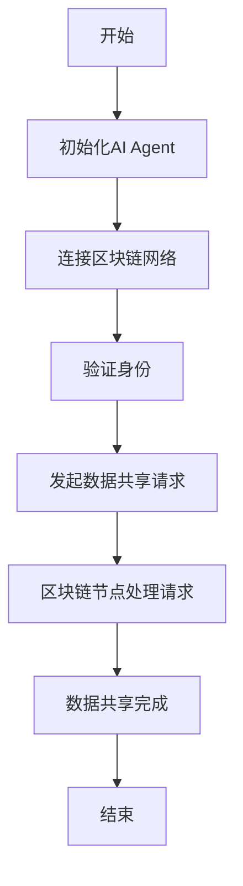
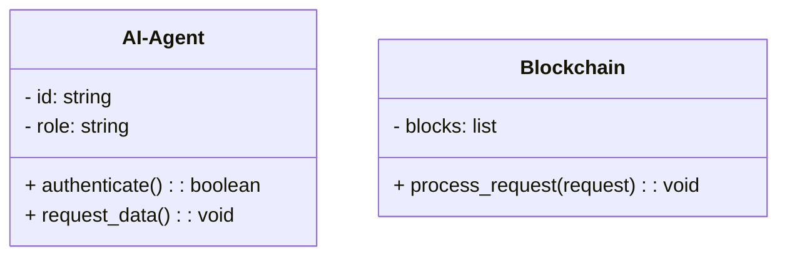
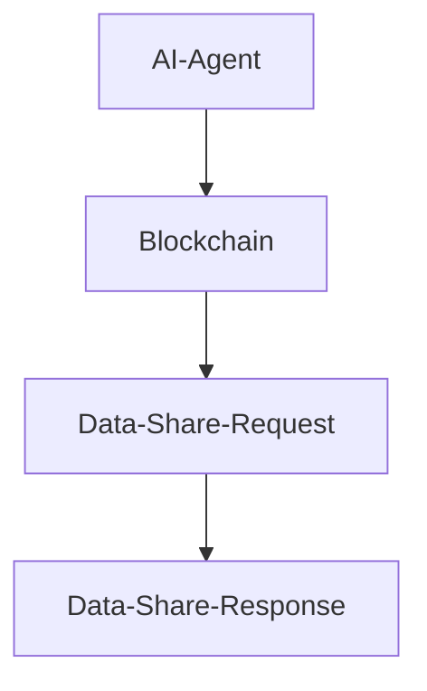
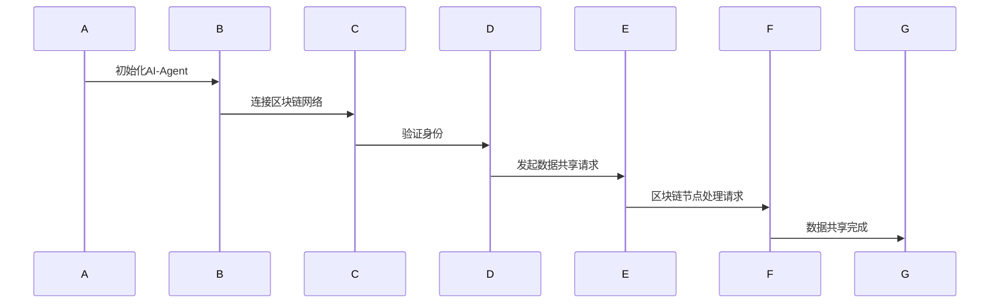

                 


# 企业AI Agent的区块链数据共享机制

> 关键词：企业AI Agent，区块链，数据共享，分布式系统，智能合约

> 摘要：本文详细探讨了企业AI Agent如何利用区块链技术实现高效、安全的数据共享机制。文章从问题背景出发，分析了传统数据共享的痛点，提出了基于区块链的解决方案，并详细阐述了AI Agent与区块链的结合原理、算法流程、系统架构及实际应用案例。

---

## 第一章: 问题背景与核心概念

### 1.1 问题背景

#### 1.1.1 数据共享的重要性
在企业数字化转型的今天，数据已成为核心资产。企业通过共享数据可以提升协作效率、优化决策，甚至创造新的业务价值。然而，传统的数据共享方式常常面临以下问题：

- 数据孤岛：不同部门或系统之间的数据无法有效整合，导致信息不透明。
- 安全性问题：数据在共享过程中可能被篡改或泄露。
- 效率低下：复杂的审批流程和中间人介入导致数据共享效率低。

#### 1.1.2 传统数据共享的痛点
传统的数据共享方式通常依赖于中心化的机构或平台，这种方式虽然在一定程度上解决了数据孤岛问题，但也带来了新的挑战：

- 中心化机构的单点故障风险：一旦中心机构出现问题，整个数据共享系统可能瘫痪。
- 数据隐私与安全风险：数据在传输和存储过程中可能被未经授权的第三方窃取或篡改。
- 成本高昂：中心化机构的运营成本较高，企业需要支付大量的服务费用。

#### 1.1.3 区块链技术的引入
区块链技术作为一种分布式账本技术，以其去中心化、不可篡改和透明性等特点，为数据共享问题提供了一种新的解决方案。区块链的特性使得数据共享更加安全、高效和透明。

### 1.2 问题描述

#### 1.2.1 数据孤岛现象
数据孤岛是指数据分散在不同的系统或部门中，缺乏统一的管理和共享机制，导致数据无法有效利用。

#### 1.2.2 数据共享的安全性挑战
数据在共享过程中可能面临的安全性问题，包括数据泄露、数据篡改等。

#### 1.2.3 数据共享的效率问题
传统的数据共享流程复杂，审批时间长，效率低下。

### 1.3 问题解决

#### 1.3.1 AI Agent的定义与作用
AI Agent（人工智能代理）是一种能够感知环境并采取行动以实现目标的智能实体。在数据共享中，AI Agent可以自动处理数据请求、验证权限、执行共享操作。

#### 1.3.2 区块链技术的解决方案
区块链技术通过去中心化的方式记录数据，确保数据的安全性和不可篡改性，同时通过智能合约自动执行数据共享的规则。

#### 1.3.3 数据共享机制的设计目标
设计目标包括：确保数据的安全性、提高数据共享的效率、实现数据的可追溯性。

### 1.4 边界与外延

#### 1.4.1 数据共享的边界条件
数据共享的边界包括数据的范围、参与方的权限、数据的生命周期等。

#### 1.4.2 相关领域的外延
与数据共享相关的领域包括数据隐私保护、数据安全、分布式系统等。

#### 1.4.3 核心概念的结构化分析
通过结构化分析，明确了AI Agent、区块链、数据共享机制之间的关系和相互作用。

### 1.5 核心要素组成

#### 1.5.1 数据共享的核心要素
- 数据源：数据的提供者。
- 数据消费者：数据的使用方。
- 共享规则：数据共享的条件和权限。
- 数据记录：记录数据共享的过程和结果。

#### 1.5.2 AI Agent的功能模块
- 数据感知：感知数据源和数据消费者的需求。
- 数据处理：对数据进行处理和验证。
- 数据共享：执行数据共享操作。

#### 1.5.3 区块链技术的实现组件
- 分布式账本：记录数据共享的详细信息。
- 智能合约：自动执行数据共享的规则。
- 节点共识：确保数据共享的合法性。

---

## 第二章: 核心概念与联系

### 2.1 核心概念原理

#### 2.1.1 AI Agent的工作原理
AI Agent通过感知环境、分析需求、执行操作来实现数据共享。其核心在于智能化的决策和自动化的执行能力。

#### 2.1.2 区块链技术的原理
区块链通过去中心化的方式记录数据，确保数据的安全性和不可篡改性。其核心在于分布式账本和智能合约的自动执行。

#### 2.1.3 数据共享机制的实现原理
数据共享机制通过AI Agent和区块链技术的结合，实现数据的安全、高效共享。其核心在于智能合约的自动执行和数据的不可篡改性。

### 2.2 概念属性特征对比

| 概念         | 描述                                                                 |
|--------------|----------------------------------------------------------------------|
| AI Agent     | 具有智能性和自主性，能够感知环境并采取行动。                          |
| 区块链       | 去中心化的分布式账本，确保数据的安全性和不可篡改性。                  |
| 数据共享机制 | 通过AI Agent和区块链技术实现数据的安全、高效共享。                    |

### 2.3 ER实体关系图

```mermaid
er
actor(AI Agent, id: string, role: string)
actor(User, id: string, role: string)
actor(区块链节点, id: string, role: string)
```

---

## 第三章: 算法原理讲解

### 3.1 算法流程图



### 3.2 算法实现代码

```python
def blockchain_data-sharing():
    # 初始化AI Agent
    agent = AI-Agent()
    # 连接区块链网络
    agent.connect Blockchain()
    # 验证身份
    if agent.authenticate():
        # 发起数据共享请求
        request = Data-Share-Request()
        # 区块链节点处理请求
        Blockchain.process(request)
        # 数据共享完成
        print("数据共享完成")
    else:
        print("身份验证失败")
```

### 3.3 数学模型和公式

数据共享的效率可以用以下公式表示：

$$ \text{效率} = \frac{\text{数据共享速度}}{\text{数据共享范围}} $$

---

## 第四章: 系统分析与架构设计

### 4.1 问题场景介绍

#### 4.1.1 数据共享场景
企业内部各部门之间的数据共享，需要确保数据的安全性和高效性。

#### 4.1.2 系统介绍
基于区块链的AI Agent数据共享系统，通过智能合约实现数据的自动共享和管理。

### 4.2 系统功能设计

#### 4.2.1 领域模型类图



#### 4.2.2 系统架构设计



#### 4.2.3 系统接口设计

- AI-Agent接口：提供认证、数据请求等功能。
- Blockchain接口：提供处理数据请求、验证交易等功能。

#### 4.2.4 系统交互序列图



---

## 第五章: 项目实战

### 5.1 环境安装

- 安装Python和相关库：`pip install mermaid4jupyter`

### 5.2 系统核心实现源代码

```python
class AI-Agent:
    def __init__(self, id, role):
        self.id = id
        self.role = role

    def authenticate(self):
        # 身份验证逻辑
        return True

    def request_data(self, data):
        # 发起数据请求
        pass

class Blockchain:
    def __init__(self):
        self.blocks = []

    def process_request(self, request):
        # 处理数据请求
        pass
```

### 5.3 代码应用解读与分析

- AI-Agent类实现了身份验证和数据请求功能。
- Blockchain类实现了数据请求的处理逻辑。

### 5.4 实际案例分析

#### 5.4.1 案例背景
某企业需要共享客户数据，确保数据的安全性和合规性。

#### 5.4.2 案例实现
通过AI-Agent和区块链技术，实现客户数据的自动共享和管理。

### 5.5 项目小结

通过实际案例，验证了AI-Agent与区块链技术结合的可行性，实现了高效、安全的数据共享。

---

## 第六章: 总结与展望

### 6.1 最佳实践 tips

- 在实际应用中，建议结合具体的业务需求，灵活调整系统架构。
- 定期更新智能合约，确保数据共享的合规性。

### 6.2 小结

本文详细探讨了企业AI-Agent的区块链数据共享机制，从问题背景到实际应用，全面分析了其核心概念、算法原理和系统架构。

### 6.3 注意事项

- 数据共享过程中，需严格控制访问权限，确保数据安全。
- 系统设计时，需考虑扩展性和可维护性。

### 6.4 拓展阅读

- 推荐阅读《区块链技术与应用》和《人工智能代理设计》。

---

以上是《企业AI Agent的区块链数据共享机制》的技术博客文章的完整目录和内容概述。通过系统化的分析和详细的技术阐述，本文为读者提供了关于如何利用AI Agent和区块链技术实现高效、安全的数据共享机制的深入理解。

