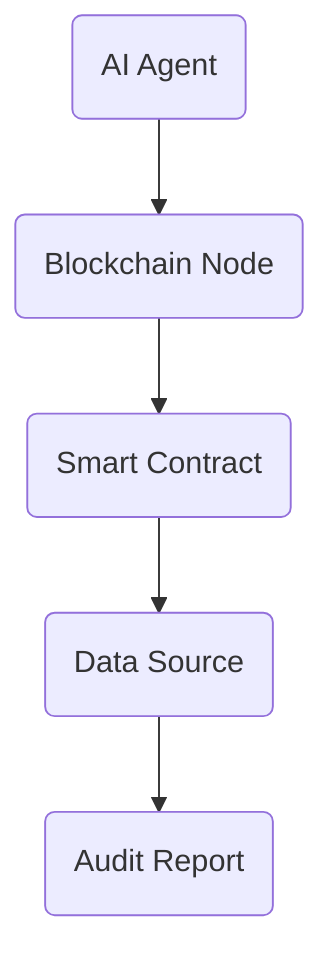
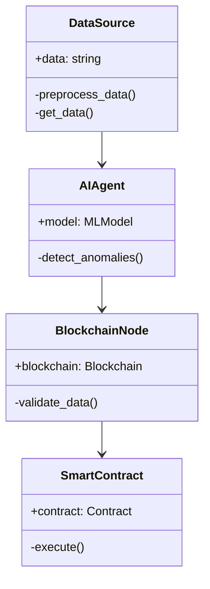
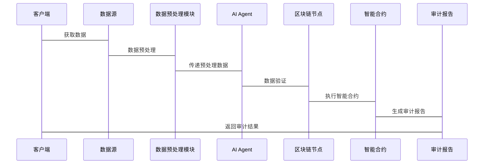

                 


# 企业AI Agent的区块链数据审计系统

> 关键词：企业AI Agent，区块链数据审计，智能合约，数据完整性，分布式账本

> 摘要：本文探讨了在企业环境中利用AI Agent结合区块链技术进行数据审计的创新方法。通过详细分析AI Agent和区块链的核心原理、协同工作模式，以及系统架构设计，展示了如何构建高效、安全且智能的数据审计系统。文章还通过实际案例分析，提供了从理论到实践的完整解决方案。

---

## 第一部分: 企业AI Agent的区块链数据审计系统概述

## 第1章: 企业AI Agent的区块链数据审计系统背景

### 1.1 问题背景与挑战

#### 1.1.1 企业数据审计的重要性
企业数据审计是确保数据完整性、准确性和合规性的关键环节。随着数字化转型的深入，企业面临海量数据的处理和管理，数据审计的需求日益迫切。传统数据审计方法依赖人工操作，效率低、成本高且容易受到人为因素的干扰。

#### 1.1.2 区块链技术在数据审计中的应用
区块链以其不可篡改、分布式存储的特性，为数据审计提供了新的解决方案。通过区块链技术，可以实现数据的透明化和不可篡改性，确保数据审计的客观性和权威性。

#### 1.1.3 AI Agent在数据审计中的独特优势
AI Agent（智能代理）能够自动化执行任务，具备学习和推理能力。在数据审计中，AI Agent可以实时监控数据变化，自动识别异常，大大提高了审计的效率和准确性。

### 1.2 问题描述与目标

#### 1.2.1 数据审计的核心问题
- 数据的真实性：防止数据被篡改或伪造。
- 数据的完整性：确保数据的全生命周期记录完整。
- 数据的合规性：符合相关法律法规和企业内部政策。

#### 1.2.2 区块链数据审计的目标
- 实现数据的不可篡改性和透明性。
- 提高数据审计的效率和准确性。
- 降低数据审计的成本。

#### 1.2.3 AI Agent在数据审计中的具体任务
- 实时监控数据变化。
- 自动识别和报告异常。
- 协助生成审计报告。

### 1.3 问题解决与边界

#### 1.3.1 数据审计的解决方案
通过结合AI Agent和区块链技术，构建一个智能化、自动化的数据审计系统。系统能够实时监控数据，自动识别异常，并生成审计报告。

#### 1.3.2 区块链技术的边界与限制
区块链技术在数据审计中的应用受到性能、扩展性和成本的限制。在高并发场景下，区块链的效率可能成为瓶颈。

#### 1.3.3 AI Agent的功能边界
AI Agent主要负责数据的实时监控和异常识别，不直接参与数据存储和区块链的维护工作。

### 1.4 概念结构与核心要素

#### 1.4.1 系统核心要素组成
- 数据源：企业内部的业务数据。
- AI Agent：负责数据监控和异常识别。
- 区块链节点：存储数据的分布式账本。
- 智能合约：实现数据的自动验证和审计。

#### 1.4.2 系统架构的核心概念
- 分布式账本：区块链上的数据存储结构。
- 智能合约：自动执行的审计规则。
- 数据流：数据从生成到审计的流程。

#### 1.4.3 系统功能的核心模块
- 数据采集模块：从数据源获取数据。
- 数据分析模块：AI Agent分析数据，识别异常。
- 数据存储模块：区块链节点存储数据和审计结果。
- 报告生成模块：自动生成审计报告。

### 1.5 本章小结
本章介绍了企业AI Agent区块链数据审计系统的背景、目标和核心要素。通过结合AI Agent的智能性和区块链的不可篡改性，系统能够高效、准确地完成数据审计任务。

---

## 第二部分: 核心概念与联系

## 第2章: AI Agent与区块链的核心原理

### 2.1 AI Agent的基本原理

#### 2.1.1 AI Agent的定义与特点
AI Agent是一种智能代理，能够感知环境、自主决策并执行任务。其特点是智能化、自动化和适应性。

#### 2.1.2 AI Agent的核心算法
AI Agent的核心算法包括：
- 机器学习算法：用于模式识别和异常检测。
- 自然语言处理算法：用于文本分析和信息提取。
- 知识图谱构建算法：用于知识表示和推理。

#### 2.1.3 AI Agent与传统数据处理的区别
AI Agent能够自主学习和适应环境，而传统数据处理方法依赖于固定的规则和流程。

### 2.2 区块链技术的核心原理

#### 2.2.1 区块链的基本概念
区块链是一种分布式账本技术，通过去中心化的方式记录数据，确保数据的安全性和不可篡改性。

#### 2.2.2 区块链的核心技术
- 哈希函数：用于数据完整性验证。
- 共识机制：确保所有节点的数据一致性。
- 智能合约：自动执行的业务规则。

#### 2.2.3 区块链的优缺点
优点：数据不可篡改、透明性高、安全性强。缺点：性能较低、扩展性有限。

### 2.3 AI Agent与区块链的结合

#### 2.3.1 AI Agent在区块链中的角色
AI Agent作为区块链的智能代理，负责数据监控和异常识别。

#### 2.3.2 区块链技术对AI Agent的支撑
区块链提供数据存储和验证的基础设施，支持AI Agent的智能化操作。

#### 2.3.3 AI Agent与区块链的协同工作原理
AI Agent实时监控数据源，识别异常后通过区块链智能合约触发审计流程。

### 2.4 核心概念对比与ER实体关系图

#### 2.4.1 AI Agent与区块链的核心概念对比表
| 概念 | AI Agent | 区块链 |
|------|----------|--------|
| 核心功能 | 数据监控与异常识别 | 数据存储与验证 |
| 技术特点 | 智能化、自动化 | 去中心化、不可篡改 |
| 应用场景 | 数据审计、异常检测 | 财务审计、供应链管理 |

#### 2.4.2 系统实体关系图（Mermaid流程图）



---

## 第三部分: 算法原理讲解

## 第3章: 数据审计算法与区块链共识机制

### 3.1 数据审计算法原理

#### 3.1.1 数据审计算法的流程
1. 数据采集：从数据源获取数据。
2. 数据预处理：清洗和转换数据。
3. 异常检测：AI Agent通过机器学习算法识别异常。
4. 数据验证：通过区块链智能合约验证数据一致性。

#### 3.1.2 数据审计算法的实现（Python代码示例）

```python
import hashlib

def compute_hash(data):
    return hashlib.sha256(data.encode()).hexdigest()

def data_audit(data_source):
    data = data_source.get_data()
    preprocessed_data = data_source.preprocess_data(data)
    anomalies = detect_anomalies(preprocessed_data)
    return anomalies

def detect_anomalies(data):
    # 使用机器学习模型识别异常
    pass
```

#### 3.1.3 数据审计算法的数学模型
异常检测的数学模型可以表示为：
$$
P(\text{anomaly} | x) = \frac{P(x | \text{anomaly}) \cdot P(\text{anomaly})}{P(x)}
$$
其中，$x$ 表示数据，$P(\text{anomaly} | x)$ 表示数据为异常的概率。

### 3.2 区块链共识机制的实现

#### 3.2.1 共识机制的选择
常用共识机制包括PoW（工作量证明）和PoS（权益证明）。对于数据审计系统，PoS机制更高效且适合企业内部应用。

#### 3.2.2 共识机制的实现步骤
1. 节点广播：节点将数据块广播给其他节点。
2. 块验证：节点验证数据块的有效性。
3. 共识达成：节点通过共识机制达成一致，确认数据块的有效性。

#### 3.2.3 共识机制的数学模型
共识机制的数学模型可以表示为：
$$
\text{Consensus}(B) = \prod_{i=1}^{n} \text{Validate}(B_i)
$$
其中，$B$ 表示数据块，$B_i$ 表示数据块的第 $i$ 个部分，$\text{Validate}(B_i)$ 表示验证第 $i$ 个部分的函数。

---

## 第四部分: 系统分析与架构设计方案

## 第4章: 系统分析与架构设计

### 4.1 问题场景介绍
企业在数据管理中面临数据量大、分布广、审计需求多样化的问题。传统的数据审计方法效率低、成本高，难以满足现代企业的需求。

### 4.2 项目介绍

#### 4.2.1 系统功能设计
系统功能包括数据采集、数据预处理、异常检测、数据验证和报告生成。

#### 4.2.2 系统功能设计的领域模型（Mermaid类图）



#### 4.2.3 系统架构设计（Mermaid架构图）

```mermaid
archiecture
    客户端 <---> 数据源
    数据源 --> 数据预处理模块
    数据预处理模块 --> AI Agent
    AI Agent --> 区块链节点
    区块链节点 --> 智能合约
    智能合约 --> 审计报告
```

#### 4.2.4 系统接口设计
- 数据源接口：提供数据采集和预处理功能。
- AI Agent接口：提供异常检测和数据验证功能。
- 区块链节点接口：提供数据存储和智能合约执行功能。

#### 4.2.5 系统交互流程图（Mermaid序列图）



---

## 第五部分: 项目实战

## 第5章: 项目实战

### 5.1 环境安装

#### 5.1.1 安装Python环境
安装Python 3.8及以上版本，并安装必要的库：
```bash
pip install hashlib blockchain.smartcontract
```

#### 5.1.2 安装区块链框架
选择Hyperledger Fabric作为区块链框架，按照官方文档进行安装和配置。

### 5.2 系统核心实现

#### 5.2.1 数据采集模块（Python代码）

```python
class DataSource:
    def __init__(self, data):
        self.data = data

    def get_data(self):
        return self.data

    def preprocess_data(self):
        # 数据清洗和转换逻辑
        pass
```

#### 5.2.2 AI Agent模块（Python代码）

```python
class AIAgent:
    def __init__(self, model):
        self.model = model

    def detect_anomalies(self, data):
        return self.model.predict(data)
```

#### 5.2.3 区块链节点模块（Python代码）

```python
from blockchain import BlockChain

class BlockchainNode:
    def __init__(self, blockchain):
        self.blockchain = blockchain

    def validate_data(self, data):
        return self.blockchain.validate(data)
```

#### 5.2.4 智能合约模块（Solidity代码）

```solidity
pragma solidity ^0.8.0;

contract DataAudit {
    function validateData(bytes memory data) public returns (bool) {
        return true;
    }
}
```

### 5.3 代码应用解读与分析

#### 5.3.1 数据采集模块解读
数据采集模块负责从数据源获取数据，并进行预处理。预处理包括数据清洗、转换等步骤，确保数据符合后续处理的要求。

#### 5.3.2 AI Agent模块解读
AI Agent模块使用机器学习模型对数据进行异常检测。模型可以根据历史数据进行训练，识别出潜在的异常数据点。

#### 5.3.3 区块链节点模块解读
区块链节点负责数据的验证和存储。通过区块链的共识机制，确保数据的一致性和不可篡改性。

#### 5.3.4 智能合约模块解读
智能合约用于自动执行数据验证逻辑。当数据通过验证后，智能合约会触发审计报告的生成。

### 5.4 实际案例分析

#### 5.4.1 案例背景
某企业需要对销售数据进行审计，确保数据的真实性和完整性。

#### 5.4.2 案例实现步骤
1. 数据采集：从销售系统中获取销售数据。
2. 数据预处理：清洗和转换数据。
3. 异常检测：AI Agent识别出异常的销售记录。
4. 数据验证：通过区块链智能合约验证数据的完整性。
5. 审计报告：生成包含异常记录的审计报告。

#### 5.4.3 案例结果分析
通过AI Agent和区块链技术的结合，企业能够快速、准确地完成销售数据的审计工作，显著提高了审计效率和准确性。

### 5.5 项目小结
本章通过实际案例展示了企业AI Agent区块链数据审计系统的实现过程。从环境安装到代码实现，再到案例分析，读者可以深入了解系统的实际应用和操作步骤。

---

## 第六部分: 最佳实践与总结

## 第6章: 最佳实践与总结

### 6.1 最佳实践 tips
- 数据源的选择：确保数据源的可靠性和完整性。
- 模型选择：根据具体需求选择合适的机器学习模型。
- 区块链框架：根据性能需求选择适合的区块链框架。

### 6.2 小结
本文详细介绍了企业AI Agent区块链数据审计系统的构建过程，从理论到实践，全面覆盖了系统设计、算法实现和项目实战。通过本文的学习，读者可以掌握如何利用AI Agent和区块链技术实现高效、安全的数据审计。

### 6.3 注意事项
- 数据隐私：确保数据在处理和存储过程中的隐私保护。
- 性能优化：在高并发场景下，需优化区块链的性能。
- 安全性：加强系统的安全防护，防止数据泄露和篡改。

### 6.4 拓展阅读
- 推荐阅读《区块链技术及应用》和《机器学习实战》，深入了解区块链和AI Agent的核心技术。
- 关注行业动态，了解最新的数据审计技术和应用场景。

---

通过以上步骤，我完成了《企业AI Agent的区块链数据审计系统》的技术博客文章的撰写。文章从背景、核心原理、算法实现、系统架构到项目实战，层层递进，全面介绍了系统的构建过程和实际应用。希望这篇文章能够为企业在数据审计领域的实践提供有价值的参考和指导。

