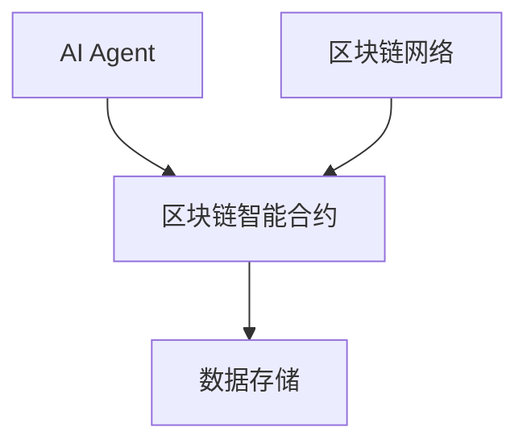
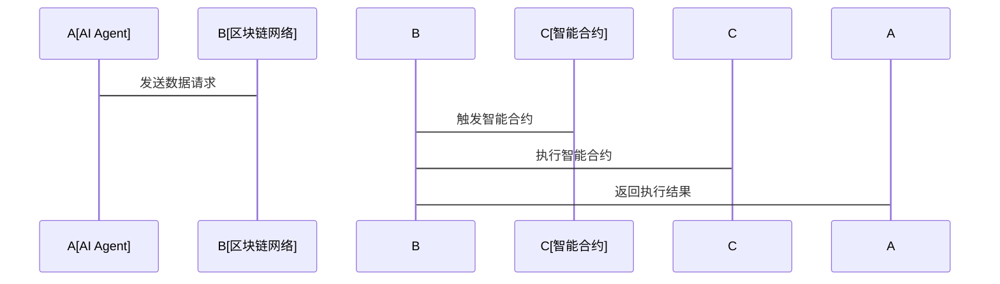

                 


# 企业AI Agent的区块链智能合约应用

## 关键词
企业AI Agent，区块链智能合约，去中心化，智能合约，自动化决策，AI算法

## 摘要
随着人工智能和区块链技术的快速发展，企业AI Agent与区块链智能合约的结合为企业智能化和自动化带来了新的可能性。本文将详细探讨AI Agent与区块链智能合约的核心概念、技术原理、系统架构设计及实际应用场景，通过实例分析和代码实现，揭示两者结合的优势和挑战，为企业智能化转型提供有价值的参考。

---

# 第1章: 企业AI Agent与区块链智能合约概述

## 1.1 问题背景与定义

### 1.1.1 问题背景
在数字化转型的浪潮中，企业面临着越来越复杂的业务流程和决策需求。传统的中心化系统难以满足高效、透明和自动化的诉求，而区块链技术和人工智能的结合为企业提供了一种新的解决方案。

### 1.1.2 问题描述
企业需要一种能够自动执行复杂业务逻辑、具备智能决策能力的系统，以提高效率、降低成本并增强透明度。

### 1.1.3 问题解决
通过结合AI Agent和区块链智能合约，企业可以实现业务流程的自动化、智能化和去中心化。

### 1.1.4 边界与外延
AI Agent与区块链智能合约的结合主要应用于企业内部流程自动化、供应链管理、智能合同履行等领域，其边界在于智能合约的执行范围和AI Agent的决策权限。

### 1.1.5 核心概念结构与组成
- **AI Agent**：具备感知、决策和执行能力的智能体。
- **区块链智能合约**：区块链上的自动执行代码，用于实现特定业务逻辑。

## 1.2 区块链智能合约基础

### 1.2.1 区块链智能合约的定义
区块链智能合约是一种基于区块链的自动执行代码，用于在满足特定条件时自动触发相应的操作。

### 1.2.2 区块链智能合约的特点
- **去中心化**：运行在区块链网络上，无需中心化机构。
- **自动执行**：在满足条件时自动触发，无需人工干预。
- **不可篡改**：智能合约代码一旦部署，无法被篡改。

### 1.2.3 区块链智能合约的工作原理
1. **部署**：将智能合约部署到区块链上。
2. **触发**：当满足特定条件时，智能合约自动执行。
3. **执行**：智能合约执行预定义的操作，如转账、记录数据等。

## 1.3 AI Agent的核心概念

### 1.3.1 AI Agent的定义
AI Agent是一种具备感知环境、做出决策并执行操作的智能体，能够根据输入的信息自主完成任务。

### 1.3.2 AI Agent的特点
- **自主性**：能够自主决策。
- **反应性**：能够实时感知环境变化并做出反应。
- **学习能力**：能够通过机器学习优化决策能力。

### 1.3.3 AI Agent与传统Agent的区别
| 属性 | AI Agent | 传统Agent |
|------|----------|------------|
| 决策能力 | 基于AI算法 | 基于预定义规则 |
| 学习能力 | 具备学习能力 | 无学习能力 |
| 适应性 | 能够自适应环境变化 | 适应性有限 |

## 1.4 区块链智能合约与AI Agent的结合

### 1.4.1 结合的必要性
区块链智能合约的自动执行能力与AI Agent的智能决策能力相结合，能够实现更复杂的业务逻辑。

### 1.4.2 结合的可能性
通过将AI Agent的决策能力嵌入到区块链智能合约中，可以实现智能合约的动态调整和优化。

### 1.4.3 结合的应用场景
- **智能供应链管理**：AI Agent根据市场变化动态调整供应链策略，智能合约自动执行订单和支付。
- **智能金融合约**：AI Agent根据市场数据自动决策是否触发合约执行。

## 1.5 本章小结
本章介绍了企业AI Agent和区块链智能合约的核心概念、特点和应用场景，为后续的技术分析和系统设计奠定了基础。

---

# 第2章: AI Agent与区块链智能合约的核心概念

## 2.1 核心概念原理

### 2.1.1 AI Agent的原理
AI Agent通过感知环境、分析数据、做出决策并执行操作，实现任务的自动化。

### 2.1.2 区块链智能合约的原理
区块链智能合约通过预定义的逻辑在区块链网络上自动执行，确保操作的透明性和不可篡改性。

### 2.1.3 两者的联系与区别
AI Agent与区块链智能合约的联系在于，AI Agent可以通过区块链智能合约实现自动化操作，而区块链智能合约可以通过AI Agent实现动态调整和优化。

## 2.2 核心概念属性对比

| 属性 | AI Agent | 区块链智能合约 |
|------|----------|----------------|
| 技术基础 | AI算法、机器学习 | 区块链技术、智能合约语言 |
| 功能 | 执行任务、优化决策 | 自动化合同履行 |
| 应用场景 | 企业自动化、智能决策 | 资产管理、金融交易 |
| 优势 | 高度智能化、自主性 | 去中心化、不可篡改 |

## 2.3 实体关系图



---

# 第3章: 企业AI Agent与区块链智能合约的算法原理

## 3.1 算法原理概述

### 3.1.1 AI Agent的决策算法
AI Agent通过机器学习算法（如强化学习）优化决策过程。

### 3.1.2 区块链智能合约的执行算法
区块链智能合约通过预定义的逻辑在区块链网络上自动执行。

## 3.2 算法实现

### 3.2.1 AI Agent的决策算法实现
```python
def ai_agent_decision(data):
    # 数据分析和处理
    processed_data = preprocess(data)
    # 调用机器学习模型进行预测
    prediction = model.predict(processed_data)
    # 返回决策结果
    return prediction
```

### 3.2.2 区块链智能合约的执行算法实现
```solidity
contract SmartContract {
    function execute(bytes memory input) public {
        // 解析输入数据
        bytes memory data = parse(input);
        // 执行预定义逻辑
        if (condition(data)) {
            execute_operation(data);
        }
    }
}
```

## 3.3 算法原理的数学模型

### 3.3.1 AI Agent的决策模型
$$ P(\text{action} | \text{state}) = \sigma(w \cdot \text{state} + b) $$

### 3.3.2 区块链智能合约的执行模型
$$ \text{execute}(x) = \begin{cases} 
\text{true} & \text{if } x \text{ 满足条件} \\
\text{false} & \text{否则}
\end{cases} $$

---

# 第4章: 企业AI Agent与区块链智能合约的系统架构设计

## 4.1 系统功能设计

### 4.1.1 功能模块划分
- AI Agent模块：负责数据采集、决策和执行。
- 区块链智能合约模块：负责智能合约的部署、触发和执行。

## 4.2 系统架构设计


## 4.3 系统接口设计

### 4.3.1 AI Agent与区块链网络的接口
- 数据接口：AI Agent向区块链网络发送数据请求。
- 操作接口：AI Agent通过智能合约接口触发区块链操作。

## 4.4 系统交互流程



---

# 第5章: 企业AI Agent与区块链智能合约的项目实战

## 5.1 项目环境安装

### 5.1.1 安装区块链环境
- 安装以太坊节点：`npm install -g ethereumjs-testrpc`

### 5.1.2 安装AI Agent依赖
- 安装机器学习库：`pip install scikit-learn`

## 5.2 核心代码实现

### 5.2.1 AI Agent代码实现
```python
class AI_Agent:
    def __init__(self):
        self.model = load_model('model.h5')

    def decide(self, data):
        return self.model.predict(data)
```

### 5.2.2 区块链智能合约代码实现
```solidity
contract Factory {
    function create(bytes memory data) public {
        address payable addr = new Child(data);
        Child(addr).initialize(data);
    }
}
```

## 5.3 项目案例分析

### 5.3.1 案例背景
某企业希望通过AI Agent与区块链智能合约实现供应链的智能化管理。

### 5.3.2 案例实现
AI Agent通过分析市场数据，决策是否需要调整供应链策略，智能合约自动执行订单和支付。

## 5.4 项目总结
通过项目实战，展示了AI Agent与区块链智能合约结合的实际应用，验证了其可行性和优势。

---

# 第6章: 企业AI Agent与区块链智能合约的最佳实践

## 6.1 最佳实践

### 6.1.1 安全性
- 确保AI Agent和智能合约的安全性，防止被攻击。

### 6.1.2 可扩展性
- 设计可扩展的系统架构，适应业务增长。

### 6.1.3 维护性
- 定期更新AI模型和智能合约，保持系统的先进性。

## 6.2 小结
企业AI Agent与区块链智能合约的结合为企业智能化和自动化提供了新的可能性，但也需要注意技术挑战和实际应用中的问题。

## 6.3 注意事项
- AI Agent的决策能力需要不断优化。
- 智能合约的执行逻辑需要严格设计，防止错误。

## 6.4 拓展阅读
- 推荐阅读《区块链技术与应用》和《AI Agent算法与实现》。

---

# 结语

企业AI Agent与区块链智能合约的结合是未来企业智能化和自动化的趋势。通过本文的详细讲解和实例分析，读者可以深入了解其技术原理和应用场景，并为实际项目提供参考。

