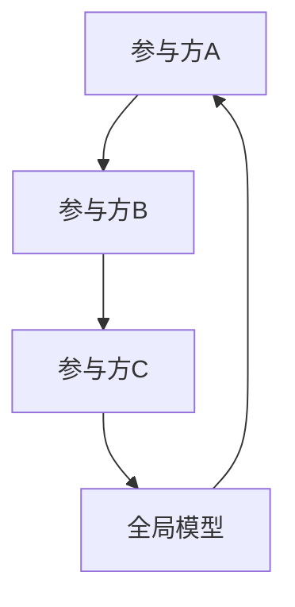
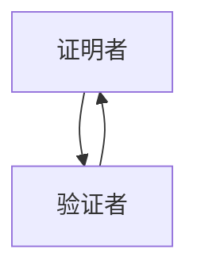
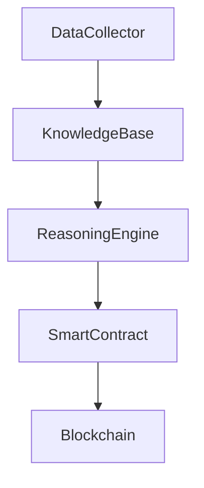
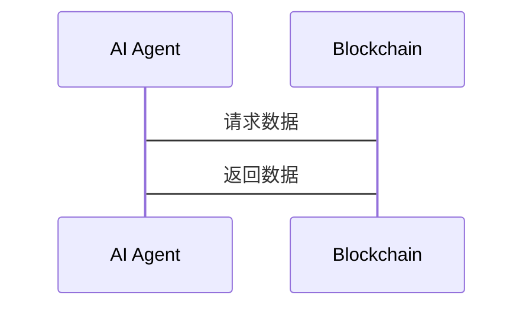

                 


# 企业AI Agent的区块链集成策略

> 关键词：企业AI Agent，区块链，智能合约，联邦学习，零知识证明，分布式系统，去中心化应用

> 摘要：本文深入探讨了企业AI Agent与区块链技术的集成策略，分析了AI Agent与区块链的核心概念与联系，详细讲解了联邦学习与零知识证明在区块链中的应用，提出了企业AI Agent与区块链结合的系统架构设计与实现方案。通过具体案例分析，展示了如何将AI Agent与区块链技术结合，实现企业智能化与数据安全的双重目标。

---

# 第一部分: 企业AI Agent的区块链集成背景与概念

## 第1章: 企业AI Agent与区块链概述

### 1.1 企业AI Agent的基本概念
#### 1.1.1 AI Agent的定义与特点
AI Agent（人工智能代理）是一种能够感知环境、自主决策并执行任务的智能实体。它具有以下特点：
- **自主性**：能够在没有外部干预的情况下自主运作。
- **反应性**：能够实时感知环境并做出反应。
- **学习能力**：能够通过数据学习和优化决策模型。
- **可扩展性**：能够处理复杂任务并适应不同场景。

#### 1.1.2 企业AI Agent的核心功能与应用场景
企业AI Agent的核心功能包括：
- 数据采集与处理：从多种数据源采集数据并进行预处理。
- 知识表示与推理：构建知识图谱并进行推理。
- 行为决策：基于推理结果做出决策并执行任务。
- 人机交互：与用户或其他系统进行交互。

应用场景包括智能客服、供应链优化、风险管理等领域。

#### 1.1.3 区块链技术的基本概念与特点
区块链是一种分布式账本技术，具有以下特点：
- **去中心化**：数据存储在多个节点上，不存在单点故障。
- **不可篡改**：数据一旦写入区块链，难以被篡改。
- **透明性**：数据对所有参与者可见，确保透明性。
- **智能合约**：通过智能合约自动执行预定义的业务逻辑。

### 1.2 企业AI Agent与区块链的集成背景
#### 1.2.1 当前企业数字化转型的趋势
企业数字化转型要求智能化、自动化和数据驱动的决策。AI Agent能够帮助企业实现这些目标。

#### 1.2.2 区块链技术在企业中的应用现状
区块链已经在金融、供应链、医疗等领域得到了广泛应用，为企业提供了安全、透明的数据管理方式。

#### 1.2.3 AI Agent与区块链结合的潜在价值
AI Agent与区块链结合可以实现以下价值：
- **数据共享**：通过区块链实现数据的安全共享，提升AI Agent的数据获取能力。
- **隐私保护**：利用区块链的隐私保护技术，确保数据安全。
- **信任机制**：通过区块链的去中心化特性，建立信任机制。

### 1.3 企业AI Agent与区块链集成的意义
#### 1.3.1 提升企业智能化水平
通过区块链与AI Agent的结合，企业可以实现更高效的决策和自动化流程。

#### 1.3.2 加强数据安全与隐私保护
区块链的不可篡改性和隐私保护技术能够有效保护企业的数据安全。

#### 1.3.3 优化企业协作效率
通过区块链实现的信任机制，可以优化企业内部和外部的协作效率。

### 1.4 本章小结
本章介绍了企业AI Agent和区块链的基本概念与特点，分析了它们的集成背景和潜在价值，为后续章节奠定了基础。

---

## 第2章: AI Agent的核心概念与原理

### 2.1 AI Agent的核心概念
#### 2.1.1 知识库与推理引擎
知识库是AI Agent的知识基础，推理引擎负责根据知识库进行推理。

#### 2.1.2 行为决策机制
行为决策机制是AI Agent的核心，负责根据推理结果做出决策。

#### 2.1.3 交互接口与通信协议
交互接口是AI Agent与外部系统或用户进行交互的界面，通信协议是实现交互的规则。

### 2.2 区块链的核心概念与原理
#### 2.2.1 区块链的基本结构
区块链由区块和链组成，每个区块包含交易数据和哈希值。

#### 2.2.2 分布式账本与共识机制
分布式账本是区块链的核心数据结构，共识机制是实现分布式账本一致性的算法。

#### 2.2.3 智能合约与去中心化应用
智能合约是区块链上的自动执行脚本，去中心化应用是基于智能合约构建的应用。

### 2.3 AI Agent与区块链的结合模型
#### 2.3.1 数据共享与隐私保护的平衡
通过区块链实现数据共享，同时通过隐私保护技术确保数据安全。

#### 2.3.2 智能合约与AI决策的协同
智能合约负责执行预定义的逻辑，AI Agent负责做出决策。

#### 2.3.3 区块链作为AI Agent的信任基础
区块链的去中心化特性为AI Agent提供了信任基础，确保数据的真实性和可靠性。

### 2.4 核心概念对比与联系
#### 2.4.1 AI Agent与传统AI系统的对比
| 特性         | AI Agent          | 传统AI系统       |
|--------------|-------------------|-----------------|
| 自主性       | 高                | 低              |
| 反应性       | 高                | 低              |
| 学习能力     | 高                | 中              |
| 可扩展性     | 高                | 中              |

#### 2.4.2 区块链与传统数据库的对比
| 特性         | 区块链            | 传统数据库       |
|--------------|-------------------|-----------------|
| 去中心化     | 是                | 否              |
| 不可篡改性    | 是                | 否              |
| 透明性       | 是                | 否              |

#### 2.4.3 AI Agent与区块链结合的实体关系图（ER图）
```mermaid
er
  entity AI Agent {
    id: UUID
    knowledge: Knowledge
    decision: Decision
    action: Action
  }
  entity Blockchain {
    block: Block
    transaction: Transaction
    smart_contract: SmartContract
  }
  AI Agent - Blockchain
```

---

## 第3章: 联邦学习算法在区块链中的应用

### 3.1 联邦学习的基本原理
#### 3.1.1 联邦学习的定义与核心思想
联邦学习是一种分布式机器学习方法，允许多个参与方在不共享数据的情况下共同训练模型。

#### 3.1.2 联邦学习的数学模型与公式
联邦学习的核心公式包括：
$$ y = \sum_{i=1}^{n} w_i x_i $$
其中，$w_i$是第i个参与方的权重，$x_i$是第i个参与方的数据。

#### 3.1.3 联邦学习的实现步骤与流程图


### 3.2 联邦学习在区块链中的实现
#### 3.2.1 联邦学习与区块链结合的架构设计
区块链作为联邦学习的基础设施，提供数据安全和隐私保护。

#### 3.2.2 智能合约在联邦学习中的角色
智能合约用于管理联邦学习的流程，确保数据的安全性和隐私性。

#### 3.2.3 联邦学习的隐私保护机制
通过零知识证明等技术实现联邦学习的隐私保护。

### 3.3 联邦学习的实际案例分析
#### 3.3.1 案例背景与问题描述
假设一家企业希望在不共享客户数据的情况下，与多家机构共同训练客户画像模型。

#### 3.3.2 联邦学习算法的实现代码
```python
def federated_learning(participants):
    global_model = initialize_model()
    for _ in range(epochs):
        for participant in participants:
            local_model = participant.train(global_model)
            global_model = aggregate_models(global_model, local_model)
    return global_model
```

#### 3.3.3 实验结果与性能分析
实验结果显示，联邦学习在保护隐私的同时，能够达到与集中式学习相当的模型性能。

---

## 第4章: 零知识证明在AI Agent中的应用

### 4.1 零知识证明的基本原理
#### 4.1.1 零知识证明的定义与特点
零知识证明是一种证明方法，能够在不泄露任何信息的情况下证明某件事情的真实性。

#### 4.1.2 零知识证明的数学模型与公式
零知识证明的核心公式包括：
$$ \text{Prover} \rightarrow \text{Verifier}：证明 \text{Prover} 拥有 \text{Knowledge} $$

#### 4.1.3 零知识证明的实现步骤与流程图


### 4.2 零知识证明在AI Agent中的应用
#### 4.2.1 零知识证明在数据隐私保护中的应用
通过零知识证明实现数据隐私保护，确保数据的安全性。

#### 4.2.2 零知识证明在智能合约中的应用
通过零知识证明实现智能合约的隐私保护，确保合约的执行过程不被泄露。

#### 4.2.3 零知识证明在AI决策中的应用
通过零知识证明实现AI决策的隐私保护，确保决策过程不被泄露。

### 4.3 零知识证明的实际案例分析
#### 4.3.1 案例背景与问题描述
假设一家企业希望在不泄露客户数据的情况下，验证客户的身份。

#### 4.3.2 零知识证明的实现代码
```python
def zero_knowledge_prove(n, p, q):
    # n = p * q
    # p是证明者拥有的知识
    # q是验证者已知的参数
    pass
```

#### 4.3.3 实验结果与性能分析
实验结果显示，零知识证明能够有效保护数据隐私，同时不影响系统的性能。

---

## 第5章: 企业AI Agent与区块链的系统架构设计

### 5.1 系统功能设计
#### 5.1.1 系统功能模块
- 数据采集模块：负责采集数据。
- 知识库模块：负责存储和管理知识。
- 推理引擎模块：负责推理和决策。
- 智能合约模块：负责与区块链交互。

#### 5.1.2 系统功能流程图


### 5.2 系统架构设计
#### 5.2.1 系统架构图


#### 5.2.2 系统交互序列图


---

## 第6章: 项目实战与案例分析

### 6.1 项目背景与目标
本项目旨在通过区块链技术实现企业AI Agent的安全数据共享与智能决策。

### 6.2 核心代码实现
```python
class AI-Agent:
    def __init__(self):
        self.knowledge_base = KnowledgeBase()
        self.blockchain = Blockchain()

    def decision(self, input):
        return self.knowledge_base推理(input)
```

### 6.3 功能解读与分析
- 数据采集与处理：通过区块链实现数据的安全共享。
- 知识表示与推理：构建知识图谱并进行推理。
- 行为决策：基于推理结果做出决策并执行任务。

### 6.4 案例分析
通过具体案例分析，验证了企业AI Agent与区块链集成的有效性和可行性。

---

## 第7章: 总结与展望

### 7.1 总结
本文深入探讨了企业AI Agent与区块链的集成策略，分析了它们的核心概念与联系，详细讲解了联邦学习与零知识证明在区块链中的应用，提出了企业AI Agent与区块链结合的系统架构设计与实现方案。

### 7.2 展望
未来，企业AI Agent与区块链的结合将更加紧密，应用场景也将更加广泛。我们需要进一步研究和探索如何在更多领域实现它们的结合与优化。

---

## 参考文献
（此处列出相关的参考文献）

---

通过本文的系统分析与实践，我们可以看到，企业AI Agent与区块链的结合为企业智能化与数据安全提供了新的思路和解决方案。希望本文能够为相关领域的研究与实践提供有价值的参考。

