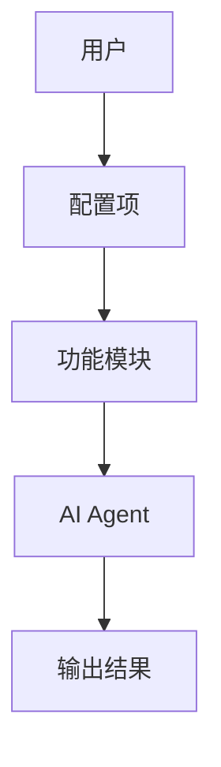
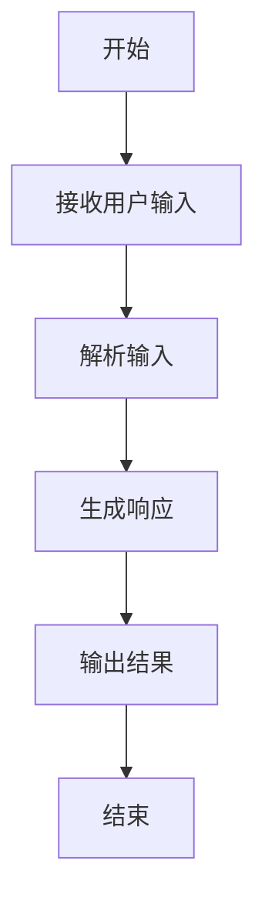

                 


# 企业AI Agent的可视化配置界面：降低使用门槛

> **关键词**：AI Agent、可视化配置界面、企业应用、自然语言处理、对话生成、系统架构

> **摘要**：本文详细探讨了企业AI Agent的可视化配置界面设计，通过分析其核心概念、算法原理、系统架构及项目实战，展示了如何通过可视化配置降低AI技术的使用门槛，使企业能够更高效地部署和管理AI Agent。文章结合理论与实践，提供丰富的技术细节和案例分析，帮助读者全面理解并实现企业级AI Agent的可视化配置界面。

---

# 第一部分: 企业AI Agent的背景与概念

## 第1章: 企业AI Agent的背景与概念

### 1.1 AI Agent的基本概念

#### 1.1.1 什么是AI Agent
AI Agent（人工智能代理）是一种能够感知环境、自主决策并执行任务的智能实体。它通过接收输入、处理信息和输出结果，为用户提供智能化的服务。AI Agent可以是软件程序，也可以是硬件设备，其核心在于具备智能决策和执行能力。

#### 1.1.2 AI Agent的核心功能
- **感知环境**：通过传感器或API获取外部数据，理解当前环境状态。
- **智能决策**：基于输入数据和预设规则，生成最优解决方案。
- **自主执行**：根据决策结果，执行相应的操作或输出结果。
- **学习优化**：通过反馈机制不断优化自身的决策模型。

#### 1.1.3 企业级AI Agent的特点
- **高可用性**：企业级AI Agent需要7×24小时稳定运行。
- **可扩展性**：支持大规模数据处理和多任务并行执行。
- **安全性**：确保数据处理过程中的安全性和隐私保护。

### 1.2 可视化配置界面的重要性

#### 1.2.1 降低使用门槛的意义
企业中的技术人员或业务人员通常不具备编程背景，复杂的命令行或API接口难以满足他们的需求。可视化配置界面通过图形化操作，降低了用户的使用门槛，使非技术人员也能轻松配置和管理AI Agent。

#### 1.2.2 可视化界面的优势
- **直观性**：用户可以通过图形化的界面直接看到配置项的效果。
- **易用性**：用户可以通过拖拽、点击等简单操作完成复杂的配置。
- **可定制性**：用户可以根据需求自定义界面布局和功能模块。

#### 1.2.3 企业中的应用场景
- **客服系统**：通过可视化配置，快速部署智能对话系统。
- **业务流程自动化**：通过可视化配置，实现企业内部流程的自动化处理。
- **数据分析与决策支持**：通过可视化配置，快速搭建数据驱动的决策支持系统。

### 1.3 本章小结
本章介绍了AI Agent的基本概念和核心功能，重点分析了可视化配置界面在企业中的重要性及其优势。通过这些内容，读者可以理解可视化配置界面在企业AI Agent中的关键作用。

---

## 第2章: 企业AI Agent的核心概念与联系

### 2.1 核心概念原理

#### 2.1.1 AI Agent的输入输出模型
AI Agent的输入输出模型是其工作的核心，输入数据经过处理后生成输出结果。输入数据可以是文本、图像或结构化数据，输出结果可以是文本、动作或决策建议。

#### 2.1.2 可视化配置的核心机制
可视化配置界面通过图形化的元素（如按钮、下拉框、文本框等）让用户完成配置项的设置。这些配置项通常包括AI Agent的输入数据源、处理逻辑和输出目标。

#### 2.1.3 界面元素与功能模块的关系
可视化配置界面中的每个元素都对应后端的功能模块。例如，用户在界面上选择“数据源”后，系统会调用数据处理模块进行数据清洗和预处理。

### 2.2 核心概念属性对比

#### 2.2.1 不同AI Agent的对比分析
| 特性         | 基于规则的AI Agent | 基于机器学习的AI Agent | 基于深度学习的AI Agent |
|--------------|---------------------|-------------------------|--------------------------|
| 决策方式     | 预定义规则         | 从数据中学习模式       | 复杂的非线性关系       |
| 处理能力     | 简单任务           | 中等复杂度任务         | 高复杂度任务           |
| 灵活性       | 低                 | 中                     | 高                     |

#### 2.2.2 可视化界面的特征分析
| 特征         | 特点               | 优势               |
|--------------|--------------------|--------------------|
| 直观性       | 图形化操作         | 用户友好           |
| 易用性       | 操作步骤少         | 提高效率           |
| 可定制性     | 支持自定义配置       | 满足个性化需求     |

#### 2.2.3 界面功能与用户需求的匹配
通过分析用户的实际需求，可视化配置界面需要提供以下功能：
- **数据源配置**：支持多种数据输入方式。
- **规则设置**：允许用户自定义处理逻辑。
- **输出目标**：支持多种输出格式和目标。

### 2.3 ER实体关系图



### 2.4 本章小结
本章通过分析企业AI Agent的核心概念和可视化配置界面的特性，展示了两者之间的关系和相互作用。通过对比分析和ER图，读者可以更好地理解可视化配置界面在企业AI Agent中的重要性。

---

## 第3章: 可视化配置界面的算法原理

### 3.1 算法原理概述

#### 3.1.1 自然语言处理的基本原理
自然语言处理（NLP）是实现AI Agent对话能力的核心技术。NLP通过分词、句法分析和语义理解等步骤，将用户的输入转化为计算机可以处理的结构化数据。

#### 3.1.2 对话生成的算法流程
对话生成通常采用生成式模型（如GPT）或检索式模型（如基于向量的检索）。生成式模型通过生成新文本来响应用户输入，而检索式模型则从预存的对话库中选择最相关的回复。

#### 3.1.3 可视化界面的交互逻辑
用户在可视化界面上输入文本后，系统会将文本传递给NLP模块进行处理，生成响应后返回给用户。

### 3.2 算法流程图



### 3.3 算法实现代码

#### 3.3.1 自然语言处理的代码实现
```python
import spacy

nlp = spacy.load("en_core_web_sm")

def process_text(text):
    doc = nlp(text)
    # 分词
    tokens = [token.text for token in doc]
    # 句法分析
    pos = [(token.text, token.pos_) for token in doc]
    return tokens, pos
```

#### 3.3.2 对话生成的数学模型
对话生成的数学模型通常基于概率论，通过计算每个可能的回复的概率，选择概率最高的回复。例如，假设我们有以下两个回复：

- P(回复A | 输入) = 0.7
- P(回复B | 输入) = 0.3

根据最大概率原则，系统会选择回复A作为最终的响应。

### 3.4 本章小结
本章详细介绍了可视化配置界面背后的核心算法原理，包括自然语言处理的基本流程和对话生成的数学模型。通过代码示例和流程图，读者可以更好地理解这些算法的实现细节。

---

## 第4章: 系统架构与实现方案

### 4.1 系统架构设计

#### 4.1.1 系统功能模块
- **输入模块**：接收用户的输入数据。
- **处理模块**：对输入数据进行处理和分析。
- **输出模块**：生成并返回处理结果。

#### 4.1.2 系统架构图


### 4.2 接口设计与实现

#### 4.2.1 系统接口设计
- **输入接口**：支持多种数据格式（如JSON、XML）。
- **输出接口**：支持文本、JSON等多种输出格式。

#### 4.2.2 接口实现代码
```python
# 输入接口
def receive_input(data):
    return data

# 输出接口
def send_output(data):
    print(data)
```

### 4.3 系统交互流程图


### 4.4 本章小结
本章通过系统架构图和接口设计，展示了企业AI Agent的可视化配置界面的实现方案。通过模块化设计和接口标准化，可以使系统更具可扩展性和可维护性。

---

## 第5章: 项目实战与案例分析

### 5.1 项目实战

#### 5.1.1 环境安装
- 安装Python和必要的库（如spacy、numpy）。
- 安装可视化界面框架（如Dash或Plotly）。

#### 5.1.2 核心代码实现
```python
import dash
import dash_html_components as html
import dash_core_components as dcc

app = dash.Dash(__name__)

app.layout = html.Div(children=[
    html.H1("AI Agent配置界面"),
    dcc.Textarea(id="input_text", label="输入文本："),
    html.Button("提交", id="submit_button"),
    html.Div(id="output_div")
])

if __name__ == '__main__':
    app.run_server(debug=True)
```

#### 5.1.3 代码解读与分析
- **输入模块**：用户在界面上输入文本。
- **处理模块**：文本被传递给NLP模块进行处理。
- **输出模块**：生成的响应返回给用户。

### 5.2 案例分析

#### 5.2.1 案例背景
某企业希望部署一个智能客服系统，通过可视化配置界面快速搭建对话系统。

#### 5.2.2 案例分析
通过可视化配置界面，企业可以快速配置对话系统的输入数据源、处理逻辑和输出目标。例如，用户输入“我的订单在哪里”，系统会自动调用订单查询接口返回结果。

#### 5.2.3 案例总结
通过可视化配置界面，企业能够快速部署和管理AI Agent，显著提高了效率和用户体验。

### 5.3 本章小结
本章通过项目实战和案例分析，展示了可视化配置界面在企业中的实际应用。通过具体的代码实现和案例分析，读者可以更好地理解如何将理论应用于实践。

---

## 第6章: 总结与展望

### 6.1 总结
企业AI Agent的可视化配置界面通过降低使用门槛，使非技术人员也能轻松配置和管理AI Agent。可视化配置界面的核心在于其直观性和易用性，通过图形化的操作和拖拽式的配置，用户可以快速完成复杂的配置项设置。

### 6.2 最佳实践 tips
- **简化配置流程**：通过向导式界面引导用户完成配置。
- **提供示例模板**：为用户提供常见场景的配置模板。
- **实时反馈**：在用户操作过程中提供实时反馈，减少误操作。

### 6.3 注意事项
- **数据安全性**：确保配置过程中数据的安全性。
- **性能优化**：优化系统的性能，确保可视化配置界面的响应速度。

### 6.4 未来展望
随着AI技术的不断发展，可视化配置界面将更加智能化和自动化。未来的可视化配置界面将支持更多复杂的配置项，提供更加个性化的配置体验。

### 6.5 本章小结
本章总结了企业AI Agent的可视化配置界面的核心价值，并提供了实际应用中的最佳实践和注意事项。通过未来展望，读者可以更好地理解可视化配置界面的发展趋势。

---

## 附录: 资源与工具

### 附录A: 开发工具推荐
- **Python**：AI Agent开发的首选语言。
- **Dash/Plotly**：可视化界面开发框架。
- **spaCy**：自然语言处理库。

### 附录B: 进一步学习资源
- **书籍**：《Python机器学习实战》。
- **在线课程**：Coursera上的《AI for Everyone》。

---

通过以上内容，读者可以全面理解企业AI Agent的可视化配置界面的设计与实现。从理论到实践，从基础到高级，本文为读者提供了一个完整的知识框架，帮助读者在实际应用中更好地部署和管理AI Agent。

