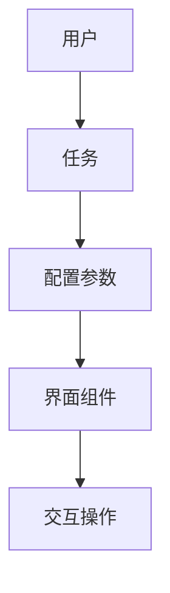
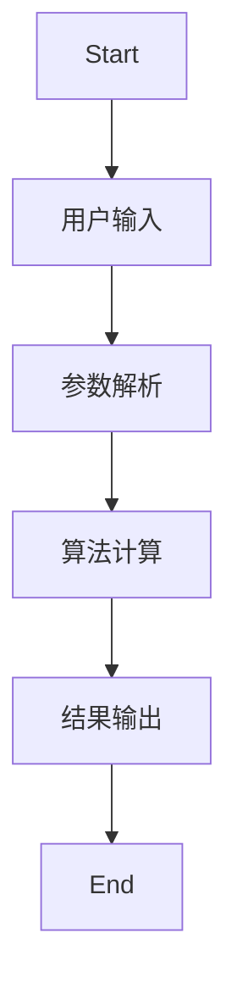

                 


# 企业AI Agent的可视化配置界面：降低技术门槛

## 关键词：企业AI Agent，可视化配置界面，技术门槛，AI算法，系统架构

## 摘要：  
随着人工智能技术的快速发展，企业AI Agent的应用越来越广泛。然而，AI Agent的配置和部署过程通常需要较高的技术门槛，限制了其在企业中的普及。本文通过分析企业AI Agent的核心概念、算法原理和系统架构，详细探讨如何通过可视化配置界面降低技术门槛，使非技术人员也能轻松配置和管理AI Agent。文章结合实际案例，提供了一套完整的解决方案，并展望了未来的发展方向。

---

## 正文

### 第一部分：企业AI Agent的背景与挑战

#### 第1章：企业AI Agent的背景与挑战

##### 1.1 AI Agent的基本概念  
- **AI Agent**（人工智能代理）是指能够感知环境、自主决策并执行任务的智能实体。  
- AI Agent可以是软件程序、机器人或其他智能设备，广泛应用于自动化任务、数据分析、客户服务等领域。  

##### 1.2 问题背景  
- 当前AI Agent的配置和部署过程复杂，通常需要编程能力和专业知识。  
- 企业中的非技术人员难以直接使用AI Agent，导致技术门槛高，限制了其在企业中的应用。  

##### 1.3 可视化配置界面的必要性  
- 可视化配置界面通过图形化操作，简化了AI Agent的配置流程，降低了技术门槛。  
- 提高用户体验，使非技术人员也能轻松完成AI Agent的部署和管理。  

#### 1.4 本章小结  
本章介绍了AI Agent的基本概念和当前面临的技术门槛问题，强调了可视化配置界面的重要性和必要性。

---

### 第二部分：企业AI Agent的核心概念与联系

#### 第2章：企业AI Agent的核心概念与联系

##### 2.1 AI Agent的核心原理  
- AI Agent主要由**感知模块**、**决策模块**和**执行模块**组成。  
  - **感知模块**：通过传感器或数据输入获取环境信息。  
  - **决策模块**：基于感知信息进行分析和判断，生成决策指令。  
  - **执行模块**：根据决策指令执行具体操作或任务。  

##### 2.2 可视化配置界面的设计原则  
- **直观性**：界面设计应简单直观，用户能够快速理解功能和操作流程。  
- **易用性**：操作流程应简洁明了，减少用户的学习成本。  
- **可扩展性**：界面应支持多种配置场景和功能扩展。  

##### 2.3 核心概念的ER实体关系图  


#### 2.4 本章小结  
本章详细讲解了AI Agent的核心原理和可视化配置界面的设计原则，并通过ER实体关系图展示了各组件之间的关系。

---

### 第三部分：AI Agent的算法原理与实现

#### 第3章：AI Agent的算法原理与实现

##### 3.1 算法原理概述  
- **感知算法**：基于输入数据，利用机器学习模型进行特征提取和分类。  
- **决策算法**：采用决策树、规则引擎或强化学习等方法生成决策指令。  
- **执行算法**：根据决策指令，调用相关接口或执行脚本完成任务。  

##### 3.2 可视化配置界面的算法实现  
- **动态生成算法**：根据用户选择的配置参数，动态生成界面组件。  
- **实时验证算法**：对用户输入的参数进行实时校验，确保配置的有效性。  
- **用户操作的反馈算法**：根据用户的操作行为，提供实时反馈和提示信息。  

##### 3.3 算法流程图  


##### 3.4 算法实现代码  
```python
def config_validator(params):
    # 验证配置参数是否合法
    for key, value in params.items():
        if not isinstance(value, (int, str)):
            return False
    return True

def generate_ui_components(params):
    # 根据参数动态生成界面组件
    components = []
    for key in params:
        components.append({
            'type': 'input',
            'label': key
        })
    return components

# 示例使用
params = {'threshold': 0.8, 'timeout': 30}
if config_validator(params):
    components = generate_ui_components(params)
    print(components)
```

#### 3.5 本章小结  
本章详细介绍了AI Agent的算法原理，并通过代码示例展示了如何通过可视化配置界面实现动态生成和实时验证。

---

### 第四部分：系统分析与架构设计方案

#### 第4章：系统分析与架构设计方案

##### 4.1 系统功能设计  
- **领域模型设计**：定义系统的核心功能模块和数据流。  
- **功能模块**：包括用户管理、任务配置、日志监控等。  

##### 4.2 系统架构设计  


##### 4.3 系统接口设计  
- **用户接口**：提供可视化配置界面和任务管理功能。  
- **系统接口**：定义API接口，支持与其他系统的集成和交互。  

##### 4.4 系统交互流程图  


#### 4.5 本章小结  
本章通过系统架构图和交互流程图展示了系统的整体设计，并详细描述了各模块的功能和接口设计。

---

### 第五部分：项目实战

#### 第5章：可视化配置界面的实现与应用

##### 5.1 项目背景与目标  
- 本项目旨在开发一个可视化配置界面，用于企业AI Agent的配置和管理。  
- 通过可视化界面降低技术门槛，使用户能够快速完成AI Agent的部署和配置。  

##### 5.2 环境安装与配置  
- **安装依赖**：安装必要的Python库，如Django、Flask等。  
- **配置环境**：设置数据库、API接口和日志记录等。  

##### 5.3 核心代码实现  
```python
from flask import Flask, request, jsonify

app = Flask(__name__)

@app.route('/config', methods=['POST'])
def config_agent():
    data = request.json
    if not config_validator(data):
        return jsonify({'error': 'Invalid configuration parameters'}), 400
    # 生成界面组件
    components = generate_ui_components(data)
    return jsonify({'components': components})

if __name__ == '__main__':
    app.run(debug=True)
```

##### 5.4 功能解读与实际案例分析  
- **功能解读**：通过可视化界面，用户可以轻松配置AI Agent的各项参数，并实时查看配置结果。  
- **实际案例**：以任务调度系统为例，展示如何通过可视化界面完成任务配置和监控。  

#### 5.5 本章小结  
本章通过项目实战展示了可视化配置界面的实现过程，并通过实际案例分析了其应用价值。

---

### 第六部分：最佳实践与总结

#### 第6章：最佳实践与总结

##### 6.1 设计与实现中的注意事项  
- **界面设计**：确保界面直观易用，减少用户的认知负担。  
- **错误处理**：提供详细的错误提示和日志记录，方便用户排查问题。  

##### 6.2 未来发展方向  
- **智能化配置**：进一步优化算法，实现智能化的配置推荐和自动调整。  
- **多平台支持**：扩展系统功能，支持多种平台和设备的集成。  

#### 6.3 本章小结  
本章总结了设计与实现中的注意事项，并展望了未来的发展方向。

---

### 附录：拓展阅读与参考资料

- **推荐书籍**：  
  1. 《机器学习实战》  
  2. 《设计模式：可复用面向对象软件的基础》  
- **推荐工具**：  
  1. **Mermaid**：用于绘制流程图和架构图。  
  2. **Django/Flask**：用于快速开发Web应用。  

---

## 结语  
通过本文的详细讲解，我们了解了企业AI Agent的可视化配置界面的设计原理和实现方法。希望本文能够帮助读者降低技术门槛，更好地理解和应用AI Agent技术。未来，随着技术的不断进步，可视化配置界面将变得更加智能和便捷，为企业AI Agent的发展注入更多活力。

