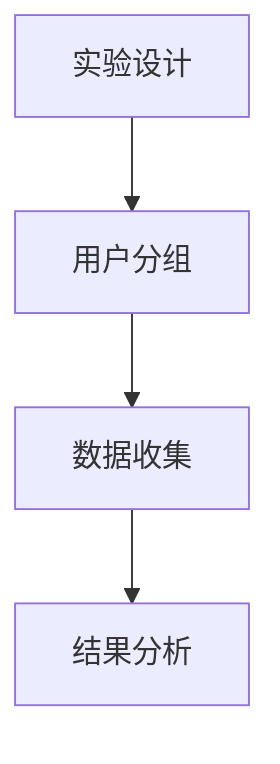
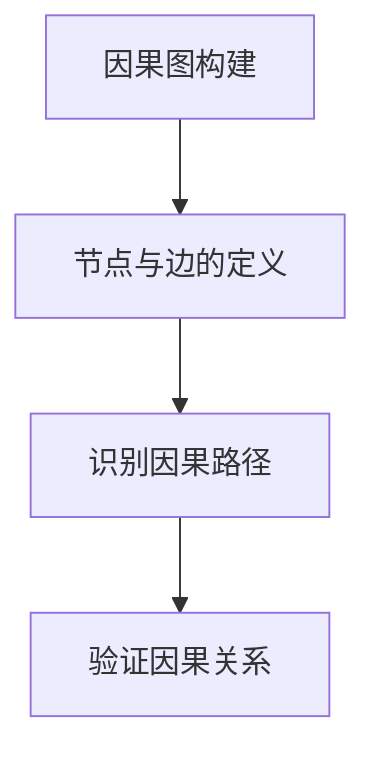
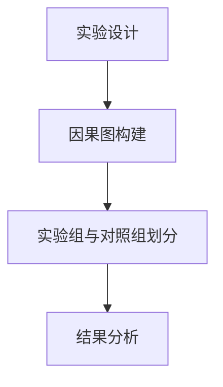
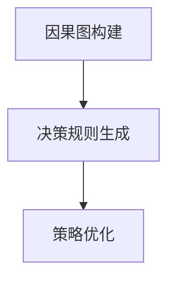

                 


# 企业AI Agent的因果推理在A/B测试分析中的应用

---

## 关键词：因果推理, A/B测试, 企业AI Agent, 因果图, 潜在结果框架, 机器学习

---

## 摘要

本文探讨了企业AI Agent在因果推理中的应用，特别是在A/B测试分析中的具体实现。通过结合因果图、潜在结果框架和机器学习算法，本文深入分析了如何利用因果推理解决A/B测试中的因果关系问题，并提出了基于AI Agent的因果推理模型，为企业在数据驱动决策中提供了新的思路。

---

# 第一部分: 企业AI Agent的因果推理基础

## 第1章: 因果推理与A/B测试概述

### 1.1 因果推理的基本概念

因果推理是理解变量之间因果关系的核心方法，其目标是识别和量化因果效应。因果效应是指一个变量的变化对另一个变量的直接影响，而非仅仅是相关关系。在企业中，因果推理可以帮助决策者理解不同策略对业务指标的真正影响，而不仅仅依赖于相关性的观察数据。

**图1.1:** 因果效应的定义

$$\text{因果效应} = P(y|do(x)) - P(y|x)$$

其中，$P(y|do(x))$表示在干预$x$后的结果分布，而$P(y|x)$是观察到的条件概率。

### 1.2 A/B测试的基本原理

A/B测试是一种常用的实验方法，通过将用户随机分配到不同的实验组，比较不同策略对业务指标的影响。然而，A/B测试的结果可能存在潜在的偏差，例如外部干扰和样本选择偏差，这需要通过因果推理来解决。

**图1.2:** A/B测试的基本流程



### 1.3 企业AI Agent的定义与特点

企业AI Agent是一种能够感知环境、自主决策并执行任务的智能系统。它结合了机器学习、自然语言处理和自动化技术，能够在复杂的商业环境中优化决策过程。

**表1.1:** 企业AI Agent与传统数据分析的对比

| 特性             | 传统数据分析         | 企业AI Agent       |
|------------------|---------------------|--------------------|
| 数据处理能力     | 基于规则的处理       | 基于机器学习的处理   |
| 决策能力         | 依赖人工规则         | 自主学习与优化       |
| 适应性           | 较低                 | 高                 |
| 可扩展性         | 有限                 | 高                 |

---

## 第2章: 因果图与潜在结果框架

### 2.1 因果图的基本概念

因果图（Directed Acyclic Graph, DAG）是一种用于表示变量之间因果关系的图形模型。它通过有向边表示因果关系，并通过节点之间的关系来识别因果效应。

**图2.1:** 因果图的构建步骤



### 2.2 潜在结果框架

潜在结果框架（Potential Outcome Framework）是因果推理的核心理论之一。它通过定义每个单位在不同处理下的潜在结果，来估计因果效应。

**公式2.1:** 平均因果效应的定义

$$\text{ATE} = E[Y^{x} - Y^{x'}]$$

其中，$Y^{x}$表示在处理$x$下的结果，$Y^{x'}$是在处理$x'$下的结果。

---

## 第3章: A/B测试中的因果推理应用

### 3.1 A/B测试中的因果识别

在A/B测试中，因果识别的目标是通过因果推理方法，准确估计因果效应，同时控制外部干扰和样本选择偏差。

**图3.1:** 基于因果图的A/B测试设计



### 3.2 基于机器学习的因果推理

机器学习算法（如树模型和深度学习）可以辅助因果推理，通过建模复杂的变量关系，提高因果效应的估计精度。

**公式3.1:** 基于树模型的因果效应估计

$$\text{ATE} = \sum_{i} w_i (Y_i - Y_i^{x'})$$

其中，$w_i$是权重，$Y_i$和$Y_i^{x'}$分别是处理和对照的结果。

---

## 第4章: 企业AI Agent的因果推理实现

### 4.1 基于因果图的AI Agent模型

基于因果图的AI Agent模型通过构建企业环境中的因果关系，优化决策策略。这种方法可以有效解决复杂的因果关系问题。

**图4.1:** 基于因果图的AI Agent架构



### 4.2 基于机器学习的因果推理模型

基于机器学习的因果推理模型通过深度学习算法，建模复杂的因果关系，实现更精准的因果效应估计。

**公式4.1:** 基于图神经网络的因果推理

$$\text{P} = \sigma(G(x, y))$$

其中，$G$是图神经网络，$\sigma$是激活函数。

---

## 第5章: 项目实战与总结

### 5.1 项目实战

通过实际案例，展示如何利用企业AI Agent的因果推理模型，优化A/B测试的分析过程。

**代码示例：**

```python
def causal_inference(x, y):
    # 构建因果图
    graph = build_causal_graph(x, y)
    # 估计因果效应
    ate = estimate_ate(graph, x, y)
    return ate
```

### 5.2 总结

本文详细探讨了企业AI Agent在因果推理中的应用，特别是在A/B测试分析中的具体实现。通过结合因果图、潜在结果框架和机器学习算法，提出了新的因果推理模型，为企业在数据驱动决策中提供了新的思路。

---

## 最佳实践 Tips

- 在实际项目中，建议先构建因果图，再进行因果效应的估计。
- 使用机器学习算法辅助因果推理，可以提高模型的准确性和泛化能力。
- 定期监控和优化AI Agent的决策模型，确保其适应复杂的商业环境。

---

通过本文的分析，读者可以深入了解企业AI Agent在因果推理中的应用，掌握如何利用因果推理优化A/B测试的分析过程，为企业决策提供更有力的支持。

