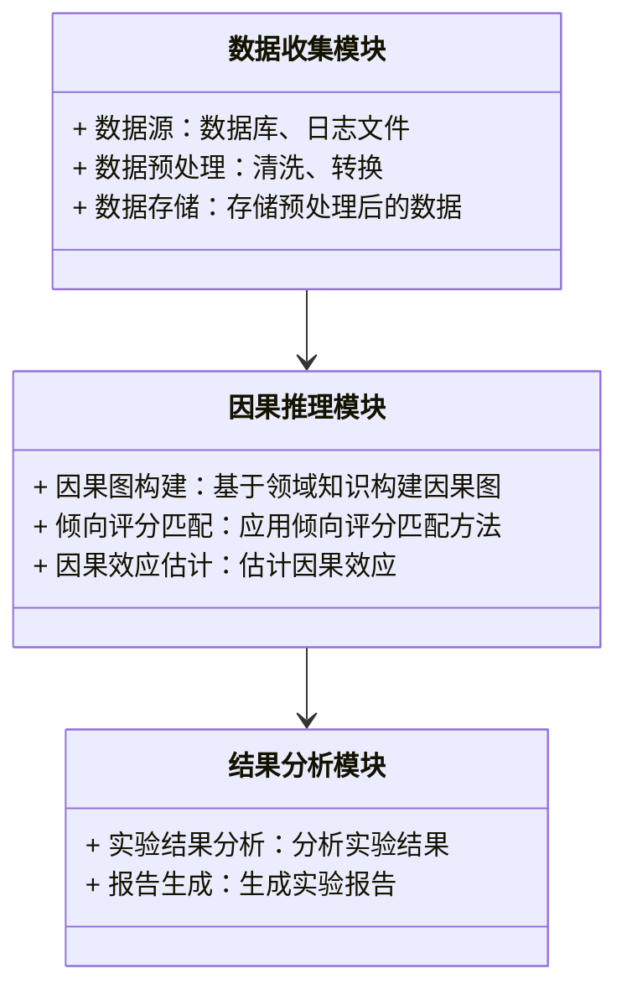
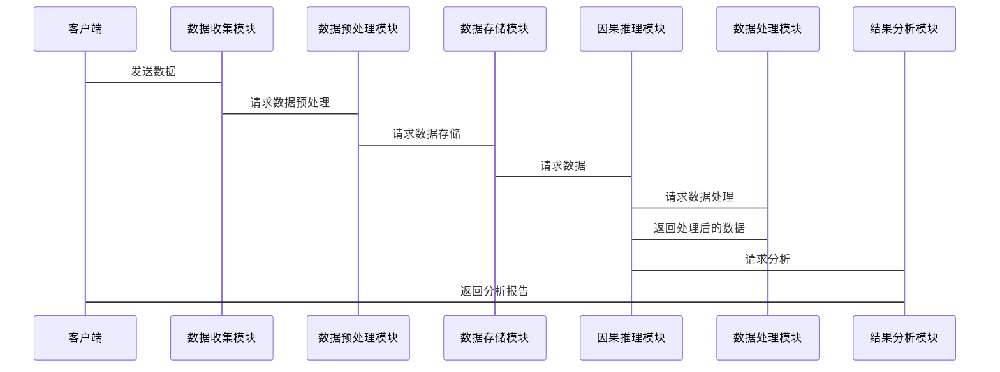

                 


# 企业AI Agent的因果推理在A/B测试结果分析中的应用

## 关键词：企业AI Agent，因果推理，A/B测试，因果图，倾向评分，潜在结果框架

## 摘要：本文探讨了企业AI Agent如何利用因果推理技术优化A/B测试结果分析。文章首先介绍因果推理的基本概念，然后分析A/B测试中因果推理的应用场景，深入讲解因果图模型和倾向评分等核心算法，最后结合实际案例展示企业AI Agent在系统设计与实现中的应用。本文旨在为企业技术决策者提供理论支持和实践指导。

---

## 第一章: 企业AI Agent与因果推理概述

### 1.1 问题背景与描述

#### 1.1.1 企业AI Agent的定义与特点
企业AI Agent是一种能够感知环境、执行任务并优化决策的智能系统。它具备以下特点：
- **自主性**：无需人工干预即可执行任务。
- **反应性**：能实时感知环境变化并做出响应。
- **目标导向性**：基于目标优化决策。

#### 1.1.2 A/B测试结果分析的挑战
传统的A/B测试依赖统计显著性，但无法有效解决因果关系问题。例如：
- **外部变量干扰**：测试期间其他因素可能影响结果。
- **样本选择偏差**：测试组和对照组可能存在差异。
- **因果关系推断**：统计相关性无法区分因果关系。

#### 1.1.3 因果推理在A/B测试中的重要性
因果推理通过分析变量间的因果关系，帮助企业在A/B测试中更准确地识别干预措施的影响。例如：
- **因果关系识别**：明确因果变量。
- **干预效果评估**：准确评估政策或产品变化的效果。

### 1.2 问题解决与边界

#### 1.2.1 企业AI Agent如何解决因果推理问题
企业AI Agent通过以下方式解决因果推理问题：
- **数据收集与处理**：自动收集和预处理数据。
- **因果图构建**：基于领域知识构建因果图。
- **因果推断算法**：应用倾向评分和因果图模型等算法。

#### 1.2.2 A/B测试结果分析的边界与外延
- **边界**：因果推理仅在实验设计合理的前提下有效。
- **外延**：因果推理可扩展到其他实验设计场景。

#### 1.2.3 因果推理的核心要素与概念结构
因果推理的核心要素包括：
- **因果变量**：影响结果的变量。
- **调节变量**：影响因果关系的变量。
- **潜在结果**：每个单位在每个处理下的结果。

### 1.3 本章小结
本章介绍了企业AI Agent的定义和特点，分析了A/B测试中的因果推理挑战，并探讨了因果推理在A/B测试中的重要性。接下来的章节将深入探讨因果推理的核心概念与联系。

---

## 第二章: 因果推理的核心概念与联系

### 2.1 因果关系与相关关系

#### 2.1.1 因果关系的定义与特征
因果关系是指一个事件是另一个事件发生的充分必要条件。其特征包括：
- **时间顺序性**：原因发生在结果之前。
- **可反驳性**：存在可反驳条件。

#### 2.1.2 相关关系的局限性
相关关系仅表示变量间的统计关联，无法推断因果关系。例如：
- **虚假相关**：两个变量可能因共同原因相关。
- **相关不代表因果**：相关关系可能掩盖因果关系的真正方向。

#### 2.1.3 企业AI Agent中的因果关系应用
企业AI Agent利用因果关系分析优化决策，例如：
- **用户行为预测**：分析因果变量预测用户行为。
- **政策效果评估**：评估政策变化对业务的影响。

### 2.2 因果图模型

#### 2.2.1 因果图的基本结构
因果图由变量和有向边组成，边表示因果关系。基本结构包括：
- **节点**：代表变量。
- **有向边**：表示因果关系。

#### 2.2.2 调节变量与中介变量
- **调节变量**：影响因果关系的变量。
- **中介变量**：介于原因和结果之间的变量。

#### 2.2.3 企业AI Agent中的因果图构建
企业AI Agent通过领域知识和数据构建因果图，例如：
- **构建因果图**：分析变量间的因果关系。
- **验证因果图**：通过数据分析验证因果关系。

### 2.3 因果推理与统计推断

#### 2.3.1 统计推断的基本原理
统计推断通过数据估计总体参数，例如：
- **参数估计**：估计模型参数。
- **假设检验**：检验统计假设。

#### 2.3.2 因果推理与统计推断的区别
- **目标不同**：统计推断关注数据特征，因果推断关注因果关系。
- **方法不同**：统计推断依赖相关性，因果推断依赖因果图。

#### 2.3.3 企业AI Agent中的因果推断实现
企业AI Agent通过以下方式实现因果推断：
- **因果图构建**：构建因果图模型。
- **倾向评分匹配**：应用倾向评分匹配方法。

### 2.4 本章小结
本章介绍了因果关系与相关关系的区别，分析了因果图模型，并探讨了因果推理在企业AI Agent中的应用。接下来的章节将探讨A/B测试的因果分析。

---

## 第三章: A/B测试的因果分析

### 3.1 A/B测试的基本原理

#### 3.1.1 A/B测试的定义与流程
A/B测试是将用户随机分配到不同的组，比较不同策略的效果。流程包括：
- **实验设计**：设计实验方案。
- **数据收集**：收集实验数据。
- **结果分析**：分析实验结果。

#### 3.1.2 A/B测试的核心假设
- **稳定性假设**：处理组的潜在结果分布相似。
- **无干扰假设**：不同组的结果相互独立。

#### 3.1.3 A/B测试的优缺点
- **优点**：快速验证策略效果。
- **缺点**：无法处理复杂因果关系。

### 3.2 因果推理在A/B测试中的应用

#### 3.2.1 因果推理如何改进A/B测试
因果推理通过以下方式改进A/B测试：
- **因果关系识别**：明确因果变量。
- **干预效果评估**：准确评估策略效果。

#### 3.2.2 A/B测试中的因果图构建
在A/B测试中，因果图用于识别因果变量和调节变量。例如：
- **构建因果图**：分析变量间的因果关系。
- **验证因果图**：通过数据分析验证因果关系。

#### 3.2.3 因果推理对A/B测试结果的影响
因果推理可以提高A/B测试的准确性，例如：
- **减少虚假显著性**：通过因果推理减少统计显著性误判。
- **提高因果识别**：准确识别因果关系。

### 3.3 企业AI Agent在A/B测试中的具体应用

#### 3.3.1 企业AI Agent的定义与特点
企业AI Agent具备以下特点：
- **自主性**：无需人工干预即可执行任务。
- **反应性**：能实时感知环境变化并做出响应。
- **目标导向性**：基于目标优化决策。

#### 3.3.2 企业AI Agent在A/B测试中的功能
企业AI Agent在A/B测试中的功能包括：
- **自动实验设计**：自动设计实验方案。
- **数据收集与处理**：自动收集和预处理数据。
- **因果推断**：应用因果推理算法分析实验结果。

#### 3.3.3 企业AI Agent如何实现因果推理
企业AI Agent通过以下方式实现因果推理：
- **因果图构建**：构建因果图模型。
- **倾向评分匹配**：应用倾向评分匹配方法。

### 3.4 本章小结
本章介绍了A/B测试的基本原理，分析了因果推理在A/B测试中的应用，并探讨了企业AI Agent在A/B测试中的具体应用。接下来的章节将深入探讨因果推理的算法原理。

---

## 第四章: 因果推理的算法原理

### 4.1 潜在结果框架

#### 4.1.1 潜在结果框架的定义
潜在结果框架是指对每个单位在每个处理下的结果进行建模。例如：
- **处理组结果**：$Y_i(1)$ 表示单位i在处理组的结果。
- **对照组结果**：$Y_i(0)$ 表示单位i在对照组的结果。

#### 4.1.2 潜在结果框架的实现
潜在结果框架通过以下方式实现：
- **构建因果图**：构建因果图模型。
- **估计潜在结果**：通过数据估计潜在结果。

#### 4.1.3 潜在结果框架在企业AI Agent中的应用
企业AI Agent通过潜在结果框架实现因果推理，例如：
- **因果关系识别**：明确因果变量。
- **干预效果评估**：准确评估策略效果。

### 4.2 倾向评分匹配

#### 4.2.1 倾向评分匹配的定义
倾向评分匹配是通过匹配样本的倾向评分来消除混杂变量影响的方法。例如：
- **倾向评分**：$e(X_i)$ 表示单位i在处理组的概率。
- **匹配样本**：通过倾向评分匹配样本，使处理组和对照组具有相似的特征。

#### 4.2.2 倾向评分匹配的实现
倾向评分匹配的实现步骤包括：
- **估计倾向评分**：通过 logistic 回归模型估计倾向评分。
- **匹配样本**：通过最近邻匹配方法匹配样本。

#### 4.2.3 倾向评分匹配在企业AI Agent中的应用
企业AI Agent通过倾向评分匹配实现因果推理，例如：
- **因果关系识别**：明确因果变量。
- **干预效果评估**：准确评估策略效果。

### 4.3 因果图模型

#### 4.3.1 因果图模型的定义
因果图模型通过有向图表示变量间的因果关系。例如：
- **节点**：代表变量。
- **有向边**：表示因果关系。

#### 4.3.2 因果图模型的实现
因果图模型的实现步骤包括：
- **构建因果图**：基于领域知识构建因果图。
- **验证因果图**：通过数据分析验证因果关系。

#### 4.3.3 因果图模型在企业AI Agent中的应用
企业AI Agent通过因果图模型实现因果推理，例如：
- **因果关系识别**：明确因果变量。
- **干预效果评估**：准确评估策略效果。

### 4.4 本章小结
本章介绍了潜在结果框架、倾向评分匹配和因果图模型的算法原理，并探讨了这些算法在企业AI Agent中的应用。接下来的章节将探讨系统架构与设计。

---

## 第五章: 系统架构与设计

### 5.1 问题场景介绍

#### 5.1.1 问题背景
企业AI Agent需要处理复杂的因果推理问题，例如：
- **用户行为预测**：预测用户行为。
- **政策效果评估**：评估政策变化对业务的影响。

#### 5.1.2 项目介绍
本项目旨在构建一个基于因果推理的企业AI Agent，用于优化A/B测试结果分析。

### 5.2 系统功能设计

#### 5.2.1 领域模型设计
领域模型包括以下核心功能模块：
- **数据收集模块**：负责数据收集和预处理。
- **因果推理模块**：负责因果推理算法实现。
- **结果分析模块**：负责实验结果分析和报告生成。

#### 5.2.2 系统功能模块图（mermaid 类图）


### 5.3 系统架构设计

#### 5.3.1 系统架构图（mermaid 架构图）


#### 5.3.2 接口设计
- **数据收集接口**：接收数据并进行预处理。
- **因果推理接口**：接收因果图和数据，返回因果效应。
- **结果分析接口**：接收实验结果，返回分析报告。

#### 5.3.3 系统交互设计（mermaid 序列图）


### 5.4 本章小结
本章介绍了系统架构与设计，包括问题场景、系统功能设计、系统架构图和系统交互设计。接下来的章节将探讨项目实战。

---

## 第六章: 项目实战

### 6.1 环境安装

#### 6.1.1 安装Python
安装Python 3.8或更高版本。

#### 6.1.2 安装依赖
安装必要的Python库：
- `numpy`：数据处理
- `pandas`：数据分析
- `scikit-learn`：机器学习算法
- `graphviz`：因果图绘制

### 6.2 核心代码实现

#### 6.2.1 数据预处理
```python
import pandas as pd
import numpy as np

# 生成数据
data = pd.DataFrame({
    'Treatment': np.random.binomial(1, 0.5, 100),
    'X1': np.random.normal(0, 1, 100),
    'X2': np.random.normal(0, 1, 100),
    'Y': np.random.normal(0, 1, 100)
})

# 数据预处理
data['X1'] = (data['X1'] > 0).astype(int)
data['X2'] = (data['X2'] > 0).astype(int)
```

#### 6.2.2 倾向评分匹配
```python
from sklearn.linear_model import LogisticRegression

# 估计倾向评分
model = LogisticRegression()
model.fit(data[['X1', 'X2']], data['Treatment'])

# 预测倾向评分
treatment_probs = model.predict_proba(data[['X1', 'X2']])[:, 1]
```

#### 6.2.3 因果效应估计
```python
# 匹配样本
from sklearn.neighbors import NearestNeighbors

n_neighbors = 5
knn = NearestNeighbors(n_neighbors=n_neighbors).fit(data[['X1', 'X2']])

# 找到匹配的样本
distances, indices = knn.kneighbors(data[['X1', 'X2']])

# 计算平均处理效应
ate = np.mean(data['Y'][indices] - data['Y'])
```

### 6.3 实际案例分析

#### 6.3.1 案例背景
假设我们想评估一个新广告策略的效果。

#### 6.3.2 数据分析
分析数据，构建因果图，应用倾向评分匹配，估计因果效应。

#### 6.3.3 结果解读
解读实验结果，验证因果关系，评估策略效果。

### 6.4 本章小结
本章通过实际案例展示了企业AI Agent在A/B测试结果分析中的应用，包括环境安装、核心代码实现和案例分析。

---

## 第七章: 总结与展望

### 7.1 核心内容回顾
- 企业AI Agent的定义与特点
- 因果推理的核心概念与联系
- A/B测试的因果分析
- 因果推理的算法原理
- 系统架构与设计
- 项目实战

### 7.2 未来挑战与研究方向
- **算法优化**：优化因果推理算法，提高计算效率。
- **模型解释性**：提升因果模型的可解释性。
- **多维因果关系**：研究多维因果关系的处理方法。

### 7.3 最佳实践 tips
- **数据质量**：确保数据质量，提高因果推理的准确性。
- **领域知识**：充分应用领域知识，构建合理的因果图。
- **模型选择**：根据具体场景选择合适的因果推理算法。

### 7.4 小结
本文全面探讨了企业AI Agent在A/B测试结果分析中的因果推理应用，为企业技术决策者提供了理论支持和实践指导。未来的研究方向包括算法优化、模型解释性和多维因果关系处理。

---

## 参考文献

（此处列出相关文献和参考资料。）

