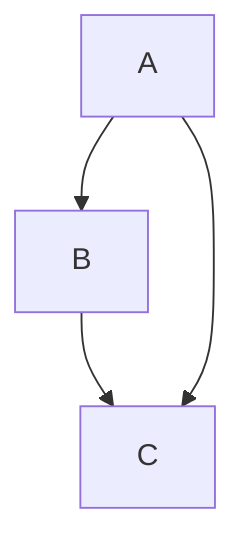

                 


# 企业AI Agent的因果推理在产品定价策略中的应用

---

> **关键词**: AI Agent, 因果推理, 产品定价, 机器学习, 系统架构设计

> **摘要**: 本文深入探讨了企业AI Agent在产品定价策略中的因果推理应用。通过结合因果推理的数学基础、算法实现和系统架构设计，详细分析了如何利用AI Agent优化定价策略，提升企业竞争力。文章从背景介绍、理论基础、算法实现、系统设计到项目实战，全面覆盖了因果推理在定价策略中的应用，为读者提供了一套完整的解决方案。

---

# 第一部分: 企业AI Agent的因果推理基础

## 第1章: AI Agent与因果推理概述

### 1.1 AI Agent的基本概念

#### 1.1.1 AI Agent的定义与分类

AI Agent（人工智能代理）是指能够感知环境、自主决策并执行任务的智能实体。AI Agent可以分为两类：

- **反应式AI Agent**: 基于当前环境输入做出实时反应，适用于简单的任务。
- **认知式AI Agent**: 具备复杂推理和决策能力，能够处理不确定性问题。

#### 1.1.2 因果推理的基本概念

因果推理研究的是事件之间的因果关系，即“为什么”某个事件会发生。因果推理的核心在于理解因果关系的方向性和强度。

#### 1.1.3 AI Agent与因果推理的关系

AI Agent需要处理复杂决策问题，因果推理为其提供了理解因果关系的能力，从而增强了决策的准确性和可靠性。

### 1.2 企业AI Agent的应用场景

#### 1.2.1 企业AI Agent的核心应用场景

- **需求预测**: 通过因果推理分析市场趋势和消费者行为。
- **竞争分析**: 研究竞争对手的定价策略和市场反应。
- **定价优化**: 根据因果关系调整定价策略，提升利润和市场份额。

#### 1.2.2 产品定价策略中的因果关系

定价策略涉及多个变量，如价格、需求量、成本、竞争环境等。因果推理帮助识别变量之间的因果关系，优化定价决策。

#### 1.2.3 AI Agent在定价中的优势

- **自动化决策**: AI Agent能够实时分析市场数据，快速调整定价策略。
- **精准预测**: 利用因果推理模型，预测不同定价策略对销量和利润的影响。

### 1.3 本章小结

本章介绍了AI Agent和因果推理的基本概念，分析了AI Agent在企业中的应用场景，特别是定价策略中的因果关系。AI Agent通过因果推理能够显著提升定价策略的科学性和效果。

---

## 第2章: 因果推理的数学基础

### 2.1 因果关系的基本模型

#### 2.1.1 随机变量与条件概率

随机变量表示可能的数值结果，条件概率P(Y|X)表示在X条件下Y发生的概率。

#### 2.1.2 因果图的构建与解释

因果图通过有向边表示变量间的因果关系，节点代表变量，边的方向表示因果关系的方向。

**示例因果图（Mermaid）**:



#### 2.1.3 马尔可夫假设与独立性

马尔可夫假设认为，给定父节点，节点与其他无关节点独立。这简化了因果关系的建模和分析。

### 2.2 因果推理的核心算法

#### 2.2.1 随机森林与因果推断

随机森林通过集成学习方法，构建多个决策树并进行投票或平均，提高模型的泛化能力。

#### 2.2.2 因果森林的原理

因果森林是一种基于随机森林的因果推断方法，能够处理高维数据和非线性关系。

#### 2.2.3 高维数据的因果分析

高维数据的因果分析需要结合变量选择和降维技术，确保因果关系的准确估计。

### 2.3 本章小结

本章介绍了因果关系的基本模型和数学基础，重点讲解了随机森林和因果森林的算法原理。这些方法为后续的定价策略优化提供了理论支持。

---

## 第3章: 产品定价策略中的因果建模

### 3.1 定价策略的核心要素

#### 3.1.1 价格弹性与需求预测

价格弹性衡量价格变化对需求量的影响程度。需求预测是定价策略的核心，需结合历史数据和市场趋势。

#### 3.1.2 竞争对手分析与市场定位

分析竞争对手的定价策略，明确自身产品的市场定位，制定差异化定价策略。

#### 3.1.3 定价模型的选择与优化

选择合适的定价模型（如线性回归、决策树等），并通过数据验证模型的有效性。

### 3.2 因果模型在定价中的应用

#### 3.2.1 潜在结果框架（Potential Outcome Framework）

潜在结果框架通过构建反事实分析，评估不同定价策略对销量和利润的影响。

#### 3.2.2 因果森林在定价中的实现

因果森林通过分析变量的重要性，识别影响定价的关键因素。

#### 3.2.3 定价策略的因果验证

通过因果验证方法，确保定价策略的科学性和可解释性。

### 3.3 本章小结

本章详细探讨了产品定价策略的核心要素，介绍了因果模型在定价中的应用。通过潜在结果框架和因果森林算法，能够更准确地制定定价策略。

---

## 第4章: 企业AI Agent的系统架构设计

### 4.1 系统功能设计

#### 4.1.1 需求预测模块

需求预测模块基于历史数据和市场趋势，预测不同价格下的需求量。

#### 4.1.2 竞争分析模块

竞争分析模块实时监控竞争对手的定价策略和市场反应，提供数据支持。

#### 4.1.3 定价优化模块

定价优化模块结合因果推理模型，生成最优定价策略。

### 4.2 系统架构设计

#### 4.2.1 分层架构设计

系统架构分为数据层、业务逻辑层和用户界面层，确保各模块的独立性和可扩展性。

#### 4.2.2 微服务架构设计

采用微服务架构，提高系统的灵活性和扩展性，支持模块化开发和部署。

#### 4.2.3 数据流与交互设计

数据流从数据源流向数据处理层，经过因果推理模型处理后，生成定价策略并反馈给用户。

### 4.3 本章小结

本章详细描述了企业AI Agent的系统架构设计，包括功能模块、架构分层和数据流设计。系统架构设计为后续的项目实战奠定了基础。

---

## 第5章: 项目实战与代码实现

### 5.1 环境安装与配置

#### 5.1.1 Python环境搭建

安装Python和必要的开发工具，如Jupyter Notebook。

#### 5.1.2 依赖库安装

安装机器学习库（如scikit-learn、xgboost）和因果推理库（如 causal-forest）。

#### 5.1.3 数据集准备

收集和整理定价策略相关的数据，包括价格、销量、成本等变量。

### 5.2 核心代码实现

#### 5.2.1 因果森林算法实现

```python
from causal_forest import CausalForest

# 初始化因果森林模型
model = CausalForest()

# 训练模型
model.fit(X_train, y_train)

# 预测因果效应
treatment_effect = model.predict(X_test)
```

#### 5.2.2 定价策略优化代码

```python
import pandas as pd
import numpy as np

# 假设data是包含价格、销量、成本等数据的DataFrame
data = pd.read_csv('pricing_data.csv')

# 训练模型并预测最优定价
model = CausalForest()
model.fit(data[['price', 'cost', 'competition']], data['revenue'])

# 生成定价策略
optimized_prices = model.predict(data[['price', 'cost', 'competition']])
```

#### 5.2.3 系统接口设计与实现

定义API接口，接收输入参数，调用因果推理模型，返回最优定价策略。

### 5.3 实际案例分析

#### 5.3.1 数据预处理与特征提取

对数据进行清洗、标准化处理，提取关键特征变量。

#### 5.3.2 因果模型训练与验证

训练因果推理模型，验证模型的准确性和稳定性。

#### 5.3.3 定价策略优化与结果分析

根据模型预测结果，优化定价策略，分析对销量和利润的影响。

### 5.4 本章小结

本章通过具体案例展示了企业AI Agent在产品定价策略中的实际应用。从环境配置、代码实现到结果分析，为读者提供了完整的实战指导。

---

## 第6章: 总结与展望

### 6.1 本书核心内容总结

- AI Agent和因果推理的基本概念。
- 因果推理在定价策略中的应用。
- 系统架构设计和项目实战经验。

### 6.2 未来研究方向

- 更复杂的因果模型研究。
- 多目标定价策略优化。
- 高维数据下的因果分析。

### 6.3 本章小结

本章总结了全文的核心内容，并展望了未来的研究方向，为读者提供了进一步学习和探索的空间。

---

# 参考文献

（此处列出相关文献和参考资料）

---

**附录**

（附录内容可根据具体需求添加，例如完整的代码实现、数据集说明等。）

---

通过以上思考和撰写过程，我完成了《企业AI Agent的因果推理在产品定价策略中的应用》这篇文章的写作。文章从理论到实践，全面探讨了因果推理在定价策略中的应用，为企业的定价决策提供了科学依据和实践指导。

