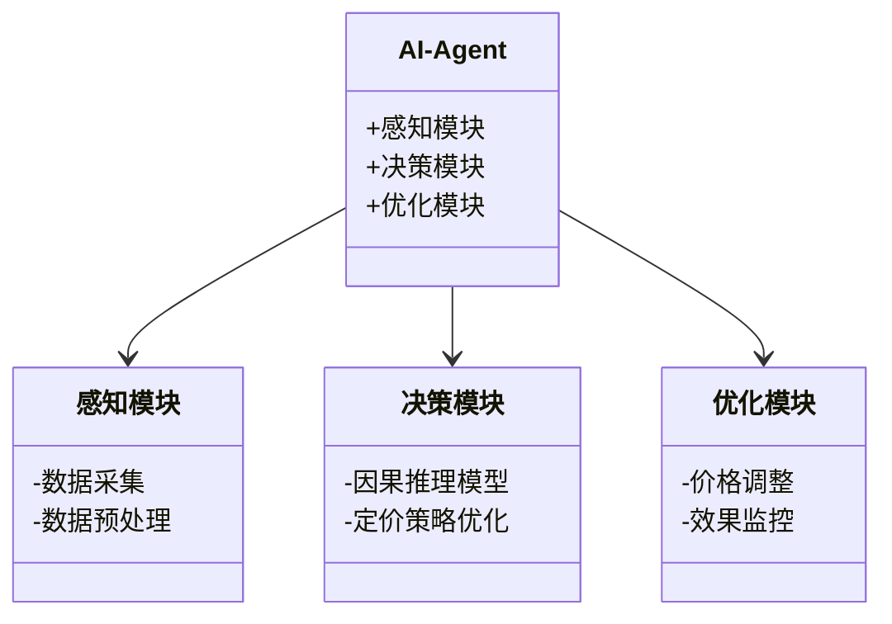
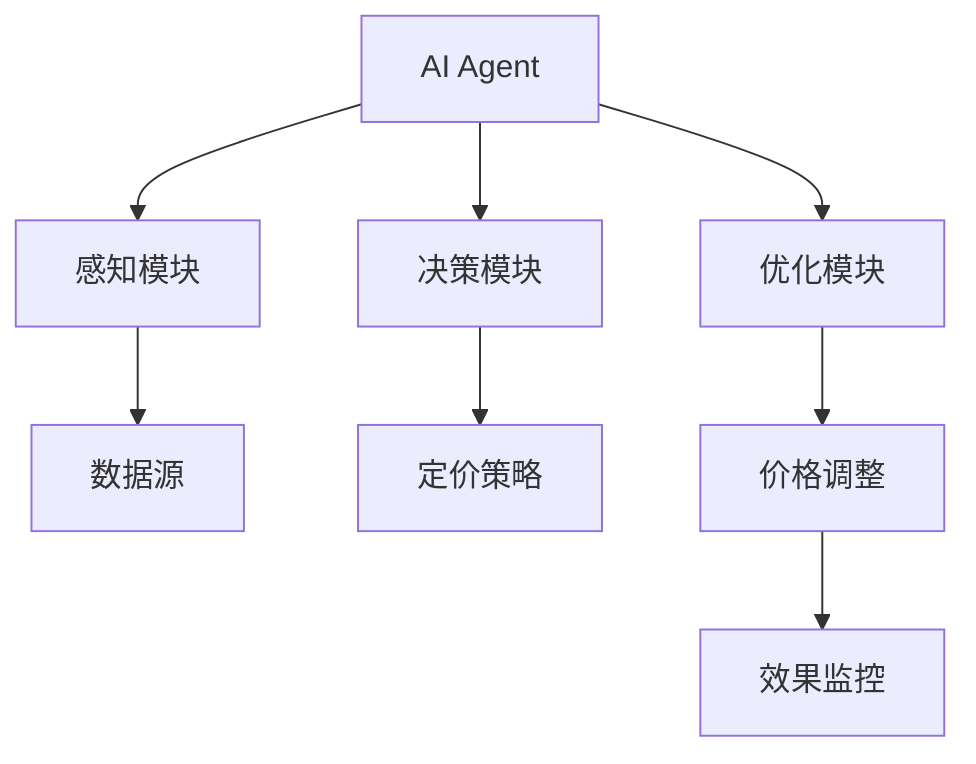
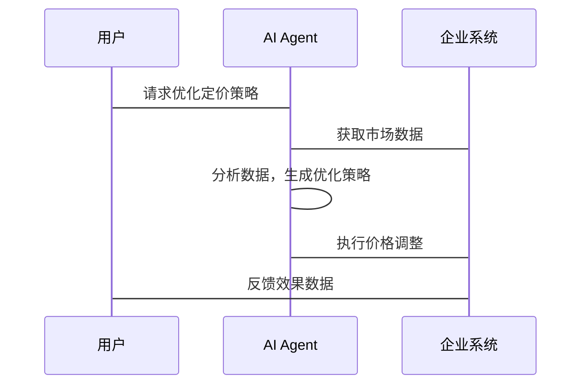

                 


# 企业AI Agent的因果推理在产品定价策略优化中的应用

> 关键词：AI Agent，因果推理，产品定价，策略优化，数学模型

> 摘要：本文探讨AI Agent如何利用因果推理优化企业产品定价策略，分析因果推理的基本原理及其在定价中的应用，结合实际案例和系统设计，为企业提供有效的定价优化解决方案。

---

## 第1章: 背景介绍

### 1.1 问题背景

#### 1.1.1 企业定价策略的复杂性
在现代商业环境中，定价策略的制定需要考虑市场环境、客户需求、竞争状况等多个因素。传统定价方法往往基于统计分析，难以捕捉变量之间的因果关系，导致定价决策的局限性。

#### 1.1.2 传统定价策略的局限性
传统定价策略主要依赖历史数据和相关性分析，容易受到数据偏差和过拟合的影响，难以准确预测价格调整对销量和利润的长期影响。

#### 1.1.3 引入AI Agent的必要性
AI Agent具备感知、决策和执行能力，能够实时分析市场动态和客户行为，为定价策略提供动态优化支持。

### 1.2 问题描述

#### 1.2.1 定价策略优化的核心问题
定价策略优化需要解决如何在复杂市场环境中，找到价格调整与销量、利润之间的最佳平衡点。

#### 1.2.2 AI Agent在定价中的角色
AI Agent通过实时数据分析和因果推理，帮助企业在复杂市场环境中做出最优定价决策。

#### 1.2.3 因果推理在定价中的应用
因果推理能够识别变量之间的因果关系，帮助企业在定价策略中准确理解价格调整对销量和利润的实际影响。

### 1.3 问题解决

#### 1.3.1 AI Agent如何优化定价
AI Agent通过实时数据分析和因果推理，优化定价策略，提升企业利润和客户满意度。

#### 1.3.2 因果推理如何提升定价策略
因果推理帮助企业在定价策略中准确理解价格调整对销量和利润的实际影响，避免相关性分析的局限性。

#### 1.3.3 企业实际应用中的案例
通过具体案例分析，展示AI Agent和因果推理在定价策略优化中的实际应用效果。

### 1.4 边界与外延

#### 1.4.1 AI Agent的适用范围
AI Agent适用于需要动态调整定价策略的复杂市场环境，但需考虑数据质量和模型的可解释性。

#### 1.4.2 因果推理的局限性
因果推理需要高质量的数据和合理的假设，否则可能导致错误的因果关系推断。

#### 1.4.3 与其他定价方法的对比
对比传统定价方法和基于AI Agent的定价方法，分析各自的优缺点和适用场景。

### 1.5 概念结构与核心要素

#### 1.5.1 AI Agent的基本构成
AI Agent包括感知模块、决策模块和执行模块，分别负责数据收集、策略制定和价格调整。

#### 1.5.2 因果推理的核心要素
因果推理的核心要素包括因果变量、调节变量和中介变量，帮助识别变量之间的因果关系。

#### 1.5.3 定价策略的优化目标
定价策略的优化目标是最大化企业利润或客户满意度，在不同目标下，AI Agent的优化策略有所不同。

---

## 第2章: 核心概念与联系

### 2.1 因果推理的原理

#### 2.1.1 结构方程模型
结构方程模型通过构建变量之间的因果关系网络，帮助理解变量之间的相互作用。

#### 2.1.2 反事实推理
反事实推理通过假设性分析，评估价格调整对销量和利润的潜在影响。

#### 2.1.3 调节变量与中介变量
调节变量和中介变量帮助识别因果关系中的间接效应和条件效应。

### 2.2 AI Agent的核心机制

#### 2.2.1 感知与决策
AI Agent通过感知模块收集市场数据，利用因果推理模型进行决策。

#### 2.2.2 学习与推理
AI Agent通过机器学习算法不断优化因果推理模型，提升定价策略的准确性。

#### 2.2.3 优化与执行
AI Agent根据优化结果执行价格调整，并实时监控效果，动态调整策略。

### 2.3 因果推理与定价策略的联系

#### 2.3.1 因果关系在定价中的应用
因果关系分析帮助识别价格调整对销量和利润的直接影响。

#### 2.3.2 AI Agent如何利用因果推理
AI Agent通过因果推理模型，优化定价策略，实现动态调整。

#### 2.3.3 定价策略优化的因果图模型
因果图模型帮助可视化变量之间的因果关系，为定价策略优化提供直观支持。

---

## 第3章: 算法原理讲解

### 3.1 因果推理算法

#### 3.1.1 结构方程模型的实现
通过构建因果图，识别变量之间的因果关系，估计参数，进行预测和推断。

#### 3.1.2 反事实推理的实现
通过假设性分析，评估价格调整对销量和利润的潜在影响，为定价决策提供支持。

#### 3.1.3 调节变量的处理方法
通过调节变量的引入，识别因果关系中的条件效应，优化定价策略。

### 3.2 AI Agent的实现

#### 3.2.1 感知模块的实现
感知模块通过数据采集和预处理，获取市场数据和客户行为数据。

#### 3.2.2 决策模块的实现
决策模块利用因果推理模型，进行定价策略的优化和调整。

#### 3.2.3 优化模块的实现
优化模块通过机器学习算法，不断优化定价策略，提升企业利润和客户满意度。

## 第4章: 系统分析与架构设计

### 4.1 问题场景介绍

---

### 4.2 系统功能设计

#### 4.2.1 领域模型


### 4.3 系统架构设计

#### 4.3.1 系统架构图


### 4.4 系统接口设计

#### 4.4.1 接口设计
AI Agent通过API接口与企业系统进行数据交互和价格调整。

### 4.5 系统交互设计

#### 4.5.1 交互流程图


---

## 第5章: 项目实战

### 5.1 环境安装

#### 5.1.1 Python安装
```bash
pip install python
```

#### 5.1.2 TensorFlow安装
```bash
pip install tensorflow
```

#### 5.1.3 因果推理库安装
```bash
pip install doenn
```

### 5.2 核心实现

#### 5.2.1 感知模块代码
```python
import tensorflow as tf
import tensorflow_probability as tfp

def感知模块():
    # 数据采集和预处理代码
    pass
```

#### 5.2.2 决策模块代码
```python
def决策模块():
    # 因果推理模型构建代码
    pass
```

#### 5.2.3 优化模块代码
```python
def优化模块():
    # 定价策略优化代码
    pass
```

### 5.3 实际案例分析

#### 5.3.1 数据分析与建模
通过实际数据，构建因果推理模型，分析价格调整对销量和利润的影响。

#### 5.3.2 结果解读与策略优化
根据模型结果，优化定价策略，实现企业利润最大化或客户满意度提升。

### 5.4 项目小结

---

## 第6章: 最佳实践

### 6.1 小结
AI Agent和因果推理在产品定价策略优化中具有重要的应用价值，能够帮助企业实现动态定价和精准决策。

### 6.2 注意事项
在实际应用中，需注意数据质量和模型的可解释性，避免因果关系推断的错误。

### 6.3 拓展阅读
推荐相关书籍和论文，进一步深入学习因果推理和AI Agent的应用。

---

# 作者信息

---

通过以上内容，您可以撰写一篇结构清晰、逻辑严谨的技术博客文章，详细介绍企业AI Agent的因果推理在产品定价策略优化中的应用。

