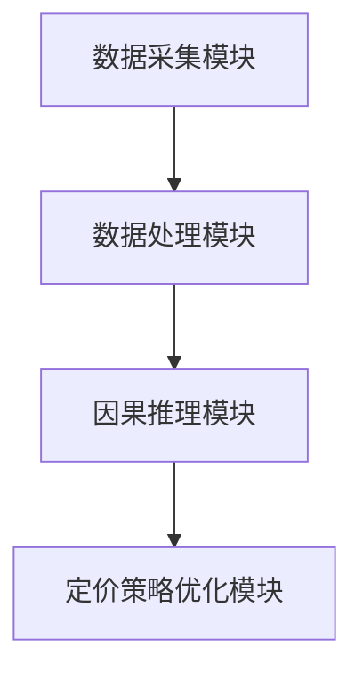

                 

# 企业AI Agent的因果推理在产品定价策略优化中的应用

## 关键词：企业AI Agent，因果推理，产品定价，策略优化，机器学习

## 摘要：  
本文探讨了企业AI Agent在产品定价策略优化中的应用，重点分析了因果推理在定价策略中的作用。通过结合AI Agent与因果推理，企业能够更精准地理解定价策略对业务的影响，优化定价模型，提升企业盈利能力。文章详细介绍了因果推理的理论基础、定价策略优化的核心方法，以及AI Agent在实际应用中的系统设计与案例分析。

---

# 第1章: 企业AI Agent与因果推理概述

## 1.1 企业AI Agent的基本概念

### 1.1.1 AI Agent的定义与特点  
AI Agent（人工智能代理）是一种能够感知环境、自主决策并执行任务的智能实体。企业AI Agent具备以下特点：  
1. **自主性**：能够在无需人工干预的情况下执行任务。  
2. **反应性**：能够实时感知环境变化并调整行为。  
3. **目标导向**：以特定目标为导向，优化决策过程。  
4. **学习能力**：通过数据学习和优化模型，提升决策准确性。  

### 1.1.2 企业AI Agent的应用场景  
企业AI Agent广泛应用于多个领域，包括：  
- **客户服务**：通过聊天机器人提供个性化服务。  
- **供应链管理**：优化库存管理与物流调度。  
- **风险管理**：实时监控并预测潜在风险。  
- **定价策略**：基于市场数据优化产品定价。  

### 1.1.3 企业AI Agent与传统算法的区别  
传统算法通常基于统计学习，而企业AI Agent结合了因果推理和强化学习，能够更好地理解因果关系，优化决策过程。  

## 1.2 因果推理的基本概念  

### 1.2.1 因果关系的定义  
因果关系是指一个事件（原因）导致另一个事件（结果）发生的必然联系。例如，价格调整（原因）导致销量变化（结果）。  

### 1.2.2 因果推理的核心原理  
因果推理通过分析变量之间的因果关系，推断出因果效应。例如，通过因果图模型，可以识别出哪些变量是直接影响目标变量的关键因素。  

### 1.2.3 因果推理与相关概念的对比  
- **相关性 vs 因果性**：相关性表示变量之间的关联性，而因果性表示变量之间的因果关系。  
- **统计推断 vs 因果推断**：统计推断关注变量之间的关联，而因果推断关注变量之间的因果关系。  

## 1.3 企业AI Agent与因果推理的关系  

### 1.3.1 企业AI Agent中的因果推理需求  
企业AI Agent需要通过因果推理理解定价策略对销量、利润等指标的影响。  

### 1.3.2 因果推理在企业AI Agent中的作用  
因果推理能够帮助AI Agent理解因果关系，优化定价策略，提升企业盈利能力。  

### 1.3.3 企业AI Agent与因果推理的结合方式  
企业AI Agent通过因果推理模型分析定价策略的影响，优化决策过程。  

## 1.4 本章小结  
本章介绍了企业AI Agent和因果推理的基本概念，分析了因果推理在企业AI Agent中的作用，为后续内容奠定了基础。

---

# 第2章: 因果推理的理论基础

## 2.1 因果图模型  

### 2.1.1 因果图的基本结构  
因果图由节点和边组成，节点表示变量，边表示因果关系。例如，价格（P）→ 销量（Q）表示价格影响销量。  

### 2.1.2 因果图的性质与特点  
1. **方向性**：边的方向表示因果关系的方向。  
2. **独立性**：变量之间存在独立性，即某些变量对目标变量没有直接影响。  
3. **可解释性**：因果图能够清晰地展示变量之间的因果关系。  

### 2.1.3 因果图的构建方法  
因果图的构建需要结合领域知识和数据，通常采用专家判断和数据验证的方法。  

## 2.2 潜在结果框架  

### 2.2.1 潜在结果的定义  
潜在结果是指在特定干预下，目标变量的可能取值。例如，价格调整后的潜在销量。  

### 2.2.2 潜在结果的估计方法  
1. **随机化试验**：通过随机分配干预，直接估计潜在结果。  
2. **倾向评分匹配**：通过匹配样本，估计潜在结果。  

### 2.2.3 潜在结果与因果推理的关系  
潜在结果是因果推理的核心，因果推理通过潜在结果估计因果效应。  

## 2.3 因果推断的算法  

### 2.3.1 随机森林因果推断  
随机森林是一种基于树的因果推断方法，能够处理高维数据和复杂关系。  

### 2.3.2 回归分析因果推断  
回归分析通过建立回归模型，估计变量之间的因果关系。  

### 2.3.3 基于因果图的推断算法  
基于因果图的推断算法通过分析图结构，识别因果路径，估计因果效应。  

## 2.4 本章小结  
本章介绍了因果图模型、潜在结果框架和因果推断算法，为后续的定价策略优化奠定了理论基础。

---

# 第3章: 产品定价策略优化的背景与需求

## 3.1 产品定价的基本概念  

### 3.1.1 定价策略的定义  
定价策略是企业根据市场环境和竞争状况，制定价格以实现目标的过程。  

### 3.1.2 定价策略的分类  
常见的定价策略包括成本导向定价、需求导向定价、竞争导向定价等。  

### 3.1.3 定价策略的影响因素  
定价策略的影响因素包括市场需求、成本、竞争环境、品牌价值等。  

## 3.2 企业定价中的常见问题  

### 3.2.1 定价策略的不确定性  
市场需求波动和竞争环境变化可能导致定价策略失效。  

### 3.2.2 数据不足与模型偏差  
定价策略优化需要大量数据支持，数据不足可能导致模型偏差。  

### 3.2.3 定价策略的可解释性  
复杂的定价策略可能难以解释，影响企业的透明性和信任度。  

## 3.3 本章小结  
本章分析了产品定价策略的基本概念和企业定价中的常见问题，为后续的优化策略提供了背景支持。

---

# 第4章: 企业AI Agent在定价策略优化中的应用

## 4.1 AI Agent在定价中的数据收集与分析  

### 4.1.1 数据来源  
AI Agent可以通过内部数据（如销售数据）和外部数据（如市场数据）进行定价分析。  

### 4.1.2 数据预处理  
数据预处理包括数据清洗、特征提取和数据标准化。  

## 4.2 AI Agent在定价中的特征工程  

### 4.2.1 特征选择  
特征选择是通过分析变量对目标变量的影响，选择关键特征。  

### 4.2.2 特征构建  
特征构建是通过组合现有特征，构建新的特征以提升模型性能。  

## 4.3 AI Agent在定价中的因果模型构建  

### 4.3.1 因果图构建  
基于领域知识和数据，构建因果图，识别因果关系。  

### 4.3.2 因果效应估计  
通过因果图模型，估计因果效应，优化定价策略。  

## 4.4 本章小结  
本章介绍了AI Agent在定价策略优化中的应用，包括数据收集、特征工程和因果模型构建等内容。

---

# 第5章: 因果推理的数学模型与算法实现

## 5.1 因果推理的数学模型  

### 5.1.1 潜在结果模型  
潜在结果模型通过定义潜在结果，分析变量之间的因果关系。  

### 5.1.2 因果图模型  
因果图模型通过图结构表示变量之间的因果关系，支持因果效应的估计。  

## 5.2 因果推理算法的实现  

### 5.2.1 倾向评分匹配  
倾向评分匹配是一种常用的因果推断方法，通过匹配样本，估计因果效应。  

### 5.2.2 加权回归  
加权回归通过调整权重，估计因果效应。  

## 5.3 本章小结  
本章详细介绍了因果推理的数学模型和算法实现，为后续的系统设计提供了理论支持。

---

# 第6章: 系统设计与架构方案

## 6.1 系统功能设计  

### 6.1.1 数据采集模块  
数据采集模块负责采集定价相关数据，包括销售数据、市场数据等。  

### 6.1.2 数据处理模块  
数据处理模块对数据进行清洗、特征提取和标准化处理。  

### 6.1.3 因果推理模块  
因果推理模块通过因果图模型和算法，估计因果效应，优化定价策略。  

## 6.2 系统架构设计  

### 6.2.1 系统架构图  
以下是系统架构的mermaid图：  

### 6.2.2 接口设计  
系统接口设计包括数据接口和API接口，支持与其他系统的集成。  

## 6.3 本章小结  
本章详细描述了系统设计与架构方案，为后续的项目实施提供了指导。

---

# 第7章: 项目实战与案例分析

## 7.1 项目背景与目标  

### 7.1.1 项目背景  
某电商平台希望通过优化定价策略，提升销售额和利润率。  

### 7.1.2 项目目标  
通过AI Agent和因果推理，优化定价策略，提升企业盈利能力。  

## 7.2 项目实施过程  

### 7.2.1 数据采集与预处理  
采集销售数据、市场数据和竞争数据，进行数据清洗和特征提取。  

### 7.2.2 因果模型构建  
基于因果图模型，构建定价策略优化的因果模型。  

### 7.2.3 算法实现与优化  
实现因果推断算法，优化定价策略，提升企业收益。  

## 7.3 案例分析与结果展示  

### 7.3.1 定价策略优化效果  
优化后的定价策略提升了销售额和利润率，验证了模型的有效性。  

### 7.3.2 模型性能分析  
模型性能分析包括准确率、召回率和F1值，评估模型的性能。  

## 7.4 本章小结  
本章通过项目实战和案例分析，验证了AI Agent和因果推理在定价策略优化中的有效性。

---

# 第8章: 总结与展望

## 8.1 本项目的核心成果  
通过AI Agent和因果推理，优化了定价策略，提升了企业盈利能力。  

## 8.2 项目经验总结  
项目实施过程中，注重数据质量、模型选择和系统设计，确保项目顺利实施。  

## 8.3 未来研究方向  
未来可以进一步研究因果推理在其他领域的应用，如市场营销和风险管理。  

## 8.4 本章小结  
本章总结了项目成果，分析了项目经验，并展望了未来的研究方向。

---

# 参考文献  
1. Pearl, J. (2009). Causality: Models, Reasoning, and Inference.  
2. Bishop, C. M. (2006). Pattern Recognition and Machine Learning.  
3.

