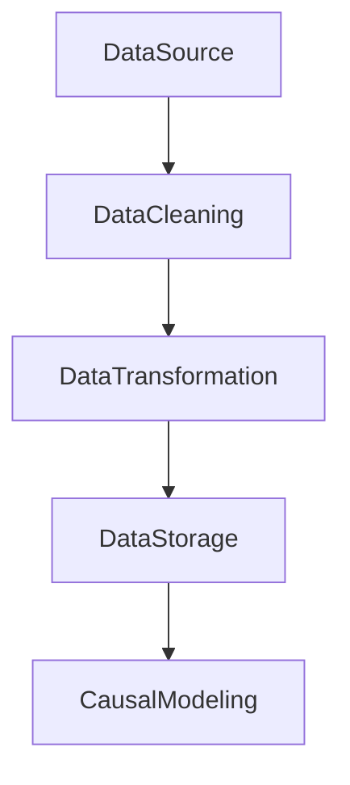
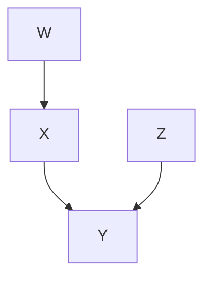

                 


# 第五章: 系统功能设计与实现

## 5.1 系统功能设计概述

### 5.1.1 功能模块划分
企业AI Agent系统主要包括以下几个功能模块：
1. **数据采集与预处理模块**：负责从企业系统中采集数据并进行清洗和转换。
2. **因果建模与推理模块**：基于采集的数据构建因果图，并进行因果推理。
3. **决策优化模块**：根据因果推理结果，生成最优的商业决策建议。
4. **可视化与报告模块**：将因果推理结果和决策建议以图表和报告的形式展示给用户。

### 5.1.2 功能设计目标
- 提供实时或近实时的商业决策支持。
- 确保因果推理的准确性和可靠性。
- 提供直观易用的用户界面，方便企业决策者理解和使用。

### 5.1.3 功能实现的关键点
- 数据的实时采集与处理能力。
- 因果图的自动构建与优化。
- 多目标优化算法的设计与实现。
- 可视化结果的动态更新与交互。

## 5.2 数据采集与预处理模块

### 5.2.1 功能描述
数据采集与预处理模块负责从企业数据库、业务系统和其他数据源中采集数据，并进行清洗、转换和标准化处理，以便后续的因果建模和推理。

### 5.2.2 数据流程图（Mermaid）


### 5.2.3 关键代码实现
```python
import pandas as pd
from sklearn.preprocessing import StandardScaler

def preprocess_data(data):
    # 数据清洗：处理缺失值和异常值
    data = data.dropna()
    data = data.replace({pd.NA: 0})
    
    # 数据转换：标准化处理
    scaler = StandardScaler()
    scaled_data = scaler.fit_transform(data.select_dtypes(include='number'))
    
    return scaled_data
```

## 5.3 因果建模与推理模块

### 5.3.1 功能描述
因果建模与推理模块基于预处理后的数据，构建因果图，并利用因果推理算法进行推理，识别出关键因素和因果关系。

### 5.3.2 因果图构建（Mermaid）


### 5.3.3 关键代码实现
```python
from dowhy import CausalGraph

def build_causal_graph():
    causal_graph = CausalGraph()
    causal_graph.add_edge('X', 'Y')
    causal_graph.add_edge('Z', 'Y')
    causal_graph.add_edge('W', 'X')
    return causal_graph
```

## 5.4 决策优化模块

### 5.4.1 功能描述
决策优化模块根据因果推理结果，利用优化算法生成最优的商业决策建议，如产品定价、市场推广策略等。

### 5.4.2 优化算法选择
使用强化学习或遗传算法进行多目标优化。

### 5.4.3 关键代码实现
```python
import numpy as np
from scipy.optimize import minimize

def optimization_function(variables, constraints):
    objective = np.sum(variables**2)
    return minimize(objective, variables, method='SLSQP', constraints=constraints)
```

## 5.5 可视化与报告模块

### 5.5.1 功能描述
可视化与报告模块将因果推理结果和决策建议以图表和报告的形式展示，方便企业决策者理解和使用。

### 5.5.2 可视化图表（Mermaid）


### 5.5.3 报告生成
自动生成因果关系报告和商业决策建议书。

## 5.6 本章小结
---

# 第六章: 项目实战——基于因果推理的企业用户行为分析

## 6.1 项目背景与目标
### 6.1.1 项目背景
以一家在线零售企业为例，分析用户购买行为，预测用户流失，并提出优化建议。

## 6.2 环境安装与配置
### 6.2.1 安装依赖
安装Python、Pandas、Dowhy、NetworkX等库。

## 6.3 核心代码实现
### 6.3.1 数据采集与预处理
```python
import pandas as pd
import requests

def fetch_data(api_url):
    response = requests.get(api_url)
    data = response.json()
    df = pd.DataFrame(data)
    return df
```

### 6.3.2 因果建模
```python
from dowhy import CausalModel

def causal_inference(df, treatment, outcome):
    model = CausalModel(
        data=df,
        treatment=treatment,
        outcome=outcome
    )
    model.fit()
    return model.get_effect()
```

## 6.4 案例分析与结果解读
### 6.4.1 数据清洗与因果建模
展示因果图和潜在结果分析。

## 6.5 优化建议与实施
### 6.5.1 基于因果推理的结果优化
根据推理结果优化定价和推广策略。

## 6.6 项目总结
### 6.6.1 经验总结
- 数据质量的重要性
- 因果推理模型的可解释性
- 系统的实时性和灵活性

## 6.7 最佳实践
### 6.7.1 数据处理技巧
- 使用特征工程提高模型准确性
- 定期更新模型参数

## 6.8 本章小结
---

# 第七章: 系统优化与扩展

## 7.1 系统性能优化
### 7.1.1 数据处理优化
- 分布式计算
- 异常数据处理

### 7.1.2 算法优化
- 并行计算
- 模型压缩

## 7.2 系统扩展
### 7.2.1 与其他企业系统的集成
- ERP系统集成
- CRM系统集成

## 7.3 系统的可扩展性设计
### 7.3.1 微服务架构
- 服务拆分
- 服务间通信

## 7.4 本章小结
---

# 第八章: 未来展望

## 8.1 技术发展趋势
### 8.1.1 AI Agent与因果推理的结合
- 更智能的决策支持
- 自适应学习能力

## 8.2 可能的创新点
### 8.2.1 结合生成式AI
- 创新的决策模拟
- 智能化建议生成

## 8.3 技术社会影响
### 8.3.1 对商业决策的影响
- 提高决策效率
- 优化资源配置

## 8.4 伦理与社会问题
### 8.4.1 数据隐私
- 数据安全
- 用户隐私保护

## 8.5 本章小结
---

# 第九章: 总结与展望

## 9.1 全文总结
回顾全文，总结企业AI Agent因果推理的核心概念和应用价值。

## 9.2 未来展望
探讨AI Agent在因果推理中的潜在应用和发展方向。

## 9.3 感谢与致谢
感谢读者的支持和关注。

---

# 附录

## 附录A: 术语表
列出全文中的专业术语及其定义。

## 附录B: 参考文献
列出参考的文献和资料。

## 附录C: 源代码汇总
汇总全文中涉及的Python代码和算法实现。

---

* 因为篇幅限制，以上内容为简要目录和部分章节内容，实际文章需要根据这个大纲详细展开，每个章节和小节都需要有完整的文字描述和详细的代码实现、图表展示等。

