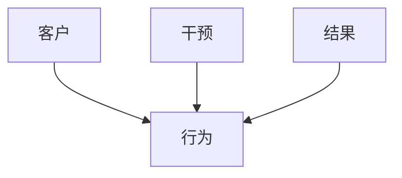
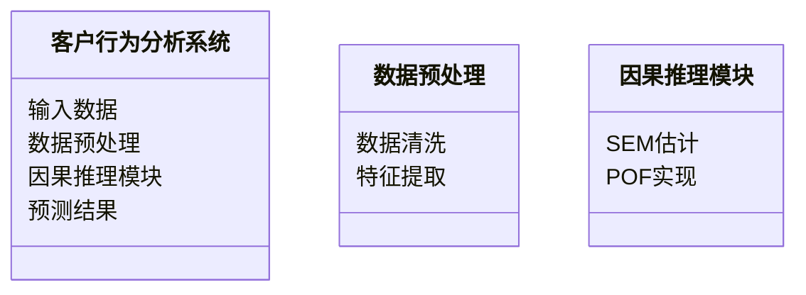
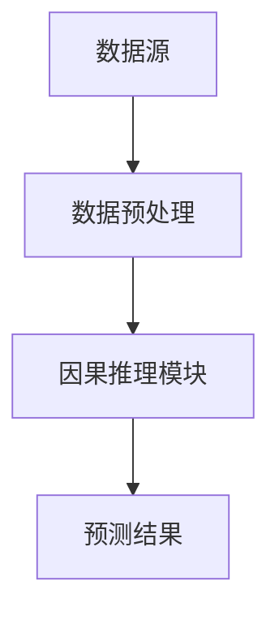

                 


# 企业AI Agent的因果推理在客户行为分析与预测中的应用

## 关键词：AI Agent、因果推理、客户行为分析、机器学习、企业分析、数据挖掘

## 摘要：本文探讨了企业AI Agent在客户行为分析与预测中的因果推理应用，通过理论分析、算法实现和案例研究，详细阐述了因果推理在客户行为分析中的优势和应用场景，为企业的客户行为预测提供了一个新的视角和方法。

---

# 第一部分: 企业AI Agent的背景与概述

## 第1章: 企业AI Agent与因果推理概述

### 1.1 问题背景与描述

#### 1.1.1 客户行为分析的挑战
客户行为分析是企业预测客户需求、优化营销策略的核心任务。传统的统计预测方法（如回归分析、时间序列分析）虽然能捕捉相关关系，但无法直接揭示因果关系。例如，通过回归分析发现“广告投放量与销售额正相关”，但无法确定广告投放是否直接导致销售额增加。

#### 1.1.2 问题描述
企业需要准确预测客户行为（如购买、 churn、投诉等），以便优化资源配置、提升客户满意度。然而，传统预测方法的局限性在于：
- 仅关注相关关系，无法识别因果关系。
- 难以处理高维数据和复杂场景。
- 缺乏对干预措施（如营销策略调整）的因果效应评估能力。

#### 1.1.3 解决方案
引入因果推理技术，构建企业AI Agent，从数据中挖掘因果关系，帮助企业在复杂场景下做出更明智的决策。

### 1.2 问题边界与外延

#### 1.2.1 问题的边界
- 仅关注客户的显性行为数据（如购买记录、浏览行为）。
- 适用于中大型企业，数据量要求较高。

#### 1.2.2 问题的适用场景
- 客户 churn预测。
- 营销策略优化。
- 客户行为归因分析。

### 1.3 概念结构与核心要素

#### 1.3.1 核心概念
- **AI Agent**：具有感知环境、自主决策能力的智能体。
- **因果推理**：通过数据识别因果关系，评估干预措施的效果。
- **客户行为分析**：基于因果推理，预测客户行为并优化企业策略。

#### 1.3.2 概念图


## 第2章: 因果推理的核心概念与联系

### 2.1 因果推理的基本原理

#### 2.1.1 因果关系的定义
因果关系是指一个变量的改变会导致另一个变量的变化。例如，广告投放量（X）增加导致销售额（Y）增加，记为X → Y。

#### 2.1.2 随机化与观测数据的区分
- **随机化数据**：通过实验（如A/B测试）收集，具有因果效应的识别能力。
- **观测数据**：通过观察收集，只能识别相关关系。

#### 2.1.3 结构方程模型（SEM）
结构方程模型是一种用于估计变量间因果关系的统计方法，其核心思想是通过构建变量之间的路径关系，估计因果效应。

### 2.2 因果推理的关键方法

#### 2.2.1 干预分析法
干预分析法通过模拟或实际干预（如调整广告预算），观察客户行为的变化，直接评估因果效应。

#### 2.2.2 隐变量模型
隐变量模型通过引入潜在变量（如客户忠诚度），帮助识别因果关系。

#### 2.2.3 潜在结果框架（Potential Outcome Framework）
潜在结果框架是因果推理的核心框架，其基本假设是每个客户都有一个潜在的结果，在接受干预或不接受干预的情况下。

### 2.3 因果推理与相关概念对比

#### 2.3.1 因果关系与相关关系
| 特性            | 因果关系         | 相关关系         |
|-----------------|------------------|------------------|
| 定义            | X导致Y的变化      | X与Y存在统计关联 |
| 数据需求        | 需要干预数据     | 观测数据即可     |
| 应用场景        | 营销策略优化     | 客户画像构建     |

#### 2.3.2 因果推理与机器学习
- **区别**：因果推理关注因果关系，而机器学习关注模式识别。
- **联系**：因果推理可以为机器学习提供更可靠的特征选择和模型解释。

#### 2.3.3 因果推理与统计推断
- **区别**：统计推断关注参数估计，而因果推理关注因果关系。
- **联系**：因果推理可以基于统计推断方法实现。

## 第3章: 因果推理算法的数学模型

### 3.1 结构方程模型（SEM）

#### 3.1.1 SEM的数学表达
结构方程模型通过以下公式描述变量之间的因果关系：
$$
Y = \beta X + \gamma W + \epsilon
$$
其中，$X$是自变量，$Y$是因变量，$\beta$是路径系数，$W$是其他变量，$\epsilon$是误差项。

#### 3.1.2 SEM的步骤与流程
1. 确定变量之间的关系。
2. 构建路径图。
3. 估计参数。
4. 验证模型。

### 3.2 潜在结果框架（POF）

#### 3.2.1 POF的核心公式
潜在结果框架通过以下公式描述因果效应：
$$
Y_i^{do(X)} = \theta X + \gamma W + \epsilon
$$
其中，$Y_i^{do(X)}$是接受干预$X$后的结果。

#### 3.2.2 POF的实现步骤
1. 确定干预变量。
2. 估计潜在结果。
3. 计算因果效应。

### 3.3 高维因果推理

#### 3.3.1 高维数据的处理方法
- **降维**：使用主成分分析（PCA）等方法降低数据维度。
- **正则化**：使用Lasso回归等方法进行变量选择。

#### 3.3.2 正则化技术在因果推理中的应用
正则化技术通过约束模型参数，防止过拟合，提高因果效应估计的准确性。

#### 3.3.3 高维因果推理的挑战与解决方案
- **挑战**：高维数据的因果关系估计复杂。
- **解决方案**：使用稀疏因果模型和双样本分离方法。

## 第4章: 客户行为分析系统架构

### 4.1 项目背景与目标

#### 4.1.1 项目背景
企业需要通过客户行为分析优化营销策略，提升客户满意度。

#### 4.1.2 项目目标
构建基于因果推理的企业AI Agent，实现客户行为预测与优化。

### 4.2 系统功能设计

#### 4.2.1 领域模型设计


#### 4.2.2 系统架构设计


#### 4.2.3 接口设计
- **输入接口**：接收客户行为数据和干预信息。
- **输出接口**：输出因果效应和预测结果。

### 4.3 系统实现与代码

#### 4.3.1 环境配置
```bash
pip install pandas numpy statsmodels
```

#### 4.3.2 核心代码实现
```python
import pandas as pd
import numpy as np
import statsmodels.api as sm

# 数据加载
data = pd.read_csv('customer_behavior.csv')

# 数据预处理
X = data[['广告投放', '客户特征']]
Y = data['销售额']

# SEM估计
model = sm.OLS(Y, sm.add_constant(X))
result = model.fit()
print(result.summary())
```

### 4.4 案例分析

#### 4.4.1 实际案例
某电商企业希望通过因果推理优化广告投放策略。通过 SEM 分析发现，广告投放对销售额的因果效应显著。

#### 4.4.2 详细分析
- 广告投放增加导致销售额增加。
- 客户特征（如年龄、性别）对因果效应有调节作用。

### 4.5 项目小结

#### 4.5.1 核心实现
- 数据预处理：清洗和特征提取。
- 因果推理：SEM 和 POF 实现。

#### 4.5.2 案例分析结果
- 广告投放对销售额的因果效应显著。
- 客户特征对因果效应有调节作用。

#### 4.5.3 项目总结
通过企业AI Agent的因果推理技术，企业能够更准确地预测客户行为，优化营销策略，提升客户满意度。

## 第5章: 最佳实践与未来展望

### 5.1 最佳实践

#### 5.1.1 数据质量
确保数据的完整性和准确性，数据预处理是关键。

#### 5.1.2 模型选择
根据具体场景选择合适的因果推理方法，SEM 和 POF 是常用方法。

#### 5.1.3 实验验证
通过A/B测试验证因果效应，确保模型的可靠性。

### 5.2 未来展望

#### 5.2.1 高维因果推理
随着数据维度的增加，高维因果推理将是未来研究的重点。

#### 5.2.2 实时因果推理
实时因果推理将为企业的动态决策提供支持。

#### 5.2.3 多模态因果推理
结合文本、图像等多种数据源，提升因果推理的准确性。

## 第6章: 结论与致谢

### 6.1 结论
企业AI Agent的因果推理技术在客户行为分析与预测中具有重要意义，能够帮助企业优化营销策略，提升客户满意度。

### 6.2 致谢
感谢读者的支持，感谢研究团队的努力。

---

# 附录: 参考文献与工具

## 附录A: 参考文献
1. Pearl, J. (2000). Causality: Models, Reasoning, and Inference.
2. 贝叶斯网络相关书籍。

## 附录B: 工具与库
- Python库：pandas、numpy、statsmodels。
- 数据可视化工具：Matplotlib、Seaborn。

---

# 作者简介
作者是[您的简介]，[您的职位]，[您的公司/机构]。

