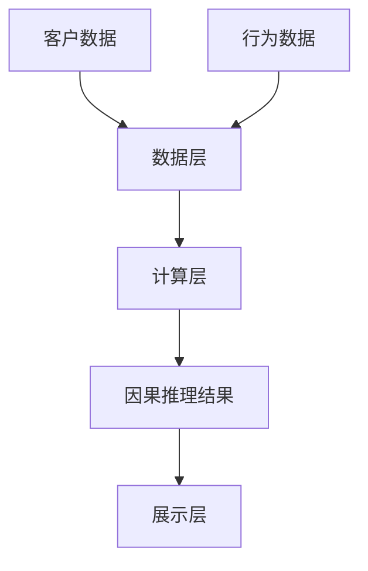
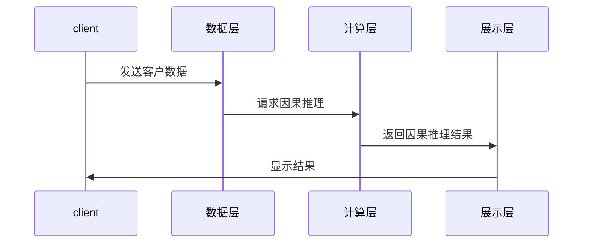

                 


# 企业AI Agent的因果推理在客户行为分析中的应用

> 关键词：企业AI Agent，因果推理，客户行为分析，因果图模型，潜在结果框架，系统架构设计

> 摘要：本文详细探讨了企业AI Agent在因果推理中的应用，特别是在客户行为分析领域。通过分析因果推理的基本理论、算法实现和系统架构设计，本文为读者提供了从理论到实践的全面指南。结合实际案例，本文展示了如何利用因果推理提升客户行为预测的准确性，为企业决策提供有力支持。

---

# 第1章 企业AI Agent与因果推理概述

## 1.1 企业AI Agent的基本概念

### 1.1.1 什么是企业AI Agent
企业AI Agent（Artificial Intelligence Agent）是一种智能实体，能够感知环境、自主决策并执行任务。它通过数据驱动的方法，帮助企业优化运营、提升效率和客户体验。AI Agent的核心特征包括智能性、自主性、反应性和社会性。

### 1.1.2 AI Agent的核心特征
- **智能性**：能够理解和处理复杂信息，做出合理决策。
- **自主性**：无需人工干预，自主执行任务。
- **反应性**：实时感知环境变化并调整行为。
- **社会性**：能够与其他系统或人类进行交互协作。

### 1.1.3 企业AI Agent的应用场景
- **客户行为预测**：通过分析历史数据，预测客户的行为模式。
- **个性化推荐**：基于客户特征和行为，提供个性化的产品或服务推荐。
- **风险控制**：识别潜在风险，优化企业决策流程。

## 1.2 因果推理的基本概念

### 1.2.1 什么是因果推理
因果推理是研究因果关系的科学方法，旨在确定变量之间的因果联系。与相关性分析不同，因果推理关注的是“为什么”变量之间存在关系，而不仅仅是“相关”。

### 1.2.2 因果推理与相关概念的区别
| 概念         | 描述                                                                 |
|--------------|----------------------------------------------------------------------|
| 相关性       | 表示两个变量的变动趋势相似，但不一定存在因果关系。                     |
| 因果性       | 表示一个变量的变化是另一个变量变化的原因。                           |
| 调度性       | 指定实验中如何分配处理和控制变量。                                     |

### 1.2.3 因果推理在客户行为分析中的应用
因果推理可以帮助企业识别客户行为的驱动因素，从而制定更有效的营销策略。例如，通过因果推理可以确定广告投放是否直接影响了销售量。

## 1.3 企业AI Agent与因果推理的结合

### 1.3.1 企业AI Agent中因果推理的作用
在企业AI Agent中，因果推理用于分析客户行为的驱动因素，帮助企业做出更明智的决策。

### 1.3.2 因果推理在客户行为分析中的意义
通过因果推理，企业可以识别出哪些变量是客户行为的真正驱动因素，从而优化资源配置。

### 1.3.3 本书的核心问题与目标
本书旨在探讨如何在企业AI Agent中应用因果推理，特别是在客户行为分析中的应用。目标是通过理论与实践相结合的方式，帮助企业提升客户行为预测的准确性。

---

## 本章小结
本章介绍了企业AI Agent的基本概念和因果推理的基本理论，分析了两者在客户行为分析中的结合方式。接下来的章节将深入探讨因果推理的理论基础、算法实现和系统设计。

---

# 第2章 因果推理的理论基础

## 2.1 因果关系的基本原理

### 2.1.1 因果关系的定义
因果关系是指一个变量（原因）导致另一个变量（结果）发生变化的关系。例如，广告投放（原因）导致销售量增加（结果）。

### 2.1.2 因果关系的类型
- **直接因果关系**：原因直接导致结果。
- **间接因果关系**：原因通过中间变量影响结果。
- **共同因果关系**：多个原因共同影响结果。

### 2.1.3 因果关系的数学模型
因果关系可以用概率图模型（如贝叶斯网络）来表示。例如，因果图中的箭头表示因果关系的方向。

## 2.2 因果推理的基本方法

### 2.2.1 穿透性原则
穿透性原则是指在因果推理中，如果变量X是变量Y的原因，那么在控制其他变量的情况下，X的变化会导致Y的变化。

### 2.2.2 调整法
调整法是通过调整其他变量的影响，来估计因果效应的方法。例如，通过调整广告投放以外的因素，来估计广告对销售量的因果效应。

### 2.2.3 随机化实验
随机化实验是通过随机分配处理和控制组，来估计因果效应的方法。例如，在广告投放中，随机选择一部分客户投放广告，另一部分不投放，然后比较两组的销售量差异。

## 2.3 因果推理与统计学习的关系

### 2.3.1 因果推理在统计学习中的应用
因果推理可以增强统计模型的解释能力。例如，在回归分析中，通过因果推理可以识别出真正的影响变量。

### 2.3.2 统计学习与因果推理的区别
统计学习关注变量之间的相关关系，而因果推理关注变量之间的因果关系。

### 2.3.3 如何将因果推理融入统计模型
通过引入因果图模型，统计模型可以更好地捕捉因果关系。例如，在客户行为分析中，因果图模型可以帮助识别出影响客户购买行为的真正原因。

---

## 本章小结
本章详细介绍了因果关系的基本原理和因果推理的基本方法，分析了因果推理与统计学习的关系。接下来的章节将探讨AI Agent的因果推理模型。

---

# 第3章 AI Agent的因果推理模型

## 3.1 因果图模型

### 3.1.1 因果图的基本结构
因果图由变量和因果关系的箭头组成。例如，广告投放（A）→ 销售量（S）。

### 3.1.2 贝叶斯网络与因果图的关系
贝叶斯网络是因果图的一种形式化表示方法，可以用概率分布描述变量之间的关系。

### 3.1.3 使用因果图进行客户行为分析
通过因果图模型，可以识别出影响客户行为的因果关系。例如，确定广告投放是否是客户购买行为的真正原因。

## 3.2 潜在结果框架

### 3.2.1 潜在结果的概念
潜在结果是指在给定处理变量的情况下，每个单位可能的结果。例如，对于每个客户，广告投放=1（处理）或0（控制）的情况下的潜在结果。

### 3.2.2 潜在结果框架的核心思想
潜在结果框架通过比较处理组和控制组的结果，来估计因果效应。

### 3.2.3 潜在结果框架的应用
在客户行为分析中，潜在结果框架可以用来估计广告投放对销售量的因果效应。

## 3.3 因果推理算法

### 3.3.1 基于因果图的算法
- **反事实推理**：通过比较事实和反事实情况，来估计因果效应。
- **条件概率推理**：通过计算条件概率，来估计因果效应。

### 3.3.2 潜在结果框架的实现
通过潜在结果框架，可以估计出因果效应。例如，通过比较广告投放组和非广告投放组的销售量，来估计广告投放对销售量的因果效应。

---

## 本章小结
本章介绍了因果图模型和潜在结果框架，并探讨了因果推理算法。接下来的章节将详细讲解算法实现和系统设计。

---

# 第4章 系统分析与架构设计方案

## 4.1 项目背景介绍

### 4.1.1 项目目标
通过因果推理，提升客户行为预测的准确性，优化企业决策。

### 4.1.2 项目范围
本项目聚焦于客户行为分析，重点解决因果推理在广告投放效果评估中的应用。

## 4.2 系统功能设计

### 4.2.1 领域模型设计
- **客户数据模块**：收集和管理客户数据。
- **行为分析模块**：分析客户行为，识别行为模式。
- **因果推理模块**：识别客户行为的因果关系，评估因果效应。

### 4.2.2 系统架构设计
- **数据层**：存储客户数据和行为数据。
- **计算层**：实现因果推理算法，估计因果效应。
- **展示层**：展示因果推理结果，支持决策。

## 4.3 系统架构设计图


## 4.4 系统接口设计

### 4.4.1 数据接口
- **输入接口**：接收客户数据和行为数据。
- **输出接口**：返回因果推理结果。

### 4.4.2 交互流程


---

## 本章小结
本章通过系统分析和架构设计，为因果推理在客户行为分析中的应用提供了技术支持。接下来的章节将通过实际案例，详细讲解因果推理的实现。

---

# 第5章 项目实战：因果推理在客户行为分析中的应用

## 5.1 环境安装与配置

### 5.1.1 Python环境安装
安装Python和必要的库（如pandas、numpy、networkx）。

### 5.1.2 数据准备
收集客户数据和行为数据，清洗和预处理数据。

## 5.2 因果推理算法实现

### 5.2.1 因果图构建
使用networkx库构建因果图。

### 5.2.2 潜在结果框架实现
通过Python代码实现潜在结果框架，估计因果效应。

## 5.3 代码实现与解读

### 5.3.1 因果图构建代码
```python
import networkx as nx

G = nx.DiGraph()
G.add_edge('广告投放', '销售量')
G.add_edge('广告投放', '客户点击率')
```

### 5.3.2 潜在结果框架代码
```python
import pandas as pd

def estimate_causal_effect(treatment, control):
    return treatment.mean() - control.mean()

treatment_group = df[df['广告投放'] == 1]['销售量']
control_group = df[df['广告投放'] == 0]['销售量']
causal_effect = estimate_causal_effect(treatment_group, control_group)
print(f'因果效应为：{causal_effect}')
```

## 5.4 实际案例分析

### 5.4.1 数据分析与结果展示
通过因果推理算法，识别出广告投放对销售量的因果效应。

### 5.4.2 案例小结
因果推理帮助企业识别出广告投放的真正效果，优化广告策略。

---

## 本章小结
本章通过实际案例，详细讲解了因果推理的实现和应用。通过代码实现和案例分析，读者可以更好地理解因果推理在客户行为分析中的应用。

---

# 第6章 总结与展望

## 6.1 核心概念回顾
- 企业AI Agent
- 因果推理
- 客户行为分析

## 6.2 研究成果与不足
- 成功将因果推理应用于客户行为分析。
- 当前研究的不足：因果图模型的复杂性和潜在结果框架的计算成本。

## 6.3 未来研究方向
- 探讨更高效的因果推理算法。
- 研究因果推理在其他领域的应用。

## 6.4 最佳实践Tips
- 在企业AI Agent中，因果推理可以帮助识别客户行为的驱动因素。
- 使用因果图模型和潜在结果框架，提升因果推理的准确性。

---

## 本章小结
本文通过理论与实践相结合的方式，探讨了企业AI Agent的因果推理在客户行为分析中的应用。未来的研究将进一步优化因果推理算法，拓展其应用领域。

---

# 结语

企业AI Agent的因果推理在客户行为分析中的应用，为企业提供了更精准的决策支持。通过因果推理，企业可以识别出客户行为的驱动因素，优化资源配置，提升客户体验。随着技术的不断发展，因果推理将在企业AI Agent中发挥更大的作用，为企业创造更大的价值。

---

# 参考文献

（此处列出相关参考文献）

---

通过以上内容，您可以根据需要进一步扩展和优化每个章节的内容，确保文章的完整性和深度。希望这篇文章能够为您提供有价值的见解和指导！

