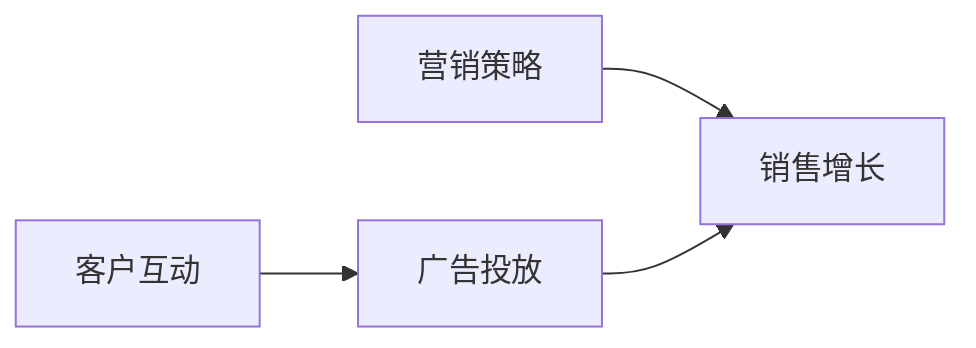
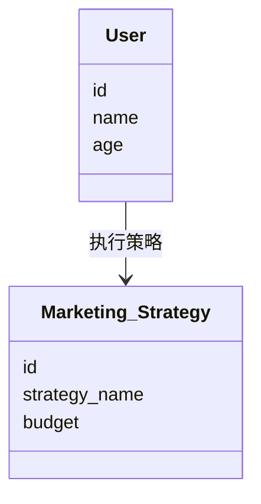
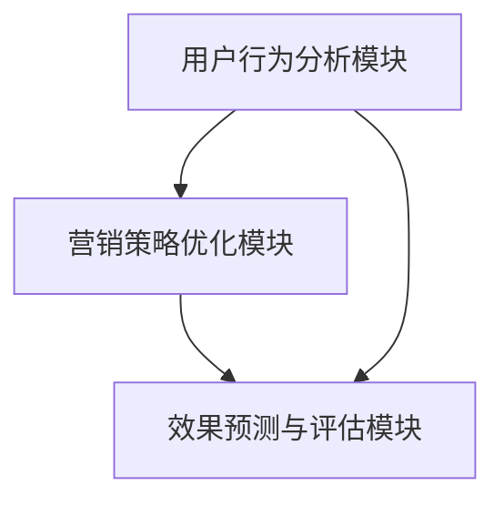

                 


# 企业AI Agent的因果推理在市场营销效果分析中的应用

## 关键词：AI Agent、因果推理、市场营销、效果分析、数据科学、因果关系

## 摘要：本文深入探讨了企业AI Agent如何利用因果推理技术分析和优化市场营销效果。通过结合AI技术与因果推理，企业能够更准确地评估营销策略的影响，实现数据驱动的决策。文章详细介绍了因果推理的基本原理、算法实现、系统架构设计以及实际应用案例，为企业提供一套完整的解决方案。

---

## 第一部分：企业AI Agent的因果推理基础

### 第1章：因果推理的原理与应用

#### 1.1 因果推理的基本概念

因果推理是通过分析变量之间的因果关系，推断出某一变量对另一变量的影响程度。与相关性分析不同，因果推理能够明确变量之间的因果方向和强度。

#### 1.2 企业AI Agent的核心目标

企业AI Agent的目标是通过数据驱动的方式，帮助企业在市场营销中做出更明智的决策。通过因果推理，AI Agent能够识别出哪些营销策略真正影响了销售结果，从而优化资源配置。

#### 1.3 因果推理与相关性分析的对比

| 特性        | 相关性分析                          | 因果推理                          |
|-------------|-----------------------------------|-----------------------------------|
| 目标         | 发现变量之间的关联性                | 发现变量之间的因果关系            |
| 方法         | 基于统计学，计算相关系数            | 基于图模型和干预分析，推断因果关系 |
| 应用场景     | 描述性分析                          | 预测性和干预性分析                |

#### 1.4 因果图与ER图

##### 因果图示例（Mermaid）



##### ER图示例（Mermaid）

```mermaid
erd
rectangle User {
  id INT PK
  name VARCHAR
}
rectangle Marketing_Strategy {
  id INT PK
  strategy_name VARCHAR
}
User --> Marketing_Strategy {执行策略}
```

---

## 第2章：因果推理的算法原理

### 2.1 随机森林与因果推理

随机森林是一种常用的机器学习算法，可以用来估计因果效应。通过构建多棵决策树，随机森林能够捕捉到数据中的非线性关系，并通过集成学习提高预测的准确性。

#### Python代码实现

```python
import numpy as np
from sklearn.ensemble import RandomForestRegressor

# 生成示例数据
n_samples = 100
X = np.random.rand(n_samples, 2)
y = X[:, 0] * 2 + X[:, 1] + np.random.randn(n_samples) * 0.1

# 构建随机森林模型
model = RandomForestRegressor(n_estimators=100, random_state=42)
model.fit(X, y)

# 预测因果效应
treatment_effect = model.predict(X[:, 1].reshape(-1, 1)) - model.predict(X[:, 0].reshape(-1, 1))
print("平均因果效应:", np.mean(treatment_effect))
```

### 2.2 回归分析与因果推理

回归分析是另一种常用的方法，通过建立变量之间的回归模型，估计出某一变量对目标变量的因果效应。

#### 数学模型与公式

$$ y = \beta_0 + \beta_1 x_1 + \beta_2 x_2 + \epsilon $$

其中，$\beta_1$ 表示 $x_1$ 对 $y$ 的因果效应。

---

## 第3章：系统分析与架构设计

### 3.1 问题场景介绍

在市场营销中，企业通常面临以下问题：
- 如何评估不同营销策略的效果？
- 如何优化广告投放的预算分配？
- 如何预测客户行为变化对销售的影响？

### 3.2 系统功能设计

#### 领域模型类图（Mermaid）



#### 系统架构图（Mermaid）



---

## 第4章：项目实战与实现

### 4.1 环境安装与配置

- 安装Python和必要的库（如scikit-learn、numpy、pandas）。
- 准备相关数据集，例如用户行为数据、广告投放数据等。

### 4.2 核心代码实现

#### 因果图构建代码

```python
from causalnex.structure import DAG
from causalnex.serialization import to_dot

# 创建因果图
dag = DAG()
dag.add_edges([('广告投放', '销售增长'), ('客户互动', '广告投放')])

# 可视化因果图
to_dot(dag).render('因果图')
```

#### 因果推理算法实现

```python
from causalnex.inference import do_calculus

# 计算广告投放对销售增长的因果效应
effect = do_calculus(dag, '广告投放', '销售增长')
print("因果效应:", effect)
```

---

## 第5章：最佳实践与小结

### 5.1 最佳实践 tips

- **数据质量**：确保数据的准确性和完整性，避免偏差影响因果推理结果。
- **模型调优**：根据实际场景调整模型参数，优化预测效果。
- **实际应用中的常见问题**：处理缺失数据和混杂变量时，需要谨慎设计因果图。

### 5.2 项目小结

通过本文的介绍，读者可以了解企业AI Agent在因果推理中的应用，掌握相关算法的实现方法，并能够将这些技术应用到实际的市场营销分析中。因果推理不仅能够帮助企业更准确地评估营销策略的效果，还能为未来的决策优化提供有力支持。

---

## 结语

企业AI Agent的因果推理在市场营销效果分析中的应用，标志着数据分析技术向更高级别迈进。通过本文的系统讲解，希望读者能够掌握这一技术的核心思想，并在实际工作中加以应用，为企业创造更大的价值。

