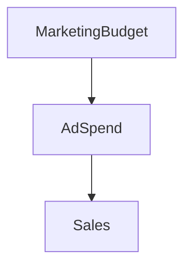
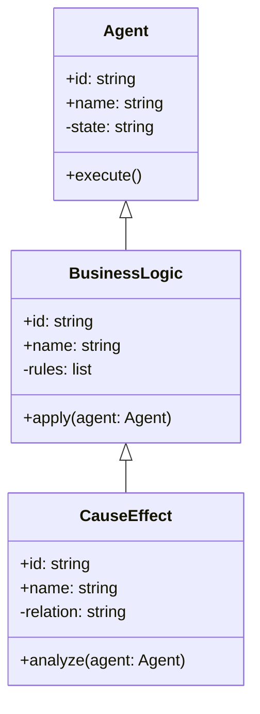
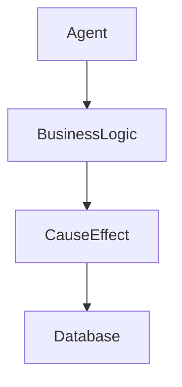

                 


# 企业AI Agent的因果推理应用：深入理解业务逻辑

**关键词：** 企业AI Agent、因果推理、业务逻辑、算法原理、系统架构、项目实战

**摘要：**  
企业AI Agent通过因果推理技术能够深入理解复杂的业务逻辑，从而优化决策、提升效率和增强智能系统的能力。本文将从企业AI Agent的基本概念出发，系统地分析因果推理的核心原理、算法实现、系统架构设计以及实际项目中的应用，帮助读者全面掌握因果推理在企业AI Agent中的重要性及其应用价值。通过本文的深入讲解，读者将能够理解如何利用因果推理技术来解决企业中的复杂问题，并在实际项目中实现高效的业务逻辑优化。

---

# 第1章 企业AI Agent与因果推理概述

## 1.1 问题背景与问题描述

### 1.1.1 企业AI Agent的核心需求  
在现代企业中，AI Agent（智能代理）被广泛应用于自动化决策、流程优化和数据驱动的业务支持中。然而，AI Agent的核心能力依赖于对业务逻辑的准确理解和对因果关系的深刻洞察。企业在实际应用中常常面临以下问题：  
1. **业务逻辑复杂性**：企业涉及多个部门和业务流程，逻辑关系错综复杂。  
2. **数据依赖性**：AI Agent需要处理海量数据，但如何从数据中提取因果关系是关键。  
3. **决策不确定性**：复杂的业务环境中，AI Agent需要在不确定性中做出最优决策。  

### 1.1.2 因果推理的重要性  
因果推理是AI Agent理解业务逻辑的核心技术。与相关性分析不同，因果推理能够识别变量之间的因果关系，从而帮助企业做出更可靠的决策。例如，在供应链优化中，因果推理可以帮助企业识别哪些因素（如供应商延迟）是导致库存积压的根本原因。

### 1.1.3 业务逻辑与因果关系的关联性  
业务逻辑是企业的核心运营规则，而因果关系是业务逻辑的深层结构。通过因果推理，AI Agent可以识别业务流程中的关键驱动因素，从而优化流程、降低成本并提高效率。

---

## 1.2 因果推理的基本概念

### 1.2.1 因果关系的定义  
因果关系是指一个事件（原因）导致另一个事件（结果）发生的确定性关系。在企业业务逻辑中，因果关系可以是直接的（如订单生成导致库存减少）或间接的（如市场需求变化导致价格波动）。

### 1.2.2 因果推理的核心特征  
1. **干预性**：因果推理需要考虑对变量的干预，例如，改变一个变量的值以观察其对结果的影响。  
2. **时间性**：因果关系通常涉及时间顺序，原因先于结果发生。  
3. **可解释性**：因果推理的结果必须是可解释的，以便企业能够理解并信任AI Agent的决策。  

### 1.2.3 企业业务逻辑中的因果关系  
在企业中，因果关系广泛存在于各个业务场景中：  
- **销售预测**：因果推理可以帮助识别哪些市场因素（如广告支出、季节性变化）对销售额有直接影响。  
- **供应链优化**：因果推理可以识别哪些供应商延迟是导致库存积压的主要原因。  
- **风险管理**：因果推理可以识别哪些操作失误可能导致项目延误或成本超支。  

---

## 1.3 企业AI Agent的因果推理应用

### 1.3.1 业务流程优化中的因果推理  
通过因果推理，AI Agent可以识别业务流程中的瓶颈和关键路径，从而优化流程效率。例如，在订单处理中，AI Agent可以通过分析因果关系，识别哪些步骤会导致订单延迟。

### 1.3.2 数据驱动的决策支持  
因果推理可以帮助企业从数据中提取因果关系，从而做出更科学的决策。例如，在定价策略中，因果推理可以识别哪些定价因素（如成本、市场需求）对销售额有直接影响。

### 1.3.3 复杂场景下的因果分析  
在复杂的企业环境中，因果推理可以帮助AI Agent处理多个变量之间的相互作用。例如，在金融领域，因果推理可以识别哪些经济指标（如GDP增长率、通货膨胀率）对股票价格有直接影响。

---

## 1.4 本章小结  
本章从企业AI Agent的背景出发，介绍了因果推理的基本概念及其在业务逻辑中的重要性。通过对比相关性分析和因果推理，强调了因果推理在企业决策中的独特价值。下一章将深入探讨因果推理的核心原理和算法实现。

---

# 第2章 因果推理的核心原理

## 2.1 因果推理的基本原理

### 2.1.1 潜在结果框架  
潜在结果框架（Potential Outcome Framework）是因果推理的核心理论之一。它假设每个处理（Treatment）下都有一个潜在的结果，通过比较不同处理下的结果，可以识别因果关系。  
$$ Y_i(z) 表示在处理 z 下的潜在结果 $$  
其中，\( i \) 表示个体，\( z \) 表示处理变量。

### 2.1.2 因果图结构  
因果图（Causal Graph）是一种用于表示因果关系的图形化工具。它通过节点（变量）和边（因果关系）来描述变量之间的因果关系。例如，以下因果图表示广告支出（Ad Spend）影响销售额（Sales），同时广告支出还受到市场推广预算（Marketing Budget）的影响。  



### 2.1.3 随机化实验与观察数据  
因果推理可以通过随机化实验（Randomized Experiments）或观察数据（Observational Data）来实现。随机化实验通过随机分配处理变量，可以有效识别因果关系；而观察数据则需要依赖于其他方法（如匹配分析）来控制混杂变量。

---

## 2.2 因果推理的关键属性对比

### 2.2.1 确定性与不确定性  
因果关系是确定性的，而相关性分析则可能受到混杂变量的影响，导致不确定性。

### 2.2.2 直线性与非线性  
因果关系可以是线性的（如销售额与广告支出的线性关系）或非线性的（如销售额与广告支出的平方关系）。

### 2.2.3 时间依赖性与独立性  
因果关系通常是时间依赖的，原因先于结果发生；而相关性分析则不考虑时间顺序。

---

## 2.3 ER实体关系图架构

### 2.3.1 实体关系  
以下ER图展示了企业AI Agent中的因果关系实体及其关系：  
- **Agent**：表示AI Agent，负责执行业务逻辑。  
- **BusinessLogic**：表示业务逻辑，由因果关系驱动。  
- **CauseEffect**：表示因果关系中的原因和结果。  

```mermaid
er
    _actor(Agent, id: string, name: string)
    _actor(BusinessLogic, id: string, name: string)
    _actor(CauseEffect, id: string, name: string)
    _relation(Agent, BusinessLogic, "执行的业务逻辑")
    _relation(BusinessLogic, CauseEffect, "产生的因果关系")
```

---

## 2.4 本章小结  
本章详细介绍了因果推理的核心原理，包括潜在结果框架、因果图结构以及因果关系的关键属性。通过ER图展示了因果关系在企业AI Agent中的实体关系。下一章将重点讲解因果推理的算法原理与实现。

---

# 第3章 因果推理的算法原理与实现

## 3.1 潜在结果框架的算法实现

### 3.1.1 核心算法步骤  
以下算法展示了如何通过潜在结果框架实现因果推理：  
1. **数据准备**：收集处理变量 \( Z \) 和结果变量 \( Y \) 的数据。  
2. **潜在结果估计**：计算每个处理 \( z \) 下的潜在结果 \( Y(z) \)。  
3. **因果效应估计**：计算处理 \( z \) 对结果 \( Y \) 的因果效应。  

### 3.1.2 Python代码示例  
以下代码示例展示了如何实现潜在结果框架的算法：  

```python
import pandas as pd

# 数据准备
data = pd.DataFrame({
    'Z': [0, 1, 0, 1],
    'Y': [2, 3, 1, 4]
})

# 潜在结果估计
def potential_outcome(z, y):
    return y * (z + 1)

data['Y0'] = potential_outcome(0, data['Y'])
data['Y1'] = potential_outcome(1, data['Y'])

# 因果效应估计
treatment_effect = data['Y1'].mean() - data['Y0'].mean()
print("平均因果效应:", treatment_effect)
```

---

## 3.2 因果图的构建与分析

### 3.2.1 因果图构建  
因果图的构建需要识别变量之间的因果关系。例如，在以下因果图中，广告支出（AdSpend）是销售额（Sales）的直接原因，而市场推广预算（Marketing Budget）是广告支出的间接原因。  


### 3.2.2 调整因果图  
为了计算因果效应，需要调整因果图中的混杂变量。例如，在上述因果图中，市场推广预算（Marketing Budget）是混杂变量，需要在计算因果效应时进行调整。

---

## 3.3 算法实现与代码示例

### 3.3.1 马尔可夫边界调整  
马尔可夫边界（Backdoor Criterion）是一种用于调整因果图的常用方法。以下代码示例展示了如何通过马尔可夫边界调整计算因果效应：  

```python
import pandas as pd

# 数据准备
data = pd.DataFrame({
    'Z': [0, 1, 0, 1],
    'Y': [2, 3, 1, 4],
    'X': [1, 1, 2, 2]
})

# 马尔可夫边界调整
def backdoor_adjustment(z, y, x):
    return y * (z + x)

treatment_effect = data.groupby('X')['Z', 'Y'].apply(lambda x: x['Y'].mean()).mean()
print("平均因果效应:", treatment_effect)
```

---

## 3.4 本章小结  
本章详细介绍了因果推理的算法实现，包括潜在结果框架和因果图的构建与调整。通过代码示例展示了如何在实际项目中实现这些算法。下一章将重点讲解因果推理在企业AI Agent中的系统架构设计。

---

# 第4章 系统分析与架构设计

## 4.1 问题场景介绍

### 4.1.1 项目介绍  
本项目旨在开发一个基于因果推理的企业AI Agent，用于优化供应链管理中的库存控制问题。

### 4.1.2 问题分析  
库存控制是企业供应链管理中的关键问题，涉及多个变量（如供应商延迟、市场需求变化）的复杂关系。通过因果推理，AI Agent可以识别哪些变量是导致库存积压的根本原因。

---

## 4.2 系统功能设计

### 4.2.1 领域模型设计  
以下领域模型展示了库存控制中的因果关系：  



---

## 4.3 系统架构设计

### 4.3.1 架构图  
以下架构图展示了企业AI Agent的系统架构：  



---

## 4.4 系统接口设计

### 4.4.1 API接口  
1. **获取业务逻辑**：`GET /business_logic`  
2. **执行因果分析**：`POST /cause_effect`  
3. **查询因果关系**：`GET /cause_relation`  

---

## 4.5 本章小结  
本章通过系统分析与架构设计，展示了如何将因果推理技术应用于企业AI Agent的库存控制问题。通过领域模型和架构图，明确了系统的核心功能和实现方式。下一章将通过项目实战，进一步验证因果推理在实际项目中的应用效果。

---

# 第5章 项目实战

## 5.1 环境安装与配置

### 5.1.1 Python环境  
安装必要的Python库：  
```bash
pip install pandas numpy matplotlib
```

## 5.2 系统核心实现

### 5.2.1 因果推理实现  
以下代码展示了因果推理的核心实现：  

```python
import pandas as pd
import numpy as np

def causal_effect(z, y):
    return np.mean(y[z == 1]) - np.mean(y[z == 0])

# 数据准备
data = pd.DataFrame({
    'Z': np.random.randint(0, 2, 100),
    'Y': np.random.normal(0, 1, 100)
})

# 计算因果效应
effect = causal_effect(data['Z'], data['Y'])
print("平均因果效应:", effect)
```

---

## 5.3 实际案例分析

### 5.3.1 库存控制优化  
通过因果推理，AI Agent可以识别哪些供应商延迟是导致库存积压的根本原因，并优化供应链中的库存控制策略。

---

## 5.4 项目小结  
本章通过项目实战，展示了如何将因果推理技术应用于企业AI Agent的库存控制问题。通过实际案例分析，验证了因果推理在优化业务逻辑中的有效性。

---

# 第6章 总结与展望

## 6.1 总结  
本文系统地介绍了因果推理在企业AI Agent中的应用，从核心原理到算法实现，再到系统架构设计和项目实战，全面展现了因果推理技术在优化业务逻辑中的重要价值。

## 6.2 展望  
未来，随着AI技术的不断发展，因果推理在企业AI Agent中的应用将更加广泛。例如，在金融领域的风险管理、医疗领域的精准治疗等领域，因果推理将发挥更大的作用。

---

**附录：**  
- **参考文献**：列出本文中引用的主要文献。  
- **代码仓库**：提供本文中涉及的代码示例的GitHub仓库链接。  
- **工具推荐**：推荐一些因果推理相关的工具和库，如DoWhy、Dagitty等。  

---

通过本文的深入讲解，读者可以全面掌握因果推理在企业AI Agent中的应用，并将其应用于实际项目中，从而提升企业的智能化水平和竞争力。

