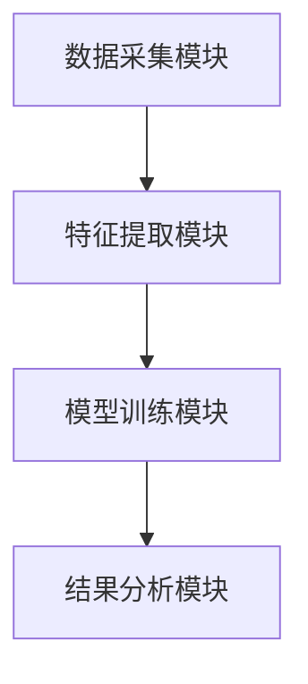

                 


# 企业AI Agent的图卷积网络在社交网络分析中的应用

## 关键词
- 企业AI Agent
- 图卷积网络（GCN）
- 社交网络分析
- 算法原理
- 系统架构设计

## 摘要
本文详细探讨了企业AI Agent如何利用图卷积网络（GCN）技术进行社交网络分析。文章从背景介绍、核心概念、算法原理、系统架构设计、项目实战到最佳实践，全面分析了GCN在社交网络中的应用。通过详细的数学模型和代码示例，结合系统设计和实际案例，展示了GCN在企业AI Agent中的强大能力，为读者提供了一套完整的解决方案和实践指南。

---

# 第一部分: 背景介绍

## 第1章: 问题背景

### 1.1 问题背景
#### 1.1.1 企业AI Agent的发展现状
企业AI Agent通过自动化工具和机器学习模型，帮助企业实现业务流程优化和决策支持。随着AI技术的快速发展，企业AI Agent在社交网络分析中的应用日益广泛。

#### 1.1.2 社交网络分析的挑战与需求
社交网络分析涉及用户行为、关系建模和信息传播等问题。传统的统计方法难以应对复杂的社交网络结构，而深度学习技术，尤其是图卷积网络，为这些问题提供了新的解决方案。

#### 1.1.3 图卷积网络在社交网络分析中的优势
图卷积网络能够处理图结构数据，捕捉节点之间的关系，适用于社交网络中的用户行为预测和社区检测。

### 1.2 问题描述
#### 1.2.1 企业AI Agent的核心目标
企业AI Agent的目标是通过自动化手段优化企业流程，提高效率，降低成本，并提供数据驱动的决策支持。

#### 1.2.2 社交网络分析的关键问题
社交网络分析需要解决用户行为建模、关系网络构建和信息传播路径预测等问题。

#### 1.2.3 图卷积网络的应用场景
图卷积网络适用于社交网络中的节点分类、链接预测和社区检测等任务。

### 1.3 问题解决
#### 1.3.1 图卷积网络的核心优势
图卷积网络能够有效处理图结构数据，捕捉局部和全局特征，适用于复杂的社交网络分析任务。

#### 1.3.2 企业AI Agent的解决方案
企业AI Agent结合图卷积网络技术，实现社交网络数据的高效分析和预测。

#### 1.3.3 社交网络分析的具体实现
通过GCN模型，实现用户行为预测和社交网络结构优化。

### 1.4 边界与外延
#### 1.4.1 企业AI Agent的适用范围
企业AI Agent适用于需要自动化处理和数据驱动决策的业务场景。

#### 1.4.2 图卷积网络的局限性
GCN在处理大规模图数据时可能存在计算复杂度高和训练效率低的问题。

#### 1.4.3 社交网络分析的边界条件
社交网络分析需要考虑数据隐私和用户行为的动态变化。

### 1.5 概念结构与核心要素组成
#### 1.5.1 企业AI Agent的组成要素
企业AI Agent通常包括感知模块、决策模块和执行模块。

#### 1.5.2 图卷积网络的核心组件
GCN由图结构数据、卷积操作和激活函数组成。

#### 1.5.3 社交网络分析的关键指标
包括用户活跃度、关系强度和社区凝聚力等指标。

---

# 第二部分: 核心概念与联系

## 第2章: 核心概念原理

### 2.1 核心概念原理
#### 2.1.1 企业AI Agent的基本原理
企业AI Agent通过感知环境、分析数据并执行任务，优化企业运营。

#### 2.1.2 图卷积网络的工作机制
GCN通过在图结构数据上进行卷积操作，提取节点特征并进行分类或预测。

#### 2.1.3 社交网络分析的核心方法
社交网络分析利用图论方法，研究用户行为和网络结构特征。

### 2.2 概念属性特征对比
以下是企业AI Agent、图卷积网络和社交网络分析的核心属性对比：

| 概念        | 核心属性                     |
|-------------|------------------------------|
| 企业AI Agent | 自动化、数据驱动、决策支持   |
| 图卷积网络   | 图结构处理、局部全局特征     |
| 社交网络分析 | 用户行为、网络结构、信息传播 |

### 2.3 ER实体关系图

```mermaid
er
actor: 企业AI Agent
goal: 社交网络分析
relation: 应用GCN技术
```

---

# 第三部分: 算法原理讲解

## 第3章: 图卷积网络算法原理

### 3.1 GCN基本原理
#### 3.1.1 GCN的数学模型
GCN的传播规则可以表示为：
$$ h^{(l+1)} = \theta (h^{(l)} A h^{(l)} ) $$
其中，$A$是归一化邻接矩阵，$\theta$是激活函数。

#### 3.1.2 GCN的多层网络结构
GCN通过多层卷积操作，逐步提取图中的高层次特征：
$$ h^{(L)} = \Theta (A h^{(L-1)} ) $$

### 3.2 GCN算法实现
以下是GCN的Python实现示例：

```python
import torch
from torch import nn
import torch.nn.functional as F

class GCN(nn.Module):
    def __init__(self, in_features, out_features):
        super(GCN, self).__init__()
        self.W = nn.Parameter(torch.randn(in_features, out_features))
    
    def forward(self, x, A):
        support = x @ self.W
        output = torch.bmm(A, support)
        return F.relu(output)
```

### 3.3 GCN在社交网络分析中的应用
#### 3.3.1 用户行为预测
通过GCN提取用户特征，预测用户的下一步行为。

#### 3.3.2 社区检测
利用GCN的聚类能力，自动识别社交网络中的社区结构。

---

# 第四部分: 系统分析与架构设计方案

## 第4章: 系统架构设计

### 4.1 项目介绍
本项目旨在开发一个基于GCN的企业AI Agent，用于社交网络分析。

### 4.2 系统功能设计
系统功能模块包括数据采集、特征提取、模型训练和结果分析。

### 4.3 系统架构图



### 4.4 接口设计
系统提供REST API接口，用于数据输入和结果输出。

### 4.5 交互设计
系统通过命令行界面（CLI）与用户交互，支持参数配置和结果展示。

---

# 第五部分: 项目实战

## 第5章: 实战分析

### 5.1 环境安装
安装所需的Python库和框架，如PyTorch和NetworkX。

### 5.2 核心实现
实现GCN模型，并集成到企业AI Agent系统中。

### 5.3 案例分析
分析实际社交网络数据，验证模型的预测能力和社区检测效果。

---

# 第六部分: 最佳实践与总结

## 第6章: 总结与展望

### 6.1 最佳实践
- 数据预处理是关键，需确保数据质量和完整性。
- 模型调参和优化是提升性能的重要步骤。
- 结合业务场景，灵活调整模型结构和参数。

### 6.2 小结
企业AI Agent结合GCN技术，在社交网络分析中展现出强大的能力，为企业提供了高效的解决方案。

### 6.3 注意事项
- 注意数据隐私和安全问题。
- 避免过度依赖单一模型，需结合多种技术进行优化。

### 6.4 拓展阅读
推荐阅读《图神经网络入门与实践》和《企业AI Agent开发指南》。

---

通过本文的详细分析，读者可以全面了解企业AI Agent的图卷积网络在社交网络分析中的应用，从理论到实践，掌握完整的解决方案。

