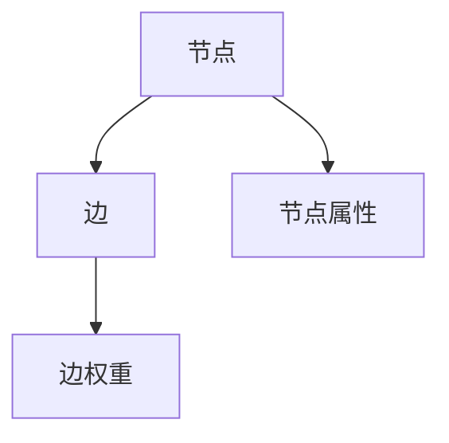
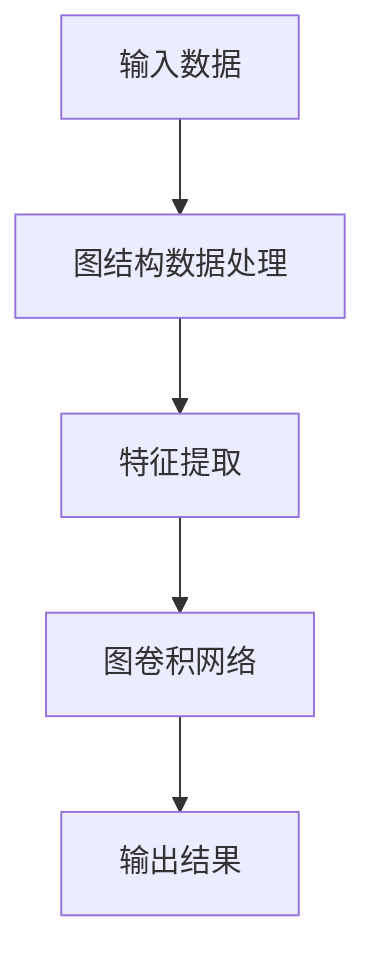
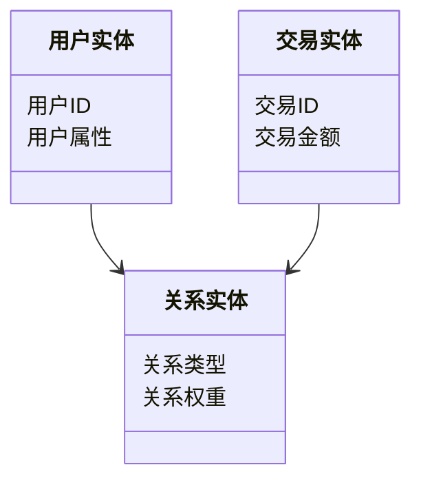
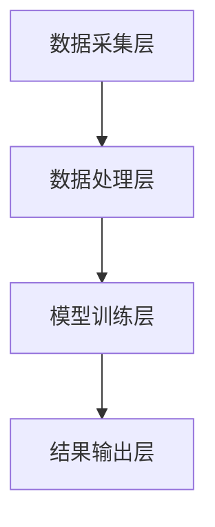
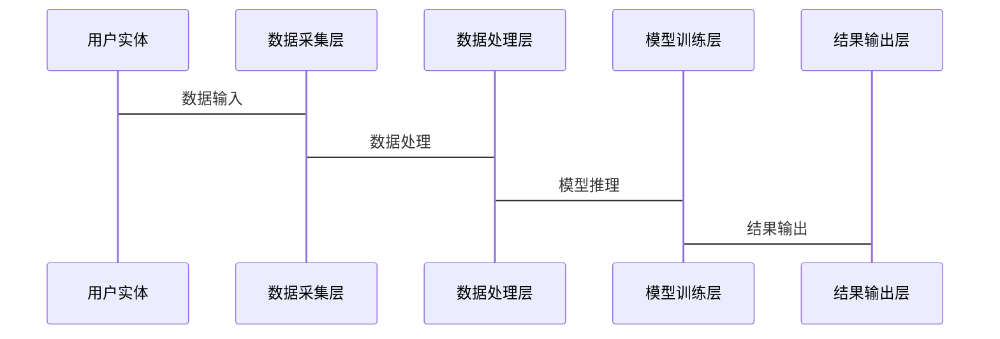

                 


# 企业AI Agent的图神经网络在欺诈检测中的应用

> 关键词：企业AI Agent，图神经网络，欺诈检测，图卷积网络，系统架构设计

> 摘要：本文深入探讨了企业AI Agent在欺诈检测中的应用，结合图神经网络技术，提出了基于图卷积网络（GCN）的欺诈检测模型。通过详细分析图神经网络的核心原理、AI Agent的架构设计，以及系统实现的各个部分，本文为读者提供了一种高效、准确的欺诈检测解决方案。文章还通过实际案例分析，展示了该方案在实际场景中的应用效果和优势。

---

# 第1章: 企业AI Agent与图神经网络的背景介绍

## 1.1 问题背景

### 1.1.1 欺诈检测的挑战与需求
欺诈检测是企业风险管理中的重要环节，其目的是通过识别异常交易、非法活动等行为，保护企业的财务安全和声誉。传统的欺诈检测方法主要依赖规则引擎和统计分析，但随着企业规模的扩大和业务复杂度的增加，传统的检测方法在以下方面面临挑战：

- **数据维度高**：企业数据通常涉及多维度信息，包括交易数据、用户行为数据、社交网络数据等，传统的统计方法难以处理高维数据。
- **实时性要求高**：欺诈行为往往发生在瞬间，需要实时检测和响应。
- **模型泛化能力弱**：传统方法依赖于预定义的规则，难以应对新型欺诈手段。

### 1.1.2 图神经网络的优势
图神经网络（Graph Neural Networks, GNN）是一种基于图结构数据的深度学习模型，能够有效处理节点之间的关系信息。相比于传统深度学习模型，图神经网络具有以下优势：

- **能够处理复杂关系**：图神经网络能够捕捉节点之间的复杂关系，适用于欺诈检测中涉及多主体、多关系的场景。
- **全局视角**：图神经网络可以从全局视角分析数据，发现潜在的欺诈模式。
- **鲁棒性高**：图神经网络能够处理噪声数据，具有较强的抗干扰能力。

### 1.1.3 企业AI Agent的定义与目标
企业AI Agent是一种具备自主决策和执行能力的智能体，能够根据实时数据和环境变化，自主完成任务。其目标是通过智能化的决策和执行，提升企业的运营效率和风险管理能力。

---

## 1.2 核心概念与问题描述

### 1.2.1 图神经网络的基本概念
图神经网络是一种基于图结构数据的深度学习模型，其核心思想是通过传播节点特征信息，学习节点之间的关系。图神经网络可以处理多种图结构数据，包括无向图、有向图、加权图等。

### 1.2.2 AI Agent的核心功能
AI Agent的核心功能包括感知、决策和执行。感知功能负责获取环境中的数据和信息；决策功能基于感知数据进行分析和判断；执行功能负责根据决策结果执行相应的操作。

### 1.2.3 欺诈检测的场景与边界
欺诈检测的场景包括交易欺诈、身份盗用、虚假交易等。其边界包括数据来源、检测范围、检测频率等。企业需要根据自身业务特点，明确欺诈检测的边界和目标。

---

## 1.3 核心要素与概念结构

### 1.3.1 图结构数据的特征
图结构数据的特征包括节点特征、边特征和图结构信息。节点特征表示节点的属性信息，边特征表示节点之间的关系信息，图结构信息表示整个图的拓扑结构。

### 1.3.2 AI Agent的功能模块
AI Agent的功能模块包括感知层、决策层和执行层。感知层负责数据采集和特征提取；决策层负责模型训练和预测；执行层负责结果输出和反馈。

### 1.3.3 欺诈检测的流程与逻辑
欺诈检测的流程包括数据采集、特征提取、模型训练、实时检测和结果反馈。其逻辑包括异常检测、关联分析和风险评估。

---

## 1.4 本章小结
本章主要介绍了企业AI Agent和图神经网络的基本概念，分析了欺诈检测的挑战和需求，明确了图神经网络和AI Agent在欺诈检测中的优势和作用。

---

# 第2章: 图神经网络与AI Agent的核心概念

## 2.1 图神经网络的原理

### 2.1.1 图的表示与节点关系
图的表示方式包括邻接矩阵、边列表和节点属性。节点之间的关系包括直接关系和间接关系。

### 2.1.2 图卷积网络（GCN）的原理
图卷积网络（GCN）是一种基于图结构数据的卷积神经网络。其核心思想是通过传播节点特征信息，学习节点之间的关系。

$$y = \sigma(A X W)$$

其中，$A$是邻接矩阵，$X$是节点特征矩阵，$W$是权重矩阵，$\sigma$是激活函数。

### 2.1.3 图神经网络的训练与推理
图神经网络的训练过程包括正向传播、损失计算和反向传播。其推理过程包括输入数据、特征提取和结果输出。

---

## 2.2 AI Agent的架构与功能

### 2.2.1 AI Agent的感知层
AI Agent的感知层负责数据采集和特征提取。其功能包括数据源的接入、数据清洗和特征工程。

### 2.2.2 AI Agent的决策层
AI Agent的决策层负责模型训练和预测。其功能包括模型选择、参数优化和结果输出。

### 2.2.3 AI Agent的执行层
AI Agent的执行层负责结果输出和反馈。其功能包括决策执行、结果反馈和日志记录。

---

## 2.3 图神经网络与AI Agent的结合

### 2.3.1 图结构数据的输入与处理
图结构数据的输入包括节点特征和边信息。其处理过程包括数据清洗、特征提取和图结构构建。

### 2.3.2 AI Agent的决策逻辑
AI Agent的决策逻辑包括异常检测、关联分析和风险评估。其决策过程基于图神经网络的预测结果。

### 2.3.3 欺诈检测的输出与反馈
欺诈检测的输出包括检测结果和风险评分。其反馈过程包括结果输出和日志记录。

---

## 2.4 核心概念对比表

| 概念 | 图神经网络 | AI Agent |
|------|------------|-----------|
| 核心功能 | 学习节点关系 | 自主决策和执行 |
| 输入数据 | 图结构数据 | 多源数据 |
| 输出结果 | 节点标签 | 决策结果 |

---

## 2.5 实体关系图（ER图）



---

## 2.6 本章小结
本章详细介绍了图神经网络和AI Agent的核心概念，分析了两者在欺诈检测中的结合方式和作用。

---

# 第3章: 图神经网络算法原理

## 3.1 图卷积网络（GCN）的原理

### 3.1.1 GCN的数学模型
图卷积网络（GCN）的数学模型如下：

$$y = \sigma(A X W)$$

其中，$A$是邻接矩阵，$X$是节点特征矩阵，$W$是权重矩阵，$\sigma$是激活函数。

### 3.1.2 GCN的算法流程
GCN的算法流程包括以下步骤：

1. **输入数据**：输入图结构数据和节点特征。
2. **计算邻接矩阵**：构建图的邻接矩阵。
3. **正向传播**：通过GCN层进行特征提取。
4. **激活函数**：对输出结果进行激活。
5. **损失计算**：计算损失函数。
6. **反向传播**：更新模型参数。

### 3.1.3 GCN的实现细节
GCN的实现细节包括邻接矩阵的构建、特征矩阵的维度和激活函数的选择。

---

## 3.2 图神经网络的训练过程

### 3.2.1 损失函数的定义
图神经网络的损失函数通常采用交叉熵损失函数：

$$L = -\frac{1}{N}\sum_{i=1}^{N} y_i \log(p_i) + (1-y_i)\log(1-p_i)$$

其中，$y_i$是真实标签，$p_i$是预测概率。

### 3.2.2 优化器的选择与配置
图神经网络的优化器通常选择Adam优化器，其参数包括学习率、动量和衰减率。

### 3.2.3 训练策略的优化
图神经网络的训练策略包括批量训练、学习率调度和模型正则化。

---

## 3.3 图神经网络的数学模型

### 3.3.1 GCN的数学公式
图卷积网络（GCN）的数学公式如下：

$$y = \sigma(A X W)$$

其中，$A$是邻接矩阵，$X$是节点特征矩阵，$W$是权重矩阵，$\sigma$是激活函数。

### 3.3.2 图结构数据的表示
图结构数据的表示包括邻接矩阵、节点特征矩阵和边权重矩阵。

### 3.3.3 模型的评估与验证
模型的评估与验证包括准确率、召回率和F1分数的计算。

---

## 3.4 图神经网络的流程图



---

## 3.5 本章小结
本章详细讲解了图神经网络的核心算法GCN的原理和实现过程，分析了其在欺诈检测中的应用。

---

# 第4章: 系统分析与架构设计方案

## 4.1 问题场景介绍

### 4.1.1 欺诈检测的场景描述
欺诈检测的场景包括交易欺诈、身份盗用和虚假交易等。其核心目标是通过实时检测和分析，识别异常行为。

### 4.1.2 系统需求分析
系统需求包括实时性、准确性和可扩展性。系统需要支持多源数据接入、高并发处理和模型更新。

---

## 4.2 系统功能设计

### 4.2.1 领域模型
领域模型包括用户实体、交易实体和关系实体。



### 4.2.2 系统架构设计
系统架构设计包括数据采集层、数据处理层、模型训练层和结果输出层。



### 4.2.3 系统接口设计
系统接口设计包括数据接口、模型接口和结果接口。

---

## 4.3 系统交互设计

### 4.3.1 系统交互流程
系统交互流程包括数据输入、特征提取、模型推理和结果输出。



### 4.3.2 交互流程图


---

## 4.4 本章小结
本章详细分析了欺诈检测系统的场景、功能和架构设计，提出了基于图神经网络的系统架构方案。

---

# 第5章: 项目实战

## 5.1 环境安装

### 5.1.1 Python环境
安装Python 3.8以上版本。

### 5.1.2 图神经网络库
安装以下库：

```
pip install tensorflow
pip install numpy
pip install pandas
pip install networkx
pip install pymermaid
```

---

## 5.2 系统核心实现源代码

### 5.2.1 数据处理代码

```python
import pandas as pd
import networkx as nx

# 读取数据
data = pd.read_csv('fraud_data.csv')

# 构建图结构
G = nx.Graph()
for i in range(len(data)):
    G.add_node(data['user_id'][i])
    G.add_edge(data['user_id'][i], data['transaction_id'][i], weight=data['amount'][i])
```

### 5.2.2 模型训练代码

```python
import tensorflow as tf
from tensorflow.keras import layers

# 定义图卷积层
class GraphConvolution(layers.Layer):
    def __init__(self, output_dim):
        super(GraphConvolution, self).__init__()
        self.output_dim = output_dim

    def call(self, inputs, adjacency):
        x = inputs
        a = adjacency
        x = tf.sparse.sparse_triangular_matmul(a, x, transpose_b=True)
        x = tf.nn.relu(x)
        return x

# 构建模型
model = tf.keras.Sequential([
    GraphConvolution(64),
    layers.Dense(32),
    layers.ReLU(),
    layers.Dense(2),
    layers.Softmax()
])

# 编译模型
model.compile(optimizer='adam', loss='sparse_categorical_crossentropy', metrics=['accuracy'])
```

---

## 5.3 代码应用解读与分析

### 5.3.1 数据处理部分
数据处理部分包括数据读取和图结构构建。数据读取使用Pandas库，图结构构建使用NetworkX库。

### 5.3.2 模型训练部分
模型训练部分包括图卷积层和全连接层的定义。图卷积层使用自定义层GraphConvolution，全连接层使用Dense层。

---

## 5.4 实际案例分析

### 5.4.1 数据准备
准备欺诈检测数据，包括用户ID、交易ID和交易金额。

### 5.4.2 模型训练
使用准备好的数据训练模型，评估模型的准确率和召回率。

### 5.4.3 案例分析
分析模型的预测结果，验证模型的欺诈检测能力。

---

## 5.5 本章小结
本章通过实际案例分析，展示了基于图神经网络的欺诈检测系统的实现过程和应用效果。

---

# 第6章: 总结与展望

## 6.1 总结
本文详细探讨了企业AI Agent的图神经网络在欺诈检测中的应用，提出了基于图卷积网络（GCN）的欺诈检测模型。通过分析图神经网络的核心原理、AI Agent的架构设计，以及系统实现的各个部分，本文为读者提供了一种高效、准确的欺诈检测解决方案。

---

## 6.2 本章小结

### 6.2.1 最佳实践 tips
- 数据预处理是关键，需要确保数据的完整性和准确性。
- 模型训练时，建议使用高质量的数据和合理的超参数设置。
- 系统部署时，需要考虑实时性和可扩展性。

### 6.2.2 注意事项
- 模型的泛化能力需要通过交叉验证和数据增强来提升。
- 模型的可解释性需要通过可视化工具进行分析。
- 模型的实时性需要通过优化算法和硬件配置来保证。

### 6.2.3 拓展阅读
- 《Graph Neural Networks: A Review of Methods, Applications, and Open Challenges》
- 《Deep Learning for Graphical Data》

---

## 6.3 展望
未来的研究方向包括更高效的图神经网络算法、更智能的AI Agent架构，以及更广泛的应用场景。随着技术的不断发展，企业AI Agent的图神经网络在欺诈检测中的应用将更加广泛和深入。

---

# 结语

本文通过系统分析和实践，深入探讨了企业AI Agent的图神经网络在欺诈检测中的应用。希望本文的内容能够为读者提供有价值的参考和启发，帮助企业在欺诈检测领域实现更高效、更准确的解决方案。

