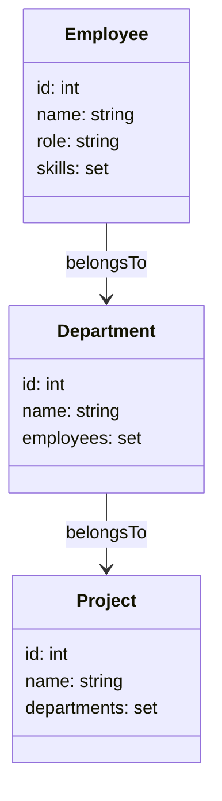
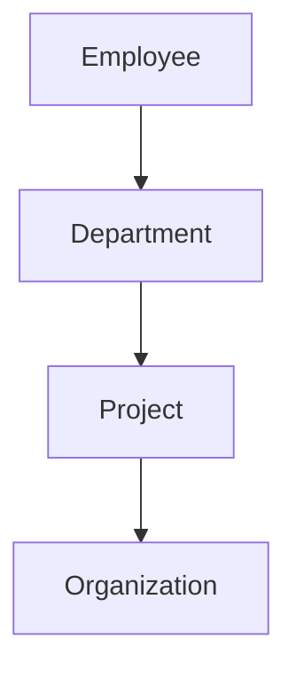
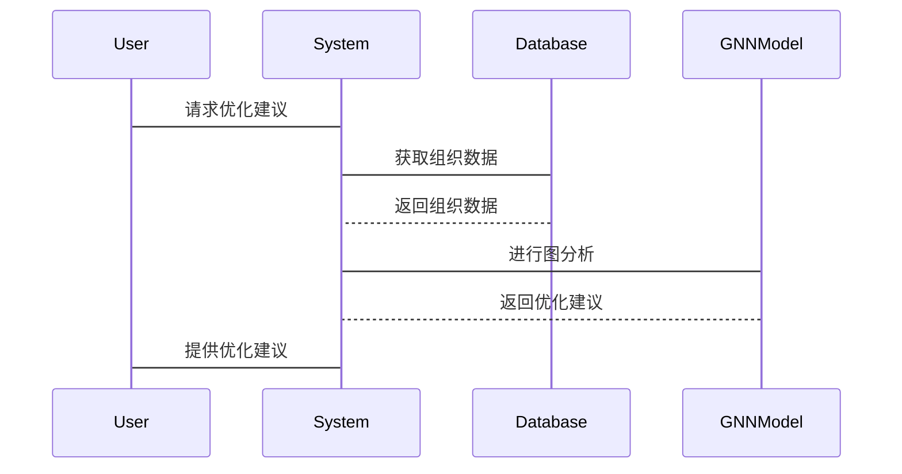

                 


# 企业AI Agent的图神经网络在组织结构优化中的应用

> 关键词：企业AI Agent，图神经网络，组织结构优化，系统架构设计，算法原理，项目实战

> 摘要：本文探讨了企业AI Agent与图神经网络在组织结构优化中的应用。首先介绍了企业AI Agent和图神经网络的基本概念，分析了其在组织优化中的优势。接着详细讲解了图神经网络的核心原理，包括图表示学习和算法流程。然后通过系统架构设计展示了如何将图神经网络应用于企业AI Agent中。最后通过项目实战，给出了具体的实现步骤和案例分析，总结了最佳实践和注意事项。

---

# 第一部分: 企业AI Agent与图神经网络概述

## 第1章: 企业AI Agent的背景与概念

### 1.1 企业AI Agent的定义与特点

#### 1.1.1 什么是企业AI Agent

企业AI Agent是一种智能代理系统，能够感知企业内外部环境，自主决策并执行任务，以优化企业运营效率。它结合了人工智能、机器学习和自然语言处理等技术，具备学习、推理和自适应能力。

#### 1.1.2 企业AI Agent的核心特点

- **自主性**：能够独立决策和行动。
- **反应性**：实时感知环境变化并做出反应。
- **学习能力**：通过数据和经验不断优化自身行为。
- **协作性**：能够与人和其他系统协同工作。

#### 1.1.3 企业AI Agent与传统AI的区别

| 特性            | 传统AI                          | 企业AI Agent                     |
|-----------------|---------------------------------|----------------------------------|
| 自主性           | 依赖于外部指令                 | 自主决策                          |
| 适应性           | 预设规则，适应性有限           | 具备学习能力，适应变化             |
| 应用场景         | 单一任务处理                   | 复杂企业环境优化                 |

### 1.2 图神经网络的基本概念

#### 1.2.1 图神经网络的定义

图神经网络（Graph Neural Network, GNN）是一种处理图结构数据的深度学习模型。它能够通过节点和边的特征，学习图的结构信息和语义信息。

#### 1.2.2 图神经网络的核心原理

- **节点表示学习**：通过聚合和传播机制，将节点特征传播到整个图中，生成节点的低维表示。
- **边权重计算**：根据节点特征和上下文信息，动态计算边的权重，反映节点之间的关系强度。
- **图嵌入方法**：将整个图的结构和特征嵌入到低维向量中，用于下游任务。

#### 1.2.3 图神经网络的优势与应用场景

- **优势**：
  - 能够处理复杂的非结构化数据。
  - 自然表达实体之间的关系。
  - 具备良好的可解释性。
- **应用场景**：
  - 社交网络分析
  - 推荐系统
  - 金融 fraud detection
  - 医疗健康

---

## 第2章: 企业AI Agent在组织结构优化中的应用背景

### 2.1 组织结构优化的必要性

#### 2.1.1 传统组织结构的局限性

- **信息孤岛**：部门间信息不共享，导致效率低下。
- **决策延迟**：层级过多导致决策过程缓慢。
- **资源浪费**：资源分配不合理，导致浪费。

#### 2.1.2 数字化转型对企业组织结构的影响

- **扁平化管理**：减少层级，提高效率。
- **协作式组织**：强调跨部门协作，提升整体效率。
- **数据驱动决策**：利用数据和AI技术优化决策过程。

#### 2.1.3 企业AI Agent在组织优化中的角色

- **实时监控**：监控组织运行状态，发现潜在问题。
- **优化建议**：基于数据分析，提供优化建议。
- **动态调整**：根据环境变化，动态调整组织结构。

### 2.2 图神经网络在组织优化中的优势

#### 2.2.1 图神经网络处理复杂关系的能力

- **多维关系建模**：能够处理员工、部门、项目之间的复杂关系。
- **关系权重动态调整**：根据实时数据，动态调整关系权重。

#### 2.2.2 图神经网络在组织结构分析中的应用

- **关键节点识别**：识别组织中的关键人物或部门。
- **社区检测**：发现组织中的自然团队或社区。
- **网络可视化**：将复杂的组织结构可视化，便于分析和优化。

#### 2.2.3 图神经网络在决策优化中的作用

- **预测潜在风险**：通过图结构分析，预测组织中的潜在风险。
- **优化资源配置**：根据图结构信息，优化资源分配。
- **提升协作效率**：通过图神经网络，提升部门间协作效率。

---

# 第二部分: 企业AI Agent的图神经网络原理

## 第3章: 图神经网络的核心原理

### 3.1 图表示学习

#### 3.1.1 节点表示学习

节点表示学习的目标是将图中的每个节点转换为低维向量，这些向量能够保留节点的特征及其在图中的位置信息。

#### 3.1.2 边表示学习

边表示学习的目标是将图中的边表示为低维向量，这些向量能够反映边的权重和方向信息。

#### 3.1.3 图嵌入方法

图嵌入方法将整个图的结构和特征嵌入到低维向量中，用于下游任务如分类、聚类等。

### 3.2 图神经网络的算法流程

#### 3.2.1 图数据的输入与处理

图数据通常包括节点特征和边信息。节点特征可以是文本、数值等，边信息包括边权重和方向。

#### 3.2.2 图卷积操作

图卷积操作是图神经网络的核心操作，它通过聚合相邻节点的特征，更新当前节点的特征。

#### 3.2.3 图池化与上采样

图池化操作用于降低图的复杂度，上采样操作用于恢复图的细节信息。

## 第4章: 企业AI Agent的图神经网络模型

### 4.1 基于图神经网络的AI Agent架构

#### 4.1.1 模型输入设计

模型输入包括企业组织结构图、员工特征、任务需求等。

#### 4.1.2 模型结构设计

模型结构包括输入层、图卷积层、聚合层和输出层。

#### 4.1.3 模型输出设计

模型输出包括优化建议、资源分配方案等。

### 4.2 图神经网络在组织结构优化中的应用

#### 4.2.1 组织网络的构建

通过图神经网络构建企业组织网络，包括员工、部门、项目等节点，以及它们之间的关系。

#### 4.2.2 关键节点识别

通过图神经网络，识别组织中的关键节点，如关键员工或部门。

#### 4.2.3 组织结构优化建议生成

根据图结构信息，生成优化建议，如调整部门结构、优化资源配置等。

---

# 第三部分: 系统分析与架构设计

## 第5章: 系统分析与架构设计方案

### 5.1 问题场景与系统需求分析

#### 5.1.1 问题场景

- 企业组织结构复杂，部门间协作效率低。
- 资源分配不合理，导致浪费。
- 组织结构优化缺乏数据支持。

#### 5.1.2 系统功能设计

- **数据采集**：采集企业组织数据。
- **图结构构建**：构建企业组织网络。
- **优化建议生成**：基于图神经网络，生成优化建议。
- **实时监控**：实时监控组织运行状态。

#### 5.1.3 系统架构设计

- **分层架构**：包括数据层、计算层和应用层。
- **模块化设计**：功能模块化，便于维护和扩展。

### 5.2 系统架构设计

#### 5.2.1 领域模型设计



#### 5.2.2 系统架构图



#### 5.2.3 系统接口设计

- **数据接口**：与企业数据源对接，获取组织数据。
- **用户接口**：提供优化建议和实时监控界面。
- **API接口**：提供API供其他系统调用。

#### 5.2.4 系统交互流程



---

## 第6章: 项目实战

### 6.1 环境安装

- **Python**：安装Python 3.8及以上版本。
- **TensorFlow**：安装TensorFlow和Keras。
- **PyTorch**：安装PyTorch和相关库。
- **Mermaid**：安装Mermaid CLI。

### 6.2 核心代码实现

#### 6.2.1 图神经网络实现

```python
import torch
from torch import nn

class GraphConvolution(nn.Module):
    def __init__(self, in_features, out_features):
        super(GraphConvolution, self).__init__()
        self.weight = nn.Parameter(torch.randn(in_features, out_features))
        self.bias = nn.Parameter(torch.randn(out_features))
    
    def forward(self, input, adj):
        support = torch.mm(input, self.weight)
        output = torch.spmm(adj, support)
        return output + self.bias
```

#### 6.2.2 优化建议生成

```python
def generate_optimization建议():
    # 假设已经构建了图结构模型
    model = GNNModel()
    model.load_state_dict(torch.load('model.pth'))
    optimized_structure = model.optimize()
    return optimized_structure
```

### 6.3 案例分析与实际应用

#### 6.3.1 案例分析

假设一个企业有10个部门，每个部门有5名员工。通过图神经网络分析，发现某些部门间协作效率低下，资源分配不均。模型会提出优化建议，如合并某些部门或调整资源分配。

#### 6.3.2 详细解读

通过图神经网络，系统能够识别关键员工和部门，分析它们之间的关系，预测潜在风险，并生成优化建议。例如，识别某个部门的关键员工，发现该部门的协作效率低下，建议调整部门结构或优化资源分配。

### 6.4 项目小结

通过项目实战，我们验证了图神经网络在企业组织结构优化中的有效性。模型能够准确识别关键节点，生成合理的优化建议，提升企业协作效率和资源利用率。

---

## 第7章: 最佳实践、小结与注意事项

### 7.1 最佳实践

- **数据质量**：确保数据的准确性和完整性。
- **模型调优**：根据实际需求，调整模型参数和结构。
- **实时监控**：实时监控模型性能，及时调整和优化。

### 7.2 小结

本文详细介绍了企业AI Agent与图神经网络在组织结构优化中的应用。通过理论分析和项目实战，展示了如何利用图神经网络优化企业组织结构，提升企业效率。

### 7.3 注意事项

- **数据隐私**：注意保护企业数据隐私，遵守相关法律法规。
- **模型解释性**：确保模型的可解释性，便于理解和优化。
- **系统稳定性**：确保系统的稳定性和可靠性，避免因模型问题影响企业运行。

### 7.4 拓展阅读

- **推荐书籍**：《图神经网络：理论与实践》
- **推荐论文**：《Graph Neural Networks: A Review of Methods, Applications, and Open Challenges》
- **在线资源**：[Awesome GNN](https://github.com/EdisonCHL/awesome-graph-neural-networks)

---

# 结语

企业AI Agent与图神经网络的结合为企业组织结构优化提供了新的思路和方法。通过图神经网络，企业能够更高效地识别问题，优化资源配置，提升协作效率。未来，随着技术的不断发展，企业AI Agent和图神经网络将在组织优化中发挥更大的作用。

