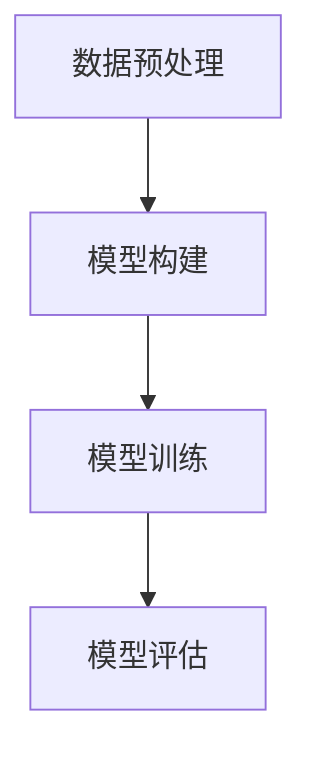
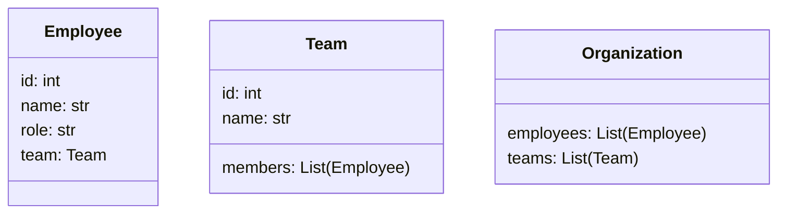
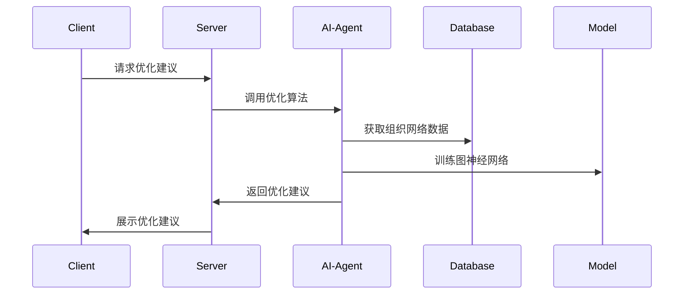

                 


# 企业AI Agent的图神经网络在组织网络优化中的应用

> 关键词：企业AI Agent，图神经网络，组织网络优化，算法实现，系统架构设计

> 摘要：随着人工智能和图神经网络技术的快速发展，企业AI Agent在组织网络优化中的应用日益广泛。本文将详细探讨企业AI Agent的核心概念、图神经网络的原理与算法，以及如何将两者结合应用于组织网络优化。通过实际项目案例的分析，本文将深入解读图神经网络在企业AI Agent中的具体应用，为企业组织网络优化提供理论支持和实践指导。

---

# 第一章：企业AI Agent与图神经网络概述

## 1.1 企业AI Agent的定义与背景

### 1.1.1 企业AI Agent的概念与特点
企业AI Agent是一种能够感知企业内外部环境、自主决策并执行任务的智能体。它具有以下特点：
1. **自主性**：能够在没有人工干预的情况下独立运行。
2. **反应性**：能够实时感知环境变化并做出响应。
3. **学习能力**：通过数据学习优化自身的决策能力。
4. **协作性**：能够与其他AI Agent或系统协同工作。

### 1.1.2 图神经网络的基本概念
图神经网络（Graph Neural Network, GNN）是一种用于处理图结构数据的深度学习模型。它通过节点之间的关系和属性来建模复杂的网络结构，适用于社交网络、推荐系统、知识图谱等多种场景。

### 1.1.3 企业AI Agent与图神经网络的结合
企业AI Agent可以通过图神经网络来优化其决策能力和协作能力。例如，在组织网络优化中，AI Agent可以利用图神经网络分析组织结构中的关系，发现潜在的优化点并提出改进方案。

## 1.2 问题背景与应用需求

### 1.2.1 传统组织网络优化的痛点
传统的企业组织网络优化往往依赖人工分析和经验判断，存在以下问题：
1. **效率低下**：人工分析耗时长，难以应对复杂网络的优化需求。
2. **主观性**：优化结果依赖于个人经验，存在主观性。
3. **动态性差**：难以实时适应组织结构的动态变化。

### 1.2.2 AI Agent在组织网络优化中的作用
AI Agent能够通过自动化的方式分析组织网络的结构和关系，发现优化点并提出解决方案。例如，AI Agent可以通过图神经网络分析员工之间的协作关系，优化团队分工。

### 1.2.3 图神经网络在组织网络优化中的优势
图神经网络能够有效建模组织网络中的复杂关系，帮助AI Agent更准确地分析和优化组织结构。例如，图神经网络可以用于识别关键节点、预测组织网络的演化趋势等。

## 1.3 本章小结
本章介绍了企业AI Agent和图神经网络的基本概念，并分析了它们在组织网络优化中的应用价值。接下来的章节将深入探讨图神经网络的原理与算法，以及如何将其应用于企业AI Agent的优化设计。

---

# 第二章：图神经网络的原理与算法

## 2.1 图论基础

### 2.1.1 图的基本概念
图由节点（顶点）和边组成，可以表示为$G = (V, E)$，其中$V$是节点集合，$E$是边集合。

### 2.1.2 图的表示与存储
图可以表示为邻接矩阵或邻接表。邻接矩阵适用于节点数量较少的场景，而邻接表适用于节点数量较多的场景。

### 2.1.3 图的遍历算法
常用的图遍历算法包括深度优先搜索（DFS）和广度优先搜索（BFS）。DFS适用于发现图中的最长路径，而BFS适用于发现图中的最短路径。

## 2.2 图神经网络的核心算法

### 2.2.1 图卷积网络（GCN）
图卷积网络通过聚合节点及其邻居的信息来生成节点表示。其数学公式为：
$$
y = \sigma(A X X^T)
$$
其中，$A$是邻接矩阵，$X$是节点特征矩阵，$\sigma$是激活函数。

### 2.2.2 图注意力网络（GAT）
图注意力网络通过注意力机制聚合节点信息，公式为：
$$
\alpha_{ij} = \frac{e^{q^T k}}{\sum_{k} e^{q^T k}}
$$
其中，$\alpha_{ij}$是注意力权重，$q$是查询向量，$k$是键向量。

### 2.2.3 图嵌入与表示学习
图嵌入通过将节点映射到低维空间来学习节点的表示。常用的图嵌入方法包括Node2Vec和GraphSAGE。

## 2.3 图神经网络的数学模型
### 2.3.1 GCN的数学公式
GCN的传播规则为：
$$
H^{(l+1)} = \sigma(A H^{(l)} H^{(l)}^T)
$$
其中，$H^{(l)}$是第$l$层的节点表示，$\sigma$是激活函数。

### 2.3.2 GAT的注意力机制
GAT的注意力权重计算公式为：
$$
\alpha_{ij} = \frac{\exp(\text{sim}(q_i, k_j))}{\sum_{k} \exp(\text{sim}(q_i, k_j))}
$$
其中，$\text{sim}(q_i, k_j)$是查询$q_i$和键$k_j$的相似性。

## 2.4 本章小结
本章介绍了图神经网络的核心原理和算法，包括图论基础、GCN和GAT的数学模型。接下来的章节将探讨企业AI Agent的设计与实现，并结合实际项目案例分析图神经网络的应用。

---

# 第三章：企业AI Agent的设计与实现

## 3.1 企业AI Agent的需求分析

### 3.1.1 业务需求分析
企业AI Agent需要具备以下功能：
1. 实时监控组织网络的状态。
2. 自主发现优化点。
3. 提供优化建议。

### 3.1.2 技术需求分析
企业AI Agent需要满足以下技术要求：
1. 高效的数据处理能力。
2. 强大的学习能力。
3. 灵活的扩展性。

### 3.1.3 用户需求分析
用户（企业管理员）需要：
1. 易用的管理界面。
2. 实时的优化建议。
3. 可视化的网络结构。

## 3.2 企业AI Agent的架构设计

### 3.2.1 分层架构设计
企业AI Agent的架构分为数据层、逻辑层和应用层。数据层负责数据的采集与存储，逻辑层负责数据的处理与分析，应用层负责结果的展示与交互。

### 3.2.2 模块化设计
企业AI Agent可以分为以下几个模块：
1. 数据采集模块：负责采集组织网络数据。
2. 数据处理模块：负责对数据进行预处理。
3. 模型训练模块：负责训练图神经网络模型。
4. 优化建议模块：负责生成优化建议。

### 3.2.3 组件交互设计
组件之间的交互流程如下：
1. 数据采集模块采集数据并传递给数据处理模块。
2. 数据处理模块对数据进行预处理后传递给模型训练模块。
3. 模型训练模块训练完成后，将模型应用于组织网络优化。
4. 优化建议模块根据模型输出生成优化建议并传递给用户。

## 3.3 企业AI Agent的实现方法

### 3.3.1 数据采集与处理
数据采集可以通过API接口或日志文件进行，数据处理包括数据清洗和特征提取。

### 3.3.2 模型训练与部署
模型训练使用图神经网络算法，训练完成后将模型部署到服务器上。

### 3.3.3 系统集成与测试
系统集成包括前后端的整合和功能测试，确保系统稳定性和用户体验。

## 3.4 本章小结
本章详细探讨了企业AI Agent的设计与实现方法，包括需求分析、架构设计和实现步骤。接下来的章节将结合实际项目案例，深入分析图神经网络在企业AI Agent中的应用。

---

# 第四章：图神经网络算法实现

## 4.1 图神经网络算法的实现步骤

### 4.1.1 数据预处理
数据预处理包括数据清洗、特征提取和数据标准化。

### 4.1.2 模型构建
模型构建包括选择图神经网络模型（如GCN或GAT）、定义损失函数和优化器。

### 4.1.3 模型训练
模型训练包括设置训练参数、训练数据和验证数据的划分，以及训练过程的监控。

### 4.1.4 模型评估
模型评估包括计算模型的准确率、召回率和F1分数。

## 4.2 图神经网络算法的代码实现

### 4.2.1 GCN的实现代码
```python
import torch
import torch.nn as nn
import torch.nn.functional as F

class GCN(nn.Module):
    def __init__(self, input_dim, hidden_dim, output_dim):
        super(GCN, self).__init__()
        self.gc1 = nn.Linear(input_dim, hidden_dim)
        self.gc2 = nn.Linear(hidden_dim, output_dim)
        self.dropout = nn.Dropout(0.5)

    def forward(self, x, adj):
        x = F.relu(self.gc1(torch.mm(adj, x)))
        x = F.dropout(x, p=0.5, training=True)
        x = self.gc2(torch.mm(adj, x))
        return x
```

### 4.2.2 GAT的实现代码
```python
class GATLayer(nn.Module):
    def __init__(self, in_dim, out_dim):
        super(GATLayer, self).__init__()
        self.w = nn.Parameter(torch.randn(in_dim, out_dim))
        self.a = nn.Parameter(torch.randn(out_dim, 1))

    def forward(self, x, adj):
        x = torch.mm(x, self.w)
        attention = F.softmax(torch.mm(x, self.a), dim=1)
        x = torch.mm(attention, x.T).T
        return x
```

### 4.2.3 算法流程图


## 4.3 本章小结
本章详细介绍了图神经网络算法的实现步骤和代码实现，为后续章节的实际项目案例提供了技术基础。

---

# 第五章：企业AI Agent的组织网络优化应用

## 5.1 项目背景与目标

### 5.1.1 项目背景
本项目旨在利用企业AI Agent和图神经网络优化某企业的组织网络结构，提升组织效率和协作能力。

### 5.1.2 项目目标
1. 构建组织网络模型。
2. 发现组织网络中的优化点。
3. 提供优化建议并实现优化。

## 5.2 系统功能设计

### 5.2.1 领域模型设计


### 5.2.2 系统架构设计


### 5.2.3 系统交互设计


## 5.3 项目实现与测试

### 5.3.1 环境安装
需要安装的环境包括Python、PyTorch和相关深度学习库。

### 5.3.2 核心代码实现
```python
import torch
import torch.nn as nn
import torch.optim as optim

# 定义模型
class GAT(nn.Module):
    def __init__(self, input_dim, hidden_dim, output_dim):
        super(GAT, self).__init__()
        self.gc1 = nn.Linear(input_dim, hidden_dim)
        self.gc2 = nn.Linear(hidden_dim, output_dim)
        self.dropout = nn.Dropout(0.5)

    def forward(self, x, adj):
        x = F.relu(torch.mm(torch.mm(adj, x), self.gc1.weight))
        x = F.dropout(x, p=0.5, training=True)
        x = torch.mm(torch.mm(adj, x), self.gc2.weight)
        return x

# 定义损失函数和优化器
criterion = nn.CrossEntropyLoss()
optimizer = optim.Adam(model.parameters(), lr=0.001)

# 训练模型
for epoch in range(num_epochs):
    outputs = model(batch_x, batch_adj)
    loss = criterion(outputs, batch_y)
    optimizer.zero_grad()
    loss.backward()
    optimizer.step()
```

### 5.3.3 案例分析与优化建议
通过对某企业的组织网络进行分析，发现团队协作效率低下，可以通过重新分配团队成员来优化协作流程。

## 5.4 本章小结
本章通过实际项目案例，详细介绍了企业AI Agent在组织网络优化中的应用，包括系统设计、实现和测试过程。接下来的章节将总结全文并展望未来的研究方向。

---

# 第六章：总结与展望

## 6.1 总结
本文详细探讨了企业AI Agent和图神经网络在组织网络优化中的应用，介绍了图神经网络的核心原理和算法，以及企业AI Agent的设计与实现方法。通过实际项目案例的分析，展示了图神经网络在组织网络优化中的巨大潜力。

## 6.2 未来展望
未来的研究方向包括：
1. 图神经网络的可解释性研究。
2. 多模态图神经网络的应用。
3. 高效图神经网络算法的优化。

## 6.3 最佳实践 Tips
1. 在实际应用中，应结合企业的具体需求选择合适的图神经网络模型。
2. 数据的采集和预处理是影响模型性能的关键因素。
3. 优化建议的可实施性是组织网络优化成功的重要保障。

## 6.4 本章小结
本文总结了企业AI Agent和图神经网络在组织网络优化中的应用，并展望了未来的研究方向，为读者提供了宝贵的参考。

---

# 参考文献
（此处列出相关文献和资料）

---

# 致谢
感谢读者的关注和支持！

