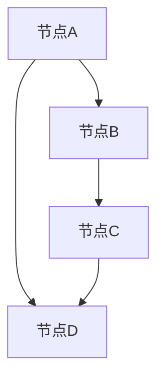

                 


# 企业AI Agent的图神经网络在组织网络分析中的应用

---

## 关键词：企业AI Agent，图神经网络，组织网络分析，算法实现，系统架构

---

## 摘要

随着企业数字化转型的深入，组织网络分析变得越来越重要。传统的网络分析方法在面对复杂的企业组织结构时显得力不从心。而图神经网络（Graph Neural Networks, GNNs）作为一种新兴的人工智能技术，能够有效地处理图结构数据，为组织网络分析提供了新的解决方案。本文将详细探讨企业AI Agent与图神经网络的结合，分析其在组织网络分析中的应用，并通过实际案例展示其优势。

---

## 目录

### 第1章: 企业AI Agent与图神经网络概述

#### 1.1 企业AI Agent的基本概念

- **1.1.1 AI Agent的定义与特点**
  - AI Agent的定义：AI Agent是一种能够感知环境并采取行动以实现目标的智能体。
  - AI Agent的特点：自主性、反应性、目标导向、社会性。

- **1.1.2 企业AI Agent的核心功能**
  - 数据分析与决策支持
  - 自动化任务处理
  - 智能交互与协作

- **1.1.3 图神经网络在AI Agent中的作用**
  - 图神经网络能够处理复杂的组织网络结构，提供高效的节点和边的表示。

#### 1.2 图神经网络的基本原理

- **1.2.1 图结构与图数据的表示**
  - 图的定义：由节点和边组成的数据结构。
  - 图数据的表示方法：邻接矩阵、邻接表、边列表。

- **1.2.2 图神经网络的节点表示方法**
  - 基于特征的表示：利用节点的属性特征进行表示。
  - 基于结构的表示：通过节点的连接关系进行表示。

- **1.2.3 图神经网络的传播机制**
  - 信息传播：通过边传播节点特征，更新节点表示。

#### 1.3 企业组织网络分析的背景与挑战

- **1.3.1 企业组织网络的复杂性**
  - 组织结构的层次性：包括部门、团队、个人等不同层次。
  - 节点之间的关系多样性：包括协作、竞争、依赖等。

- **1.3.2 传统网络分析方法的局限性**
  - 传统方法难以处理大规模复杂网络。
  - 传统方法无法捕捉节点之间的动态关系。

- **1.3.3 图神经网络在组织网络分析中的优势**
  - 能够高效处理大规模图数据。
  - 能够捕捉节点之间的复杂关系。

### 第2章: 图神经网络的核心概念与算法原理

#### 2.1 图结构与节点表示

- **2.1.1 图的定义与表示方法**
  - 图的表示方法：邻接矩阵、邻接表、边列表。
  - 图的属性：节点数、边数、密度等。

- **2.1.2 节点特征与边特征的表示**
  - 节点特征：节点的属性信息，如职位、部门等。
  - 边特征：边的权重或标签，如协作强度、竞争关系等。

- **2.1.3 图的同构与异构网络**
  - 同构网络：节点和边的结构相同。
  - 异构网络：节点和边的结构不同。

#### 2.2 图神经网络的算法原理

- **2.2.1 GCN（Graph Convolutional Networks）原理**
  - GCN的基本思想：通过卷积操作传播节点特征。
  - GCN的传播公式：$$h^{(l+1)} = \sum_{j} A_{ij} h^{(l)}_j$$

- **2.2.2 GAT（Graph Attention Networks）原理**
  - GAT的基本思想：通过注意力机制捕捉节点之间的关系。
  - 注意力计算公式：$$\alpha_{ij} = \text{softmax}(\frac{W h_i}{\sqrt{d}})$$

- **2.2.3 图嵌入与图表示学习**
  - 图嵌入：将图中的节点表示为低维向量。
  - 图表示学习：通过学习图的结构特征，生成图的表示向量。

#### 2.3 图神经网络的数学模型

- **2.3.1 GCN的数学公式推导**
  - 输入：邻接矩阵A，节点特征矩阵X。
  - 输出：节点表示矩阵H。

- **2.3.2 GAT的注意力机制公式**
  - 注意力权重矩阵：通过计算节点之间的相似性生成权重。
  - 最终节点表示：$$h_i = \sum_{j} \alpha_{ij} h_j$$

- **2.3.3 图神经网络的训练与优化**
  - 损失函数：交叉熵损失。
  - 优化方法：随机梯度下降（SGD）、Adam优化器。

#### 2.4 图神经网络的核心概念对比表

| 概念 | GCN | GAT | 图嵌入 |
|------|-----|-----|--------|
| 核心思想 | 层次化传播 | 注意力机制 | 低维表示 |
| 优点 | 全局信息传播 | 位置无关性 | 轻量高效 |
| 缺点 | 易受噪声影响 | 计算复杂 | 信息损失 |

#### 2.5 图神经网络的ER实体关系图



### 第3章: 企业AI Agent的图神经网络算法实现

#### 3.1 图神经网络的算法流程

- **3.1.1 数据预处理与图构建**
  - 数据清洗：去除无效数据，处理缺失值。
  - 图构建：根据节点和边的关系构建邻接矩阵。

- **3.1.2 模型训练与参数优化**
  - 模型选择：选择适合任务的图神经网络模型。
  - 参数优化：通过随机梯度下降或Adam优化器优化模型参数。

- **3.1.3 模型推理与结果解释**
  - 模型推理：输入新数据，生成预测结果。
  - 结果解释：对模型输出进行解释，分析结果的含义。

#### 3.2 图神经网络的算法实现

- **3.2.1 GCN的实现步骤**
  - 数据预处理：读取数据，构建邻接矩阵和节点特征矩阵。
  - 模型定义：定义GCN网络结构，包括卷积层和激活函数。
  - 模型训练：使用训练数据训练模型，优化参数。
  - 模型推理：使用测试数据进行预测，评估模型性能。

- **3.2.2 使用Mermaid绘制算法流程图**
  ```mermaid
  graph TD
      Start --> DataPreprocessing
      DataPreprocessing --> ModelTraining
      ModelTraining --> ModelInference
      ModelInference --> End
  ```

- **3.2.3 提供Python核心代码实现**
  ```python
  import torch
  import torch.nn as nn
  import torch.nn.functional as F

  class GCN(nn.Module):
      def __init__(self, in_features, out_features):
          super(GCN, self).__init__()
          self.weight = nn.Parameter(torch.randn(in_features, out_features))
          self.bias = nn.Parameter(torch.randn(out_features))

      def forward(self, x, A):
          x = torch.mm(A, x)
          x = torch.mm(x, self.weight)
          x = F.relu(x)
          return x

  # 使用示例
  A = torch.randn(4, 4)  # 邻接矩阵
  x = torch.randn(4, 2)   # 节点特征
  model = GCN(2, 3)
  output = model(x, A)
  print(output)
  ```

- **3.2.4 数学公式的详细推导**
  - GCN的传播公式：$$h^{(l+1)} = A h^{(l)} W^{(l)}$$
  - 其中，A是邻接矩阵，W是权重矩阵，h是节点表示。

#### 3.3 系统分析与架构设计

- **3.3.1 问题场景介绍**
  - 企业组织网络分析：分析部门之间的协作关系，识别关键节点。

- **3.3.2 系统功能设计**
  - 领域模型：部门、员工、协作关系。
  ```mermaid
  classDiagram
      class 部门 {
          名称
          员工列表
      }
      class 员工 {
          姓名
          职位
          协作部门
      }
      部门 --> 员工
      员工 --> 协作部门
  ```

- **3.3.3 系统架构设计**
  - 系统架构图：展示前端、后端和数据库的交互。
  ```mermaid
  architecture
      Client
      Server
      Database
      Client --> Server: 请求
      Server --> Database: 查询
      Server <-- Database: 返回数据
      Server --> Client: 响应
  ```

- **3.3.4 系统接口设计和交互**
  - 序列图：展示用户与系统之间的交互流程。
  ```mermaid
  sequenceDiagram
      User -> Server: 请求分析
      Server -> Database: 查询数据
      Database --> Server: 返回数据
      Server -> User: 返回结果
  ```

#### 3.4 项目实战

- **3.4.1 环境安装与配置**
  - 安装PyTorch和相关库：`pip install torch networkx`

- **3.4.2 核心代码实现与解读**
  - 实现GCN模型，读取数据，训练模型，预测结果。

- **3.4.3 实际案例分析与详细讲解**
  - 使用企业部门协作数据进行分析，展示模型输出结果。

- **3.4.4 项目小结**
  - 总结项目实现的关键步骤，提出改进建议。

### 第4章: 总结与展望

#### 4.1 全文总结

- 企业AI Agent与图神经网络的结合为企业组织网络分析提供了新的解决方案。
- 图神经网络能够高效处理复杂网络结构，捕捉节点之间的关系。

#### 4.2 未来研究方向

- 深度学习在组织网络分析中的应用。
- 图神经网络在实时网络分析中的优化。

#### 4.3 致谢

- 感谢读者的支持，感谢团队的协作。

---

通过以上详细的目录结构，文章将系统地介绍企业AI Agent与图神经网络在组织网络分析中的应用，结合理论与实践，为读者提供全面的技术指导。

