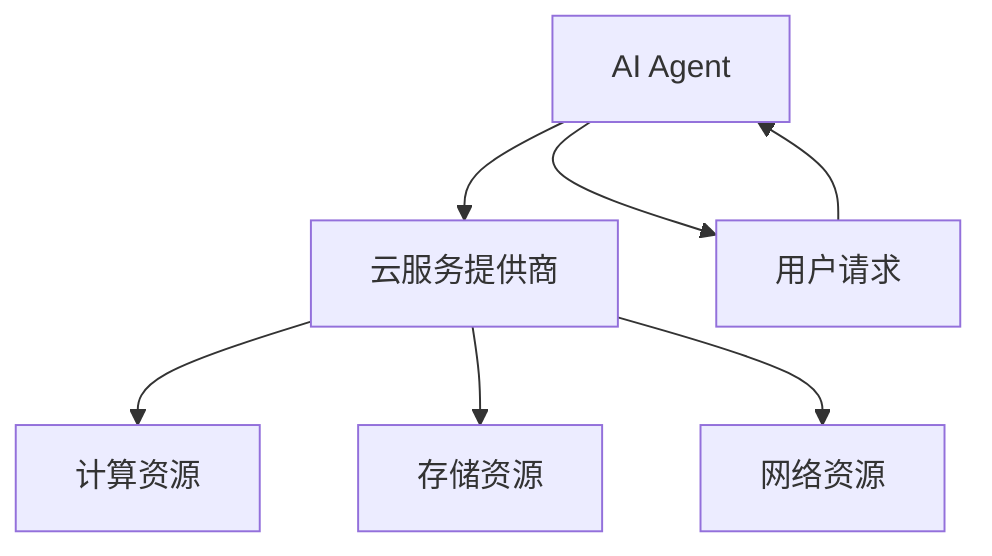
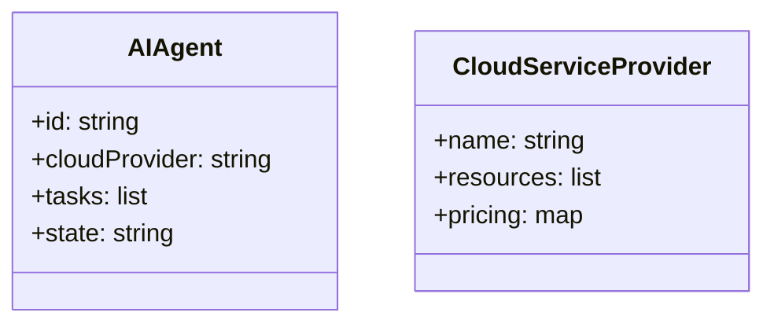
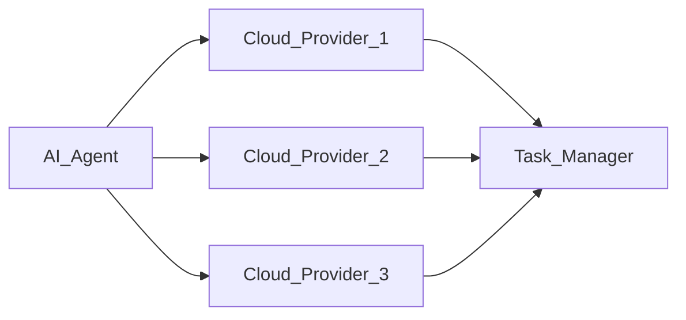
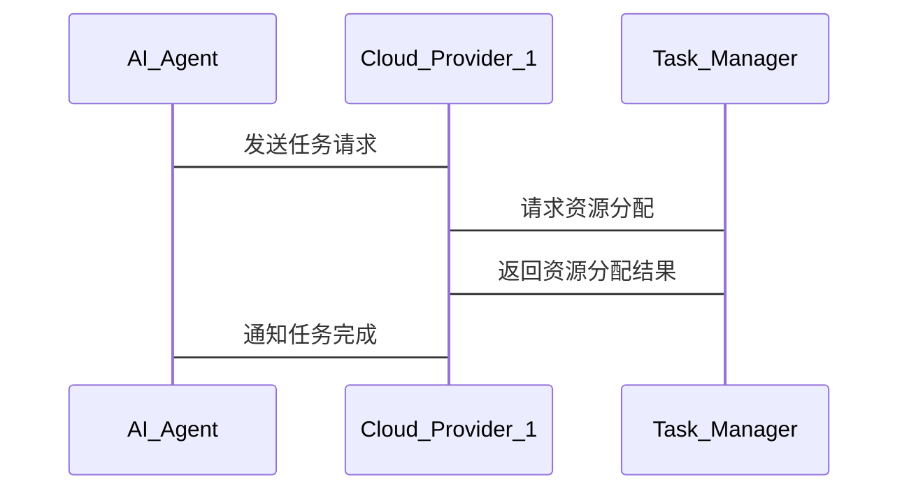

                 


# 企业AI Agent的多云部署策略

> 关键词：AI Agent, 多云部署, 资源调度, 负载均衡, 云计算

> 摘要：随着企业对AI Agent的需求不断增加，多云部署成为实现高效资源管理和灵活业务扩展的重要策略。本文从AI Agent的核心原理出发，分析其在多云环境中的部署策略，探讨任务分配算法、资源调度算法等关键技术，并结合实际案例，为企业AI Agent的多云部署提供系统的解决方案和最佳实践。

---

## 第1章: 企业AI Agent与多云部署背景

### 1.1 AI Agent的基本概念

#### 1.1.1 AI Agent的定义与核心功能
AI Agent（人工智能代理）是一种能够感知环境、自主决策并执行任务的智能体。其核心功能包括：
1. **感知**：通过传感器或API获取环境信息。
2. **决策**：基于感知信息，运用AI算法做出决策。
3. **执行**：通过执行器或API调用完成任务。

AI Agent可以应用于企业内部的自动化运维、智能客服、供应链优化等领域。

#### 1.1.2 AI Agent在企业中的应用场景
- **自动化运维**：监控系统状态，自动修复故障。
- **智能客服**：通过自然语言处理为用户提供个性化服务。
- **供应链优化**：预测需求，优化库存管理。

#### 1.1.3 企业AI Agent的演进历程
从最初的单一功能代理，到现在的多智能体协作，AI Agent逐渐向着智能化、分布式方向发展。

### 1.2 多云部署的背景与挑战

#### 1.2.1 多云部署的定义与特点
多云部署是指企业同时使用多个云服务提供商（如AWS、Azure、阿里云等）来构建分布式系统。其特点包括：
1. **资源弹性扩展**：可以根据业务需求灵活调整资源。
2. **高可用性**：通过多云架构降低单点故障风险。
3. **成本优化**：通过竞争选择最优的云服务提供商。

#### 1.2.2 企业采用多云部署的驱动力
1. **避免vendor lock-in**：减少对单一云服务提供商的依赖。
2. **优化成本**：通过多地多云策略降低运营成本。
3. **提升性能**：根据不同业务需求选择最优云服务。

#### 1.2.3 多云部署的主要挑战
1. **资源调度复杂性**：跨云资源调度需要解决异构环境下的兼容性问题。
2. **网络延迟**：多云部署可能导致网络时延增加。
3. **安全性与合规性**：跨云数据传输和存储需要符合企业安全策略和法律法规。

### 1.3 企业AI Agent多云部署的必要性

#### 1.3.1 提高系统的可用性与容灾能力
通过多云部署，AI Agent可以在一个云服务提供商故障时切换到另一个提供商，确保服务不中断。

#### 1.3.2 优化资源利用与成本控制
通过动态分配计算资源，可以在业务高峰期充分利用云资源，而在低谷期释放闲置资源。

#### 1.3.3 支持全球化业务的扩展需求
多云部署可以支持企业在不同地区部署AI Agent，满足全球化业务的实时响应需求。

---

## 第2章: 企业AI Agent多云部署的核心概念与联系

### 2.1 AI Agent的核心原理

#### 2.1.1 AI Agent的感知与决策机制
AI Agent通过感知环境信息，结合预设的目标和约束条件，运用算法（如强化学习、遗传算法等）做出决策。

#### 2.1.2 AI Agent的交互与执行流程
AI Agent接收用户请求，解析需求，调用相关服务完成任务，并将结果反馈给用户。

#### 2.1.3 AI Agent的自适应能力
AI Agent能够根据环境变化动态调整自身的行为策略，例如在负载增加时自动扩展资源。

### 2.2 多云环境下的资源分配与调度

#### 2.2.1 多云环境的资源特点
多云环境中的资源包括计算资源（CPU、GPU）、存储资源（云存储、数据库）和网络资源（带宽、API网关）。

#### 2.2.2 跨云资源调度的复杂性
跨云资源调度需要考虑不同云服务提供商的资源定价、响应时间、服务质量等因素。

#### 2.2.3 资源分配的优化策略
通过负载均衡算法（如轮询、随机、加权）和资源定价模型，优化跨云资源的分配。

### 2.3 AI Agent与多云环境的实体关系图



---

## 第3章: 企业AI Agent多云部署的算法原理

### 3.1 任务分配算法

#### 3.1.1 分布式任务分配的基本原理
任务分配算法的目标是将AI Agent的任务合理分配到多个云服务提供商，以最大化资源利用率和任务完成效率。

#### 3.1.2 基于负载均衡的任务分配算法
使用负载均衡算法（如轮询、随机、加权）将任务分配到负载较低的云服务提供商。

#### 3.1.3 基于优先级的任务分配策略
根据任务的优先级（如紧急任务、普通任务）动态调整资源分配策略。

### 3.2 资源调度算法

#### 3.2.1 跨云资源调度的数学模型
资源调度模型可以表示为：
$$
\min \sum_{i=1}^{n} c_i \cdot x_i
$$
其中，$c_i$是云服务提供商i的资源成本，$x_i$是分配给云服务提供商i的任务数量。

#### 3.2.2 基于遗传算法的资源优化
通过遗传算法（GA）优化资源分配，例如：
1. 初始化种群。
2. 计算适应度。
3. 选择、交叉、变异。
4. 保留最优解。

#### 3.2.3 基于动态规划的资源分配
动态规划算法可以将问题分解为子问题，逐步优化资源分配。

### 3.3 优化策略与实际应用

#### 3.3.1 负载均衡算法的优化
通过引入自适应权重调整机制，提高负载均衡的效率。

#### 3.3.2 资源定价模型的应用
根据各云服务提供商的价格、性能指标，动态选择最优资源。

---

## 第4章: 企业AI Agent多云部署的系统分析与架构设计

### 4.1 系统功能设计

#### 4.1.1 领域模型设计


#### 4.1.2 系统架构设计


#### 4.1.3 接口设计与交互流程
通过API接口实现AI Agent与云服务提供商之间的通信，例如：
1. AI Agent向云服务提供商发送任务请求。
2. 云服务提供商返回资源分配结果。
3. AI Agent调用相应资源完成任务。

### 4.2 系统交互设计

#### 4.2.1 系统交互流程


#### 4.2.2 系统交互中的关键点
1. **任务请求处理**：AI Agent接收用户请求并解析需求。
2. **资源分配决策**：Task_Manager根据资源可用性和成本模型做出决策。
3. **任务执行与反馈**：AI Agent调用资源完成任务，并将结果反馈给用户。

---

## 第5章: 企业AI Agent多云部署的项目实战

### 5.1 环境安装与配置

#### 5.1.1 系统环境要求
- 操作系统：Linux（推荐）或Windows。
- 开发工具：Python、Jupyter Notebook。
- 云服务提供商：AWS、Azure、阿里云。

#### 5.1.2 安装依赖库
安装必要的Python库，如：
```bash
pip install boto3 requests numpy
```

### 5.2 系统核心实现

#### 5.2.1 AI Agent的实现
```python
class AIAgent:
    def __init__(self, cloud_providers):
        self.cloud_providers = cloud_providers

    def dispatch_task(self, task):
        # 负载均衡算法：轮询调度
        selected_provider = self.cloud_providers[len(self.cloud_providers) // 2]
        return selected_provider.handle_task(task)
```

#### 5.2.2 资源调度算法的实现
```python
import random

class ResourceAllocator:
    def __init__(self, providers):
        self.providers = providers

    def allocate(self, task):
        # 随机选择一个云服务提供商
        selected_provider = random.choice(self.providers)
        return selected_provider
```

### 5.3 代码实现与解读

#### 5.3.1 代码实现
```python
class CloudServiceProvider:
    def __init__(self, name, capacity, cost):
        self.name = name
        self.capacity = capacity
        self.cost = cost

    def handle_task(self, task):
        # 返回任务处理结果
        return f"{self.name} 完成任务：{task}"
```

#### 5.3.2 代码解读
1. **CloudServiceProvider**：定义云服务提供商的基本属性和方法。
2. **AIAgent**：AI Agent类，负责任务的分发和调度。
3. **ResourceAllocator**：资源分配算法，可以选择不同的调度策略。

### 5.4 实际案例分析

#### 5.4.1 案例背景
某企业需要在AWS、Azure、阿里云之间部署AI Agent，实现任务的自动分发和资源优化。

#### 5.4.2 案例实现步骤
1. 初始化云服务提供商。
2. 定义AI Agent的任务分发逻辑。
3. 使用资源分配算法动态调整任务分配。

#### 5.4.3 实验结果与分析
通过实验可以发现，基于负载均衡的多云部署策略能够有效提高系统的可用性和资源利用率。

---

## 第6章: 企业AI Agent多云部署的最佳实践

### 6.1 最佳实践

#### 6.1.1 系统设计原则
1. **模块化设计**：确保各模块独立可扩展。
2. **容错设计**：实现故障自愈和日志监控。
3. **安全设计**：确保数据传输和存储的安全性。

#### 6.1.2 系统优化建议
1. **动态调整策略**：根据业务需求动态优化资源分配。
2. **监控与反馈**：实时监控系统性能，及时调整部署策略。

### 6.2 小结与总结

企业AI Agent的多云部署通过合理分配资源和优化任务调度，能够显著提高系统的性能和可用性。本文从算法原理到系统设计，为企业提供了完整的解决方案。

### 6.3 注意事项

1. **数据一致性**：确保多云部署下的数据一致性。
2. **网络延迟**：需要考虑网络时延对系统性能的影响。
3. **合规性**：遵守相关法律法规，确保数据存储和传输的合法性。

### 6.4 拓展阅读

- 《多云环境下的人工智能应用》
- 《云计算与分布式系统》
- 《AI Agent的算法优化》

---

## 参考文献

1. [文献1]：《企业AI Agent的设计与实现》
2. [文献2]：《多云环境下的资源调度算法研究》
3. [文献3]：《云计算与分布式系统》

---

通过以上分析和实现，企业可以更好地理解和实施AI Agent的多云部署策略，从而在复杂的多云环境中实现高效的资源管理和灵活的业务扩展。

