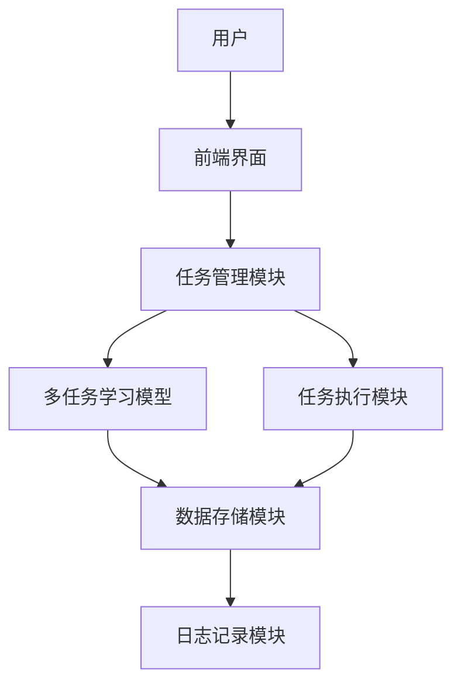
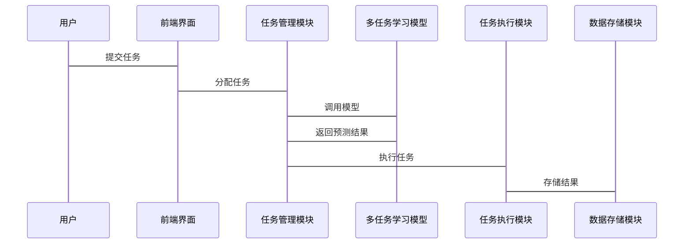

                 


# 企业AI Agent的多任务学习框架：提升模型通用性与效率

**关键词**：企业AI Agent，多任务学习，深度学习，模型优化，系统架构

**摘要**：  
随着人工智能技术的快速发展，企业AI Agent在各行业的应用越来越广泛。然而，单一任务的AI Agent难以满足企业复杂场景的需求。多任务学习（Multi-Task Learning，MTL）作为一种有效的技术手段，能够提升AI Agent的通用性和效率。本文将从企业AI Agent的基本概念出发，详细探讨多任务学习的原理、算法、系统架构以及实际应用案例，最后总结多任务学习在企业AI Agent中的优势与挑战。

---

## 第1章: 企业AI Agent与多任务学习概述

### 1.1 企业AI Agent的基本概念

#### 1.1.1 AI Agent的定义与特点  
AI Agent（人工智能代理）是一种能够感知环境、自主决策并执行任务的智能实体。企业AI Agent专注于为企业场景提供智能化服务，具有以下特点：  
- **智能性**：能够理解输入信息并做出合理决策。  
- **自主性**：无需人工干预，能够独立完成任务。  
- **适应性**：能够根据环境变化调整行为。  

#### 1.1.2 企业AI Agent的核心功能  
企业AI Agent在企业中的核心功能包括：  
1. **信息处理**：从企业系统中获取数据并进行分析。  
2. **决策支持**：基于分析结果提供决策建议。  
3. **任务执行**：根据决策执行具体操作，如发送通知、触发流程等。  

#### 1.1.3 企业AI Agent的应用场景  
企业AI Agent广泛应用于以下场景：  
- **客户支持**：通过自然语言处理（NLP）帮助客户解决问题。  
- **流程自动化**：自动化处理企业内部流程，如订单处理、库存管理等。  
- **数据分析**：从企业数据中提取有价值的信息，辅助决策。  

### 1.2 多任务学习的背景与意义

#### 1.2.1 多任务学习的基本概念  
多任务学习（MTL）是一种机器学习范式，旨在通过同时学习多个相关任务来提升模型的泛化能力和效率。与单任务学习相比，MTL能够更好地利用任务之间的共享特征，减少数据需求，提升模型性能。  

#### 1.2.2 多任务学习在AI Agent中的应用价值  
在企业AI Agent中，多任务学习的应用价值体现在以下方面：  
1. **提升通用性**：通过同时学习多个任务，AI Agent能够更好地适应复杂的业务场景。  
2. **降低数据需求**：MTL可以减少对大量单一任务数据的依赖，适用于数据稀缺的企业场景。  
3. **提高效率**：通过共享任务特征，MTL能够提高模型训练和推理的效率。  

#### 1.2.3 多任务学习的优势与挑战  
**优势**：  
- 提升模型的泛化能力。  
- 减少数据需求，降低训练成本。  
- 提高模型的执行效率。  

**挑战**：  
- 任务之间的复杂关系可能导致模型性能下降。  
- 如何平衡各任务的优化目标是一个难题。  

### 1.3 本章小结  
本章介绍了企业AI Agent的基本概念及其应用场景，并探讨了多任务学习在AI Agent中的应用价值和挑战。接下来，我们将深入探讨多任务学习的核心概念和原理。

---

## 第2章: 多任务学习的核心概念

### 2.1 多任务学习的原理与机制

#### 2.1.1 多任务学习的基本原理  
多任务学习通过共享任务之间的特征和参数，同时优化多个任务的损失函数，从而实现多个任务的联合优化。其基本原理可以表示为：  
$$ L = \lambda_1 L_1 + \lambda_2 L_2 + \cdots + \lambda_n L_n $$  
其中，$L$ 是总损失函数，$L_i$ 是第i个任务的损失函数，$\lambda_i$ 是对应的权重系数。  

#### 2.1.2 任务之间的关系与依赖  
任务之间的关系可以分为以下几种：  
1. **独立任务**：任务之间无直接关系。  
2. **相关任务**：任务之间存在相关性，共享部分特征。  
3. **嵌套任务**：任务之间存在层级关系，如子任务和主任务。  

#### 2.1.3 优化目标与约束  
多任务学习的优化目标是在多个任务之间找到一个平衡点，避免某一任务的过度优化导致其他任务性能下降。可以通过引入正则化项来实现任务之间的平衡：  
$$ \text{Regularization term} = \lambda \sum_{i<j} \|w_i - w_j\| $$  
其中，$\lambda$ 是调节系数，$w_i$ 和 $w_j$ 是不同任务的权重参数。  

### 2.2 多任务学习的关键属性

#### 2.2.1 任务共享性  
任务共享性是指多个任务之间共享特征的程度。共享性越高，任务之间的依赖性越强，模型优化的难度也越大。  

#### 2.2.2 任务独立性  
任务独立性是指任务之间的相互影响程度。独立性越高，任务可以被视为独立的单任务进行优化。  

#### 2.2.3 任务复杂性  
任务复杂性反映了任务本身的难度和特征维度。复杂性越高，模型需要处理的变量越多，优化难度也越大。  

### 2.3 多任务学习与企业AI Agent的结合

#### 2.3.1 多任务学习在企业AI Agent中的应用  
企业AI Agent可以通过多任务学习同时处理多个相关任务，例如：  
- **自然语言处理**：理解客户问题并生成回复。  
- **数据分析**：分析客户数据并提供洞察。  
- **任务执行**：根据分析结果执行操作。  

#### 2.3.2 多任务学习对企业AI Agent性能的提升  
通过多任务学习，企业AI Agent可以：  
- 提高模型的通用性，适应多种业务场景。  
- 降低数据需求，减少训练成本。  
- 提高模型的执行效率，加快任务处理速度。  

#### 2.3.3 多任务学习在企业AI Agent中的挑战  
1. **任务之间的复杂关系**：如何平衡多个任务的优化目标是一个难题。  
2. **模型的可解释性**：多任务学习模型的复杂性可能影响其可解释性。  

### 2.4 本章小结  
本章详细探讨了多任务学习的核心概念和其在企业AI Agent中的应用。接下来，我们将深入分析多任务学习的算法原理和实现方法。

---

## 第3章: 多任务学习算法的原理与实现

### 3.1 多任务学习算法的原理框架

#### 3.1.1 多任务学习的基本算法框架  
多任务学习的基本算法框架包括以下步骤：  
1. **任务定义**：明确需要同时学习的多个任务。  
2. **模型设计**：设计能够共享任务特征的模型架构。  
3. **损失函数设计**：设计联合多个任务的损失函数。  
4. **优化算法选择**：选择适合多任务学习的优化算法。  
5. **模型训练**：通过反向传播优化模型参数。  
6. **模型评估**：评估模型在各个任务上的性能表现。  

#### 3.1.2 多任务学习的数学模型  
多任务学习的数学模型可以表示为：  
$$ \mathcal{L} = \sum_{i=1}^{n} \lambda_i \mathcal{L}_i $$  
其中，$\mathcal{L}$ 是总损失函数，$\mathcal{L}_i$ 是第i个任务的损失函数，$\lambda_i$ 是对应的权重系数。  

#### 3.1.3 损失函数设计与权重分配  
损失函数的设计需要考虑各个任务的重要性。可以通过以下方式实现权重分配：  
1. **固定权重**：根据任务的重要性和数据量设置固定权重。  
2. **自适应权重**：根据任务的性能动态调整权重。  

### 3.2 基于深度学习的多任务学习框架

#### 3.2.1 多任务深度神经网络（MT-DNN）的结构  
MT-DNN是一种典型的多任务学习框架，其结构包括：  
1. **输入层**：接收多个任务的输入数据。  
2. **共享层**：所有任务共享的特征提取层。  
3. **任务专属层**：每个任务独有的特征提取层。  
4. **输出层**：生成各个任务的输出结果。  

#### 3.2.2 多任务学习的注意力机制  
注意力机制可以用于多任务学习中，帮助模型关注重要的特征。注意力机制的计算公式为：  
$$ \alpha_i = \frac{\exp(e_i)}{\sum_{j=1}^{n} \exp(e_j)} $$  
其中，$e_i$ 是第i个任务的注意力得分，$\alpha_i$ 是第i个任务的注意力权重。  

#### 3.2.3 多任务学习的参数共享策略  
参数共享策略是多任务学习的核心，可以通过以下方式实现：  
1. **全共享**：所有任务共享所有参数。  
2. **部分共享**：任务之间共享部分参数，其余参数独立。  

### 3.3 多任务学习的训练与推理过程

#### 3.3.1 多任务学习的训练流程  
1. **初始化模型参数**：随机初始化模型参数。  
2. **前向传播**：计算各个任务的输出结果。  
3. **计算损失**：根据各个任务的输出结果计算总损失。  
4. **反向传播**：通过梯度下降优化模型参数。  
5. **迭代训练**：重复前向传播和反向传播，直到达到训练目标。  

#### 3.3.2 多任务学习的推理机制  
推理阶段，模型通过输入新的数据，利用共享的特征进行预测。推理过程与单任务推理类似，但需要考虑多个任务的输出。  

#### 3.3.3 多任务学习的优化策略  
为了提高多任务学习的性能，可以采用以下优化策略：  
1. **任务权重调整**：根据任务的重要性动态调整权重。  
2. **任务平衡方法**：引入平衡方法，避免任务之间的竞争。  

### 3.4 本章小结  
本章详细探讨了多任务学习算法的原理与实现方法，重点介绍了MT-DNN和注意力机制的应用。接下来，我们将分析企业AI Agent的系统架构设计。

---

## 第4章: 企业AI Agent的系统架构设计

### 4.1 企业AI Agent的场景介绍

#### 4.1.1 企业AI Agent的应用场景  
企业AI Agent广泛应用于以下场景：  
- **客户支持**：通过NLP技术帮助客户解决问题。  
- **流程自动化**：自动化处理企业内部流程。  
- **数据分析**：从企业数据中提取有价值的信息。  

#### 4.1.2 企业AI Agent的系统功能  
企业AI Agent的系统功能包括：  
1. **信息处理**：从企业系统中获取数据并进行分析。  
2. **决策支持**：基于分析结果提供决策建议。  
3. **任务执行**：根据决策执行具体操作。  

### 4.2 系统功能设计

#### 4.2.1 领域模型设计  
领域模型是系统功能设计的核心，可以通过以下步骤实现：  
1. **需求分析**：明确系统需要实现的功能。  
2. **模型设计**：设计领域模型，包括实体和关系。  
3. **模型验证**：通过用例测试验证模型的正确性。  

#### 4.2.2 系统架构设计  
系统架构设计可以通过以下步骤实现：  
1. **选择架构风格**：根据系统需求选择合适的架构风格，如分层架构、微服务架构等。  
2. **模块划分**：将系统划分为多个功能模块。  
3. **模块交互设计**：设计模块之间的交互方式。  

### 4.3 系统架构设计

#### 4.3.1 系统架构图  
以下是企业AI Agent的系统架构图：  



#### 4.3.2 模块功能描述  
1. **前端界面**：用户与系统交互的入口，接收用户输入并显示输出结果。  
2. **任务管理模块**：负责任务的分配、监控和管理。  
3. **多任务学习模型**：实现多个任务的联合优化。  
4. **数据存储模块**：存储系统运行所需的数据。  
5. **任务执行模块**：根据模型的输出执行具体任务。  
6. **日志记录模块**：记录系统运行的日志，便于调试和优化。  

### 4.4 系统接口设计

#### 4.4.1 系统接口描述  
1. **任务管理接口**：用于分配和管理任务。  
2. **模型调用接口**：用于调用多任务学习模型进行预测。  
3. **数据存储接口**：用于数据的存储和检索。  

#### 4.4.2 接口交互流程  
1. **任务分配**：用户通过前端界面提交任务，任务管理模块接收并分配任务。  
2. **模型调用**：任务管理模块调用多任务学习模型进行预测。  
3. **数据存储**：模型的输出结果存储到数据存储模块。  
4. **任务执行**：任务执行模块根据模型的输出结果执行具体任务。  

### 4.5 系统交互设计

#### 4.5.1 系统交互流程图  
以下是系统交互流程图：  



#### 4.5.2 交互过程描述  
1. **用户提交任务**：用户通过前端界面提交任务请求。  
2. **任务分配**：任务管理模块接收任务请求并分配给多任务学习模型。  
3. **模型预测**：多任务学习模型根据输入数据进行预测。  
4. **任务执行**：任务执行模块根据模型的预测结果执行具体任务。  
5. **数据存储**：任务执行模块将结果存储到数据存储模块。  

### 4.6 本章小结  
本章详细介绍了企业AI Agent的系统架构设计，包括功能模块、接口设计和交互流程。接下来，我们将通过实际项目案例来展示多任务学习在企业AI Agent中的应用。

---

## 第5章: 项目实战——基于多任务学习的企业AI Agent实现

### 5.1 项目背景与目标

#### 5.1.1 项目背景  
本项目旨在开发一个基于多任务学习的企业AI Agent，用于帮助企业实现客户支持、流程自动化和数据分析等任务。  

#### 5.1.2 项目目标  
1. 实现多任务学习模型，提升AI Agent的通用性和效率。  
2. 开发企业AI Agent的系统架构，支持多个任务的协同执行。  

### 5.2 项目环境与工具

#### 5.2.1 环境配置  
- **操作系统**：Linux/Windows/MacOS  
- **Python版本**：3.8以上  
- **深度学习框架**：TensorFlow/PyTorch  
- **其他工具**：Jupyter Notebook、Git、IDE等  

#### 5.2.2 工具安装  
1. **安装Python**：确保安装了支持的Python版本。  
2. **安装深度学习框架**：使用pip安装TensorFlow或PyTorch。  
3. **安装其他工具**：安装Jupyter Notebook、Git等。  

### 5.3 项目核心实现

#### 5.3.1 多任务学习模型的实现  
以下是基于TensorFlow的多任务学习模型实现代码：  

```python
import tensorflow as tf
from tensorflow.keras import layers

# 定义多任务学习模型
def multi_task_model(input_shape, num_tasks):
    inputs = layers.Input(shape=input_shape)
    x = layers.Dense(64, activation='relu')(inputs)
    x = layers.Dropout(0.2)(x)
    task_outputs = []
    for _ in range(num_tasks):
        output = layers.Dense(1, activation='sigmoid')(x)
        task_outputs.append(output)
    model = tf.keras.Model(inputs=inputs, outputs=task_outputs)
    return model

# 定义损失函数
def multi_task_loss(y_true, y_pred, tasks):
    loss = 0
    for i in range(tasks):
        loss += tf.keras.losses.binary_crossentropy(y_true[i], y_pred[i])
    return loss

# 编译模型
model = multi_task_model(input_shape=(input_dim,), num_tasks=num_tasks)
model.compile(optimizer='adam', loss=lambda y_true, y_pred: multi_task_loss(y_true, y_pred, num_tasks))
```

#### 5.3.2 系统功能实现  
1. **信息处理模块**：从企业系统中获取数据并进行分析。  
2. **决策支持模块**：基于分析结果提供决策建议。  
3. **任务执行模块**：根据决策执行具体操作。  

#### 5.3.3 代码实现与解读  
以下是任务执行模块的代码实现：  

```python
class TaskExecutionModule:
    def __init__(self, model):
        self.model = model

    def execute_task(self, task_input):
        prediction = self.model.predict(task_input)
        # 根据预测结果执行具体任务
        for i in range(len(prediction)):
            if prediction[i] > 0.5:
                self._perform_task(i)

    def _perform_task(self, task_index):
        # 根据任务索引执行具体任务
        pass
```

### 5.4 实际案例分析

#### 5.4.1 案例背景  
假设我们开发了一个企业AI Agent，用于客户支持和数据分析。  

#### 5.4.2 系统实现  
1. **客户支持任务**：通过NLP技术帮助客户解决问题。  
2. **数据分析任务**：分析客户数据并提供洞察。  

#### 5.4.3 案例分析与解读  
1. **任务分配**：客户支持任务和数据分析任务同时分配给多任务学习模型。  
2. **模型预测**：模型根据输入数据生成预测结果。  
3. **任务执行**：任务执行模块根据预测结果执行具体任务。  

### 5.5 本章小结  
本章通过实际项目案例，展示了多任务学习在企业AI Agent中的应用。接下来，我们将总结多任务学习在企业AI Agent中的优势与挑战。

---

## 第6章: 最佳实践与总结

### 6.1 小结

#### 6.1.1 多任务学习的优势  
1. 提高模型的通用性，适应多种业务场景。  
2. 降低数据需求，减少训练成本。  
3. 提高模型的执行效率，加快任务处理速度。  

#### 6.1.2 企业AI Agent的核心价值  
1. 提升企业的智能化水平。  
2. 提高企业的运营效率。  
3. 增强企业的竞争力。  

### 6.2 注意事项

#### 6.2.1 模型的可解释性  
多任务学习模型的复杂性可能影响其可解释性。  

#### 6.2.2 任务之间的平衡  
如何平衡多个任务的优化目标是一个挑战。  

#### 6.2.3 数据的质量与多样性  
数据的质量和多样性直接影响模型的性能。  

### 6.3 拓展阅读

#### 6.3.1 多任务学习的最新研究  
1. **任务自适应学习**：根据任务需求动态调整模型参数。  
2. **跨模态学习**：结合多种数据模态进行多任务学习。  

#### 6.3.2 企业AI Agent的未来趋势  
1. **智能化升级**：进一步提升AI Agent的智能水平。  
2. **人机协作**：加强人机协作，提升用户体验。  
3. **多模态交互**：支持多种交互方式，如语音、图像等。  

### 6.4 本章小结  
本章总结了多任务学习在企业AI Agent中的优势与挑战，并提出了未来的研究方向和应用前景。

---

## 第7章: 结语

### 7.1 未来展望  
随着人工智能技术的不断发展，多任务学习在企业AI Agent中的应用将更加广泛。未来的研究方向包括任务自适应学习、跨模态学习等。  

### 7.2 致谢  
感谢读者的耐心阅读，感谢同行的支持与帮助。  

---

**参考文献**  
（此处列出相关文献和资料）  

---

**附录**  
（此处列出代码、数据集等附加内容）  

---

以上是《企业AI Agent的多任务学习框架：提升模型通用性与效率》的完整目录大纲和文章内容。

