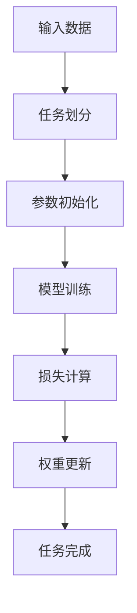
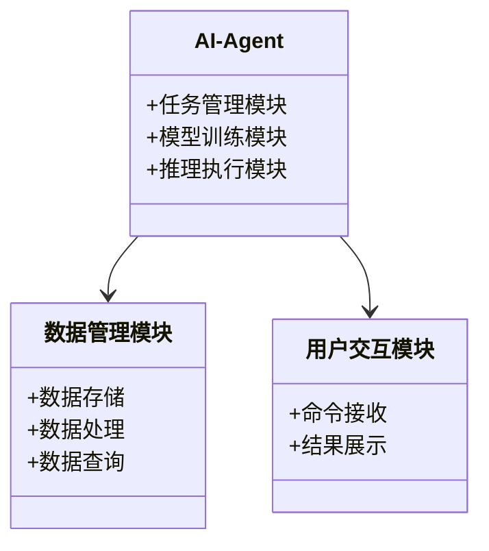
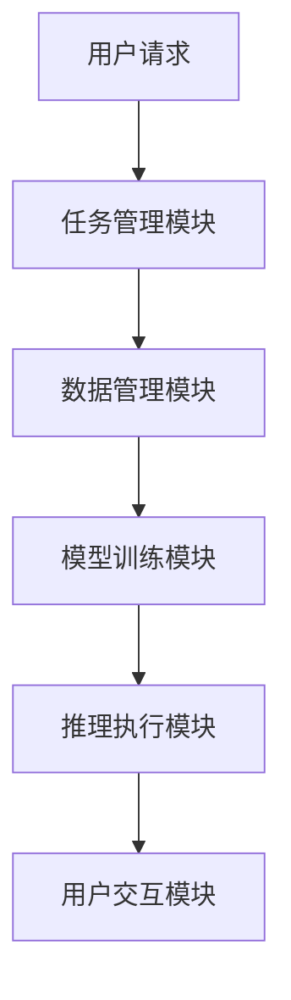
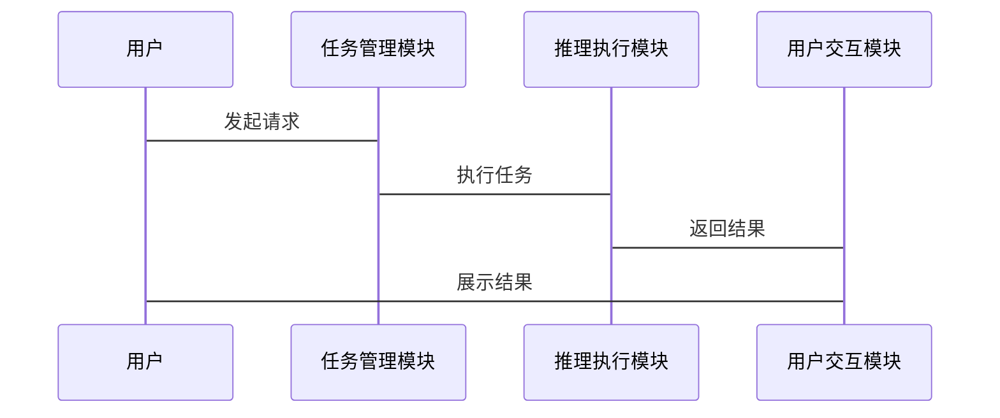

                 


# 企业AI Agent的多任务学习框架：提升模型通用性与迁移能力

## 关键词：企业AI Agent，多任务学习，模型通用性，迁移能力，机器学习，人工智能

## 摘要：本文深入探讨了企业AI Agent的多任务学习框架，分析了其在提升模型通用性和迁移能力方面的重要作用。通过系统地讲解多任务学习的原理、算法、系统架构及项目实战，本文旨在帮助读者全面理解并掌握如何在企业场景中应用多任务学习框架，以实现更高效的AI Agent系统。本文还提供了丰富的案例分析和实用建议，帮助读者在实际项目中有效实施多任务学习策略。

---

### 目录大纲

---

# 第一章：企业AI Agent与多任务学习框架概述

## 1.1 企业AI Agent的定义与特点

### 1.1.1 什么是企业AI Agent

### 1.1.2 企业AI Agent的核心特点

### 1.1.3 企业AI Agent与传统AI的区别

## 1.2 多任务学习框架的背景与意义

### 1.2.1 多任务学习的基本概念

### 1.2.2 为什么需要多任务学习框架

### 1.2.3 多任务学习在企业AI Agent中的应用价值

## 1.3 本章小结

---

# 第二章：多任务学习框架的核心概念

## 2.1 多任务学习框架的原理

### 2.1.1 多任务学习的基本原理

### 2.1.2 多任务学习与单任务学习的对比

### 2.1.3 多任务学习的优缺点

## 2.2 多任务学习框架的实现方式

### 2.2.1 参数共享

### 2.2.2 任务权重分配

### 2.2.3 任务间关系建模

## 2.3 企业AI Agent中的多任务学习应用

### 2.3.1 任务场景分析

### 2.3.2 任务间依赖关系

### 2.3.3 任务优先级与资源分配

## 2.4 本章小结

---

# 第三章：多任务学习框架的算法原理

## 3.1 多任务学习算法的数学模型与公式

### 3.1.1 损失函数的定义

$$
L_i = \frac{1}{n_i} \sum_{j=1}^{n_i} (y_{ij} - \hat{y}_{ij})^2
$$

其中，$L_i$ 表示第i个任务的损失，$n_i$ 表示该任务的样本数量，$y_{ij}$ 表示真实值，$\hat{y}_{ij}$ 表示预测值。

### 3.1.2 权重共享机制

$$
W = \{w_{jk}\}_{j=1}^m
$$

其中，$W$ 表示共享权重矩阵，$m$ 表示任务的数量。

### 3.1.3 任务权重分配策略

$$
\alpha_i = \frac{1}{1 + e^{-\beta t_i}}
$$

其中，$\alpha_i$ 表示任务i的权重，$\beta$ 是调节参数，$t_i$ 是任务i的难度指标。

## 3.2 多任务学习算法的实现流程

### 3.2.1 算法流程概述



### 3.2.2 具体实现步骤

1. 数据预处理与任务划分
2. 模型架构设计与参数初始化
3. 模型训练与损失计算
4. 权重更新与任务优化

## 3.3 本章小结

---

# 第四章：企业AI Agent的系统架构设计

## 4.1 系统架构概述

### 4.1.1 系统功能模块划分



### 4.1.2 系统架构图



## 4.2 系统接口与交互流程

### 4.2.1 系统接口设计

1. API接口定义
2. 接口调用流程
3. 接口返回格式

### 4.2.2 交互流程图



## 4.3 本章小结

---

# 第五章：多任务学习框架的项目实战

## 5.1 项目背景与目标

### 5.1.1 项目背景

### 5.1.2 项目目标

### 5.1.3 项目范围

## 5.2 环境搭建与工具安装

### 5.2.1 开发环境配置

1. 安装Python
2. 安装深度学习框架（如TensorFlow、PyTorch）
3. 安装Numpy、Pandas等数据处理库
4. 安装Mermaid工具

### 5.2.2 工具安装与配置

1. 安装Jupyter Notebook
2. 安装Git用于版本控制
3. 配置开发环境（如VS Code）

## 5.3 核心代码实现

### 5.3.1 数据预处理代码

```python
import numpy as np
import pandas as pd

# 加载数据
data = pd.read_csv('data.csv')

# 数据清洗
data = data.dropna()
data = data[~data.duplicated()]

# 数据分割
train_data, test_data = train_test_split(data, test_size=0.2)
```

### 5.3.2 模型训练代码

```python
import tensorflow as tf
from tensorflow.keras import layers

# 定义模型
model = tf.keras.Sequential([
    layers.Dense(64, activation='relu'),
    layers.Dense(1, activation='sigmoid')
])

# 编译模型
model.compile(optimizer='adam', loss='binary_crossentropy', metrics=['accuracy'])

# 训练模型
model.fit(train_data, train_labels, epochs=10, batch_size=32)
```

### 5.3.3 代码解读与分析

1. 数据预处理部分：加载数据、清洗数据、分割数据集。
2. 模型训练部分：定义网络结构、编译模型、训练模型。

## 5.4 案例分析与详细讲解

### 5.4.1 案例背景

### 5.4.2 案例分析

### 5.4.3 实施步骤

1. 确定任务目标
2. 数据收集与处理
3. 模型选择与训练
4. 模型评估与优化

## 5.5 本章小结

---

# 第六章：最佳实践与注意事项

## 6.1 最佳实践

### 6.1.1 任务选择策略

1. 优先选择相关性强的任务
2. 避免选择过于复杂的任务组合
3. 定期评估任务效果

### 6.1.2 模型调优技巧

1. 调整学习率与批量大小
2. 优化损失函数
3. 增加数据增强

## 6.2 小结与注意事项

### 6.2.1 小结

### 6.2.2 注意事项

1. 任务选择需谨慎
2. 模型调优需结合实际场景
3. 数据质量和数量需保证

## 6.3 拓展阅读

### 6.3.1 推荐书籍

1. 《深度学习》——Ian Goodfellow
2. 《机器学习实战》——周志华

### 6.3.2 推荐博客与技术文章

1. [多任务学习综述](https://zhuanlan.zhihu.com/p/...)
2. [企业AI Agent的实践分享](https://zhuanlan.zhihu.com/p/...)

---

# 第七章：总结与展望

## 7.1 本章总结

### 7.1.1 核心内容回顾

### 7.1.2 关键点总结

### 7.1.3 实践经验总结

## 7.2 未来展望

### 7.2.1 多任务学习的发展趋势

### 7.2.2 企业AI Agent的未来方向

### 7.2.3 个人职业发展建议

## 7.3 结语

---

# 附录：参考资料与工具列表

## 附录A：常用工具与框架

### 附录A.1 深度学习框架

1. TensorFlow
2. PyTorch
3. Keras

### 附录A.2 数据处理工具

1. Pandas
2. NumPy
3. Matplotlib

## 附录B：数学公式汇总

### 附录B.1 损失函数公式

$$
L = \frac{1}{n} \sum_{i=1}^{n} (y_i - \hat{y}_i)^2
$$

### 附录B.2 权重更新公式

$$
\theta_{new} = \theta - \eta \cdot \nabla L
$$

其中，$\theta$ 表示当前权重，$\eta$ 表示学习率，$\nabla L$ 表示损失函数的梯度。

---

# 结束语

感谢您的耐心阅读！希望本文能为您提供有价值的信息与启发，助您在企业AI Agent的多任务学习框架领域取得成功！

