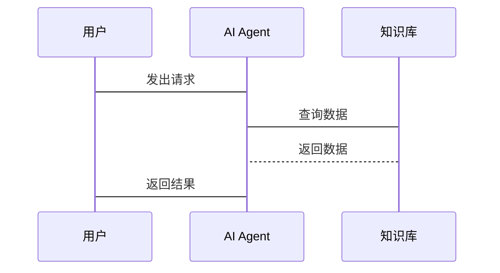
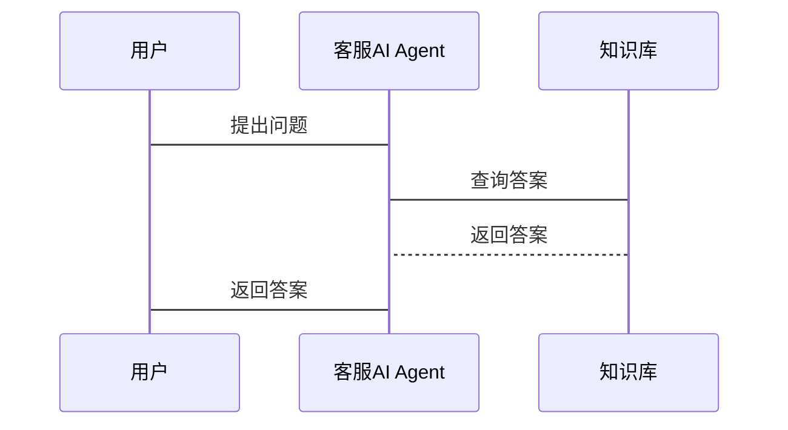

                 


# 企业AI Agent的多场景测试策略：模拟真实业务环境

> **关键词**: 人工智能, AI Agent, 多场景测试, 企业应用, 模拟测试, 测试策略

> **摘要**: 本文深入探讨了企业在应用AI Agent技术时面临的多场景测试挑战，并提出了一套系统化的测试策略。通过模拟真实业务环境，我们分析了AI Agent的核心概念、测试框架的设计、不同场景下的测试方法以及实际案例的应用。本文还结合了算法原理和系统架构设计，提供了具体的实现细节和优化建议，旨在帮助企业更好地部署和优化AI Agent系统。

---

## 第1章: 企业AI Agent的背景与概念

### 1.1 人工智能与AI Agent的基本概念

人工智能（Artificial Intelligence, AI）作为计算机科学的核心领域之一，近年来取得了飞速发展。AI Agent（智能体）作为人工智能技术的重要组成部分，是一种能够感知环境并采取行动以实现目标的实体。AI Agent可以是软件程序、机器人或其他智能设备，其核心目标是通过智能决策和自主行动来优化业务流程或提供服务。

#### 1.1.1 AI Agent的核心特征

- **自主性**: AI Agent能够自主决策，无需人工干预。
- **反应性**: 能够实时感知环境变化并做出反应。
- **目标导向**: 通过目标驱动行动，优化决策过程。
- **学习能力**: 可以通过数据和经验不断优化自身的性能。

#### 1.1.2 企业AI Agent的应用场景

AI Agent在企业中的应用场景非常广泛，例如：

- **客服机器人**: 提供24/7的客户支持服务。
- **智能助手**: 帮助员工高效处理日常任务。
- **供应链管理**: 实时监控库存并优化物流流程。
- **风险预警系统**: 通过数据分析提前识别潜在风险。

### 1.2 企业AI Agent的测试需求与挑战

AI Agent的应用场景复杂多变，测试需求也随之多样化。以下是企业在测试AI Agent时面临的几个主要挑战：

- **多场景覆盖**: 需要覆盖多种业务场景，确保AI Agent在各种情况下都能正常运行。
- **数据依赖性**: AI Agent的决策高度依赖数据质量，测试过程中需要模拟真实业务环境中的数据。
- **动态适应性**: AI Agent需要能够动态调整策略，测试需要模拟动态变化的环境。

---

## 第2章: AI Agent的核心概念与原理

### 2.1 AI Agent的组成与结构

AI Agent的结构通常包括以下几个部分：

1. **知识库**: 包含AI Agent所需的所有数据和规则。
2. **感知模块**: 负责获取环境中的信息。
3. **推理引擎**: 根据感知的信息进行逻辑推理和决策。
4. **执行模块**: 根据决策结果执行具体操作。
5. **反馈机制**: 收集执行结果并反馈给推理引擎以优化决策。

#### 2.1.1 实体关系图（ER图）设计

以下是AI Agent系统的实体关系图：

```mermaid
er
    actor: 用户
    agent: AI Agent
    knowledge_base: 知识库
    action: 行动
    feedback: 反馈

    用户 --> 知识库: 查询
    用户 --> AI Agent: 请求
    AI Agent --> 知识库: 访问数据
    AI Agent --> 推理引擎: 进行推理
    推理引擎 --> 行动: 执行决策
    行动 --> 反馈: 收集结果
    反馈 --> AI Agent: 优化决策
```

### 2.2 AI Agent的测试框架

#### 2.2.1 测试目标与指标

AI Agent的测试目标通常包括以下几点：

- **功能测试**: 确保AI Agent能够按照设计要求完成任务。
- **性能测试**: 测量AI Agent在高负载下的表现。
- **安全性测试**: 确保AI Agent的安全性和数据隐私。

#### 2.2.2 测试用例设计原则

1. **全面覆盖**: 测试用例应覆盖所有可能的业务场景。
2. **优先级排序**: 根据业务需求和风险级别对测试用例进行优先级排序。
3. **可重复性**: 测试用例应具有可重复性，便于后续优化和调整。

#### 2.2.3 测试环境配置

测试环境应尽可能模拟真实业务环境，包括以下方面：

- **数据模拟**: 创建真实业务环境中可能遇到的数据。
- **场景模拟**: 模拟多种业务场景，包括正常场景和异常场景。
- **性能压力**: 在高负载下测试AI Agent的性能表现。

---

## 第3章: 多场景测试策略的设计与实施

### 3.1 测试场景的分类与选择

AI Agent的测试场景可以分为以下几类：

1. **功能测试场景**: 测试AI Agent的基本功能是否正常。
2. **性能测试场景**: 测试AI Agent在高负载下的表现。
3. **安全测试场景**: 测试AI Agent的安全性和数据隐私。

#### 3.1.1 业务流程测试场景

业务流程测试场景是AI Agent测试中的重要部分。以下是业务流程测试的示例：



### 3.2 测试用例的设计方法

#### 3.2.1 基于场景的测试用例设计

基于场景的测试用例设计需要考虑以下几点：

1. **场景描述**: 明确测试场景的背景和目标。
2. **输入数据**: 定义测试用例的输入数据。
3. **预期结果**: 明确测试用例的预期输出结果。

#### 3.2.2 基于边界条件的测试用例设计

边界条件测试用例的设计需要考虑以下几点：

1. **输入边界**: 测试输入的边界值。
2. **输出边界**: 测试输出的边界值。
3. **异常处理**: 测试异常情况下的处理逻辑。

### 3.3 测试执行与结果分析

#### 3.3.1 测试执行的流程与方法

测试执行的流程通常包括以下步骤：

1. **测试准备**: 确保测试环境和测试用例准备完毕。
2. **测试执行**: 根据测试用例执行测试。
3. **结果收集**: 收集测试结果并进行分析。

#### 3.3.2 测试结果的分析与优化

测试结果分析的关键点包括：

1. **错误定位**: 确定测试失败的原因。
2. **问题修复**: 根据测试结果优化AI Agent的性能和逻辑。
3. **持续改进**: 根据测试结果不断优化测试策略和AI Agent的性能。

---

## 第4章: AI Agent的测试框架与工具

### 4.1 测试框架的设计与实现

#### 4.1.1 测试框架的总体架构

测试框架的总体架构通常包括以下部分：

1. **测试用例管理**: 管理和组织测试用例。
2. **测试执行引擎**: 执行测试用例并收集结果。
3. **结果分析模块**: 分析测试结果并生成报告。

#### 4.1.2 测试模块的划分与实现

测试模块的划分需要考虑以下几点：

1. **功能测试模块**: 测试AI Agent的基本功能。
2. **性能测试模块**: 测试AI Agent的性能表现。
3. **安全测试模块**: 测试AI Agent的安全性和数据隐私。

### 4.2 测试工具的选择与使用

#### 4.2.1 测试工具的功能与特点

常用的AI Agent测试工具包括：

1. **Selenium**: 用于自动化测试。
2. **JMeter**: 用于性能测试。
3. **Postman**: 用于API测试。

#### 4.2.2 测试工具的安装与配置

安装和配置测试工具的具体步骤包括：

1. **下载与安装**: 根据需求选择合适的测试工具并完成安装。
2. **配置环境**: 设置测试环境变量和路径。
3. **安装依赖**: 安装测试工具所需的依赖库。

---

## 第5章: 企业AI Agent的测试案例分析

### 5.1 某企业AI Agent的测试案例

#### 5.1.1 测试背景与目标

以某企业的客服AI Agent为例，测试目标包括：

1. **功能测试**: 确保客服AI Agent能够正常处理客户请求。
2. **性能测试**: 测试在高并发情况下的表现。
3. **安全测试**: 确保客户数据的安全性。

#### 5.1.2 测试场景与用例设计

以下是客服AI Agent的测试场景设计：



### 5.2 测试案例的总结与启示

#### 5.2.1 测试过程中的问题与解决方案

1. **数据不足**: 测试数据不足导致测试结果不准确。解决方案是通过数据生成工具模拟更多数据。
2. **性能瓶颈**: 在高并发情况下出现性能瓶颈。解决方案是优化AI Agent的算法和增加服务器资源。

---

## 第6章: 企业AI Agent测试的最佳实践与未来展望

### 6.1 测试策略的优化与改进

#### 6.1.1 测试策略的动态调整

根据测试结果动态调整测试策略，包括：

1. **增加测试场景**: 根据新需求增加新的测试场景。
2. **优化测试用例**: 根据测试结果优化测试用例。
3. **提高测试效率**: 通过自动化测试提高测试效率。

#### 6.1.2 测试数据的管理和复用

1. **数据管理**: 建立测试数据管理系统，确保数据的安全和可追溯。
2. **数据复用**: 将测试数据复用于不同的测试场景中。

### 6.2 未来测试技术的发展

随着人工智能技术的不断发展，AI Agent的测试技术也将不断进步。未来，我们可以期待以下发展：

1. **更智能化的测试工具**: 测试工具将更加智能化，能够自动识别和生成测试用例。
2. **更高效的测试方法**: 测试方法将更加高效，能够快速定位和解决测试中的问题。
3. **更全面的测试覆盖**: 测试覆盖将更加全面，能够覆盖更多复杂的业务场景。

---

## 总结

企业AI Agent的多场景测试策略是确保AI Agent在真实业务环境中能够高效、稳定运行的关键。通过模拟真实业务环境，我们可以更好地设计和实施测试策略，优化AI Agent的性能和安全性。未来，随着人工智能技术的不断发展，AI Agent的测试技术也将不断进步，为企业带来更大的价值。

--- 

**注**: 以上内容为简化版本，实际文章应根据具体需求进行详细展开和补充。

