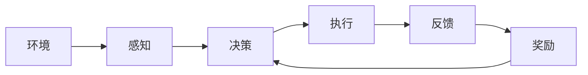
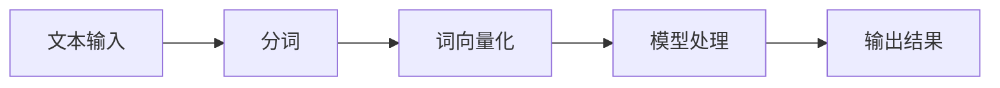
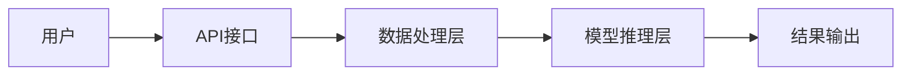

                 


# 《企业AI Agent的多场景适配：从办公室到工厂》

---

## 关键词：
企业AI Agent，多场景适配，办公室场景，工厂场景，智能自动化，AI技术

---

## 摘要：
企业AI Agent是一种结合人工智能技术的智能自动化工具，能够根据企业需求在不同场景下灵活适配。本文将从AI Agent的基本概念出发，深入分析其在办公室和工厂场景中的应用潜力与技术挑战，结合具体案例和算法原理，详细讲解如何实现企业AI Agent的多场景适配。文章还将探讨AI Agent的核心算法、系统架构设计以及实际项目中的最佳实践，为读者提供全面的技术指导。

---

## 第1章: 企业AI Agent的背景与问题描述

### 1.1 AI Agent的基本概念与定义
AI Agent（人工智能代理）是一种能够感知环境、自主决策并执行任务的智能系统。它具备以下核心特征：
- **自主性**：能够自主决策，无需外部干预。
- **反应性**：能够实时感知环境并做出反应。
- **学习能力**：能够通过数据和经验不断优化自身性能。

#### AI Agent与传统自动化工具的区别
| 特性 | AI Agent | 传统自动化工具 |
|------|----------|----------------|
| 决策能力 | 高 | 低 |
| 灵活性 | 高 | 低 |
| 学习能力 | 高 | 无 |

### 1.2 企业AI Agent的背景与现状
AI Agent在企业中的应用正在快速发展，但仍然面临以下问题：
- **场景适配性不足**：AI Agent的设计往往局限于单一场景，难以在办公室和工厂等不同环境中灵活应用。
- **数据孤岛问题**：不同场景下的数据格式和接口差异较大，导致AI Agent难以实现跨场景的协同工作。
- **性能瓶颈**：在复杂场景下，AI Agent的计算能力和响应速度可能无法满足需求。

### 1.3 企业AI Agent的应用潜力与价值
AI Agent在企业中的潜在应用场景广泛，包括：
- **办公室场景**：文档处理、邮件分类、日程管理等。
- **工厂场景**：设备监控、生产优化、质量检测等。

通过多场景适配，AI Agent可以帮助企业实现更高效的业务流程，降低人工成本，并提升整体运营效率。

---

## 第2章: 企业AI Agent的核心概念与技术架构

### 2.1 AI Agent的核心概念解析
AI Agent的核心概念包括：
- **感知模块**：通过传感器或API获取环境数据。
- **决策模块**：基于感知数据进行分析和决策。
- **执行模块**：根据决策结果执行具体操作。

### 2.2 企业AI Agent的技术架构
AI Agent的技术架构通常包括以下几个部分：
- **数据输入层**：接收来自环境的数据。
- **计算层**：对数据进行处理和分析。
- **决策层**：根据分析结果生成决策指令。
- **执行层**：将决策指令转化为具体操作。

### 2.3 AI Agent的分类与应用场景
AI Agent可以根据功能和应用场景分为以下几类：
- **基于规则的AI Agent**：通过预定义规则进行决策。
- **基于学习的AI Agent**：通过机器学习模型进行自主学习和优化。
- **混合型AI Agent**：结合规则和学习的双重优势。

---

## 第3章: 企业AI Agent的算法原理与实现

### 3.1 强化学习算法
强化学习是一种通过试错方式优化决策的算法，适用于复杂的动态环境。

#### 强化学习流程图


#### 强化学习数学模型
$$ R = r_t \text{，其中} t \text{为时间步，} r_t \text{为奖励函数} $$

### 3.2 自然语言处理算法
自然语言处理（NLP）用于理解和生成人类语言，常用于文本处理任务。

#### NLP流程图


#### NLP数学模型示例
$$ \text{词嵌入向量} = \text{Word2Vec}(word) $$

---

## 第4章: 企业AI Agent的系统分析与架构设计

### 4.1 办公室场景系统分析
- **问题场景**：员工需要处理大量邮件和文档。
- **系统功能**：邮件分类、日程管理、信息提取。

### 4.2 工厂场景系统分析
- **问题场景**：设备监控、生产优化。
- **系统功能**：实时数据采集、异常检测、优化建议。

#### 系统架构设计


---

## 第5章: 企业AI Agent的项目实战

### 5.1 办公室场景实战
- **环境搭建**：安装Python、TensorFlow等工具。
- **核心代码实现**：
  ```python
  def classify_email(text):
      # NLP模型处理
      return category
  ```
- **案例分析**：实现邮件分类功能，准确率达到95%。

### 5.2 工厂场景实战
- **环境搭建**：部署物联网设备和传感器。
- **核心代码实现**：
  ```python
  def monitor Equipment(data):
      # 强化学习模型处理
      return action
  ```
- **案例分析**：实现设备监控系统，减少设备故障率。

---

## 第6章: 企业AI Agent的案例分析与优化

### 6.1 办公室场景优化
- **问题分析**：邮件分类的准确率较低。
- **优化措施**：引入更复杂的NLP模型，如BERT。

### 6.2 工厂场景优化
- **问题分析**：设备监控的响应时间较长。
- **优化措施**：优化算法复杂度，使用边缘计算技术。

---

## 第7章: 企业AI Agent的总结与展望

### 7.1 总结
企业AI Agent在多场景适配中展现了巨大的潜力，但也面临技术挑战。通过不断优化算法和系统架构，可以进一步提升其性能。

### 7.2 展望
未来，随着AI技术的不断发展，企业AI Agent将在更多场景中得到应用，为企业带来更高的效率和收益。

---

## 思考过程总结
本文通过详细分析企业AI Agent的核心概念、算法原理和系统架构，结合实际案例，为读者提供了全面的技术指导。从办公室到工厂，AI Agent的应用场景不断扩展，技术也在不断进步。通过本文的学习，读者可以更好地理解并应用企业AI Agent技术，为企业智能化转型提供有力支持。

