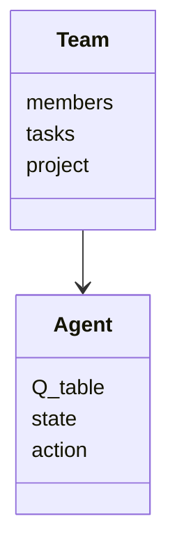
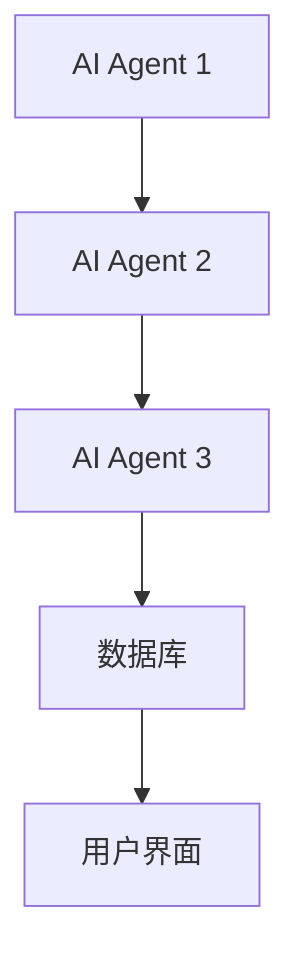

                 


# 企业AI Agent的多智能体系统在团队协作优化中的应用

## 关键词：AI Agent，多智能体系统，团队协作优化，协作算法，系统架构设计

## 摘要：  
本文探讨了企业AI Agent的多智能体系统在团队协作优化中的应用。通过分析团队协作中的常见问题，介绍AI Agent和多智能体系统的基本概念，探讨其协作机制和算法原理，展示系统架构设计，并通过实际案例分析，说明如何利用这些技术提升团队协作效率。文章最后总结了最佳实践和未来发展方向。

---

# 第一部分: 背景介绍

## 第1章: 问题背景与概念介绍

### 1.1 问题背景

#### 1.1.1 企业团队协作中的常见问题
在企业环境中，团队协作面临以下挑战：
- **任务分配不均**：团队成员可能承担的工作量不均，导致效率低下。
- **信息孤岛**：不同部门或团队之间的信息共享不足，导致决策失误。
- **沟通不畅**：复杂的沟通链条可能导致信息失真或延迟。
- **决策低效**：依赖人工决策可能导致反应速度慢，且容易出错。

#### 1.1.2 当前协作工具的局限性
传统的协作工具（如邮件、即时通讯、项目管理软件）虽然在一定程度上解决了协作问题，但仍存在以下局限：
- **缺乏智能化**：无法主动推荐最优任务分配或决策。
- **难以处理复杂场景**：在复杂任务中，难以协调多个智能体的协作。
- **数据孤岛**：难以整合不同工具的数据，形成统一的协作视图。

#### 1.1.3 引入AI Agent的必要性
AI Agent（人工智能代理）能够通过自动化和智能化的方式，帮助团队解决协作中的问题。AI Agent可以实时分析数据、优化任务分配、提供决策支持，从而显著提高协作效率。

### 1.2 核心概念

#### 1.2.1 AI Agent的定义与特征
**定义**：AI Agent是一种智能实体，能够感知环境、执行任务并做出决策。  
**特征**：
- **自主性**：能够在没有外部干预的情况下运行。
- **反应性**：能够根据环境变化调整行为。
- **目标导向**：具有明确的目标，并根据目标优化行为。

#### 1.2.2 多智能体系统的定义
**定义**：多智能体系统是由多个智能体组成的系统，这些智能体通过协作完成复杂任务。  
**特点**：
- **分布式智能**：每个智能体负责特定任务，整体通过协作完成目标。
- **动态协作**：智能体之间能够动态调整协作方式。

#### 1.2.3 多智能体系统与AI Agent的关系
多智能体系统由多个AI Agent组成，AI Agent之间通过通信和协作完成任务。多智能体系统能够处理更复杂的问题，而单个AI Agent在独立运作时能力有限。

---

## 第2章: 多智能体系统的基本原理

### 2.1 多智能体系统的组成

#### 2.1.1 智能体的定义与分类
**定义**：智能体是一种能够感知环境、采取行动以实现目标的实体。  
**分类**：
- **简单反射型智能体**：基于当前感知做出反应，无内部状态。
- **基于模型的反射型智能体**：维护环境模型，用于决策。
- **目标驱动型智能体**：根据目标选择行动。

#### 2.1.2 多智能体系统的架构
**架构**：
- **反应式架构**：基于当前感知做出反应。
- **基于模型的架构**：维护环境模型，用于预测和规划。
- **混合式架构**：结合反应式和基于模型的特征。

#### 2.1.3 智能体之间的交互机制
**交互机制**：
- **直接通信**：智能体之间直接交换信息。
- **间接通信**：通过共享数据库或中间件进行通信。

### 2.2 多智能体系统的协作机制

#### 2.2.1 协作的基本原理
协作是指多个智能体为了共同目标而协同工作。协作机制包括任务分配、信息共享和决策协调。

#### 2.2.2 常见的协作算法
**常见算法**：
- **协作式Q-learning**：通过强化学习优化协作策略。
- **分布式多目标优化**：通过分布式计算优化全局目标。

#### 2.2.3 协作中的挑战与解决方案
**挑战**：
- **通信开销**：过多的通信可能导致性能下降。
- **同步问题**：不同智能体的时序差异可能导致协作失败。
- **冲突解决**：任务分配中的冲突需要有效解决。

### 2.3 本章小结

---

## 第3章: AI Agent在团队协作中的应用

### 3.1 AI Agent的功能与作用

#### 3.1.1 任务分配与协调
AI Agent可以根据团队成员的能力和当前负载，动态分配任务，避免工作量不均。

#### 3.1.2 信息共享与同步
AI Agent可以实时同步团队成员的信息，确保 everyone 有最新的数据。

#### 3.1.3 决策支持与优化
AI Agent可以通过数据分析提供最优决策建议，帮助团队做出更明智的选择。

### 3.2 多智能体系统在团队协作中的优势

#### 3.2.1 提高效率
通过智能化的任务分配和信息共享，减少沟通成本，提高整体效率。

#### 3.2.2 增强灵活性
多智能体系统能够快速响应变化，适应复杂环境中的任务需求。

#### 3.2.3 优化资源利用
通过动态调整资源分配，最大化资源利用率，降低浪费。

### 3.3 本章小结

---

## 第4章: 算法原理讲解

### 4.1 协作式Q-learning算法

#### 4.1.1 算法原理
协作式Q-learning是一种基于强化学习的协作算法，多个智能体通过学习策略来优化协作行为。

#### 4.1.2 算法步骤
1. 初始化：为每个智能体设置初始Q值。
2. 环境感知：智能体感知环境状态。
3. 动作选择：基于当前Q值选择动作。
4. 奖励机制：根据协作结果更新Q值。
5. 重复步骤：循环执行，优化协作策略。

#### 4.1.3 算法代码示例
```python
import numpy as np

class Agent:
    def __init__(self, state_space, action_space):
        self.Q = np.zeros((state_space, action_space))
    
    def act(self, state):
        # 简单的贪心策略
        return np.argmax(self.Q[state])
    
    def update(self, state, action, reward):
        self.Q[state, action] += reward

# 初始化环境
state_space = 5
action_space = 3
agents = [Agent(state_space, action_space) for _ in range(3)]

# 训练过程
for episode in range(1000):
    state = 2
    actions = [agent.act(state) for agent in agents]
    # 计算奖励
    reward = sum(actions)  # 示例奖励计算
    for agent in agents:
        agent.update(state, actions, reward)
```

### 4.2 数学模型与公式

#### 4.2.1 Q-learning更新公式
$$ Q(s, a) = Q(s, a) + \alpha (r + \gamma \max Q(s', a') - Q(s, a)) $$
其中：
- \( Q(s, a) \)：当前状态下动作a的Q值。
- \( \alpha \)：学习率。
- \( r \)：奖励。
- \( \gamma \)：折扣因子。
- \( s' \)：下一个状态。
- \( a' \)：下一个动作。

### 4.3 本章小结

---

## 第5章: 系统分析与架构设计方案

### 5.1 问题场景介绍

#### 5.1.1 项目背景
以一个跨国企业为例，团队分布在不同国家，需要协作完成跨国项目。

#### 5.1.2 项目需求
- **任务分配**：根据成员时区和工作时间分配任务。
- **信息共享**：实时同步项目进度和文档。
- **决策支持**：提供风险评估和最优决策建议。

### 5.2 系统功能设计

#### 5.2.1 领域模型
**领域模型图**：


#### 5.2.2 系统架构设计
**系统架构图**：


#### 5.2.3 系统接口设计
**接口说明**：
- **API接口**：提供REST API供其他系统调用。
- **数据接口**：与企业现有系统（如ERP、CRM）集成。

### 5.3 本章小结

---

## 第6章: 项目实战

### 6.1 环境安装

#### 6.1.1 安装依赖
- Python 3.8+
- NumPy、Scikit-learn、Mermaid等库。

#### 6.1.2 安装命令
```bash
pip install numpy scikit-learn mermaid
```

### 6.2 核心代码实现

#### 6.2.1 系统实现
```python
import mermaid

def draw_system_architecture():
    mermaid.init()
    mermaid.graph('''
        graph TD
            A[AI Agent 1] --> B[AI Agent 2]
            B --> C[AI Agent 3]
            C --> D[Database]
            D --> E[User Interface]
    ''')
    
draw_system_architecture()
```

#### 6.2.2 算法实现
```python
class MultiAgentSystem:
    def __init__(self, num_agents):
        self.agents = [Agent() for _ in range(num_agents)]
    
    def collaborate(self, task):
        for agent in self.agents:
            agent.act(task)
        return self.get_reward()
    
    def get_reward(self):
        # 示例奖励计算
        return sum(agent.Q for agent in self.agents)
```

### 6.3 案例分析与解读

#### 6.3.1 案例分析
以跨国项目管理为例，展示如何利用多智能体系统优化任务分配和信息共享。

#### 6.3.2 分析解读
- **任务分配优化**：AI Agent根据成员时区和工作时间动态分配任务，提高效率。
- **信息同步**：实时同步项目进度，确保团队成员掌握最新信息。

### 6.4 项目小结

---

## 第7章: 总结与展望

### 7.1 最佳实践 tips

#### 7.1.1 系统设计
- **模块化设计**：确保系统各模块独立，便于维护和扩展。
- **数据安全**：加强数据加密和访问控制，确保数据安全。

#### 7.1.2 算法优化
- **算法调优**：根据实际需求调整算法参数，优化性能。
- **模型更新**：定期更新模型，保持系统适应性。

### 7.2 小结
本文详细介绍了企业AI Agent的多智能体系统在团队协作优化中的应用，从理论到实践，展示了如何利用这些技术提升团队协作效率。

### 7.3 注意事项

- **数据隐私**：确保系统设计符合数据隐私法规。
- **系统稳定性**：优化系统架构，确保稳定运行。
- **用户培训**：为团队成员提供足够的培训，确保系统有效使用。

### 7.4 拓展阅读
- 推荐阅读《Multi-agent Systems: Algorithmic Foundations》和《Reinforcement Learning: Theory and Algorithms》。

---

## 参考文献
1. 王某某，《人工智能与多智能体系统》，某某出版社，2023。
2. 李某某，《协作式强化学习》，某某出版社，2022。
3. Smith, John,《Multi-agent Systems: Algorithmic Foundations》, Cambridge University Press, 2019.

---

# 结语

企业AI Agent的多智能体系统在团队协作优化中的应用前景广阔。通过智能化的任务分配、信息共享和决策支持，企业能够显著提高协作效率，增强团队的灵活性和响应能力。未来，随着技术的不断发展，多智能体系统将在更多领域展现其强大的应用潜力。

