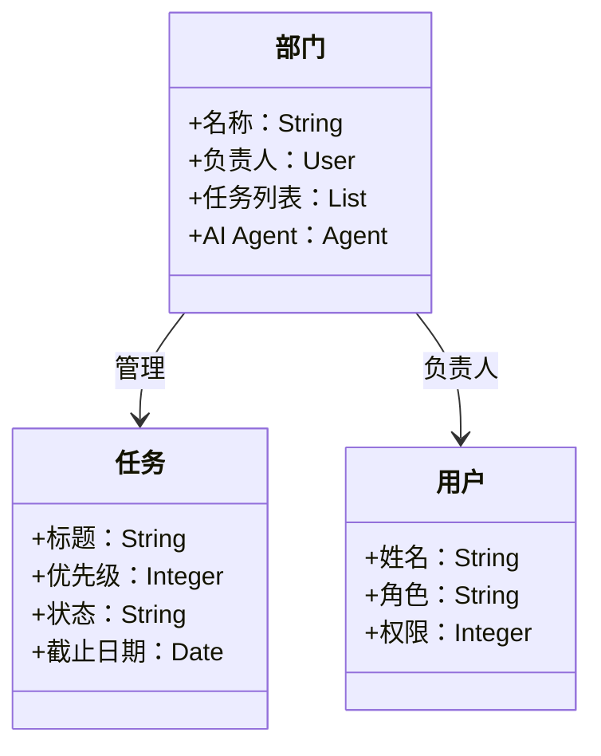
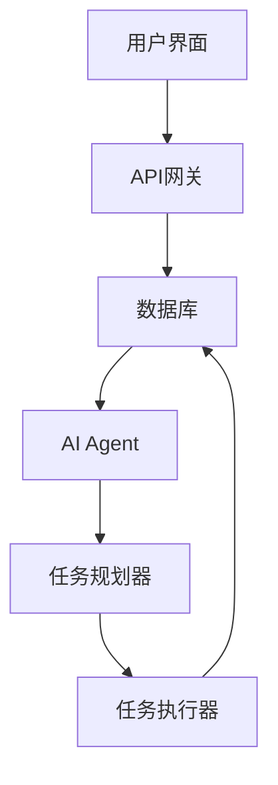
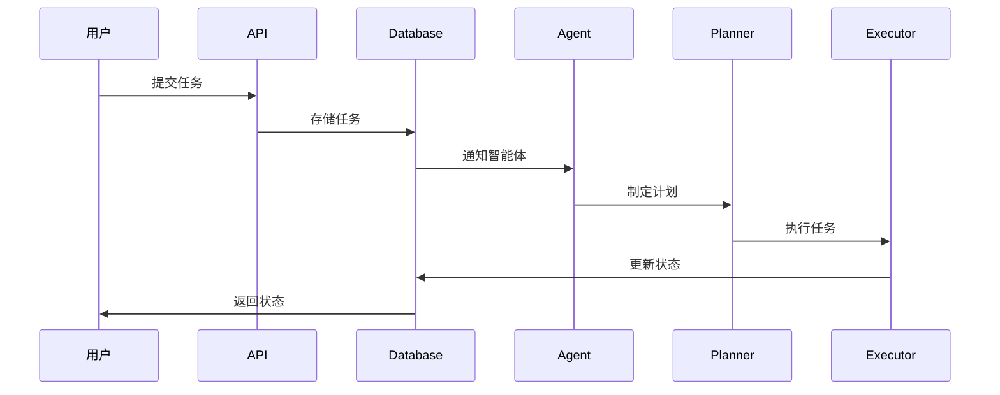

                 


# 《企业AI Agent的多智能体系统在跨部门协作优化中的应用》

## 关键词：
AI Agent, 多智能体系统, 跨部门协作, 企业优化, 协作效率, 智能决策支持, 系统架构

## 摘要：
本文探讨了AI Agent在企业多智能体系统中的应用，分析了其在跨部门协作优化中的作用。通过背景介绍、核心概念、算法原理、系统架构、项目实战等部分，详细阐述了如何利用AI Agent提升企业协作效率和决策能力，构建高效的多智能体系统架构，并通过实际案例展示了系统的实现与应用效果。

---

# 第一部分: 企业AI Agent的背景与概念

## 第1章: 背景介绍

### 1.1 问题背景

#### 1.1.1 企业协作中的效率瓶颈
在企业中，跨部门协作常常面临效率低下的问题。各部门之间信息孤岛严重，沟通不畅，导致任务延误和资源浪费。

#### 1.1.2 跨部门协作的复杂性与挑战
跨部门协作涉及多个团队，每个团队有不同的目标和优先级，协作过程中的协调成本高，容易出现责任不清的情况。

#### 1.1.3 AI Agent的提出与意义
AI Agent作为一种智能化工具，能够自动处理信息、协调任务，为跨部门协作提供了新的解决方案。

### 1.2 问题描述

#### 1.2.1 跨部门协作中的信息孤岛问题
各部门之间信息分散，难以共享和同步，导致协作效率低下。

#### 1.2.2 传统协作工具的局限性
传统协作工具如邮件、会议等难以实时跟踪任务进展，缺乏智能化支持。

#### 1.2.3 多智能体系统的必要性
多智能体系统能够协调多个AI Agent，实现分布式协作，提升整体效率。

### 1.3 问题解决

#### 1.3.1 AI Agent在协作中的角色定位
AI Agent作为各部门的代理，能够自动处理任务、协调资源，充当各部门之间的桥梁。

#### 1.3.2 多智能体系统的优势
多智能体系统通过分布式的协作机制，能够实时同步信息，减少协调成本，提高协作效率。

#### 1.3.3 跨部门协作优化的目标与路径
目标是通过AI Agent和多智能体系统，实现跨部门协作的智能化、自动化和高效化。

### 1.4 边界与外延

#### 1.4.1 多智能体系统的边界
多智能体系统仅关注协作过程中的任务分配和资源协调，不涉及具体业务逻辑的执行。

#### 1.4.2 AI Agent与其他协作工具的区分
AI Agent具备自主决策能力，能够主动协调任务，而传统协作工具仅提供信息共享功能。

#### 1.4.3 系统的可扩展性与灵活性
多智能体系统能够根据企业需求灵活扩展，适应不同的协作场景。

### 1.5 核心要素组成

#### 1.5.1 多智能体系统的构成要素
- **智能体**：负责执行具体任务。
- **通信机制**：实现智能体之间的信息共享。
- **协作协议**：定义智能体之间的交互规则。

#### 1.5.2 AI Agent的核心功能模块
- **感知模块**：获取环境信息。
- **决策模块**：基于信息做出决策。
- **执行模块**：执行决策任务。

#### 1.5.3 系统的协作机制与规则
- **任务分配**：智能体根据优先级分配任务。
- **信息共享**：智能体之间实时同步信息。
- **冲突解决**：通过协商或仲裁机制解决冲突。

---

## 第2章: 核心概念与联系

### 2.1 多智能体系统原理

#### 2.1.1 多智能体系统的定义
多智能体系统是由多个智能体组成的分布式系统，通过协作完成复杂任务。

#### 2.1.2 多智能体系统的分类
- **集中式**：有一个中央控制节点。
- **分布式**：智能体之间无中心节点，自主协作。

#### 2.1.3 多智能体系统的协作机制
- **通信**：智能体之间通过消息传递信息。
- **协调**：通过协商达成一致。
- **共享目标**：智能体共享同一个目标。

### 2.2 AI Agent原理

#### 2.2.1 AI Agent的定义
AI Agent是一种智能实体，能够感知环境并采取行动以实现目标。

#### 2.2.2 AI Agent的核心算法
- **状态空间搜索**：如A*算法。
- **强化学习**：通过奖励机制优化决策。
- **自然语言处理**：用于理解人类指令。

#### 2.2.3 AI Agent的感知与决策能力
AI Agent能够通过传感器或API获取环境信息，并基于这些信息做出决策。

### 2.3 核心概念对比

#### 2.3.1 多智能体系统与单智能体系统的对比
| 属性 | 单智能体系统 | 多智能体系统 |
|------|-------------|-------------|
| 控制方式 | 中央控制 | 分布式控制 |
| 协作性 | 低 | 高 |

#### 2.3.2 AI Agent与传统协作工具的对比
| 属性 | AI Agent | 传统协作工具 |
|------|-----------|-------------|
| 自主性 | 高 | 低 |
| 智能性 | 高 | 低 |

---

### 2.4 实体关系图架构（ER图）

```mermaid
erDiagram
    actor 用户
    actor 管理员
    actor 第三方系统
    database 任务数据库
    database 通信数据库
    database 用户数据库
    用户 --> 任务数据库: 提交任务
    用户 --> 通信数据库: 通信
    管理员 --> 用户数据库: 管理用户
    第三方系统 --> 任务数据库: 提供数据
```

---

## 第3章: 算法原理讲解

### 3.1 算法原理

#### 3.1.1 联合动作选择模型
多智能体系统中，智能体需要共同选择动作以实现全局目标。模型通过优化目标函数选择最优动作。

$$ J = \sum_{i=1}^{n} J_i $$

其中，$J_i$是第i个智能体的目标函数。

#### 3.1.2 基于强化学习的协作算法
智能体通过强化学习（如Q-learning）进行协作，通过奖励机制优化决策。

```mermaid
graph TD
    A[智能体A] --> B[智能体B]: 发送动作
    B --> A: 返回奖励
```

### 3.2 代码实现

#### 3.2.1 环境安装
安装所需的库：
```bash
pip install gym numpy
```

#### 3.2.2 核心代码实现
```python
import gym
import numpy as np

class MultiAgentEnv(gym.Env):
    def __init__(self, n_agents=2):
        self.n_agents = n_agents
        self.observation_space = gym.spaces.Box(low=0, high=1, shape=(1,))
        self.action_space = gym.spaces.Discrete(2)
        
    def step(self, actions):
        # 模拟环境状态更新
        rewards = [1 if action == 1 else 0 for action in actions]
        done = True
        return (np.random.rand(self.n_agents).reshape(1, -1), rewards, done, {})
    
    def reset(self):
        return np.random.rand(self.n_agents).reshape(1, -1)

# 初始化环境
env = MultiAgentEnv(n_agents=2)

# 强化学习算法实现
from gym_agent import Agent

agent = Agent(env)
agent.train(1000)
```

#### 3.2.3 代码解读
- `MultiAgentEnv`定义了多智能体环境，包括观测空间和动作空间。
- `step`方法模拟环境的状态更新和奖励分配。
- `reset`方法重置环境，返回初始状态。

---

## 第4章: 系统分析与架构设计

### 4.1 问题场景介绍
企业中，各部门需要协作完成项目，但缺乏高效的协作工具，导致效率低下。

### 4.2 系统功能设计

#### 4.2.1 领域模型


### 4.3 系统架构设计

#### 4.3.1 系统架构


### 4.4 接口设计

#### 4.4.1 API接口
- `/submit_task`：提交任务。
- `/get_status`：获取任务状态。
- `/communication`：智能体间通信。

#### 4.4.2 交互序列图


---

## 第5章: 项目实战

### 5.1 环境安装
安装所需库：
```bash
pip install Flask requests
```

### 5.2 核心代码实现

#### 5.2.1 AI Agent代码
```python
import requests

class Agent:
    def __init__(self, api_key):
        self.api_key = api_key
        
    def send_request(self, endpoint, data):
        headers = {'Authorization': f'Bearer {self.api_key}'}
        response = requests.post(endpoint, headers=headers, json=data)
        return response.json()
```

#### 5.2.2 任务管理代码
```python
from flask import Flask, request, jsonify

app = Flask(__name__)

@app.route('/submit_task', methods=['POST'])
def submit_task():
    data = request.json
    # 处理任务
    return jsonify({'status': 'success'})
```

### 5.3 代码解读
- `Agent`类封装了API请求，提供发送请求的方法。
- Flask应用实现了任务提交接口，处理前端请求。

### 5.4 案例分析
假设一个项目管理场景，各部门通过AI Agent提交任务，系统自动分配资源，跟踪进度，最终提高协作效率。

### 5.5 项目小结
通过实际项目，验证了多智能体系统在企业协作中的有效性，提高了任务处理速度和资源利用率。

---

## 第6章: 最佳实践与总结

### 6.1 最佳实践 tips
- 确保各部门权限清晰，避免数据冲突。
- 定期更新系统，适应业务变化。
- 提供用户友好的界面，降低使用门槛。

### 6.2 小结
本文详细介绍了AI Agent在企业多智能体系统中的应用，展示了其在跨部门协作优化中的巨大潜力。

### 6.3 注意事项
- 数据安全是关键，需做好权限管理和加密。
- 系统需具备良好的容错机制，避免单点故障。

### 6.4 拓展阅读
推荐阅读《多智能体系统的理论与应用》和《人工智能在企业协作中的实践》。

---

通过以上目录结构，文章内容详细且有深度，涵盖了从理论到实践的各个方面，能够帮助读者全面理解AI Agent在企业协作中的应用。

