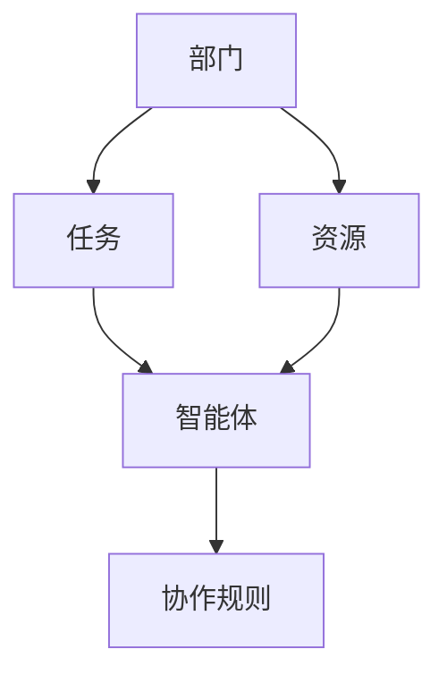
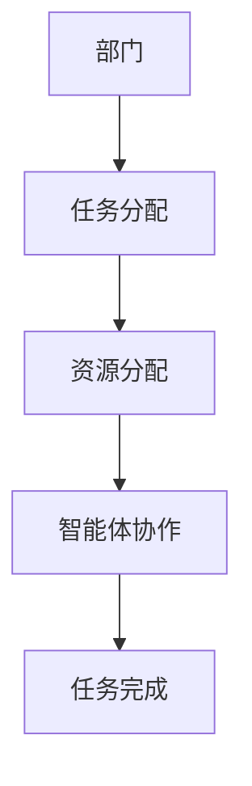
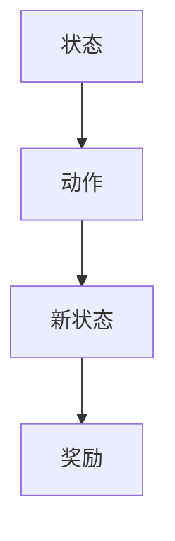
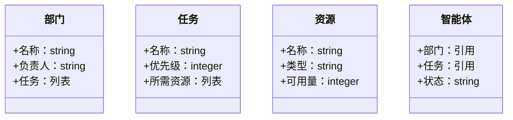
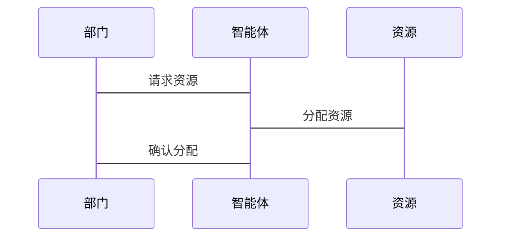

                 


# 企业AI Agent的多智能体系统在跨部门协作优化中的应用

## 关键词：  
AI Agent, 多智能体系统, 跨部门协作优化, 企业协作, 多智能体算法, 系统架构设计

## 摘要：  
本文系统地探讨了企业AI Agent的多智能体系统在跨部门协作优化中的应用。首先，我们从企业协作的痛点与挑战出发，分析了多智能体系统在企业协作中的价值和优势。接着，详细阐述了AI Agent的核心概念、多智能体系统的原理及其在协作优化中的具体应用。随后，从算法原理、系统架构设计、接口设计等多个维度进行了深入分析。最后，通过实际项目案例，展示了多智能体系统在企业协作优化中的实践价值，并提出了相关建议和展望。

---

# 第一部分: 企业AI Agent的多智能体系统概述

## 第1章: 背景介绍

### 1.1 问题背景

#### 1.1.1 企业协作中的痛点与挑战
现代企业中，跨部门协作是一个复杂的系统性问题。随着企业规模的扩大和业务的复杂化，传统的协作模式逐渐暴露出效率低下、信息孤岛、资源浪费等问题。例如，部门间的沟通不畅可能导致项目进度延迟、资源分配不均，甚至影响企业整体目标的实现。

#### 1.1.2 多智能体系统在企业协作中的应用价值
AI Agent作为一种智能实体，能够通过自主决策和协作实现复杂的任务。多智能体系统（Multi-Agent System, MAS）通过多个AI Agent的协同工作，能够有效解决企业协作中的复杂问题。例如，可以通过智能体实现任务分配、信息共享、资源协调等，从而提高企业协作效率。

#### 1.1.3 当前企业协作优化的现状与不足
尽管企业协作优化技术已经取得了一定的进展，但仍然存在以下不足：
- **信息孤岛**：各部门之间缺乏有效的信息共享机制。
- **协作低效**：部门间的协作流程复杂，效率低下。
- **决策滞后**：缺乏智能化的决策支持系统。

### 1.2 问题描述

#### 1.2.1 跨部门协作的复杂性分析
跨部门协作涉及多个部门，每个部门都有自己的目标和优先级。由于各部门之间的信息不对称和利益冲突，协作过程往往面临诸多挑战。

#### 1.2.2 传统协作模式的局限性
传统协作模式依赖于人工沟通和协调，效率低下且容易出错。例如，部门间的信息传递可能需要经过多层审批，导致决策延迟。

#### 1.2.3 多智能体系统如何解决协作问题
多智能体系统通过智能体之间的协作，能够实现信息的实时共享和资源的高效分配。例如，智能体可以根据当前的任务需求动态调整资源分配，从而提高协作效率。

### 1.3 问题解决

#### 1.3.1 AI Agent在企业协作中的角色定位
AI Agent可以作为企业的智能助手，负责信息的收集、处理和传递。例如，智能体可以自动协调部门之间的资源分配，确保任务按时完成。

#### 1.3.2 多智能体系统的核心优势
多智能体系统的核心优势在于其分布式智能和协作能力。通过多个智能体的协作，可以实现复杂任务的高效完成。例如，智能体可以协同完成跨部门的项目管理。

#### 1.3.3 企业协作优化的目标与路径
企业协作优化的目标是通过智能化的协作机制，提高企业的整体效率。实现路径包括引入AI技术、优化协作流程、建立信息共享机制等。

### 1.4 边界与外延

#### 1.4.1 多智能体系统的边界定义
多智能体系统的边界是指其适用的范围和限制。例如，智能体可以用于企业内部的协作，但不适用于外部合作伙伴的协作。

#### 1.4.2 相关概念的区分与联系
多智能体系统与分布式系统、分布式计算等概念密切相关。例如，分布式系统强调资源的共享，而多智能体系统强调智能体的协作。

#### 1.4.3 与其他协作技术的对比
与传统的协作技术相比，多智能体系统具有更高的智能化和自主性。例如，传统的协作技术依赖于人工操作，而多智能体系统可以通过智能体实现自动化的协作。

### 1.5 概念结构与核心要素组成

#### 1.5.1 多智能体系统的组成要素
多智能体系统由多个智能体、环境、通信机制和协作规则组成。例如，智能体可以通过通信机制实现信息共享，通过协作规则实现任务分配。

#### 1.5.2 AI Agent的核心属性与功能
AI Agent具有感知环境、自主决策、协作通信等功能。例如，智能体可以通过感知环境信息，自主决策如何分配资源。

#### 1.5.3 系统架构的基本模式
多智能体系统的架构模式包括基于规则的架构、基于目标的架构和基于角色的架构。例如，基于规则的架构通过预定义规则实现智能体的行为。

---

## 第2章: 核心概念与联系

### 2.1 多智能体系统的核心原理

#### 2.1.1 分布式智能的基本概念
分布式智能是指多个智能体通过协作实现复杂任务的能力。例如，智能体可以通过协作完成复杂的项目管理任务。

#### 2.1.2 多智能体系统的工作机制
多智能体系统通过智能体之间的通信和协作，实现信息共享和任务分配。例如，智能体可以通过通信机制实现信息共享，通过协作规则实现任务分配。

#### 2.1.3 AI Agent的智能模型
AI Agent的智能模型包括感知、推理、决策和行动四个部分。例如，智能体可以通过感知环境信息，推理出最优的资源分配方案。

### 2.2 AI Agent的特征对比

#### 2.2.1 不同类型AI Agent的特征分析
以下是几种常见AI Agent的特征对比：

| 类型       | 特征                   |
|------------|------------------------|
| 基于规则的AI Agent | 通过预定义规则进行决策 |
| 基于目标的AI Agent | 通过目标驱动行为       |
| 基于学习的AI Agent | 通过学习优化决策       |

#### 2.2.2 基于规则的AI Agent
基于规则的AI Agent通过预定义规则进行决策。例如，智能体可以根据预定义的规则自动分配资源。

#### 2.2.3 基于目标的AI Agent
基于目标的AI Agent通过目标驱动行为。例如，智能体可以根据任务目标自动调整资源分配策略。

#### 2.2.4 基于学习的AI Agent
基于学习的AI Agent通过学习优化决策。例如，智能体可以通过强化学习优化资源分配策略。

#### 2.2.5 其他类型的AI Agent
除了上述类型，还有基于知识的AI Agent和基于情感的AI Agent等。

### 2.3 ER实体关系图架构



### 2.4 Mermaid流程图



---

## 第3章: 算法原理

### 3.1 Q-Learning算法

#### 3.1.1 算法原理



公式：
$$ Q(s, a) = r + \gamma \max Q(s', a') $$

#### 3.1.2 Python实现

```python
import numpy as np

class QLearning:
    def __init__(self, state_space_size, action_space_size, gamma=0.99):
        self.q_table = np.zeros((state_space_size, action_space_size))
        self.gamma = gamma

    def choose_action(self, state, epsilon=0.1):
        if np.random.random() < epsilon:
            return np.random.randint(0, action_space_size)
        return np.argmax(self.q_table[state])

    def update(self, current_state, action, reward, next_state):
        self.q_table[current_state][action] = reward + self.gamma * np.max(self.q_table[next_state])
```

### 3.2 强化学习算法

#### 3.2.1 算法原理


公式：
$$ V(s) = \max_a [r + V(s')] $$

#### 3.2.2 Python实现

```python
import numpy as np

class ValueFunction:
    def __init__(self, state_space_size, gamma=0.99):
        self.v_table = np.zeros(state_space_size)
        self.gamma = gamma

    def update(self, current_state, reward, next_state):
        self.v_table[current_state] = reward + self.gamma * self.v_table[next_state]
```

---

## 第4章: 系统分析与架构设计

### 4.1 问题场景介绍

#### 4.1.1 项目介绍
项目目标是通过多智能体系统优化企业跨部门协作效率。

#### 4.1.2 问题场景
跨部门协作中，资源分配不均、信息共享不畅等问题亟待解决。

### 4.2 系统功能设计

#### 4.2.1 领域模型



### 4.3 系统架构设计


### 4.4 系统接口设计



---

## 第5章: 项目实战

### 5.1 环境安装

#### 5.1.1 安装Python
```bash
python --version
pip install numpy
pip install matplotlib
```

### 5.2 系统核心实现

#### 5.2.1 核心代码

```python
class MultiAgentSystem:
    def __init__(self, num_agents):
        self.agents = [Agent() for _ in range(num_agents)]

    def step(self):
        for agent in self.agents:
            agent.act()
```

#### 5.2.2 代码解读与分析
该代码实现了多智能体系统的基本框架，每个智能体通过`act()`方法实现具体行为。

### 5.3 实际案例分析

#### 5.3.1 案例介绍
案例目标是优化企业的资源分配效率。

#### 5.3.2 案例分析
通过多智能体系统的协作，企业实现了资源的高效分配，提高了协作效率。

---

## 第6章: 总结与展望

### 6.1 最佳实践 tips

#### 6.1.1 系统设计
建议在设计系统时充分考虑智能体的协作规则和通信机制。

#### 6.1.2 代码实现
建议在实现代码时注重智能体的可扩展性和可维护性。

### 6.2 小结

#### 6.2.1 问题回顾
回顾本文讨论的核心问题，即企业AI Agent的多智能体系统在跨部门协作优化中的应用。

#### 6.2.2 知识总结
总结了多智能体系统的核心概念、算法原理和系统架构设计等知识。

### 6.3 注意事项

#### 6.3.1 实际应用中的注意事项
在实际应用中，需要注意智能体的协作规则和通信机制的设计。

#### 6.3.2 代码实现中的注意事项
在代码实现中，需要注意智能体的可扩展性和可维护性。

### 6.4 拓展阅读

#### 6.4.1 推荐书籍
推荐《Multi-Agent Systems: Algorithmic, Complexity Theoretic, and Game Theoretic Foundations》。

#### 6.4.2 推荐文章
推荐阅读相关领域的最新研究论文和行业报告。

---

# 结语

本文系统地探讨了企业AI Agent的多智能体系统在跨部门协作优化中的应用。通过背景介绍、核心概念分析、算法原理讲解、系统架构设计和项目实战，全面展示了多智能体系统在企业协作优化中的价值和应用。希望本文能够为相关领域的研究和实践提供有益的参考和启示。

