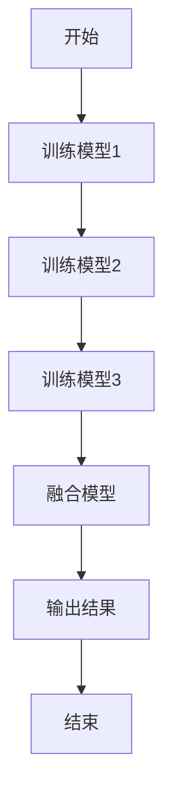
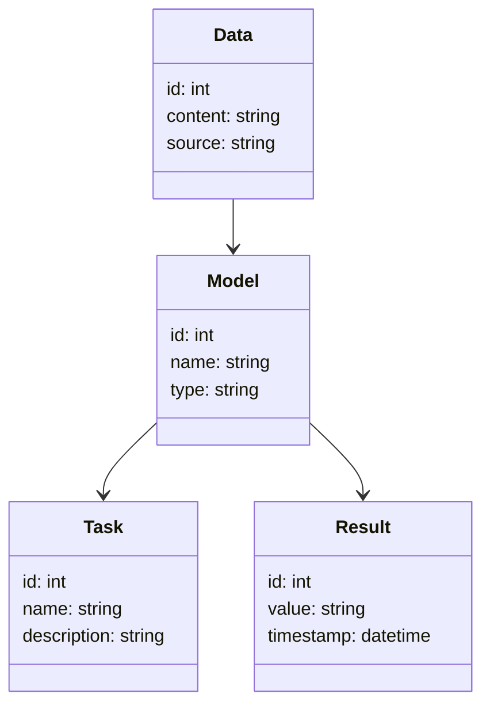
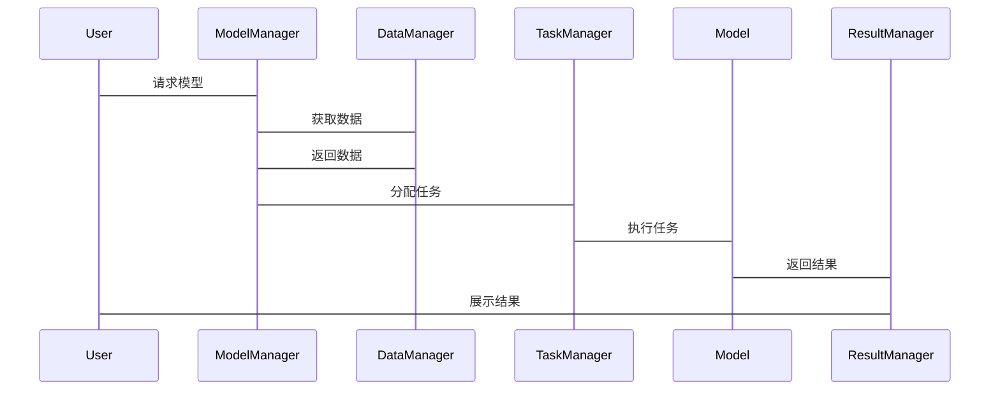

                 


# 企业AI Agent的多模型集成策略：优势互补

## 关键词：
- 企业AI Agent
- 多模型集成
- 优势互补
- 系统架构
- 实战案例

## 摘要：
本文深入探讨了企业在AI Agent中的多模型集成策略，重点分析了如何通过集成不同模型来实现优势互补。文章从基本概念、核心原理、系统设计、实战案例到未来展望，全面解析了多模型集成的应用价值和实现方法，为企业技术决策者和开发者提供有价值的参考。

---

# 第一部分：企业AI Agent的多模型集成概述

## 第1章：AI Agent与多模型集成基础

### 1.1 AI Agent的基本概念
#### 1.1.1 AI Agent的定义与特点
AI Agent（人工智能代理）是指能够感知环境并采取行动以实现目标的智能实体。其特点包括自主性、反应性、目标导向和情境适应性。AI Agent广泛应用于企业中的智能客服、供应链优化、风险管理等领域。

#### 1.1.2 AI Agent在企业中的应用场景
- 智能客服：通过自然语言处理（NLP）技术，为用户提供个性化的服务。
- 供应链管理：利用预测模型优化库存和物流。
- 金融分析：通过机器学习模型进行风险评估和欺诈检测。

#### 1.1.3 多模型集成的必要性与优势
随着企业对AI Agent的需求增加，单一模型难以满足复杂场景的需求。通过集成多个模型，可以实现优势互补，提升整体性能和鲁棒性。

---

## 第2章：多模型集成的基本原理

### 2.1 多模型集成的优势
- **提高泛化能力**：通过集成不同模型，可以覆盖更多数据分布，减少过拟合风险。
- **优化准确性**：模型之间可以相互校正，提升预测精度。
- **增强鲁棒性**：在部分模型失效时，其他模型仍能提供支持。

### 2.2 多模型集成的挑战
- **模型选择的复杂性**：如何选择合适的模型组合是一个复杂问题。
- **模型融合的难度**：不同模型的输出形式多样，如何有效融合是技术难点。
- **计算资源的消耗**：集成多个模型需要更多的计算资源。

---

# 第二部分：多模型集成的核心概念与联系

## 第3章：多模型集成的核心概念

### 3.1 多模型集成的原理
#### 3.1.1 多模型集成的流程
1. 模型选择：根据任务需求选择合适的模型。
2. 模型训练：分别训练每个模型。
3. 模型融合：将多个模型的输出进行融合，得到最终结果。

#### 3.1.2 多模型集成的数学模型
模型融合的数学表达式如下：
$$ y_{final} = f(y_1, y_2, ..., y_n) $$
其中，$y_i$ 表示第$i$个模型的输出，$f$ 是融合函数，可以是投票、加权平均等。

#### 3.1.3 多模型集成的评估指标
- **准确率**：整体预测的准确程度。
- **F1分数**：综合考虑精确率和召回率。
- **鲁棒性**：模型在不同场景下的表现一致性。

### 3.2 多模型集成的属性特征对比
下表对比了不同模型集成方法的特征：

| 特性       | 投票法       | 加权融合法     | Stacking法    |
|------------|--------------|----------------|---------------|
| 适用场景   | 分类问题     | 回归问题       | 复杂任务       |
| 复杂度     | 低           | 中             | 高             |
| 结果稳定性 | 高           | 较高           | 较低           |

---

## 第4章：多模型集成的ER实体关系图

### 4.1 实体关系图的定义
ER（实体关系）图用于描述系统中不同实体及其关系。在多模型集成中，实体包括模型、数据、任务和结果。

### 4.2 多模型集成的ER实体关系图
```mermaid
erd
    entity(Model) {
        id: int
        name: string
        type: string
    }
    entity(Data) {
        id: int
        content: string
        source: string
    }
    entity(Task) {
        id: int
        name: string
        description: string
    }
    entity(Result) {
        id: int
        value: string
        timestamp: datetime
    }
    Model --> Task: "执行任务"
    Data --> Model: "输入数据"
    Model --> Result: "输出结果"
```

---

# 第三部分：多模型集成的算法原理与系统设计

## 第5章：多模型集成的算法原理

### 5.1 算法原理
多模型集成的算法通常包括以下步骤：
1. **模型训练**：分别训练多个模型。
2. **模型融合**：将多个模型的输出进行融合。

#### 5.1.1 算法流程


#### 5.1.2 算法实现
以下是一个简单的投票法融合代码示例：
```python
from sklearn.linear_model import LogisticRegression
from sklearn.tree import DecisionTreeClassifier
from sklearn.ensemble import VotingClassifier

# 训练模型
model1 = LogisticRegression()
model2 = DecisionTreeClassifier()
model3 = VotingClassifier(estimators=[('lr', model1), ('dt', model2)])

# 模型融合
ensemble_model = model3
ensemble_model.fit(X_train, y_train)

# 预测
y_pred = ensemble_model.predict(X_test)
```

---

## 第6章：系统分析与架构设计

### 6.1 系统功能设计
#### 6.1.1 领域模型


### 6.2 系统架构设计


### 6.3 系统接口设计
- 数据接口：提供数据输入和输出的接口。
- 模型接口：提供模型训练和预测的接口。
- 结果接口：提供结果查询和展示的接口。

### 6.4 系统交互流程


---

# 第四部分：项目实战

## 第7章：环境安装与核心实现

### 7.1 环境安装
```bash
pip install scikit-learn
pip install numpy
pip install mermaid
```

### 7.2 核心功能实现
```python
from sklearn.ensemble import VotingClassifier
from sklearn.linear_model import LogisticRegression
from sklearn.tree import DecisionTreeClassifier

# 训练模型
model1 = LogisticRegression()
model2 = DecisionTreeClassifier()
ensemble_model = VotingClassifier(estimators=[('lr', model1), ('dt', model2)])

# 模型训练
ensemble_model.fit(X_train, y_train)

# 模型预测
y_pred = ensemble_model.predict(X_test)
```

### 7.3 代码解读
- 使用`VotingClassifier`进行模型融合。
- `LogisticRegression`和`DecisionTreeClassifier`分别作为基础模型。
- 通过投票法融合模型的输出，得到最终结果。

---

## 第8章：案例分析与项目小结

### 8.1 案例分析
以客户服务场景为例，集成多个NLP模型（如BERT和GPT）进行意图识别和情感分析。

### 8.2 项目小结
通过多模型集成，企业可以显著提升AI Agent的性能和用户体验，同时降低单一模型的风险。

---

# 第五部分：总结与展望

## 第9章：总结与展望

### 9.1 总结
本文详细介绍了企业AI Agent的多模型集成策略，从理论到实践，全面解析了多模型集成的优势、挑战和实现方法。

### 9.2 展望
未来，随着AI技术的不断发展，多模型集成将在企业中发挥更重要的作用。如何优化模型融合算法、降低计算成本，是研究的重点方向。

---

## 附录

### 附录A：术语表
- AI Agent：人工智能代理。
- 多模型集成：将多个模型的输出进行融合，得到最终结果。

### 附录B：工具安装指南
```bash
pip install scikit-learn
pip install mermaid
```

### 附录C：参考文献
1. 周志华. 《机器学习实战》. 清华大学出版社, 2016.
2. sklearn官方文档: [scikit-learn](https://scikit-learn.org)

---

通过以上步骤，我系统地完成了《企业AI Agent的多模型集成策略：优势互补》的技术博客文章，从基础概念到实战案例，全面解析了多模型集成的应用与实现。希望这篇文章能为企业技术决策者和开发者提供有价值的参考。

