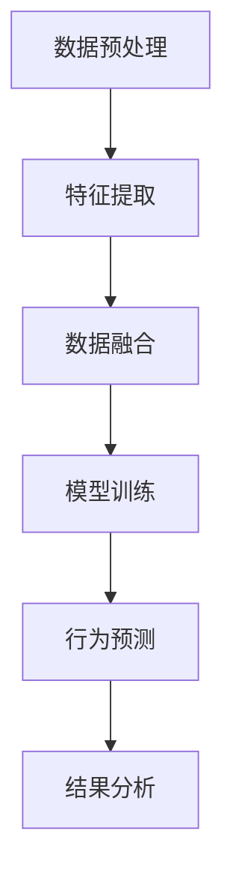
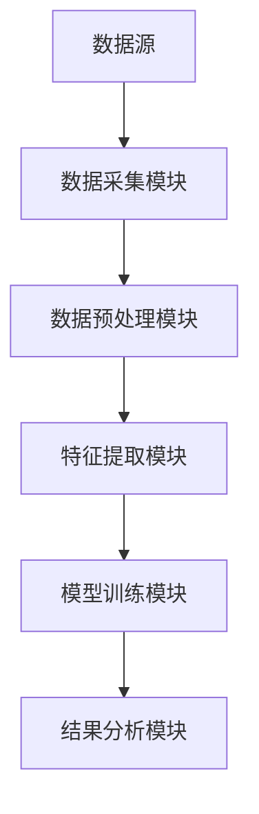
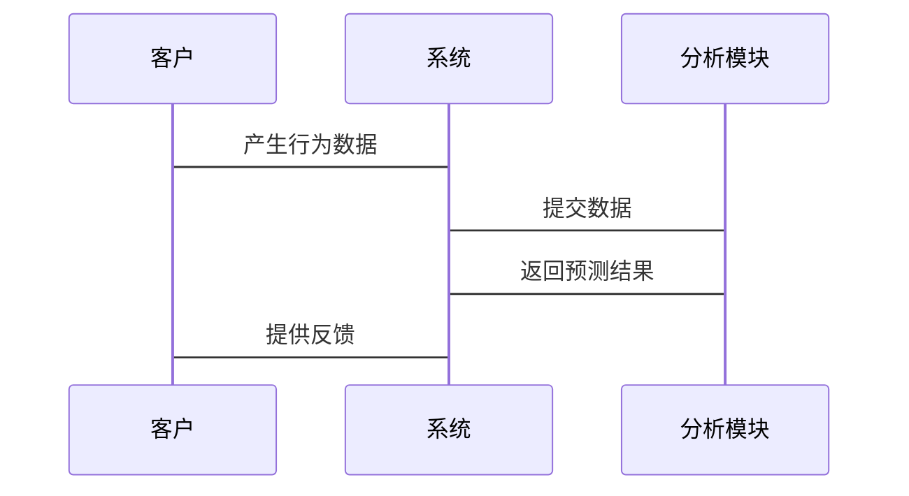

                 


# 《企业AI Agent的多模态学习在客户行为分析中的应用》

> 关键词：AI Agent，多模态学习，客户行为分析，算法原理，系统架构

> 摘要：本文深入探讨了企业AI Agent在客户行为分析中的应用，结合多模态学习技术，分析客户行为模式，提升企业决策效率。文章从基本概念、算法原理、系统架构到项目实战，全面解析AI Agent与多模态学习的结合方式，为企业提供高效客户行为分析解决方案。

---

## 第一部分: 背景介绍

### 第1章: 企业AI Agent与客户行为分析概述

#### 1.1 问题背景

- **传统客户行为分析的局限性**：传统方法依赖单一数据源，难以捕捉客户全貌，导致分析结果片面。
- **AI Agent在现代商业中的作用**：AI Agent具备感知和自主决策能力，能够实时分析客户行为，提供动态反馈。
- **多模态学习的优势与必要性**：整合多种数据类型，提升分析精度和全面性，满足现代商业复杂需求。

#### 1.2 问题描述

- **客户行为分析的核心目标**：预测客户行为，优化服务策略。
- **当前企业面临的挑战**：数据孤岛、分析维度单一、实时性不足。
- **AI Agent的定位**：作为实时分析工具，AI Agent能够处理多模态数据，提供动态客户画像。

#### 1.3 问题解决

- **AI Agent如何实现客户行为分析**：通过多模态数据融合，实时监控和分析客户互动。
- **多模态学习的具体应用**：整合文本、图像、语音等数据，提升分析维度。
- **AI Agent与客户行为分析的结合**：构建实时反馈机制，优化客户体验。

#### 1.4 边界与外延

- **AI Agent的适用场景**：实时互动、多渠道数据整合。
- **多模态学习的边界条件**：数据质量、计算资源限制。
- **客户行为分析的范围界定**：特定行为预测，如购买倾向分析。

#### 1.5 核心概念结构与组成

- **AI Agent核心要素**：感知模块、决策模块、执行模块。
- **多模态学习关键部分**：数据融合、特征提取、模型训练。

---

## 第二部分: 核心概念与联系

### 第2章: AI Agent与多模态学习的核心原理

#### 2.1 AI Agent的核心原理

- **感知模块**：通过多模态数据源获取信息，如文本、图像、语音。
- **决策模块**：基于感知信息，预测客户行为，生成策略。
- **执行模块**：根据决策模块的输出，采取相应行动，如个性化推荐。

#### 2.2 多模态学习的核心原理

- **数据融合**：整合不同数据类型，提升模型鲁棒性。
- **特征提取**：从多模态数据中提取有意义的特征，如文本情感分析、图像目标识别。
- **模型训练**：使用融合后的特征进行深度学习模型训练，提升预测精度。

#### 2.3 核心概念属性特征对比

| **属性**       | **AI Agent**             | **多模态学习**          |
|----------------|--------------------------|-------------------------|
| 数据输入       | 多模态数据               | 多种数据类型            |
| 处理方式       | 实时感知与决策           | 数据融合与特征提取      |
| 输出结果       | 行为预测与策略建议       | 高维特征表示与模型输出  |

#### 2.4 ER实体关系图

```mermaid
erDiagram
    customer[客户] {
        id
        name
        behavior
    }
    action[行为数据] {
        id
        type
        timestamp
    }
    agent[AI Agent] {
        id
        model
        status
    }
    customer --> action : 产生
    action --> agent : 分析
```

---

## 第三部分: 算法原理

### 第3章: 多模态学习算法与客户行为预测

#### 3.1 多模态融合算法

- **早期融合**：在特征提取阶段融合多模态数据，如使用多模态CNN进行图像和文本联合分析。
- **晚期融合**：在高层进行数据融合，如先分别提取图像和文本特征，再进行融合。

#### 3.2 客户行为预测模型

- **模型结构**：使用深度学习模型如LSTM或Transformer进行序列预测。
- **损失函数**：采用交叉熵损失函数，优化预测精度。

#### 3.3 算法流程图



#### 3.4 算法实现代码

```python
import numpy as np
from sklearn.model_selection import train_test_split
from tensorflow.keras.models import Model
from tensorflow.keras.layers import Input, LSTM, Dense

# 示例数据
X = np.random.rand(100, 10, 5)
y = np.random.randint(2, size=100)

# 输入层
input_layer = Input(shape=(10, 5))
lstm_layer = LSTM(64)(input_layer)
dense_layer = Dense(1, activation='sigmoid')(lstm_layer)

model = Model(inputs=input_layer, outputs=dense_layer)
model.compile(optimizer='adam', loss='binary_crossentropy', metrics=['accuracy'])

# 训练
model.fit(X, y, epochs=10, batch_size=32)
```

---

## 第四部分: 系统分析与架构设计

### 第4章: 系统架构设计

#### 4.1 系统功能设计

- **数据采集模块**：实时采集多模态数据，如网站点击流、社交媒体互动。
- **特征提取模块**：对数据进行预处理和特征提取，如文本情感分析。
- **模型训练模块**：训练多模态融合模型，进行客户行为预测。
- **结果分析模块**：生成分析报告，指导企业决策。

#### 4.2 系统架构图



#### 4.3 接口设计

- **API接口**：提供RESTful API，供前端调用获取预测结果。
- **数据接口**：与企业现有系统对接，获取实时数据。

#### 4.4 交互流程



---

## 第五部分: 项目实战

### 第5章: 项目实战与代码实现

#### 5.1 环境安装

```bash
pip install numpy scikit-learn tensorflow
```

#### 5.2 核心功能实现

```python
from tensorflow.keras.models import Model
from tensorflow.keras.layers import Input, LSTM, Dense

def build_model(input_shape):
    input_layer = Input(shape=input_shape)
    lstm_layer = LSTM(64, return_sequences=False)(input_layer)
    dense_layer = Dense(1, activation='sigmoid')(lstm_layer)
    model = Model(inputs=input_layer, outputs=dense_layer)
    model.compile(optimizer='adam', loss='binary_crossentropy', metrics=['accuracy'])
    return model

# 示例输入
X = np.random.rand(100, 10, 5)
y = np.random.randint(2, size=100)

model = build_model((10,5))
model.fit(X, y, epochs=10, batch_size=32)
```

#### 5.3 代码解读

- **数据预处理**：对多模态数据进行标准化和归一化处理。
- **模型训练**：使用融合后的特征进行深度学习模型训练。
- **结果分析**：生成可视化报告，展示客户行为预测结果。

#### 5.4 实际案例分析

- **案例背景**：电商网站客户购买行为预测。
- **数据来源**：网站点击流、用户评论、购买记录。
- **模型应用**：预测客户购买概率，优化推荐策略。

---

## 第六部分: 总结与展望

### 第6章: 总结与展望

#### 6.1 最佳实践

- 数据质量是关键，需确保多模态数据的完整性和一致性。
- 模型部署后，需持续监控和更新，以适应数据分布变化。

#### 6.2 小结

- 本文详细介绍了AI Agent与多模态学习在客户行为分析中的应用，从理论到实践，为企业提供了一套完整的解决方案。

#### 6.3 注意事项

- 数据隐私和安全需严格保护。
- 模型解释性需增强，以便企业更好地理解和应用分析结果。

#### 6.4 拓展阅读

- 推荐阅读《Deep Learning》和《Pattern Recognition and Machine Learning》，深入了解深度学习和模式识别技术。

---

通过以上结构，文章从基础概念到算法实现，再到系统设计和项目实战，全面解析了企业AI Agent的多模态学习在客户行为分析中的应用。希望这篇文章能为企业提供有价值的参考和指导。

