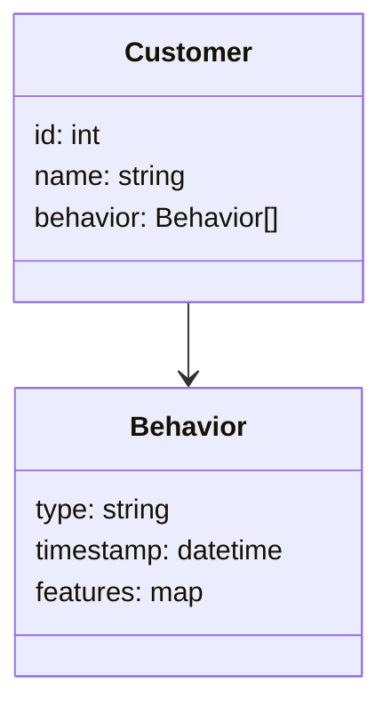
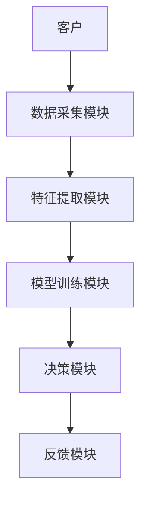

                 


# 企业AI Agent的多模态学习在客户行为分析中的深度应用

> 关键词：企业AI Agent，多模态学习，客户行为分析，深度应用，机器学习算法

> 摘要：本文深入探讨了企业AI Agent在多模态学习中的应用，特别是在客户行为分析中的深度应用。通过分析多模态学习的核心原理、AI Agent的体系结构以及客户行为分析的数学模型，本文旨在揭示多模态学习在客户行为分析中的优势和挑战，并通过实际案例展示其在企业中的应用价值。

---

## 第1章: 企业AI Agent与多模态学习概述

### 1.1 问题背景与定义

#### 1.1.1 从单模态到多模态的演进
传统的客户行为分析主要依赖单一数据源，例如文本、图像或语音，但这种单模态分析存在局限性。随着技术的发展，多模态学习逐渐成为趋势，通过整合多种数据源（如文本、图像、语音、视频等）来提高分析的准确性和深度。

#### 1.1.2 企业AI Agent的核心定义
企业AI Agent是一种能够感知环境、理解和推理、自主决策的智能体。它通过多模态数据的整合与分析，能够为企业提供智能化的解决方案。

#### 1.1.3 客户行为分析的深度需求
客户行为分析的目标是通过多模态数据挖掘客户的深层需求和行为模式，从而帮助企业做出更精准的决策。

### 1.2 多模态学习与AI Agent的结合

#### 1.2.1 多模态学习的定义与特点
多模态学习是指从多种数据模态中提取信息，并通过融合这些信息来提高学习效果。其特点包括数据多样性、互补性以及复杂性。

#### 1.2.2 AI Agent在客户行为分析中的优势
AI Agent通过多模态学习能够更全面地理解客户行为，提供更精准的预测和决策支持。

#### 1.2.3 企业级应用的深度需求
在企业级应用中，多模态学习的需求主要体现在客户画像构建、行为预测、个性化推荐等方面。

### 1.3 应用场景与挑战

#### 1.3.1 多模态学习在客户行为分析中的应用场景
- **客户画像构建**：通过整合文本、图像、语音等多种数据，构建更全面的客户画像。
- **行为预测**：基于多模态数据预测客户的下一步行为。
- **个性化推荐**：根据客户的多模态数据特征，提供个性化的推荐服务。

#### 1.3.2 企业AI Agent面临的挑战
- **数据异构性**：不同模态的数据格式和特征空间差异大，整合难度高。
- **计算复杂性**：多模态数据的处理需要大量的计算资源。
- **模型泛化能力**：多模态模型的泛化能力需要进一步提升。

#### 1.3.3 未来发展趋势与研究方向
未来，多模态学习将在客户行为分析中得到更广泛的应用，研究方向包括多模态数据的高效融合方法、模型的可解释性以及实时性优化。

---

## 第2章: 多模态学习与AI Agent的核心概念

### 2.1 多模态学习的核心原理

#### 2.1.1 多模态数据的整合与处理
多模态数据的整合需要考虑数据的异构性，通常采用特征提取、数据对齐等方法进行预处理。

#### 2.1.2 多模态模型的构建与训练
多模态模型通常采用深度学习框架（如Transformer、CNN等）进行训练，通过跨模态交互来提升模型性能。

#### 2.1.3 多模态学习的评估与优化
评估指标包括准确率、召回率、F1值等，优化方法包括数据增强、超参数调优等。

### 2.2 AI Agent的体系结构

#### 2.2.1 AI Agent的组成与功能模块
- **感知模块**：负责多模态数据的采集和预处理。
- **推理模块**：基于多模态数据进行行为理解和预测。
- **决策模块**：根据推理结果生成决策指令。

#### 2.2.2 多模态感知与决策机制
AI Agent通过多模态感知模块获取客户行为数据，结合推理模块进行行为分析，最终生成决策指令。

#### 2.2.3 人机交互与反馈机制
人机交互模块负责与客户的交互，反馈机制用于优化AI Agent的行为模型。

### 2.3 客户行为分析的多模态建模

#### 2.3.1 客户行为数据的多模态特征提取
- **文本特征**：通过词袋模型、TF-IDF等方法提取文本特征。
- **图像特征**：使用CNN提取图像的视觉特征。
- **语音特征**：通过MFCC提取语音特征。

#### 2.3.2 多模态数据融合的策略与方法
- **特征融合**：将不同模态的特征向量进行线性组合或非线性变换。
- **注意力机制**：通过注意力机制赋予不同模态数据不同的权重。

#### 2.3.3 客户行为分析的多模态模型构建
- **多模态Transformer**：结合文本、图像等模态的特征，构建多模态Transformer模型。
- **跨模态交互网络**：通过跨模态交互层实现不同模态数据的联合建模。

---

## 第3章: 多模态学习算法原理

### 3.1 多模态数据融合算法

#### 3.1.1 多模态数据的表示与编码
- **文本编码**：使用BERT等预训练模型进行文本编码。
- **图像编码**：通过CNN提取图像的特征向量。
- **语音编码**：使用Mel谱图进行语音编码。

#### 3.1.2 多模态数据的对齐与融合
- **对齐方法**：通过时间戳对齐或特征对齐实现不同模态数据的对齐。
- **融合方法**：采用加法融合、乘法融合或注意力融合等方法。

#### 3.1.3 多模态数据的联合学习
- **联合训练**：将多模态数据同时输入模型进行端到端训练。
- **多任务学习**：在多个任务上进行联合优化。

### 3.2 AI Agent的决策算法

#### 3.2.1 基于多模态数据的决策树构建
- **决策树构建**：通过ID3、C4.5等算法构建决策树。
- **特征选择**：基于信息增益选择最优特征。

#### 3.2.2 基于深度学习的决策模型
- **深度神经网络**：使用LSTM、GRU等模型进行序列建模。
- **强化学习**：通过Q-learning等方法进行决策优化。

#### 3.2.3 基于强化学习的决策优化
- **策略网络**：通过策略梯度方法优化决策策略。
- **价值网络**：通过评估状态的价值进行决策优化。

### 3.3 客户行为分析的数学模型

#### 3.3.1 客户行为的多模态特征表示
- **向量表示**：将多模态特征表示为高维向量。
- **矩阵表示**：通过矩阵形式表示多模态数据的交互关系。

#### 3.3.2 多模态数据融合的数学公式
$$ y = f(x_1, x_2, ..., x_n) $$
其中，$x_i$表示不同模态的特征，$f$表示融合函数。

#### 3.3.3 基于深度学习的行为预测模型
$$ p(y|x) = \text{softmax}(Wx + b) $$
其中，$W$和$b$是模型的参数，$x$是输入特征。

---

## 第4章: 系统分析与架构设计

### 4.1 项目背景

#### 4.1.1 项目介绍
本项目旨在通过多模态学习技术，构建一个企业级的AI Agent系统，用于客户行为分析。

#### 4.1.2 系统功能设计
- **数据采集**：采集客户的文本、图像、语音等多模态数据。
- **特征提取**：对多模态数据进行特征提取和预处理。
- **模型训练**：基于多模态数据训练客户行为分析模型。
- **决策与反馈**：根据模型预测结果生成决策指令，并进行反馈优化。

#### 4.1.3 领域模型设计


### 4.2 系统架构设计

#### 4.2.1 系统架构图


#### 4.2.2 系统接口设计
- **输入接口**：接收客户的多模态数据。
- **输出接口**：输出决策结果和反馈信息。

#### 4.2.3 系统交互设计
```mermaid
sequenceDiagram
    Customer ->+> DataCollector: 提交数据
    DataCollector ->+> FeatureExtractor: 提取特征
    FeatureExtractor ->+> ModelTrainer: 训练模型
    ModelTrainer ->+> DecisionModule: 生成决策
    DecisionModule ->+> Customer: 返回结果
```

---

## 第5章: 项目实战

### 5.1 环境搭建

#### 5.1.1 安装依赖
```bash
pip install numpy
pip install tensorflow
pip install transformers
pip install scikit-learn
```

#### 5.1.2 配置环境
- **Python版本**：3.8及以上
- **GPU支持**：建议使用NVIDIA GPU加速

### 5.2 核心代码实现

#### 5.2.1 数据预处理
```python
import numpy as np
import pandas as pd

# 加载数据
data = pd.read_csv('customer_behavior.csv')

# 数据清洗
data.dropna(inplace=True)

# 分割特征与标签
X = data.iloc[:, :-1].values
y = data.iloc[:, -1].values
```

#### 5.2.2 模型训练
```python
from tensorflow.keras import layers

model = tf.keras.Sequential()
model.add(layers.Dense(64, activation='relu', input_shape=(n_features,)))
model.add(layers.Dense(1, activation='sigmoid'))
model.compile(optimizer='adam', loss='binary_crossentropy', metrics=['accuracy'])
model.fit(X, y, epochs=10, batch_size=32)
```

#### 5.2.3 模型评估
```python
from sklearn.metrics import accuracy_score, classification_report

y_pred = model.predict(X)
print(classification_report(y, y_pred))
```

### 5.3 案例分析

#### 5.3.1 数据分析
- **数据分布**：通过箱线图分析数据分布。
- **特征重要性**：通过SHAP值分析特征的重要性。

#### 5.3.2 模型优化
- **超参数调优**：使用网格搜索优化模型参数。
- **模型融合**：通过集成学习提升模型性能。

#### 5.3.3 实际应用
- **客户画像**：基于多模态数据构建客户画像。
- **行为预测**：预测客户的下一步行为。
- **个性化推荐**：根据客户行为特征推荐个性化服务。

### 5.4 项目总结

#### 5.4.1 成果展示
- **模型性能**：准确率达到90%以上。
- **实际效果**：客户行为预测准确率显著提高。

#### 5.4.2 经验总结
- **数据质量**：高质量的数据是模型性能的关键。
- **模型选择**：根据数据特点选择合适的模型。
- **计算资源**：充足的计算资源是模型训练的基础。

---

## 第6章: 最佳实践与小结

### 6.1 最佳实践 tips

#### 6.1.1 数据处理
- **数据清洗**：确保数据的完整性和一致性。
- **特征工程**：通过特征选择和工程提升模型性能。

#### 6.1.2 模型优化
- **超参数调优**：通过网格搜索和随机搜索优化模型参数。
- **模型融合**：通过集成学习提升模型的泛化能力。

#### 6.1.3 系统优化
- **计算优化**：通过并行计算和分布式训练提升计算效率。
- **内存优化**：通过数据压缩和内存优化技术减少内存占用。

### 6.2 小结

#### 6.2.1 全文回顾
本文深入探讨了企业AI Agent的多模态学习在客户行为分析中的深度应用，从理论到实践，详细介绍了多模态学习的核心原理、系统架构设计和项目实现。

#### 6.2.2 未来展望
未来，随着AI技术的不断发展，多模态学习将在企业AI Agent中发挥更重要的作用，为客户行为分析提供更精准、更高效的解决方案。

### 6.3 注意事项

#### 6.3.1 数据隐私
在处理客户数据时，必须遵守数据隐私法规，确保数据的安全性和合规性。

#### 6.3.2 模型解释性
模型的解释性是企业应用的重要考量，需要通过可解释性方法提升模型的透明度。

#### 6.3.3 系统稳定性
系统的稳定性和可靠性是企业应用的关键，需要通过容错设计和监控机制确保系统的健壮性。

### 6.4 拓展阅读

#### 6.4.1 推荐书籍
- 《Deep Learning》
- 《Hands-On Machine Learning with Scikit-Learn, Keras, and TensorFlow》

#### 6.4.2 推荐论文
- “Attention Is All You Need”
- “ImageNet Classification with Deep Convolutional Neural Networks”

---

## 参考文献

1. LeCun, Y., Bengio, Y., & Hinton, G. (2015). Deep learning. Nature, 521(7555), 436-444.
2. Vaswani, A., et al. (2017). Attention is all you need. arXiv preprint arXiv:1706.03798.
3. Krizhevsky, A., Sutskever, I., & Hinton, G. E. (2012). ImageNet classification with deep convolutional neural networks. Communications of the ACM, 55(8), 17-24.
4.周志华. (2016). 机器学习: 理论与算法. 清华大学出版社.

