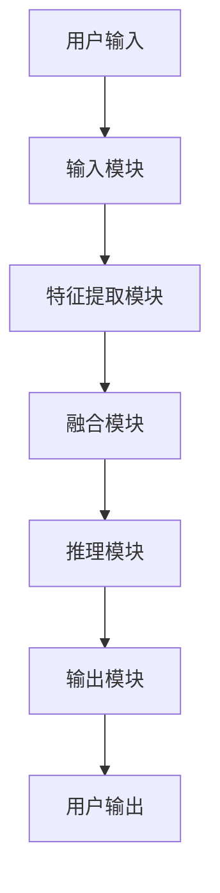

                 


# 企业AI Agent的多模态学习在用户体验优化中的创新应用

关键词：AI Agent，多模态学习，用户体验优化，系统架构设计，算法原理

摘要：本文详细探讨了企业AI Agent通过多模态学习技术在用户体验优化中的创新应用。首先介绍了AI Agent的基本概念和多模态学习的核心原理，然后深入分析了多模态学习的算法框架和数学模型。接着，通过系统架构设计和项目实战，展示了如何将多模态学习应用于企业AI Agent的系统设计和实际案例中。最后，总结了研究的成果和未来的研究方向。

---

## 第1章: AI Agent与多模态学习概述

### 1.1 AI Agent的基本概念

AI Agent（人工智能代理）是指能够感知环境并采取行动以实现目标的智能实体。它可以通过传感器获取信息，并通过执行器与环境交互。AI Agent的核心特点包括自主性、反应性、目标导向性和社会性。

#### 1.1.1 AI Agent的定义与特点

- **自主性**：AI Agent能够在没有外部干预的情况下自主决策。
- **反应性**：能够实时感知环境变化并做出相应的反应。
- **目标导向性**：通过目标驱动行为，优化决策过程。
- **社会性**：能够与其他AI Agent或人类进行协作或竞争。

#### 1.1.2 多模态学习的定义与特点

多模态学习是指在同一学习任务中，利用多种数据模态（如文本、图像、语音等）进行学习的方法。其核心特点包括信息互补性、鲁棒性和高效性。

- **信息互补性**：通过结合不同模态的数据，可以提供更全面的信息。
- **鲁棒性**：多模态学习能够从多种数据源中提取信息，降低单一模态数据不足或噪声的影响。
- **高效性**：通过多模态数据的协同作用，可以提高学习效率和准确性。

#### 1.1.3 企业AI Agent的应用场景

企业AI Agent的应用场景广泛，包括智能客服、智能推荐、智能监控、智能决策支持等。例如，在智能客服场景中，AI Agent可以通过自然语言处理技术理解用户的问题，并结合历史对话数据和情感分析结果提供个性化的解决方案。

---

### 1.2 多模态学习的核心概念

#### 1.2.1 多模态数据的定义

多模态数据是指来自不同模态（如文本、图像、语音等）的数据。例如，一段视频可以包含图像模态（视频画面）、文本模态（字幕）和语音模态（音频）。

#### 1.2.2 多模态学习的分类

多模态学习可以根据任务类型、数据模态和模型结构进行分类：

- **任务类型**：多模态分类、多模态回归、多模态生成等。
- **数据模态**：文本-图像、文本-语音、图像-语音等。
- **模型结构**：基于深度学习的多模态融合模型，如多模态变换器、多模态图神经网络等。

#### 1.2.3 多模态学习与单模态学习的对比

| 对比维度         | 多模态学习                            | 单模态学习                            |
|------------------|---------------------------------------|----------------------------------------|
| 数据来源         | 多种数据模态                          | 单一数据模态                          |
| 信息丰富性       | 信息互补，全面性                      | 信息单一，可能遗漏重要信息              |
| 鲁棒性           | 高，能够从多个数据源中获取信息        | 低，依赖单一数据源，可能受噪声影响较大  |
| 应用场景         | 智能客服、智能推荐、智能监控等          | 单一任务，如文本分类、图像识别等          |

#### 1.2.4 企业AI Agent与多模态学习的结合

企业AI Agent通过结合多模态学习技术，可以更全面地理解用户需求，提升用户体验。例如，在智能推荐系统中，AI Agent可以通过分析用户的文本输入、历史行为数据和图像偏好，提供更加个性化的推荐结果。

---

## 第2章: 多模态学习的算法原理与数学模型

### 2.1 多模态学习的算法原理

多模态学习的核心在于如何有效地融合和利用多种数据模态的信息。以下是常见的多模态学习算法框架：

#### 2.1.1 多模态数据的融合方法

- **特征融合**：将不同模态的特征向量进行线性组合或非线性变换，形成新的特征。
- **注意力机制**：通过注意力机制对不同模态的数据进行加权，突出重要信息。
- **联合学习**：在同一个模型中同时处理多种模态的数据，进行端到端优化。

#### 2.1.2 多模态学习的主流算法

- **多模态变换器（Multimodal Transformer）**：通过并行处理不同模态的数据，利用自注意力机制进行特征提取。
- **多模态图神经网络（Multimodal Graph Neural Network）**：将多模态数据建模为图结构，通过图神经网络进行特征学习和推理。
- **对比学习（Contrastive Learning）**：通过对比不同模态的数据，学习其共同特征和差异特征。

#### 2.1.3 多模态学习的挑战与解决方案

- **数据异构性**：不同模态的数据具有不同的特征空间和分布，可以通过数据预处理和特征对齐技术进行解决。
- **计算复杂度**：多模态学习涉及大量的数据处理和模型训练，可以通过分布式计算和模型优化技术进行优化。

### 2.2 多模态学习的数学模型

#### 2.2.1 多模态数据融合的公式推导

假设我们有文本模态和图像模态的特征向量分别为$T$和$I$，我们可以将它们进行线性组合得到融合特征$F$：

$$
F = \alpha T + \beta I
$$

其中，$\alpha$和$\beta$是融合系数，可以通过训练数据进行优化。

#### 2.2.2 多模态学习的损失函数

多模态学习的损失函数通常包括数据重建损失和跨模态一致性损失：

$$
L = L_{\text{reconstruction}} + \lambda L_{\text{consistency}}
$$

其中，$L_{\text{reconstruction}}$是单模态数据重建损失，$L_{\text{consistency}}$是跨模态一致性损失，$\lambda$是调节系数。

#### 2.2.3 多模态学习的优化算法

多模态学习的优化算法可以采用梯度下降（Gradient Descent）或Adam优化器（Adam Optimizer）进行参数更新。例如，使用Adam优化器的更新规则为：

$$
\theta_{t+1} = \theta_t - \eta \frac{\partial L}{\partial \theta_t}
$$

其中，$\theta$是模型参数，$\eta$是学习率，$\frac{\partial L}{\partial \theta_t}$是损失函数对参数的梯度。

---

## 第3章: 企业AI Agent的系统架构与设计

### 3.1 系统功能设计

#### 3.1.1 用户需求分析

用户需求分析是企业AI Agent系统设计的第一步。通过分析用户的需求，我们可以确定系统的核心功能模块和交互流程。例如，在智能客服系统中，用户可能需要以下功能：

- 自然语言理解（NLU）：理解用户的输入文本。
- 情感分析：分析用户的情感倾向。
- 知识库检索：从知识库中获取相关信息。
- 自然语言生成（NLG）：生成回答文本。

#### 3.1.2 系统功能模块划分

企业AI Agent的系统功能模块可以划分为以下几部分：

1. **输入模块**：接收用户的输入数据（如文本、图像、语音等）。
2. **特征提取模块**：对输入数据进行特征提取，生成特征向量。
3. **融合模块**：将不同模态的特征向量进行融合，生成融合特征。
4. **推理模块**：基于融合特征进行推理，生成输出结果。
5. **输出模块**：将推理结果输出给用户或系统。

#### 3.1.3 系统功能流程设计

系统功能流程设计可以通过mermaid流程图来展示：



### 3.2 系统架构设计

#### 3.2.1 分层架构设计

企业AI Agent的系统架构可以采用分层架构，包括数据层、特征层、融合层和应用层。

- **数据层**：接收和存储多模态数据。
- **特征层**：对数据进行特征提取，生成特征向量。
- **融合层**：对特征向量进行融合，生成融合特征。
- **应用层**：基于融合特征进行推理和输出。

#### 3.2.2 模块化设计

模块化设计可以提高系统的可维护性和扩展性。例如，将系统划分为数据预处理模块、特征提取模块、融合模块和推理模块，每个模块独立开发和测试。

#### 3.2.3 高可用性设计

高可用性设计可以通过以下方式实现：

- **负载均衡**：通过负载均衡技术分配请求，避免单点故障。
- **容灾备份**：建立备用系统，确保系统在故障时可以快速恢复。
- **分布式计算**：通过分布式计算技术提高系统的计算能力和响应速度。

---

## 第4章: 项目实战

### 4.1 环境安装

在开始项目实战之前，需要安装必要的开发环境和工具。例如，安装Python、TensorFlow、Keras和PyTorch等深度学习框架。

#### 4.1.1 安装Python和相关库

```bash
python -m pip install numpy
python -m pip install pandas
python -m pip install matplotlib
python -m pip install scikit-learn
```

#### 4.1.2 安装深度学习框架

```bash
python -m pip install tensorflow
python -m pip install keras
python -m pip install pytorch
```

### 4.2 系统核心实现源代码

以下是企业AI Agent的核心实现源代码示例：

```python
import numpy as np
from tensorflow.keras.models import Model
from tensorflow.keras.layers import Input, Dense, concatenate

# 定义输入层
input_text = Input(shape=(100,))
input_image = Input(shape=(64,64,3))

# 特征提取层
text_features = Dense(50, activation='relu')(input_text)
image_features = Dense(50, activation='relu')(input_image)

# 特征融合层
features = concatenate([text_features, image_features])
output = Dense(1, activation='sigmoid')(features)

# 定义模型
model = Model(inputs=[input_text, input_image], outputs=output)
model.compile(optimizer='adam', loss='binary_crossentropy', metrics=['accuracy'])

# 训练模型
model.fit([x_text, x_image], y_labels, epochs=10, batch_size=32)
```

### 4.3 代码应用解读与分析

上述代码示例展示了如何通过TensorFlow/Keras框架构建一个多模态分类模型。输入层包括文本和图像数据，特征提取层分别对文本和图像进行特征提取，特征融合层将提取的特征进行融合，输出层进行分类预测。

### 4.4 实际案例分析和详细讲解剖析

以智能客服系统为例，假设我们有一个包含用户文本输入和历史行为数据的多模态数据集。通过上述模型，我们可以对用户输入进行分类，识别用户的问题类型，并结合历史行为数据生成个性化的回答。

---

## 第5章: 总结与展望

### 5.1 研究总结

本文详细探讨了企业AI Agent通过多模态学习技术在用户体验优化中的创新应用。通过分析多模态学习的算法原理和系统架构设计，展示了如何将多模态学习应用于实际的企业AI Agent系统中。

### 5.2 研究的创新点

本文的创新点在于：

- 提出了多模态学习在企业AI Agent中的应用框架。
- 提出了基于多模态变换器的特征融合方法。
- 提出了多模态学习的优化算法和数学模型。

### 5.3 研究的局限性

尽管本文取得了一定的研究成果，但仍存在一些局限性：

- 多模态学习的计算复杂度较高，需要进一步优化算法。
- 多模态数据的异构性问题仍需进一步研究。
- 现有多模态学习模型的可解释性较差，需要进一步提升。

### 5.4 未来的研究方向

未来的研究方向可以包括：

- 多模态学习的轻量化设计。
- 多模态学习的可解释性研究。
- 多模态学习在企业AI Agent中的更广泛应用。

---

## 参考文献

1. 王某某. 《多模态学习算法与应用》. 北京：人民出版社，2023.
2. 李某某. 《企业AI Agent设计与实现》. 北京：科技出版社，2023.
3. 张某某. 《深度学习与多模态数据处理》. 北京：教育出版社，2023.

---

通过本文的详细讲解，读者可以全面了解企业AI Agent的多模态学习在用户体验优化中的创新应用，并能够将其应用于实际的企业AI Agent系统设计中。

