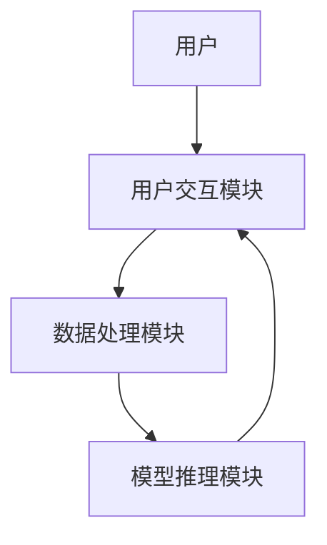
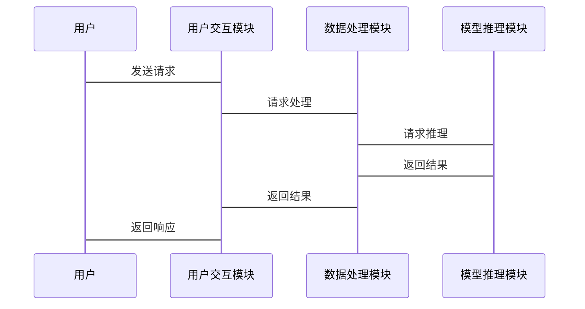

                 


# 企业AI Agent的多模态学习在用户体验优化中的应用

> **关键词**：AI Agent，多模态学习，用户体验优化，企业应用，深度学习，自然语言处理

> **摘要**：本文探讨了企业AI Agent在多模态学习中的应用，分析了其在用户体验优化中的核心作用。通过详细阐述多模态学习的原理、算法、系统架构及项目实战，本文为读者提供了从理论到实践的全面指导。文章还结合实际案例，展示了如何通过多模态学习提升用户体验，并总结了最佳实践和未来研究方向。

---

# 第一部分: 企业AI Agent的多模态学习背景与概念

## 第1章: AI Agent与多模态学习概述

### 1.1 AI Agent的基本概念

#### 1.1.1 人工智能代理的定义
人工智能代理（AI Agent）是指能够感知环境、自主决策并执行任务的智能实体。它可以是一个软件程序、机器人或其他智能系统，具备以下核心特征：
- **自主性**：能够在没有外部干预的情况下运行。
- **反应性**：能够实时感知环境并做出响应。
- **目标导向性**：基于预设目标或学习目标进行决策和行动。

#### 1.1.2 AI Agent的核心特征
AI Agent的核心特征包括：
- **智能性**：通过算法和数据进行学习和推理。
- **适应性**：能够根据环境变化调整行为。
- **交互性**：能够与用户或其他系统进行交互。

#### 1.1.3 企业级AI Agent的应用场景
在企业中，AI Agent可以应用于以下场景：
- **客户支持**：通过自然语言处理（NLP）技术为用户提供智能客服。
- **任务自动化**：自动处理重复性任务，如数据录入、报告生成。
- **决策支持**：基于数据分析为管理层提供决策支持。

### 1.2 多模态学习的定义与特点

#### 1.2.1 多模态学习的定义
多模态学习是指在同一任务中结合多种数据模态（如文本、图像、音频等）进行学习的方法。其核心目标是通过融合多模态数据，提升模型的表达能力和准确性。

#### 1.2.2 多模态学习的核心特点
多模态学习的特点包括：
- **数据互补性**：不同模态的数据可以互补，提升模型的泛化能力。
- **任务增强性**：通过结合多模态数据，任务性能可以显著提升。
- **复杂性**：处理多模态数据需要更复杂的算法和计算资源。

#### 1.2.3 多模态学习与单模态学习的对比
以下是多模态学习与单模态学习的对比：

| 对比维度         | 单模态学习                  | 多模态学习                  |
|------------------|-----------------------------|-----------------------------|
| 数据来源         | 单一数据模态（如文本、图像） | 多个数据模态（如文本、图像、音频） |
| 信息获取能力     | 信息获取单一                | 信息获取全面                |
| 模型复杂性       | 模型简单                   | 模型复杂                   |
| 任务性能         | 性能受限                   | 性能提升                   |

### 1.3 企业AI Agent与用户体验优化

#### 1.3.1 用户体验优化的核心目标
用户体验优化的核心目标包括：
- **提高用户满意度**：通过更智能的服务提升用户满意度。
- **降低用户操作成本**：减少用户完成任务所需的时间和精力。
- **提升用户粘性**：通过个性化服务增强用户粘性。

#### 1.3.2 AI Agent在用户体验优化中的作用
AI Agent通过以下方式优化用户体验：
- **实时响应**：快速理解和响应用户需求。
- **个性化服务**：根据用户行为和偏好提供个性化建议。
- **多模态交互**：支持文本、语音、图像等多种交互方式，提升用户体验。

#### 1.3.3 企业AI Agent的多模态学习优势
多模态学习的优势体现在以下方面：
- **信息融合**：通过结合多种数据模态，模型能够更全面地理解用户需求。
- **场景适应性**：能够适应复杂多变的用户场景，提供更灵活的服务。
- **性能提升**：通过多模态数据的融合，模型的准确性和鲁棒性显著提升。

---

## 第2章: 多模态学习的核心原理

### 2.1 多模态数据的特征分析

#### 2.1.1 文本数据的特征
文本数据的特征包括：
- **语义信息**：文本所表达的含义。
- **上下文信息**：文本的前后文关系。
- **情感倾向**：文本的情感色彩（正面、负面、中性）。

#### 2.1.2 图像数据的特征
图像数据的特征包括：
- **视觉信息**：颜色、形状、纹理等。
- **目标检测**：图像中的目标物体及其位置。
- **场景理解**：图像的整体场景信息。

#### 2.1.3 音频数据的特征
音频数据的特征包括：
- **语音内容**：音频中的语言内容。
- **语调**：语音的高低、快慢。
- **背景噪声**：音频中的背景噪声。

### 2.2 多模态学习的模型架构

#### 2.2.1 多模态融合的常见方法
多模态融合的常见方法包括：
- **早期融合**：在特征提取阶段进行多模态数据的融合。
- **晚期融合**：在特征提取后，对各模态的特征进行融合。
- **混合融合**：结合早期融合和晚期融合的优点。

#### 2.2.2 多模态学习的训练策略
多模态学习的训练策略包括：
- **联合训练**：同时训练多个模态的模型，共享部分参数。
- **对齐训练**：通过对比学习对齐不同模态的数据特征。
- **自监督学习**：利用未标注数据进行自监督训练。

#### 2.2.3 多模态学习的挑战与解决方案
多模态学习的主要挑战包括数据异构性、模态不平衡性等。解决方案包括：
- **数据预处理**：对不同模态的数据进行标准化处理。
- **损失函数设计**：设计联合损失函数，平衡不同模态的权重。
- **模型优化**：使用更复杂的模型结构（如Transformer）来处理多模态数据。

### 2.3 多模态学习的数学模型

#### 2.3.1 多模态数据表示的数学模型
多模态数据表示可以通过向量或矩阵形式表示。例如，文本可以表示为词向量，图像可以表示为特征向量。

#### 2.3.2 多模态融合的数学公式
一种常见的多模态融合方法是将不同模态的特征向量进行加权求和：
$$ f(x) = \sum_{i=1}^{n} w_i x_i $$
其中，\( w_i \) 是第i个模态的权重，\( x_i \) 是第i个模态的特征向量。

#### 2.3.3 模型优化的数学推导
以多模态分类任务为例，模型的目标函数可以表示为：
$$ \mathcal{L} = \sum_{i=1}^{m} \sum_{j=1}^{n} (y_{ij} \cdot \log p_{ij} + (1-y_{ij}) \cdot \log (1-p_{ij})) $$
其中，\( y_{ij} \) 是标签，\( p_{ij} \) 是模型的预测概率。

---

## 第3章: 多模态学习的经典算法

### 3.1 多模态表示学习算法

#### 3.1.1 Word2Vec在文本模态中的应用
Word2Vec通过将词表示为向量，捕捉词义信息。其训练目标是最小化以下损失函数：
$$ \mathcal{L} = -\sum_{j=1}^{n} \log p(w_j | w_i) $$
其中，\( w_i \) 是目标词，\( w_j \) 是上下文词。

#### 3.1.2 CNN在图像模态中的应用
卷积神经网络（CNN）通过卷积层提取图像特征，其关键公式包括：
$$ a^{[l+1]} = \sigma(W^{[l]} a^{[l]} + b^{[l]}) $$
其中，\( a^{[l]} \) 是第l层的激活值，\( W^{[l]} \) 和 \( b^{[l]} \) 是权重和偏置。

#### 3.1.3 图神经网络在跨模态融合中的应用
图神经网络通过构建异构图来融合多模态数据，其核心公式是：
$$ h^{(i)} = \sum_{j \in \mathcal{N}(i)} \alpha_{ij} h^{(j)} $$
其中，\( \alpha_{ij} \) 是注意力权重，\( h^{(j)} \) 是邻居节点的表示。

### 3.2 多模态对齐与对比学习

#### 3.2.1 对齐学习的基本原理
对齐学习通过将不同模态的特征映射到相同的 latent space，实现特征对齐。其核心公式是：
$$ \mathcal{L} = \sum_{i=1}^{n} \sum_{j=1}^{m} (y_{ij} \cdot \log p_{ij} + (1-y_{ij}) \cdot \log (1-p_{ij})) $$

#### 3.2.2 对比学习在多模态数据中的应用
对比学习通过最大化相似模态之间的相似性，最小化不相似模态之间的相似性。其损失函数可以表示为：
$$ \mathcal{L} = -\sum_{i=1}^{n} \sum_{j=1}^{m} \log \frac{e^{s_{ij}}}{\sum_{k} e^{s_{ik}}} $$
其中，\( s_{ij} \) 是相似度分数。

---

## 第4章: 系统分析与架构设计

### 4.1 系统功能设计

#### 4.1.1 系统功能模块
系统功能模块包括：
- **用户交互模块**：接收用户的输入并返回响应。
- **数据处理模块**：对多模态数据进行预处理和特征提取。
- **模型推理模块**：基于预训练模型进行推理并生成输出。

#### 4.1.2 系统功能流程
系统功能流程如下：
1. 用户通过多种模态（文本、图像、音频）输入请求。
2. 数据处理模块对输入数据进行预处理和特征提取。
3. 模型推理模块基于多模态模型进行推理，生成输出结果。
4. 用户交互模块将结果返回给用户。

### 4.2 系统架构设计

#### 4.2.1 系统架构图
以下是一个多模态AI Agent系统的架构图：



#### 4.2.2 系统交互序列图
以下是一个系统的交互序列图：



---

## 第5章: 项目实战

### 5.1 环境安装

#### 5.1.1 Python环境安装
安装Python 3.8及以上版本。

#### 5.1.2 依赖库安装
安装以下依赖库：
- `numpy`
- `tensorflow`
- `pytorch`
- `transformers`

### 5.2 核心代码实现

#### 5.2.1 多模态模型实现
以下是一个多模态模型的实现代码：

```python
import torch
import torch.nn as nn

class MultimodalAgent(nn.Module):
    def __init__(self, text_dim, image_dim):
        super().__init__()
        self.text_encoder = nn.Linear(text_dim, 128)
        self.image_encoder = nn.Linear(image_dim, 128)
        self融合层 = nn.Linear(256, 64)
        self.output_layer = nn.Linear(64, 1)

    def forward(self, text_features, image_features):
        text_encoded = self.text_encoder(text_features)
        image_encoded = self.image_encoder(image_features)
        fused = torch.cat([text_encoded, image_encoded], dim=-1)
        fused = nn.ReLU()(self.融合层(fused))
        output = self.output_layer(fused)
        return output

model = MultimodalAgent(text_dim=768, image_dim=2048)
```

#### 5.2.2 训练代码实现
以下是一个训练脚本的实现代码：

```python
import torch
from torch.utils.data import DataLoader

def train_model(model, train_loader, optimizer, criterion, epochs):
    for epoch in range(epochs):
        model.train()
        for batch in train_loader:
            optimizer.zero_grad()
            text_features, image_features, labels = batch
            outputs = model(text_features, image_features)
            loss = criterion(outputs, labels)
            loss.backward()
            optimizer.step()
    return model

model = train_model(model, train_loader, optimizer=torch.Adam(...), criterion=nn.CrossEntropyLoss(), epochs=10)
```

### 5.3 案例分析与优化

#### 5.3.1 案例分析
以一个智能客服系统为例，系统需要同时处理用户的文本、图像和语音请求。通过多模态模型，系统能够更准确地理解用户需求，提供更个性化的服务。

#### 5.3.2 代码优化
通过并行计算和优化算法（如AdamW）提升训练效率。

---

## 第6章: 总结与展望

### 6.1 最佳实践

#### 6.1.1 数据预处理
- 对多模态数据进行归一化处理。
- 处理文本数据时，使用预训练语言模型（如BERT）提取特征。

#### 6.1.2 模型优化
- 使用更复杂的模型架构（如Vision-LLM）进行多模态融合。
- 采用对比学习和自监督学习提升模型的泛化能力。

#### 6.1.3 系统设计
- 采用微服务架构，提升系统的扩展性和维护性。
- 使用云原生技术（如Kubernetes）部署和管理模型服务。

### 6.2 小结
企业AI Agent的多模态学习在用户体验优化中具有重要意义。通过结合文本、图像、音频等多种模态数据，模型能够更全面地理解用户需求，提供更智能的服务。未来，随着深度学习和大语言模型（如GPT-4）的不断发展，多模态学习在企业AI Agent中的应用将更加广泛和深入。

### 6.3 注意事项
- 在实际应用中，需要考虑数据隐私和安全问题。
- 多模态模型的训练和推理需要大量的计算资源，企业需要具备相应的技术储备。
- 在设计系统时，需要充分考虑不同模态数据的异构性和兼容性。

### 6.4 拓展阅读
- [《多模态学习的原理与应用》](#)
- [《AI Agent在企业中的应用实践》](#)
- [《深度学习中的多模态融合方法》](#)

---

通过以上内容，读者可以系统地了解企业AI Agent的多模态学习在用户体验优化中的应用，掌握从理论到实践的全过程，并为实际应用提供参考和指导。

