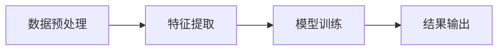
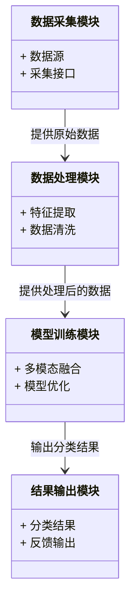
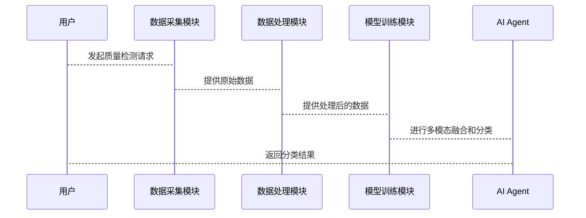

                 


# 企业AI Agent的多模态学习在质量控制中的应用

## 关键词：企业AI Agent，多模态学习，质量控制，算法原理，系统架构

## 摘要：  
本文深入探讨了企业AI Agent在质量控制中的应用，重点分析了多模态学习技术如何提升质量控制的效率和准确性。文章首先介绍了AI Agent和多模态学习的基本概念，随后详细分析了多模态学习算法的原理和实现方法，结合系统架构设计，展示了如何在实际场景中应用这些技术。最后，通过项目实战和案例分析，验证了AI Agent在质量控制中的实际效果和优势。

---

# 第1章: 企业AI Agent与多模态学习概述

## 1.1 问题背景与问题描述

### 1.1.1 传统质量控制的挑战
传统质量控制方法依赖于人工检查和单一数据源，存在效率低、精度差、成本高等问题。例如，在制造业中，人工检查可能导致漏检或误检，且难以处理复杂的数据类型。

### 1.1.2 AI Agent在质量控制中的作用
AI Agent能够实时处理多模态数据（如图像、文本、传感器数据等），通过学习和推理提供智能化的质量控制解决方案。例如，AI Agent可以通过图像识别检测产品缺陷，通过自然语言处理分析客户反馈，从而实现全面的质量监控。

### 1.1.3 多模态学习的优势
多模态学习能够整合多种数据源的信息，提升模型的鲁棒性和准确性。例如，在制造业中，结合图像和传感器数据可以更准确地预测设备故障。

## 1.2 问题解决与边界

### 1.2.1 AI Agent如何解决质量控制问题
AI Agent通过实时数据处理、自动化决策和自我优化，显著提高了质量控制的效率和准确性。例如，AI Agent可以在生产线上实时检测产品缺陷，减少人工干预。

### 1.2.2 多模态学习的应用边界
多模态学习适用于复杂场景，但其性能依赖于数据的质量和多样性。例如，在处理低质量数据或数据不足的情况下，多模态学习的效果可能受限。

### 1.2.3 质量控制的外延与内涵
质量控制不仅包括产品的检测，还包括生产过程的优化和客户反馈的分析。AI Agent可以通过多模态学习全面监控这些环节。

## 1.3 核心概念与要素

### 1.3.1 AI Agent的核心要素
AI Agent包括感知、决策、执行和反馈四个核心要素。例如，在质量控制中，AI Agent可以通过传感器数据感知设备状态，通过决策算法判断是否需要调整参数。

### 1.3.2 多模态学习的特征
多模态学习具有数据多样性、模型融合性和任务相关性三个主要特征。例如，结合图像和文本数据可以提高模型的泛化能力。

### 1.3.3 质量控制的系统架构
质量控制系统通常包括数据采集、数据处理、模型训练和结果输出四个模块。例如，在制造业中，AI Agent可以实时采集设备数据并进行分析。

## 1.4 本章小结
本章介绍了AI Agent和多模态学习在质量控制中的应用背景和优势，分析了其核心概念和系统架构，为后续章节奠定了基础。

---

# 第2章: AI Agent与多模态学习的核心原理

## 2.1 AI Agent的原理与机制

### 2.1.1 AI Agent的基本原理
AI Agent通过感知环境、分析数据、制定决策并执行操作来实现目标。例如，在质量控制中，AI Agent可以实时分析生产线上的传感器数据，判断是否存在异常。

### 2.1.2 多模态学习的算法特点
多模态学习通过融合多种数据源的信息，提升模型的泛化能力和准确性。例如，结合图像和文本数据可以提高模型的识别精度。

### 2.1.3 多模态数据的融合方法
多模态数据的融合方法包括特征级融合、决策级融合和混合融合。例如，特征级融合可以通过将不同数据源的特征向量进行组合来提升模型性能。

## 2.2 核心概念对比表

### 表2.1 AI Agent与传统算法对比
| 特性             | AI Agent                          | 传统算法                          |
|------------------|-----------------------------------|-----------------------------------|
| 数据处理能力     | 强大的多模态处理能力              | 依赖单一数据源                    |
| 自适应能力       | 高度自适应，可实时优化             | 较低，需要人工调整                 |
| 应用场景         | 复杂、动态场景                    | 简单、静态场景                    |

### 表2.2 多模态学习与单模态学习对比
| 特性             | 多模态学习                          | 单模态学习                          |
|------------------|-----------------------------------|-----------------------------------|
| 数据多样性       | 高                                   | 低                                 |
| 模型泛化能力     | 强                                   | 弱                                 |
| 应用效果         | 更准确，适用于复杂场景              | 适用于简单场景                    |

## 2.3 ER实体关系图

```mermaid
erDiagram
    actor 用户
    actor 系统
    actor 数据源
    actor 决策模块
    actor 执行模块
    用户 --> 决策模块: 提供反馈
    数据源 --> 系统: 提供多模态数据
    系统 --> 决策模块: 分析数据
    决策模块 --> 执行模块: 发出指令
    执行模块 --> 用户: 反馈结果
```

## 2.4 本章小结
本章详细讲解了AI Agent和多模态学习的核心原理，分析了它们的特点和优势，并通过对比表和实体关系图展示了它们在质量控制中的应用。

---

# 第3章: 多模态学习算法原理

## 3.1 算法概述

### 3.1.1 多模态学习的流程
多模态学习通常包括数据预处理、特征提取、模型训练和结果输出四个步骤。例如，在图像和文本数据的融合中，需要先提取各自的特征，再进行融合和分类。

### 3.1.2 算法的主要步骤
1. 数据预处理：清洗和标准化数据。
2. 特征提取：使用CNN提取图像特征，使用词袋模型提取文本特征。
3. 模型训练：通过多任务学习或自适应融合方法训练模型。
4. 结果输出：输出分类结果或回归预测。

## 3.2 算法实现

### 3.2.1 数据预处理
```python
import pandas as pd
from sklearn.preprocessing import StandardScaler

# 加载数据
data = pd.read_csv('multimodal_data.csv')

# 标准化处理
scaler = StandardScaler()
data_scaled = scaler.fit_transform(data)
```

### 3.2.2 模型训练
```python
import tensorflow as tf
from tensorflow.keras.layers import Input, Dense, concatenate
from tensorflow.keras.models import Model

# 定义输入层
input1 = Input(shape=(100,))
input2 = Input(shape=(200,))

# 特征提取层
dense1 = Dense(50, activation='relu')(input1)
dense2 = Dense(50, activation='relu')(input2)

# 融合层
merged = concatenate([dense1, dense2])

# 输出层
output = Dense(1, activation='sigmoid')(merged)

# 定义模型
model = Model(inputs=[input1, input2], outputs=output)

# 编译模型
model.compile(optimizer='adam', loss='binary_crossentropy', metrics=['accuracy'])
```

### 3.2.3 结果输出
```python
# 训练模型
model.fit([X1, X2], y, epochs=10, batch_size=32)
```

## 3.3 算法流程图



## 3.4 数学模型与公式

### 3.4.1 概率分布公式
$$P(x|y) = \frac{P(y|x)P(x)}{P(y)}$$

### 3.4.2 损失函数
$$L = -\sum_{i} y_i \log p(y_i)$$

## 3.5 本章小结
本章详细讲解了多模态学习算法的原理和实现方法，通过代码示例和流程图展示了算法的实现步骤，帮助读者更好地理解和应用。

---

# 第4章: 系统架构与设计方案

## 4.1 问题场景分析

### 4.1.1 质量控制的典型场景
在制造业中，质量控制通常涉及设备状态监测、产品缺陷检测和生产过程优化。例如，AI Agent可以通过图像识别技术检测产品表面的缺陷。

### 4.1.2 多模态数据的典型来源
多模态数据可以来自图像、文本、传感器等多种数据源。例如，在制造业中，图像数据来自摄像头，传感器数据来自生产设备。

## 4.2 系统功能设计

### 4.2.1 领域模型设计


### 4.2.2 系统架构设计


### 4.2.3 系统接口设计
- 数据采集模块：提供API接口，接收多模态数据。
- 数据处理模块：提供数据清洗和特征提取的接口。
- 模型训练模块：提供模型训练和优化的接口。
- 结果输出模块：提供分类结果和反馈的接口。

### 4.2.4 系统交互序列图


## 4.3 本章小结
本章详细分析了质量控制系统的场景，设计了系统的功能模块和架构，并通过类图和序列图展示了系统的交互过程，为后续的项目实战奠定了基础。

---

# 第5章: 项目实战与案例分析

## 5.1 项目背景与目标

### 5.1.1 项目背景
本项目旨在通过AI Agent实现制造业中的产品质量检测，提升检测效率和准确性。

### 5.1.2 项目目标
通过多模态学习技术，实现对产品的缺陷检测和分类。

## 5.2 项目核心实现

### 5.2.1 环境安装
```bash
pip install tensorflow keras pandas scikit-learn
```

### 5.2.2 核心代码实现
```python
# 加载数据
import pandas as pd
data = pd.read_csv('product_data.csv')

# 数据预处理
from sklearn.model_selection import train_test_split
X_train, X_test, y_train, y_test = train_test_split(data, target, test_size=0.2)

# 模型训练
model = MultiModalModel(input_shape)
model.fit(X_train, y_train, epochs=10, batch_size=32)

# 结果输出
y_pred = model.predict(X_test)
print(classification_report(y_test, y_pred))
```

### 5.2.3 代码解读与分析
- 数据预处理：使用Pandas进行数据清洗和标准化。
- 模型训练：使用自定义的多模态模型进行分类。
- 结果输出：使用Scikit-learn评估模型性能。

## 5.3 实际案例分析

### 5.3.1 案例背景
某制造企业希望检测产品表面的划痕和裂缝。

### 5.3.2 数据准备
数据包括图像和传感器数据，图像数据用于缺陷检测，传感器数据用于设备状态监测。

### 5.3.3 模型训练与优化
通过多模态学习，模型能够同时利用图像和传感器数据，显著提高了缺陷检测的准确率。

## 5.4 项目小结
本章通过项目实战展示了AI Agent在质量控制中的应用，详细讲解了项目的实现过程和案例分析，帮助读者更好地理解理论知识。

---

# 第6章: 总结与展望

## 6.1 最佳实践 tips

### 6.1.1 数据质量管理
确保数据的多样性和高质量，是多模态学习成功的关键。

### 6.1.2 模型优化建议
通过数据增强、超参数调优和模型融合等方法，可以进一步提升模型性能。

### 6.1.3 系统架构设计
合理设计系统架构，确保系统的可扩展性和可维护性。

## 6.2 小结
本文详细探讨了企业AI Agent在质量控制中的应用，分析了多模态学习的原理和实现方法，通过项目实战展示了其实际效果。

## 6.3 注意事项

### 6.3.1 数据隐私问题
在实际应用中，需要注意数据的隐私保护和合规性。

### 6.3.2 模型泛化能力
多模态学习模型的泛化能力依赖于数据的多样性和模型的设计。

### 6.3.3 系统稳定性
需要确保系统的稳定性和容错能力，避免因数据中断或模型故障导致的质量控制失效。

## 6.4 拓展阅读

### 6.4.1 推荐书籍
- 《Deep Learning》
- 《Multi-modal Machine Learning》

### 6.4.2 推荐论文
- “Multi-modal Deep Learning for Quality Control in Manufacturing”

## 6.5 本章小结
本章总结了全文的主要内容，给出了实践中的注意事项和拓展阅读建议，帮助读者进一步深入学习和应用。

---

# 结语
通过本文的学习，读者可以全面了解企业AI Agent在多模态学习中的应用，掌握其核心原理和实现方法，并通过实际案例分析提升质量控制的效率和准确性。希望本文能为相关领域的研究和实践提供有价值的参考。

