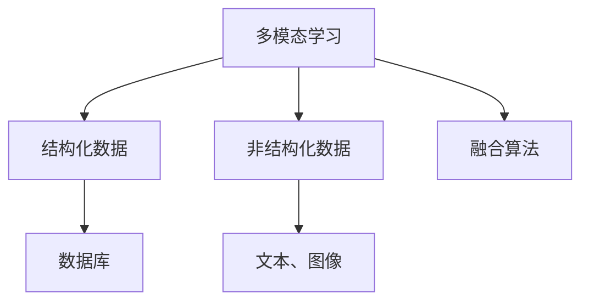
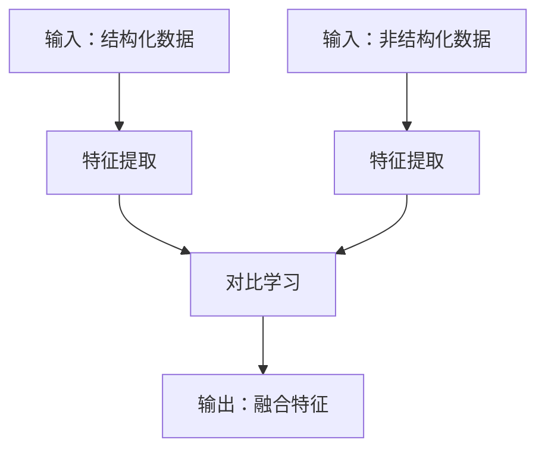
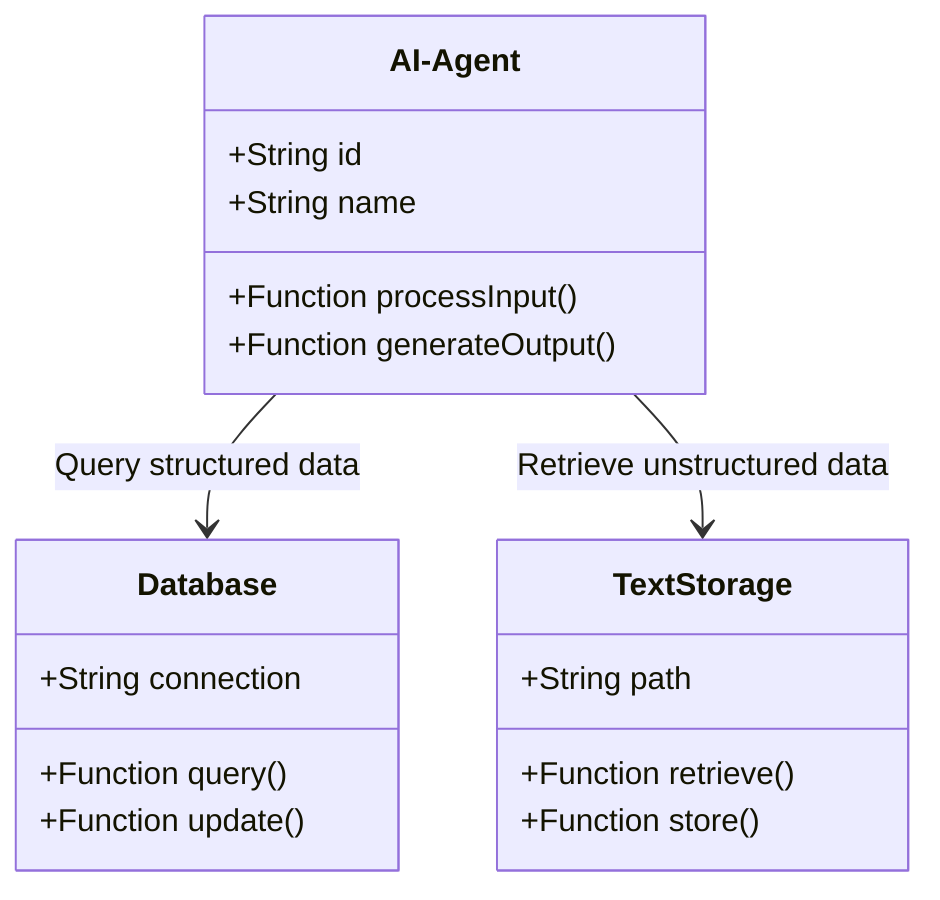

                 


# 《企业AI Agent的多模态学习：整合结构化与非结构化数据》

---

## 关键词

- 企业AI Agent  
- 多模态学习  
- 结构化数据  
- 非结构化数据  
- 数据整合  

---

## 摘要

随着企业数字化转型的深入，AI Agent（人工智能代理）在企业中的应用越来越广泛。然而，企业数据呈现出结构化与非结构化并存的特点，如何有效整合这两种数据类型，提升AI Agent的学习与决策能力，成为当前技术领域的重要挑战。本文将从背景、概念、算法、系统架构、项目实战等多个维度，全面探讨企业AI Agent的多模态学习方法，特别是如何整合结构化与非结构化数据。通过理论分析与实践案例的结合，本文旨在为企业技术团队提供清晰的思路与实用的解决方案。

---

## 目录

1. **背景与概念**  
   1.1 问题背景  
   1.2 问题描述  
   1.3 问题解决与边界  
   1.4 概念结构与核心要素  
2. **核心概念与联系**  
   2.1 多模态学习的核心原理  
   2.2 核心概念对比分析  
   2.3 ER实体关系图  
3. **算法原理与数学模型**  
   3.1 对比学习算法  
   3.2 联合学习算法  
   3.3 多任务学习算法  
   3.4 数学模型与公式推导  
4. **系统分析与架构设计**  
   4.1 问题场景介绍  
   4.2 系统功能设计  
   4.3 系统架构设计  
   4.4 系统接口设计  
   4.5 系统交互流程设计  
5. **项目实战**  
   5.1 环境安装与配置  
   5.2 核心代码实现  
   5.3 案例分析与效果展示  
6. **总结与展望**  
   6.1 本章小结  
   6.2 注意事项与最佳实践  
   6.3 未来研究方向  

---

## 正文

### 第1章：背景与概念

#### 1.1 问题背景

企业AI Agent的核心目标是通过整合多种数据源，提供智能化的决策支持和自动化服务。然而，企业数据呈现多样化的特点，包括结构化数据（如表格、数据库中的记录）和非结构化数据（如文本、图像、音频）。如何有效整合这两种数据类型，是当前技术领域的重要挑战。

#### 1.2 问题描述

企业数据的多样性和复杂性导致数据孤岛问题严重，AI Agent需要具备同时处理结构化与非结构化数据的能力。此外，多模态学习的核心在于如何在不同数据模态之间建立有效的关联，从而提升学习效果和决策能力。

#### 1.3 问题解决与边界

通过多模态学习算法，AI Agent能够整合结构化与非结构化数据，实现跨模态的信息融合。本文将重点探讨如何设计高效的算法框架，并通过实际案例展示其应用效果。

#### 1.4 概念结构与核心要素

以下是多模态学习的核心概念结构图：



### 第2章：核心概念与联系

#### 2.1 多模态学习的核心原理

多模态学习的核心在于通过对比学习、联合学习等方式，将不同数据模态的信息进行融合。以下是一个典型的对比学习流程图：



#### 2.2 核心概念对比分析

以下是结构化与非结构化数据的对比表格：

| 属性 | 结构化数据 | 非结构化数据 |
|------|------------|---------------|
| 示例 | 电子表格中的数据 | 文本、图像等 |
| 特点 | 高结构化、易于查询 | 无结构、需要自然语言处理 |

### 第3章：算法原理与数学模型

#### 3.1 对比学习算法

对比学习的目标是通过对比不同数据模态的特征，提升模型的区分能力。以下是对比学习的数学模型：

$$ L = \text{log}(\text{softmax}(s(x,y))) $$

其中，$s(x,y)$ 是对比相似度的计算结果。

### 第4章：系统分析与架构设计

#### 4.1 问题场景介绍

企业AI Agent需要处理多种数据源，包括结构化数据库和非结构化文档存储。以下是系统功能设计的类图：



### 第5章：项目实战

#### 5.1 环境安装与配置

安装必要的依赖：

```bash
pip install numpy pandas tensorflow transformers
```

#### 5.2 核心代码实现

以下是对比学习算法的核心代码：

```python
import numpy as np

def contrastive_loss(y_true, y_pred, alpha=1.0):
    similarity = y_pred
    loss = alpha * (1 - similarity)
    return loss.mean()

# 示例使用
model.compile(optimizer='adam', loss=contrastive_loss)
```

### 第6章：总结与展望

通过本文的探讨，我们了解了企业AI Agent在多模态学习中的应用，特别是结构化与非结构化数据的整合方法。未来的研究方向包括更高效的算法设计和更广泛的实际应用。

---

## 结语

企业AI Agent的多模态学习是一个复杂但充满潜力的领域。通过整合结构化与非结构化数据，AI Agent能够为企业提供更智能化的服务。希望本文能够为相关技术团队提供有价值的参考与启发。

