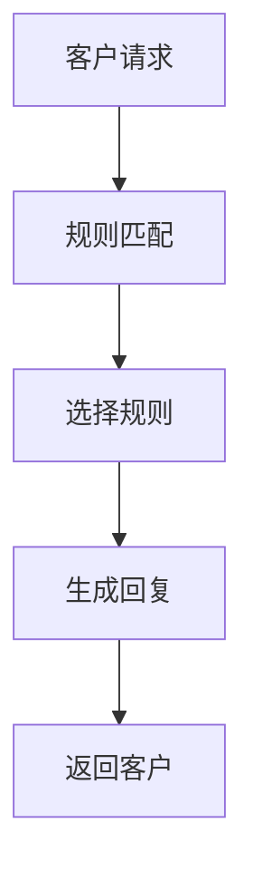
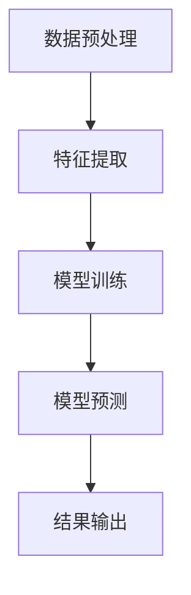
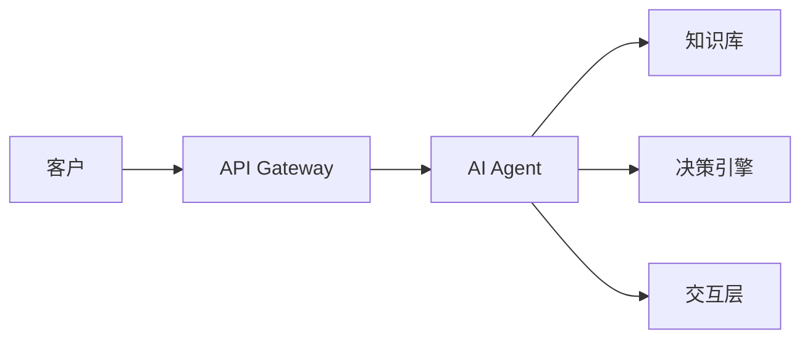

                 


# 《企业AI Agent的多渠道集成：统一客户服务体验》

> 关键词：企业AI Agent，多渠道集成，客户服务体验，智能决策，系统架构设计

> 摘要：本文深入探讨了企业AI Agent在多渠道集成中的应用，分析了如何通过AI Agent统一客户服务体验，涵盖了AI Agent的核心概念、算法原理、系统架构设计以及实际项目实战。通过详细的技术分析和案例解读，本文为读者提供了从理论到实践的全面指导。

---

## 第一章: 企业AI Agent概述

### 1.1 AI Agent的基本概念

AI Agent（人工智能代理）是指能够感知环境并采取行动以实现目标的智能体。在企业场景中，AI Agent通常用于客户服务、销售支持和内部管理等领域。

- **问题背景**: 传统客服系统存在响应速度慢、服务质量不一致的问题，无法满足现代客户对高效、个性化服务的需求。
- **问题描述**: 客户通过多种渠道（如电话、邮件、在线聊天、社交媒体等）与企业互动，但不同渠道的服务体验不统一，导致客户满意度下降。
- **解决方法**: 引入AI Agent，通过多渠道集成实现统一的服务体验。
- **边界与外延**: AI Agent仅处理客户服务相关的任务，不涉及企业的生产系统和财务系统。

### 1.2 多渠道集成的必要性

- **多样化趋势**: 客户偏好的服务渠道日益多样化，企业需要覆盖所有可能的渠道。
- **统一服务体验**: 通过AI Agent统一处理所有渠道的客户需求，确保客户获得一致的服务体验。
- **价值与挑战**: 提高客户满意度和忠诚度，但需要解决数据一致性、实时性等问题。

### 1.3 概念结构与核心要素

| 核心要素 | 描述 |
|----------|------|
| 知识库   | 包含产品信息、FAQ、政策法规等 |
| NLP引擎 | 负责理解和生成自然语言 |
| 决策引擎 | 基于知识库和上下文做出决策 |
| 交互层   | 通过多种渠道与客户互动 |

---

## 第二章: AI Agent的核心原理

### 2.1 AI Agent的组成与功能

- **知识库构建**: 通过数据抽取、清洗和标注，构建结构化的知识库。
- **NLP处理**: 使用分词、实体识别、意图识别等技术处理客户输入。
- **智能决策**: 基于上下文和知识库，生成最优的回复或行动方案。

### 2.2 多渠道集成的技术实现

- **标准化接口**: 通过API或中间件统一不同渠道的数据格式。
- **数据流处理**: 对多渠道数据进行清洗、转换和整合。
- **渠道特征对比**: 分析不同渠道的特征，优化AI Agent的响应策略。

### 2.3 概念对比与ER图

| 对比维度 | AI Agent | 传统客服系统 |
|----------|----------|--------------|
| 响应速度 | 实时响应   | 依赖人工处理  |
| 个性化程度 | 高       | 低           |
| 可扩展性 | 高       | 低           |

```mermaid
erDiagram
    customer "客户" {
        id : integer
        name : string
        contact : string
    }
    channel "渠道" {
        id : integer
        name : string
        type : string
    }
    interaction "交互" {
        id : integer
        content : string
        timestamp : datetime
    }
    customer --> interaction : 发起
    channel --> interaction : 记录
```

---

## 第三章: AI Agent的算法原理

### 3.1 基于规则的AI Agent

- **规则引擎**: 通过预定义的规则处理客户请求。
- **规则库构建**: 使用表格化规则定义，支持优先级排序。



- **规则库表格**:

| 规则ID | 条件                  | 动作                |
|--------|-----------------------|--------------------|
| 1      | 提到“订单查询”        | 返回订单信息        |
| 2      | 提到“退款”            | 转接到人工客服        |

### 3.2 基于机器学习的AI Agent

- **常见算法**: 决策树、随机森林、支持向量机。
- **机器学习流程**:



- **数学公式**: 使用贝叶斯定理进行概率计算。

$$ P(A|B) = \frac{P(B|A)P(A)}{P(B)} $$

### 3.3 混合型AI Agent

- **规则与机器学习结合**: 先通过规则匹配，再用机器学习优化。

---

## 第四章: 系统架构设计

### 4.1 系统功能模块划分

- **客户交互模块**: 处理客户输入，调用AI Agent。
- **数据处理模块**: 清洗、转换和存储数据。
- **知识库管理模块**: 维护和更新知识库。
- **智能决策模块**: 基于上下文做出决策。

### 4.2 系统架构图



### 4.3 系统接口设计

- **API接口**: 提供RESTful API，支持GET、POST、PUT、DELETE方法。
- **交互流程**: 客户请求 -> API Gateway -> AI Agent -> 返回响应。

---

## 第五章: 项目实战与应用

### 5.1 环境安装

- **工具安装**: 安装Python、TensorFlow、Flask框架。
- **数据准备**: 收集和整理多渠道客户数据。

### 5.2 核心代码实现

```python
import numpy as np
from sklearn.tree import DecisionTreeClassifier

# 数据预处理
X = np.array([[...], [...]])
y = np.array([...])

# 模型训练
model = DecisionTreeClassifier()
model.fit(X, y)

# 模型预测
def predict_customers(X_new):
    return model.predict(X_new)
```

### 5.3 代码解读与分析

- **数据预处理**: 对数据进行归一化和标准化处理。
- **模型训练**: 使用训练数据训练决策树模型。
- **模型预测**: 对新的客户请求进行分类和预测。

### 5.4 实际案例分析

- **案例背景**: 某企业希望通过AI Agent统一处理电话、邮件和在线聊天的客户请求。
- **实施步骤**: 数据收集、模型训练、接口开发、系统集成。

### 5.5 项目小结

- **成功经验**: 通过AI Agent实现了多渠道集成，统一了客户服务体验。
- **优化方向**: 不断优化模型，增加新的知识库内容。

---

## 第六章: 总结与展望

### 6.1 总结

- **核心观点**: AI Agent通过多渠道集成，统一了客户服务体验，提高了效率和客户满意度。
- **关键点**: 知识库构建、NLP处理、智能决策是实现AI Agent的核心。

### 6.2 小结

- **最佳实践**: 定期更新知识库，优化算法模型，监控系统性能。
- **注意事项**: 注意数据隐私和安全，确保系统的稳定性和可靠性。
- **拓展阅读**: 推荐阅读《机器学习实战》、《自然语言处理入门》等书籍。

---

## 附录: 参考文献

- TensorFlow官方文档
- Scikit-learn官方文档
- Mermaid图表绘制指南
- 相关技术论文和书籍

---

通过以上目录结构和内容安排，您可以逐步展开撰写每部分内容，确保逻辑清晰、内容详实。

