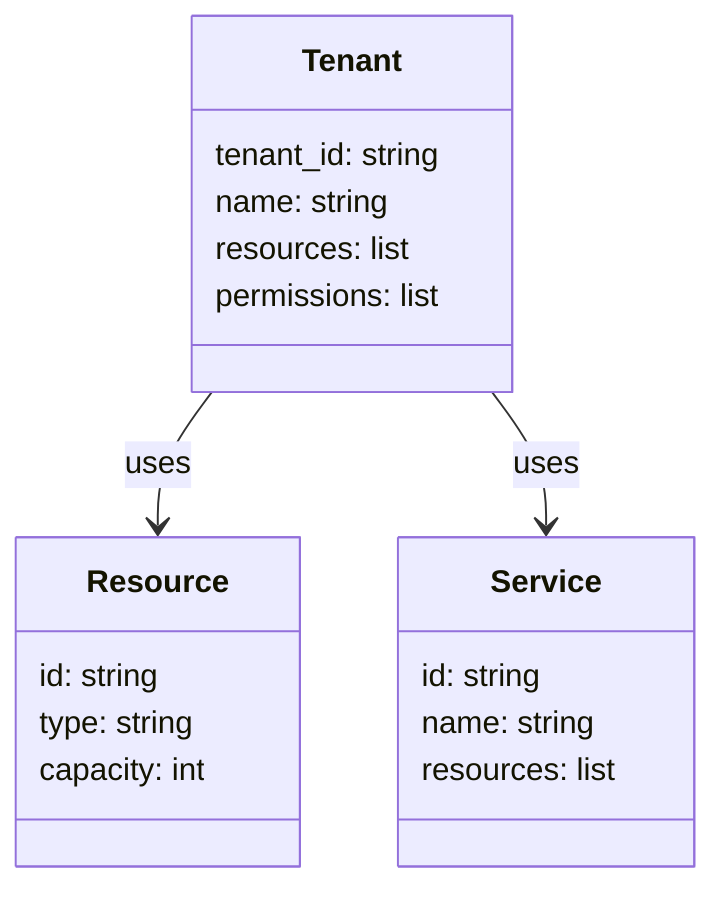
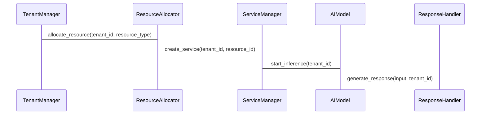

                 


# 企业AI Agent的多租户架构设计与实现

## 关键词：企业AI Agent，多租户架构，AI算法，系统设计，技术实现

## 摘要：本文将深入探讨企业AI Agent在多租户环境下的架构设计与实现方法，涵盖多租户架构的核心概念、AI Agent的算法原理、系统架构设计、项目实战以及最佳实践。通过详细的理论分析与实际案例，帮助读者全面理解和掌握企业级AI Agent的多租户架构设计与实现的关键技术。

---

# 第一部分: 企业AI Agent的多租户架构设计与实现基础

---

## 第1章: 企业AI Agent与多租户架构概述

### 1.1 企业AI Agent的定义与特点

#### 1.1.1 AI Agent的基本概念
人工智能代理（AI Agent）是一种能够感知环境、执行任务并做出决策的智能实体。它通过与用户或系统的交互，完成特定的目标，例如自然语言处理、任务调度、数据分析等。

#### 1.1.2 企业级AI Agent的核心特点
- **智能化**：基于大模型（如GPT系列）实现复杂任务的自动化。
- **可扩展性**：支持大规模数据处理和多任务执行。
- **实时性**：能够快速响应用户需求，提供实时反馈。
- **可定制化**：支持根据企业需求进行个性化配置。

#### 1.1.3 企业AI Agent的应用场景
- **客户支持**：智能客服系统，解决用户问题。
- **任务自动化**：自动处理邮件、日程安排等。
- **数据分析**：实时分析企业数据，提供决策支持。

---

### 1.2 多租户架构的定义与特点

#### 1.2.1 多租户架构的基本概念
多租户架构是一种软件架构模式，允许多个租户共享同一套系统资源（如计算资源、存储资源等），同时保证每个租户的数据隔离和权限控制。

#### 1.2.2 多租户架构的核心特点
- **资源共享**：多个租户共享同一套系统资源，降低成本。
- **数据隔离**：每个租户的数据和资源相互隔离，保证数据安全。
- **动态扩展**：根据租户需求动态分配资源，提高系统利用率。

#### 1.2.3 多租户架构的分类与对比
| 分类标准 | 租户数据库模式 | 描述 |
|----------|----------------|------|
| 数据库模式 | 共享数据库 | 多个租户共享同一数据库，适合小型应用。 |
|          | 租户数据库 | 每个租户有自己的数据库，适合数据隔离要求高的场景。 |
|          | 分片数据库 | 数据按租户分片存储，适用于大规模数据场景。 |

---

### 1.3 企业AI Agent与多租户架构的结合

#### 1.3.1 企业AI Agent的多租户化需求
企业AI Agent需要支持多个租户同时使用，每个租户可能有不同的数据、权限和配置需求。

#### 1.3.2 多租户架构在企业AI Agent中的作用
- **资源隔离**：确保不同租户之间的AI Agent运行环境互不影响。
- **数据安全**：保证每个租户的数据独立存储和处理。
- **动态扩展**：根据租户数量和需求动态调整系统资源。

#### 1.3.3 企业AI Agent多租户架构的应用场景
- **SaaS平台**：提供基于AI的SaaS服务，支持多租户使用。
- **企业内部系统**：企业内部不同部门使用同一套AI Agent系统，但数据隔离。

---

### 1.4 本章小结
本章主要介绍了企业AI Agent和多租户架构的基本概念，分析了它们的结合方式及其应用场景，为后续章节的深入分析奠定了基础。

---

## 第2章: 多租户架构的核心概念与联系

### 2.1 多租户架构的核心概念

#### 2.1.1 租户隔离与资源分配
租户隔离是指每个租户的数据、资源和权限相互独立。资源分配需要根据租户的需求动态调整，例如CPU、内存等。

#### 2.1.2 数据隔离与权限控制
数据隔离通过数据库或存储层的隔离实现，权限控制则通过访问控制列表（ACL）或基于角色的访问控制（RBAC）实现。

#### 2.1.3 多租户架构的伸缩性与扩展性
多租户架构需要支持租户数量的动态变化，同时保证系统性能和稳定性。

---

### 2.2 多租户架构的实体关系图

#### 2.2.1 租户与资源的关系
- **租户**：系统中的一个用户或组织。
- **资源**：系统提供的计算资源、存储资源等。

#### 2.2.2 资源与服务的关系
- **服务**：系统提供的功能，例如AI推理服务。
- **资源**：支持服务运行的基础设施。

#### 2.2.3 服务与数据的关系
- **数据**：租户的输入数据，例如文本、图像等。
- **服务**：处理数据并返回结果。

---

### 2.3 多租户架构的核心原理

#### 2.3.1 租户数据的隔离机制
通过数据库分库或分表的方式实现数据隔离，例如每个租户有自己的数据库或表。

#### 2.3.2 资源分配的动态调整
根据租户的请求量动态分配计算资源，例如使用容器编排技术（如Kubernetes）实现。

#### 2.3.3 权限控制的实现方式
通过访问控制列表（ACL）或基于角色的访问控制（RBAC）实现权限控制。

---

### 2.4 本章小结
本章详细分析了多租户架构的核心概念和实现原理，包括租户隔离、资源分配和权限控制，为后续章节的系统设计提供了理论基础。

---

## 第3章: 企业AI Agent的多租户架构算法原理

### 3.1 多租户架构下的AI Agent算法

#### 3.1.1 基于大模型的对话生成算法
- **算法原理**：基于预训练的大模型（如GPT-3），根据租户输入生成相应的回答。
- **数学模型**：模型通过自注意力机制（Self-Attention）处理输入文本，生成输出。

#### 3.1.2 多租户环境下的模型共享机制
- **模型共享**：多个租户共享同一个大模型，通过参数隔离实现租户特定的优化。
- **公式表示**：模型参数$\theta$通过租户特定的偏移量$\delta$进行调整，例如$\theta_{tenant} = \theta + \delta$。

#### 3.1.3 基于租户数据的个性化模型训练
- **个性化训练**：针对每个租户的数据进行微调，提升模型的适应性。
- **数据隔离**：在训练过程中确保租户数据的隔离，避免数据泄露。

---

### 3.2 多租户架构下的算法优化

#### 3.2.1 租户数据的分布式处理
- **分布式训练**：将租户数据分布在不同的计算节点上，进行并行训练。
- **公式表示**：使用分布式计算框架，例如$\text{loss} = \frac{1}{N}\sum_{i=1}^{N}\text{loss}_i$，其中$N$是节点数。

#### 3.2.2 多租户环境下的模型压缩与优化
- **模型压缩**：通过剪枝、量化等技术减少模型大小，提升推理速度。
- **公式表示**：模型压缩后，参数数量减少，推理时间$T$降低。

#### 3.2.3 基于租户特征的动态参数调整
- **动态调整**：根据租户的特征（如租户规模、使用频率）动态调整模型参数。
- **公式表示**：模型参数$\theta$通过租户特征向量$x$进行调整，例如$\theta_{tenant} = \theta + \alpha x$，其中$\alpha$是调节系数。

---

### 3.3 多租户架构下的算法实现

#### 3.3.1 基于Python的算法实现
```python
def generate_response(input_text, tenant_id):
    model = get_tenant_model(tenant_id)
    response = model.generate(input_text)
    return response
```

#### 3.3.2 基于大模型的多租户适配
- **大模型适配**：将大模型的参数进行租户级别的微调。
- **代码示例**：
```python
class TenantAdapter:
    def __init__(self, model, tenant_id):
        self.model = model
        self.tenant_id = tenant_id
    
    def generate(self, input_text):
        # 租户特定的参数调整
        adjusted_input = self.adjust_input(input_text)
        return self.model.generate(adjusted_input)
    
    def adjust_input(self, input_text):
        # 根据租户ID调整输入
        return input_text + f" [tenant:{self.tenant_id}]"
```

---

## 第4章: 企业AI Agent多租户架构的系统设计与实现

### 4.1 系统分析与设计

#### 4.1.1 问题场景介绍
- **需求分析**：企业需要一个支持多租户的AI Agent系统，提供智能化服务。
- **问题描述**：如何设计一个高效、安全、可扩展的多租户AI Agent架构。

#### 4.1.2 系统功能设计
- **租户管理**：支持租户的创建、删除和权限管理。
- **资源管理**：动态分配计算资源，保证租户性能。
- **数据隔离**：确保租户数据的安全性和隐私性。

---

### 4.2 系统架构设计

#### 4.2.1 领域模型类图


#### 4.2.2 系统架构图


---

### 4.3 接口设计与交互

#### 4.3.1 接口设计
- **租户管理接口**：
  - `create_tenant(tenant_info)`
  - `delete_tenant(tenant_id)`
  - `update_tenant(tenant_id, new_info)`
- **资源管理接口**：
  - `allocate_resource(tenant_id, resource_type)`
  - `release_resource(tenant_id, resource_id)`

#### 4.3.2 交互序列图


---

## 第5章: 企业AI Agent多租户架构的项目实战

### 5.1 环境安装与配置

#### 5.1.1 系统环境
- 操作系统：Linux
- 依赖工具：Python、pip、Docker、Kubernetes

#### 5.1.2 代码安装
```bash
git clone https://github.com/your-repo/tenant-ai-agent.git
cd tenant-ai-agent
pip install requirements.txt
```

---

### 5.2 核心代码实现

#### 5.2.1 租户管理模块
```python
class TenantManager:
    def __init__(self):
        self.tenants = {}
    
    def create_tenant(self, tenant_id, name):
        self.tenants[tenant_id] = {
            'name': name,
            'resources': [],
            'permissions': []
        }
        return f"Tenant {tenant_id} created."
```

#### 5.2.2 资源分配模块
```python
class ResourceAllocator:
    def __init__(self):
        self.resources = {}
    
    def allocate_resource(self, tenant_id, resource_type):
        resource_id = f"{tenant_id}_{uuid.uuid4()}"
        self.resources[resource_id] = resource_type
        return resource_id
```

---

### 5.3 实际案例分析

#### 5.3.1 案例背景
假设我们有一个SaaS平台，支持多租户使用AI Agent进行客服对话。

#### 5.3.2 实现步骤
1. 创建租户：`create_tenant("tenant1", "Tenant One")`
2. 分配资源：`allocate_resource("tenant1", "GPU")`
3. 启动AI服务：`start_service("tenant1", "GPU")`
4. 处理对话：`generate_response("Hello, how can I help you?", "tenant1")`

---

## 第6章: 企业AI Agent多租户架构的最佳实践

### 6.1 设计与实现中的关键点

#### 6.1.1 租户数据的严格隔离
确保每个租户的数据和资源完全隔离，避免数据泄露和资源抢占。

#### 6.1.2 系统的可扩展性设计
通过容器化和微服务架构，实现系统的弹性扩展。

#### 6.1.3 权限控制的严格性
基于角色的访问控制（RBAC）是实现权限管理的最佳选择。

---

### 6.2 实际应用中的注意事项

#### 6.2.1 性能优化
- 使用缓存技术（如Redis）优化系统性能。
- 通过模型压缩和量化技术降低资源消耗。

#### 6.2.2 安全性保障
- 数据加密存储和传输。
- 定期进行安全审计和漏洞扫描。

#### 6.2.3 可用性保障
- 使用高可用性架构（如负载均衡、容灾备份）。
- 定期进行系统演练和应急响应。

---

### 6.3 项目小结与拓展阅读

#### 6.3.1 本章小结
本章总结了企业AI Agent多租户架构的设计与实现中的关键点和注意事项，为实际应用提供了宝贵的参考。

#### 6.3.2 拓展阅读
- 《微服务架构设计》
- 《大模型的分布式训练与部署》
- 《多租户系统安全与隐私保护》

---

## 附录: 代码示例与工具清单

### 附录A: 代码示例
```python
# 租户管理模块
class TenantManager:
    def __init__(self):
        self.tenants = {}

    def create_tenant(self, tenant_id, name):
        self.tenants[tenant_id] = {'name': name, 'resources': []}
        return f"Tenant {tenant_id} created."
```

```python
# 资源分配模块
class ResourceAllocator:
    def __init__(self):
        self.resources = {}

    def allocate_resource(self, tenant_id, resource_type):
        import uuid
        resource_id = f"{tenant_id}_{uuid.uuid4()}"
        self.resources[resource_id] = resource_type
        return resource_id
```

### 附录B: 工具清单
- **编程语言**：Python
- **框架工具**：Django/Flask（Web框架），Kubernetes（容器编排）
- **数据库**：PostgreSQL（关系型数据库），MongoDB（非关系型数据库）
- **AI模型**：Hugging Face Transformers（大模型）

---

## 结语
通过本文的详细讲解，读者可以全面了解企业AI Agent的多租户架构设计与实现的关键技术，包括系统设计、算法实现、项目实战等。希望本文能够为读者在实际应用中提供有价值的参考和指导。

