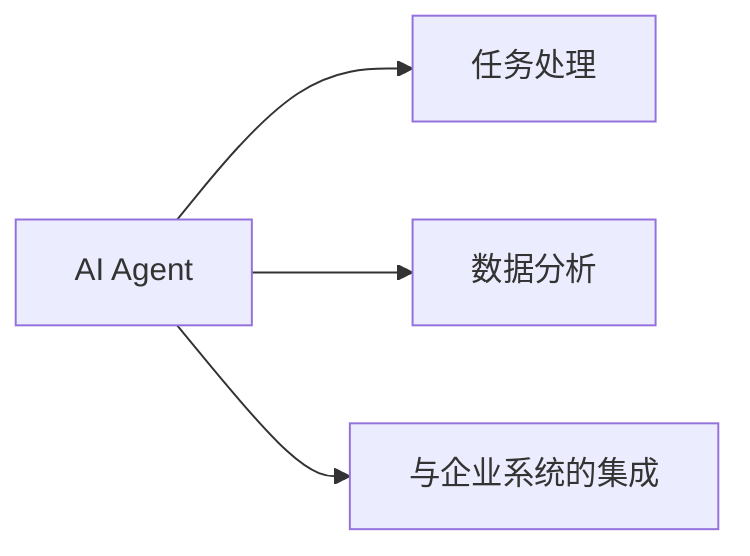
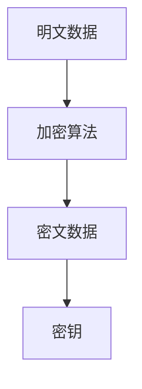
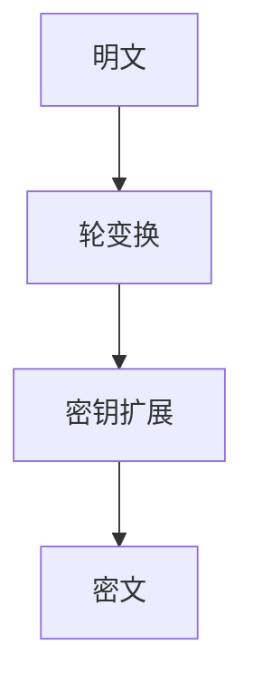
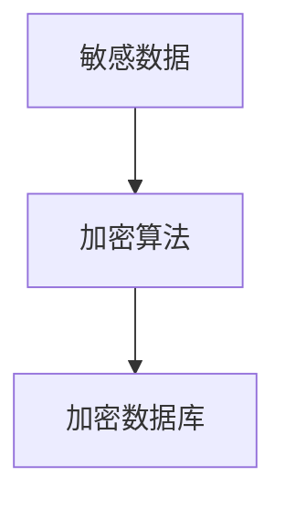
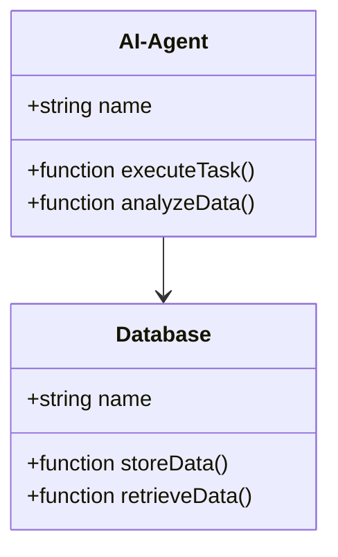
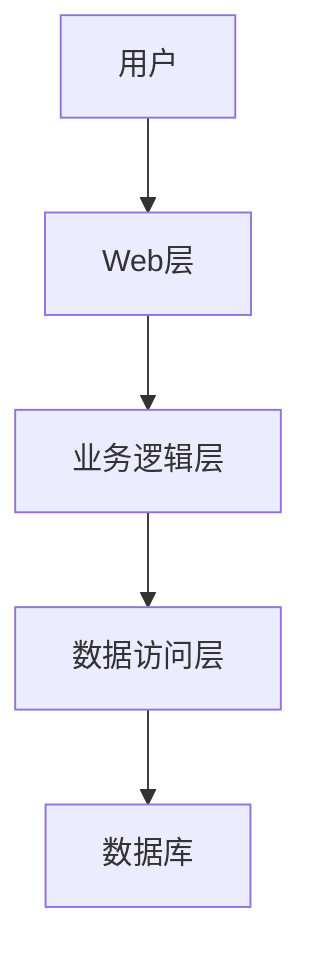

                 


# 《企业AI Agent的多维安全防护：数据加密与访问控制》

## 关键词：企业AI Agent，数据加密，访问控制，安全性，RBAC，AES加密

## 摘要：本文详细探讨了企业AI Agent在数据加密和访问控制方面的安全防护措施。通过分析数据加密技术与访问控制机制，结合实际案例，展示了如何在企业环境中保护AI Agent的数据安全。文章涵盖了加密算法、访问控制模型、系统架构设计以及项目实战，为读者提供全面的安全防护方案。

---

### 第一部分：企业AI Agent的背景与概述

#### 第1章：企业AI Agent的定义与应用

##### 1.1 什么是企业AI Agent

企业AI Agent是一种智能代理系统，能够自主执行任务，优化企业运作。它通过数据分析和机器学习，为企业提供决策支持和自动化服务。

**图1.1 企业AI Agent的基本概念**



企业AI Agent的应用场景包括自动化任务处理、数据分析与决策、系统集成等。这些功能帮助企业提高效率，降低成本。

##### 1.2 企业AI Agent的核心功能

AI Agent的核心功能包括自动化任务处理、数据分析与决策以及与企业系统的集成。这些功能通过模块化设计实现，确保系统的灵活性和扩展性。

**表1.1 企业AI Agent的核心功能**

| 功能模块 | 描述 |
|----------|------|
| 自动化任务处理 | 自动执行预定义任务，如邮件发送、数据录入 |
| 数据分析与决策 | 利用机器学习模型进行数据分析和预测 |
| 系统集成 | 与企业现有系统（如ERP、CRM）无缝集成 |

##### 1.3 企业AI Agent的发展趋势

AI Agent技术不断演进，从简单的规则执行到复杂的自主决策。在数字化转型中，AI Agent扮演越来越重要的角色，未来将更加智能化和个性化。

---

### 第二部分：数据加密技术与安全防护

#### 第2章：数据加密技术基础

##### 2.1 数据加密的基本原理

数据加密通过算法对数据进行转换，确保其在存储和传输过程中的安全性。对称加密和非对称加密是两种主要加密方式。

**图2.1 加密过程的流程图**



##### 2.2 常见加密算法详解

**2.2.1 AES加密算法的实现原理**

AES是一种常用的对称加密算法，以其高效和安全性著称。其加密过程包括多个轮数的字节代换和行移位。

**图2.2 AES加密算法流程图**



**代码实现：AES加密**

```python
from cryptography.fernet import Fernet

# 生成密钥
key = Fernet.generate_key()
cipher = Fernet(key)

# 加密数据
plaintext = "Sensitive Data"
encrypted_text = cipher.encrypt(plaintext.encode())
```

##### 2.3 数据加密的实现步骤

数据加密通常包括数据预处理、加密过程和解密过程。确保加密算法的正确使用和密钥的安全管理是关键。

---

### 第三部分：访问控制机制与安全策略

#### 第3章：访问控制的基本原理

##### 3.1 访问控制的核心概念

访问控制通过限制用户访问权限，保护系统资源。常见的访问控制模型包括基于角色的访问控制（RBAC）和基于属性的访问控制（ABAC）。

**表3.1 访问控制模型对比**

| 模型 | 描述 |
|------|------|
| RBAC | 基于用户角色分配权限 |
| ABAC | 根据用户属性和环境条件动态分配权限 |

**图3.1 RBAC模型**


##### 3.2 基于角色的访问控制（RBAC）

RBAC通过角色分配权限，适用于企业环境中用户角色较多的情况。代码实现包括用户、角色和权限的管理。

**代码实现：RBAC模型**

```python
# 定义用户、角色和权限
class User:
    def __init__(self, username, role):
        self.username = username
        self.role = role

class Role:
    def __init__(self, name, permissions):
        self.name = name
        self.permissions = permissions

# 创建用户和角色
role_admin = Role("Admin", {"read", "write", "execute"})
user_admin = User("admin_user", role_admin)

# 访问控制检查
def check_permission(user, action):
    return action in user.role.permissions

# 示例
check_permission(user_admin, "write")  # 返回True
```

##### 3.3 基于属性的访问控制（ABAC）

ABAC根据用户属性动态调整权限，适用于复杂环境。实现时需要考虑属性的动态变化和访问决策的逻辑。

---

### 第四部分：企业AI Agent的安全架构与设计

#### 第4章：企业AI Agent的安全架构

##### 4.1 数据存储与传输的安全防护

数据存储和传输过程中的加密是保护数据安全的关键。使用HTTPS协议加密数据传输，采用加密数据库存储敏感信息。

**图4.1 数据加密存储架构**



##### 4.2 系统功能设计与实现

系统功能设计包括模块划分和交互流程设计。使用类图展示系统功能模块，明确各模块之间的关系。

**图4.2 系统功能设计类图**



##### 4.3 系统架构设计与实现

系统架构设计需要考虑高可用性和可扩展性。采用分层架构，明确各层功能，确保系统稳定运行。

**图4.3 系统架构设计**



---

### 第五部分：项目实战与案例分析

#### 第5章：企业AI Agent的数据加密与访问控制实战

##### 5.1 环境搭建与工具安装

开发环境包括Python、加密库（如cryptography）和访问控制框架。安装步骤如下：

```bash
pip install cryptography
pip install Flask-RBAC
```

##### 5.2 数据加密实现

实现AES加密算法，保护敏感数据。代码示例：

```python
from cryptography.fernet import Fernet

# 生成密钥
key = Fernet.generate_key()
cipher = Fernet(key)

# 加密数据
plaintext = "Sensitive Data"
encrypted_text = cipher.encrypt(plaintext.encode())
```

##### 5.3 访问控制实现

基于RBAC模型，实现用户权限管理。代码示例：

```python
from flask import Flask
from flask_rbac import RBAC

app = Flask(__name__)
rbac = RBAC(app)

# 定义权限
rbac.add_permission('admin', {'read', 'write'})
rbac.add_permission('user', {'read'})

# 路由权限控制
@app.route('/data')
@rbac.auth('read')
def data():
    return "Data accessed"
```

##### 5.4 案例分析

通过具体案例分析，验证数据加密和访问控制的有效性。例如，一个AI Agent系统在数据传输中使用AES加密，访问控制采用RBAC模型，确保只有授权用户可以访问敏感数据。

---

### 第六部分：总结与最佳实践

#### 第6章：总结与注意事项

##### 6.1 总结

本文详细探讨了企业AI Agent在数据加密和访问控制方面的安全防护措施，通过理论分析和实战案例，展示了如何保护AI Agent的数据安全。

##### 6.2 最佳实践与注意事项

- 加密算法选择：根据数据敏感程度选择合适的加密算法。
- 访问控制策略：合理分配角色和权限，定期审查和更新。
- 系统维护：定期更新系统和加密算法，防止漏洞利用。
- 培训与意识：提高员工的安全意识，避免人为失误。

---

### 总结

企业AI Agent的安全防护需要综合考虑数据加密和访问控制。通过合理选择加密算法、设计访问控制策略，并结合实际项目进行实战演练，可以有效提升企业的数据安全性。未来，随着AI技术的发展，安全防护措施也需要不断创新和优化。

