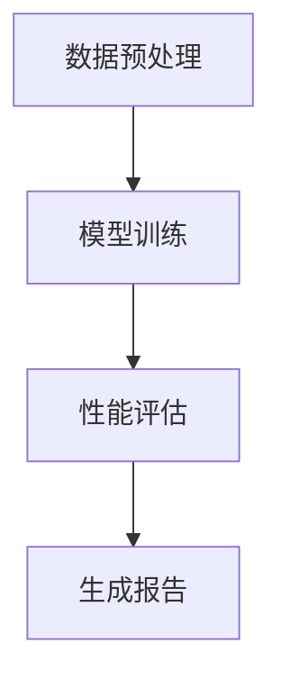
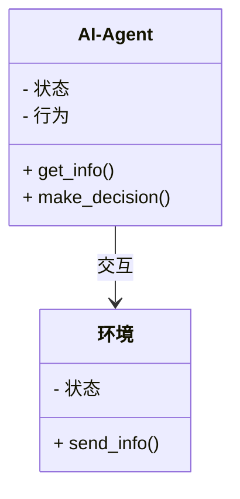
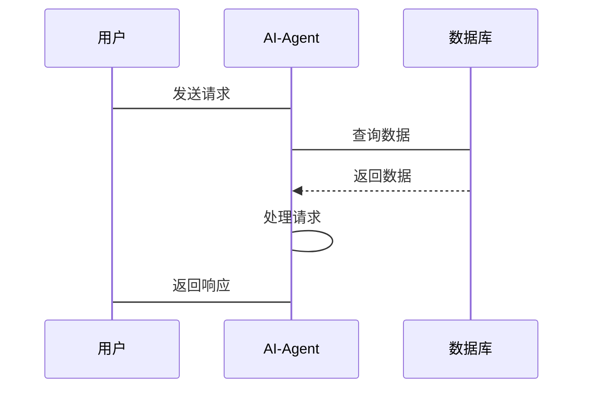

                 


# 企业AI Agent的多维度性能评估体系

> 关键词：人工智能代理, 多维度性能评估, 精准度, 召回率, F1分数, 企业AI系统

> 摘要：本文详细探讨了企业AI Agent的多维度性能评估体系，从核心概念、算法原理到系统架构，再到项目实战，全面解析了如何科学评估AI Agent的性能表现。文章通过理论与实践相结合的方式，为企业技术决策者提供了实用的评估方法和优化建议。

---

## 第一章: 企业AI Agent的背景与概念

### 1.1 人工智能代理（AI Agent）的定义与特点

人工智能代理（AI Agent）是一种能够感知环境、自主决策并执行任务的智能实体。它通过传感器获取信息，利用算法进行分析和推理，最终做出最优决策。AI Agent的核心特点包括：

1. **自主性**：能够自主决策，无需外部干预。
2. **反应性**：能够实时感知环境并做出反应。
3. **社会性**：能够与其他AI Agent或人类进行交互和协作。
4. **学习能力**：能够通过数据不断优化自身的性能。

#### AI Agent与传统程序的区别

| 特性 | 传统程序 | AI Agent |
|------|----------|----------|
| 决策方式 | 预先编写规则 | 自主学习与优化 |
| 环境感知 | 无感知能力 | 具备感知能力 |
| 交互方式 | 单向执行 | 支持多维交互 |

### 1.2 企业AI Agent的应用场景

AI Agent在企业中的应用场景广泛，包括：

1. **客服机器人**：通过自然语言处理技术为用户提供支持。
2. **智能推荐系统**：基于用户行为推荐商品或服务。
3. **自动化运维**：监控系统状态并自动修复问题。
4. **供应链优化**：通过预测需求优化库存管理。

### 1.3 本章小结

本章介绍了AI Agent的基本概念和特点，并通过对比分析明确了AI Agent与传统程序的区别。同时，列举了企业中常见的AI Agent应用场景，为后续的性能评估奠定了基础。

---

## 第二章: 多维度性能评估的核心要素

### 2.1 多维度性能评估的定义与框架

多维度性能评估是指从多个维度对AI Agent的性能进行综合评价。常见的评估维度包括：

1. **准确度（Precision）**：预测结果的正确性。
2. **召回率（Recall）**：预测结果的完整性。
3. **响应时间（Response Time）**：处理请求的速度。
4. **可解释性（Explainability）**：决策过程的透明度。

#### 多维度评估框架的组成

- **输入层**：接收原始数据和用户请求。
- **处理层**：进行数据清洗、特征提取和模型训练。
- **评估层**：从多个维度对AI Agent的性能进行打分。
- **输出层**：生成评估报告并提出优化建议。

### 2.2 AI Agent性能评估的核心指标

#### 精准度与召回率的定义

- **精准度**：$$\text{Precision} = \frac{\text{正确预测数}}{\text{总预测数}}$$
- **召回率**：$$\text{Recall} = \frac{\text{正确预测数}}{\text{实际正例数}}$$

#### F1分数

$$F1 = 2 \times \frac{\text{Precision} \times \text{Recall}}{\text{Precision} + \text{Recall}$$

F1分数综合考虑了精准度和召回率，是评估分类模型性能的重要指标。

### 2.3 本章小结

本章详细讲解了多维度性能评估的核心要素，包括准确度、召回率、响应时间和可解释性等指标。通过数学公式和实际案例，读者可以更好地理解这些指标的含义和应用场景。

---

## 第三章: 多维度性能评估的算法原理

### 3.1 基于多维度指标的评估算法

#### 算法步骤

1. 数据预处理：清洗数据并提取特征。
2. 模型训练：使用机器学习算法训练模型。
3. 性能评估：从多个维度对模型进行打分。
4. 结果分析：生成评估报告并提出优化建议。

#### 算法流程图（Mermaid）



### 3.2 基于F1分数的优化算法

#### F1分数优化步骤

1. 调整模型参数，如学习率和正则化系数。
2. 使用交叉验证评估模型性能。
3. 根据F1分数的结果优化模型结构。

#### Python代码实现

```python
from sklearn.metrics import f1_score
from sklearn.model_selection import train_test_split
from sklearn.linear_model import LogisticRegression

# 数据预处理
X = ...  # 特征矩阵
y = ...  # 标签

# 划分训练集和测试集
X_train, X_test, y_train, y_test = train_test_split(X, y, test_size=0.2)

# 模型训练
model = LogisticRegression()
model.fit(X_train, y_train)

# 预测结果
y_pred = model.predict(X_test)

# 计算F1分数
f1 = f1_score(y_test, y_pred)
print(f"模型的F1分数为：{f1}")
```

### 3.3 本章小结

本章通过Mermaid流程图和Python代码，详细讲解了基于多维度指标的评估算法。通过F1分数的优化算法，读者可以更好地理解如何提升AI Agent的性能。

---

## 第四章: 企业AI Agent系统分析与架构设计

### 4.1 系统功能设计

#### 领域模型类图（Mermaid）



### 4.2 系统架构设计

#### 系统架构图（Mermaid）

```mermaid
docker
    service AI-Agent {
        publish: HTTP
    }
    service 数据库 {
        publish: PostgreSQL
    }
    service API网关 {
        publish: HTTP
    }
    AI-Agent --> 数据库
    API网关 --> AI-Agent
```

### 4.3 系统接口设计

#### 系统交互序列图（Mermaid）



### 4.4 本章小结

本章通过Mermaid图详细展示了企业AI Agent的系统架构设计，包括领域模型类图、系统架构图和交互序列图。这些设计为企业AI Agent的实现提供了清晰的指导。

---

## 第五章: 项目实战

### 5.1 环境安装

#### 安装Python和依赖库

```bash
python -m pip install --upgrade pip
pip install scikit-learn matplotlib mermaid
```

### 5.2 核心代码实现

#### 训练AI Agent模型

```python
import numpy as np
from sklearn.datasets import make_classification
from sklearn.ensemble import RandomForestClassifier

# 生成数据
X, y = make_classification(n_samples=1000, n_features=20, n_classes=2)

# 划分训练集和测试集
X_train, X_test, y_train, y_test = train_test_split(X, y, test_size=0.2)

# 模型训练
model = RandomForestClassifier()
model.fit(X_train, y_train)

# 预测结果
y_pred = model.predict(X_test)

# 计算精准度和召回率
precision = np.mean(y_pred == y_test)
recall = np.sum(y_pred == y_test) / np.sum(y_test == 1)
print(f"精准度：{precision}")
print(f"召回率：{recall}")
```

### 5.3 项目实战小结

本章通过实际案例展示了如何在企业中应用多维度性能评估体系。通过Python代码实现AI Agent模型的训练和评估，读者可以更好地理解理论知识。

---

## 第六章: 总结与展望

### 6.1 最佳实践 tips

- 定期更新模型，保持性能稳定。
- 结合业务需求，选择合适的评估指标。
- 注重模型的可解释性，提升用户体验。

### 6.2 小结

本文详细探讨了企业AI Agent的多维度性能评估体系，从核心概念到算法原理，再到系统架构和项目实战，为企业技术决策者提供了全面的指导。

### 6.3 注意事项

- 确保数据质量，避免偏差。
- 优化模型性能，提升用户体验。
- 注重数据安全，保护用户隐私。

### 6.4 拓展阅读

- 推荐阅读《机器学习实战》和《深度学习入门》等书籍，进一步提升对AI Agent的理解。

---

以上是《企业AI Agent的多维度性能评估体系》的技术博客文章的详细内容，涵盖了从理论到实践的各个方面，为企业技术决策者提供了实用的评估方法和优化建议。

