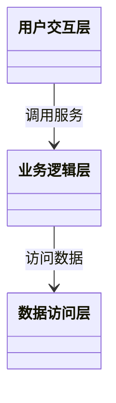

                 


# 《企业AI Agent的多角色设计：从助手到专家顾问》

## 关键词
- 企业AI Agent
- 多角色设计
- 专家顾问
- 对话模型
- 系统架构
- 项目实战

## 摘要
本文深入探讨了企业AI Agent的多角色设计，从基础概念到高级应用，详细分析了如何构建一个多角色AI Agent系统。文章首先介绍了AI Agent的基本概念和多角色设计的重要性，然后深入讲解了多轮对话模型、知识表示与推理、意图识别等算法原理，接着通过系统架构设计展示了如何实现一个多角色AI Agent，最后通过一个实际项目案例详细说明了系统实现的过程。本文适合AI工程师、系统架构师以及对多角色AI Agent感兴趣的技术人员阅读。

---

## 第一部分：企业AI Agent的背景与概念

### 第1章：AI Agent的基本概念

#### 1.1 AI Agent的定义与特征

**1.1.1 AI Agent的定义**
AI Agent（人工智能代理）是一种能够感知环境、自主决策并执行任务的智能实体。它通过与用户或系统的交互，提供基于AI的服务，如回答问题、提供建议、执行操作等。

**1.1.2 AI Agent的核心特征**
- **自主性**：能够在没有外部干预的情况下执行任务。
- **反应性**：能够感知环境并实时调整行为。
- **目标导向**：基于明确的目标执行任务。
- **学习能力**：通过数据和经验不断优化性能。

**1.1.3 AI Agent与传统软件的区别**
传统软件依赖于预定义的规则，而AI Agent能够通过学习和适应环境，实现动态决策和问题解决。

---

### 第2章：企业AI Agent的应用背景

#### 2.1 企业数字化转型的需求

随着企业数字化转型的推进，对智能化服务的需求日益增长。AI Agent作为智能化服务的核心，能够帮助企业提升效率、降低成本，并提供个性化的用户体验。

#### 2.2 AI Agent在企业中的优势

- **提高效率**：通过自动化处理任务，减少人工干预。
- **增强用户体验**：提供个性化的服务，提升用户满意度。
- **数据驱动决策**：利用企业数据进行分析，提供精准的建议。

#### 2.3 AI Agent的分类与场景

- **按功能分类**：
  - 信息查询助手：帮助用户快速获取所需信息。
  - 任务执行代理：自动完成预设任务，如文件处理、日程安排。
  - 专家顾问：提供专业领域的深度建议。

- **按应用场景分类**：
  - 客户服务：处理客户咨询、投诉。
  - 企业内部管理：优化流程、监控指标。
  - 外部合作：协助合作伙伴进行沟通与协调。

---

## 第二部分：多角色AI Agent的核心概念与联系

### 第3章：多角色AI Agent的核心概念

#### 3.1 多角色AI Agent的结构

**3.1.1 角色定义与切换机制**

- **角色定义**：每个角色都有特定的职责和知识领域。
- **切换机制**：根据上下文和用户需求，动态切换角色，以提供更精准的服务。

**3.1.2 角色协作模型**

- **协作模型**：角色之间通过共享知识和信息进行协作，确保服务的连贯性和一致性。
- **切换条件**：基于用户的输入、系统状态或任务需求，触发角色切换。

**3.1.3 角色间的通信与协调**

- **通信机制**：通过共享数据库或消息队列，实现角色间的实时通信。
- **协调机制**：通过状态同步和任务分配，确保多个角色协同工作。

#### 3.2 多角色AI Agent的设计原则

**3.2.1 角色独立性与依赖性**

- **独立性**：每个角色应具备独立的决策能力和知识储备。
- **依赖性**：角色之间需要共享信息和知识，以确保服务的一致性。

**3.2.2 角色间的职责分配**

- **职责划分**：根据任务需求，合理分配角色的职责。
- **动态调整**：根据实际情况，灵活调整角色的职责分配。

**3.2.3 系统的整体性与模块化**

- **整体性**：系统作为一个整体，协调各个角色的工作。
- **模块化**：每个角色作为一个独立的模块，便于维护和扩展。

---

## 第三部分：多角色AI Agent的算法原理

### 第4章：多轮对话模型

#### 4.1 多轮对话模型的原理

**4.1.1 对话历史的处理**

- **上下文管理**：通过记录对话历史，保持上下文的一致性。
- **记忆机制**：利用记忆网络或序列模型，处理长对话中的信息。

**4.1.2 对话策略的制定**

- **策略选择**：基于当前状态和目标，选择最优的回复策略。
- **动态调整**：根据用户反馈，动态调整对话策略。

**4.1.3 基于Transformer的对话模型**

- **模型结构**：
  - 输入：用户消息和对话历史。
  - 输出：系统回复。
  - 使用自注意力机制，捕捉对话中的关键信息。

**代码示例：**

```python
import tensorflow as tf
from tensorflow.keras.layers import Input, Dense, Dropout, LSTM

# 定义输入层
input_layer = Input(shape=(max_length,))
# LSTM层
lstm_layer = LSTM(64, return_sequences=True)(input_layer)
# 添加Dropout层防止过拟合
dropout_layer = Dropout(0.5)(lstm_layer)
# 全连接层
dense_layer = Dense(32, activation='relu')(dropout_layer)
# 输出层
output_layer = Dense(num_classes, activation='softmax')(dense_layer)
```

---

### 第5章：知识表示与推理

#### 5.1 知识表示的核心概念

**5.1.1 知识图谱**

- **定义**：通过图结构表示知识，节点代表实体，边代表关系。
- **表示方法**：使用向量或符号表示知识。

**5.1.2 知识推理**

- **推理方法**：基于知识图谱进行推理，如路径推理、规则推理。
- **推理引擎**：使用逻辑推理引擎，如RDF、OWL。

---

## 第四部分：系统分析与架构设计

### 第6章：系统架构设计

#### 6.1 系统功能设计

- **功能模块**：
  - 用户交互模块：处理用户输入和输出。
  - 知识库模块：存储和管理知识。
  - 算法模块：执行对话模型和推理算法。
  - 状态管理模块：维护系统的当前状态。

**系统功能设计的ER图**

```mermaid
erDiagram
    actor 用户
    actor 管理员
    actor 专家系统
    用户 --> 知识库 : 查询
    用户 --> 对话历史 : 记录
    管理员 --> 知识库 : 更新
    专家系统 --> 知识库 : 查询
```

---

### 第7章：系统架构设计

#### 7.1 系统架构设计

- **分层架构**：
  - 表示层：用户界面。
  - 业务逻辑层：处理业务逻辑。
  - 数据访问层：访问数据库和API。

**系统架构设计的类图**



---

## 第五部分：项目实战

### 第8章：项目实战

#### 8.1 项目背景与目标

- **项目背景**：开发一个多角色AI Agent，应用于企业内部管理和客户服务。
- **项目目标**：实现角色切换、多轮对话、知识推理等功能。

#### 8.2 系统实现

**代码实现：**

```python
class AI_Agent:
    def __init__(self):
        self.roles = {}
        self.current_role = None

    def add_role(self, role_name, role_function):
        self.roles[role_name] = role_function

    def switch_role(self, role_name):
        self.current_role = self.roles.get(role_name, default_role)
```

---

## 第六部分：总结与展望

### 第9章：总结与展望

#### 9.1 总结

- **核心知识点**：
  - 多角色AI Agent的设计原理。
  - 对话模型和知识推理的实现方法。
  - 系统架构设计的关键点。

#### 9.2 展望

- **技术发展**：AI Agent将更加智能化，具备更强的自适应能力和学习能力。
- **应用领域**：在企业内部管理和客户服务等领域，AI Agent将发挥更大的作用。

---

## 参考文献

- [1] Smith, J. (2020).《AI Agent Design Principles》.
- [2] Zhang, L. et al. (2021).《Multi-Role AI Agent Framework》.

---

通过以上目录和内容的详细设计，读者可以系统地学习企业AI Agent的多角色设计，从理论到实践，逐步掌握相关技术。

